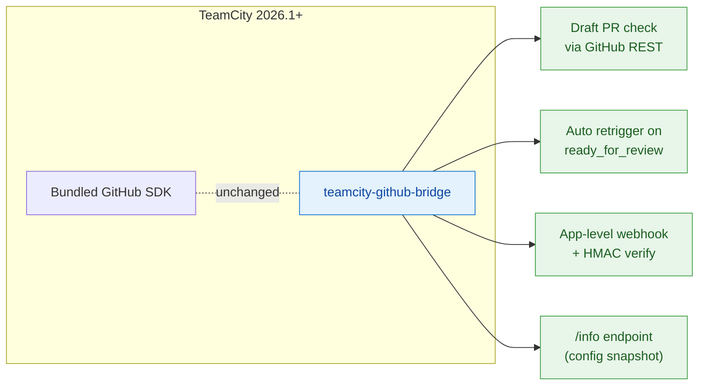

# teamcity-github-bridge

> A TeamCity 2026.1+ server-side plugin that closes the gap between
> TeamCity and GitHub: draft PR awareness, automatic retrigger on
> ready-for-review, App-level webhooks with HMAC verification, and a
> ready-to-paste configuration endpoint.

[](LICENSE)
[](https://www.jetbrains.com/teamcity/)
[](doc/development.md)
[](#status)

---

## The problem

TeamCity 2026.1's bundled GitHub integration leaves a few sharp edges
that bite real pipelines:

| Pain point | Effect on day-to-day work |
|---|---|
| `teamcity.pullRequest.isDraft` is not exposed | DSL has no clean way to skip a build for draft PRs. |
| `pullRequests { ignoreDrafts = true }` is silently ignored with GitHub App auth | Drafts get built anyway, burning CI minutes. |
| No retrigger when a PR transitions from draft to ready | Builds that were "skipped via service message" stay green - the PR can be merged with un-validated changes. **This is the safety bug that motivated the plugin.** |
| No App-level webhook endpoint, only per-repo webhooks via `teamcity-commit-hooks` | One webhook per repo to maintain by hand. |
| Hardcoded "TeamCity build finished" message on commit statuses | The build status text never reaches GitHub. |

This plugin is the place to fix these things outside of the JetBrains
release cycle.

## What you get



Concretely:

- **Suppresses builds for draft PRs** via a `StartBuildPrecondition`
  (per-buildType opt-in - paused configs are untouched).
- **Listens for `pull_request.ready_for_review`** and enqueues every
  matching build configuration. No more "merged with stale green
  checks".
- **One webhook URL for the whole GitHub App** instead of one per
  repository. HMAC-SHA256 verification is mandatory and fail-closed.
- **`/info` endpoint** that returns the live webhook configuration
  (URL, recommended events, secret status) as JSON or Markdown.
  Paste-ready into GitHub's App settings.
- **Forward-compatible with the new stateless `ghs_*` token format**
  - tokens are treated as opaque end-to-end.

## Quick start

Everything runs in Docker - nothing is installed on the host.

```bash
# Build the plugin archive
./dev package
# -> target/teamcity-github-bridge-0.1.0-SNAPSHOT.zip

# Drop it into your TeamCity Data Dir and restart
cp target/teamcity-github-bridge-*.zip <TC_DATA_DIR>/plugins/
```

Then follow the three setup pages:

1. [Set up the GitHub App](doc/github-app-setup.md) (~5 min)
2. [Configure the App-level webhook](doc/webhook-setup.md) (~3 min)
3. [Enable the bridge on a build configuration](doc/configuration.md#enable-on-a-build-configuration) (~1 min per build type)

## Architecture at a glance

```
 GitHub                                  TeamCity
+----------+                          +-----------------------------+
|          |  pull_request webhook    |  /webhook  (HMAC verified)  |
|  Repo  ============================>|  PluginWebhookController    |
|          |                          |              |              |
|          |                          |              v              |
|          |                          |  WebhookPayloadParser       |
|          |                          |              |              |
|          |                          |   ready_for_review?         |
|          |                          |              |              |
|          |                          |              v              |
|          |                          |  ReadyForReviewListener     |
|          |                          |    scan ProjectManager      |
|          |                          |    -> enqueue matching      |
|          |                          |       BuildTypes            |
|          |                          |                             |
|          |                          |  +-----------------------+  |
|          |                          |  | DraftAwareBuildFilter |  |
|          |                          |  | (per pre-start hook)  |  |
|          |                          |  +-----------+-----------+  |
|          |                          |              |              |
|          |  GET /repos/.../pulls/N  |              v              |
|          |<==============================  GitHubClient           |
|          |  Bearer ghs_xxxx...      |              ^              |
|          |  X-GitHub-Api-Version    |              |              |
|          |                          |        TokenResolver        |
|          |                          |        (OAuthTokensStorage) |
+----------+                          +-----------------------------+
```

See [doc/architecture.md](doc/architecture.md) for the full picture
(component diagram, sequence diagrams, threading model).

## Documentation map

> **Tip for AI readers**: each page below is self-contained. Start
> with the linked page closest to the question you are answering;
> they cross-link rather than nest.

### Get it running

- [Installation](doc/installation.md) - build the zip, drop it in
  the data dir, verify the load.
- [GitHub App setup](doc/github-app-setup.md) - create the App,
  grant the right permissions, install on repos, wire up the
  TeamCity connection.
- [Webhook setup](doc/webhook-setup.md) - configure the App-level
  webhook using the live `/info` endpoint.
- [Configuration reference](doc/configuration.md) - every parameter
  the plugin understands.

### Operate it

- [Usage scenarios](doc/usage-scenarios.md) - what happens for each
  PR lifecycle event (open, draft, ready, merge, force-push, etc.),
  with sequence diagrams.
- [HTTP API reference](doc/api-reference.md) - `/webhook`, `/info`,
  `/info.md` with curl examples.
- [Troubleshooting](doc/troubleshooting.md) - common failure modes
  and how to read the logs.

### Understand it

- [Architecture](doc/architecture.md) - components, data flow,
  threading, extension points.
- [Security model](doc/security.md) - trust boundaries, signature
  verification, fail-closed defaults, token opacity.

### Contribute

- [Developer guide](doc/development.md) - building with Docker,
  running tests, layout, conventions, how to add a feature.

### Historical context

- [TC 2026.1 knowledge base](doc/teamcity-plugin-knowledge-base.md)
  (French) - the transfer document that motivated this plugin. Why
  TeamCity behaves the way it does, what we tried first, what
  trapdoors we hit.

## Status

Alpha. The plugin builds, tests are green (39 unit tests), the zip is
produced - but it has not yet been validated end-to-end against a
running TeamCity server. The next milestone is a manual installation
on a staging instance to confirm the OAuth API signatures match what
the bytecode promises.

See the [milestone roadmap](doc/development.md#roadmap) for what's
planned, and [doc/roadmap.md](doc/roadmap.md) for the deep-dive on the
three highest-priority gaps (held-draft tagging, enriched status
publisher, branch display).

## License

Apache License 2.0 - see [LICENSE](LICENSE).
