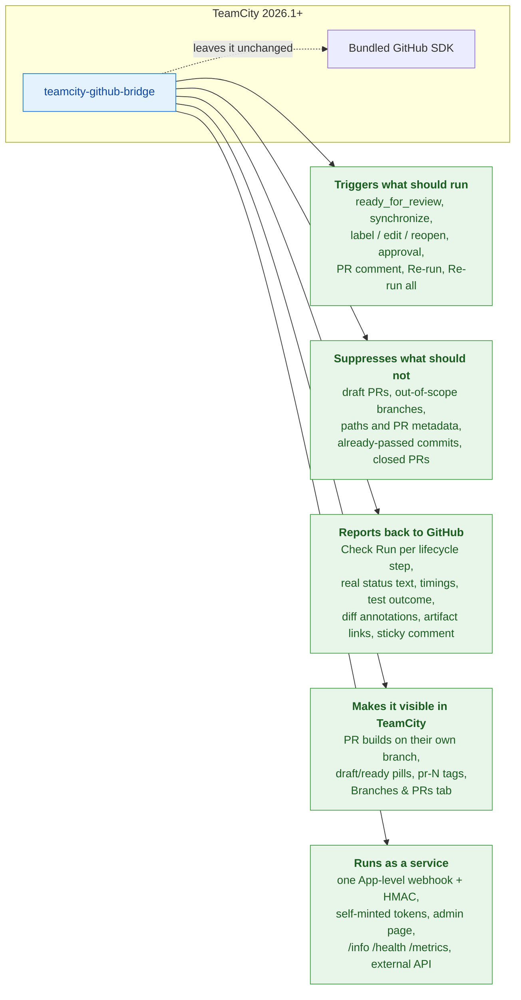
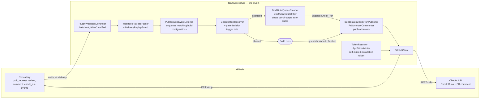

<p align="center">
  
</p>

# teamcity-github-bridge

> A TeamCity 2026.1+ server-side plugin that closes the gap between
> TeamCity and GitHub: draft PR awareness, automatic retrigger on
> ready-for-review, App-level webhooks with HMAC verification, rich
> GitHub Check Runs that carry the build's actual status text, and a
> native admin page in TeamCity's UI.

[](LICENSE)
[](https://www.jetbrains.com/teamcity/)
[](doc/development.md)
[](#status)
[](#status)

---

## The problem

TeamCity 2026.1's bundled GitHub integration leaves a few sharp edges
that bite real pipelines:

| Pain point | Effect on day-to-day work |
|---|---|
| `teamcity.pullRequest.isDraft` is not exposed | DSL has no clean way to skip a build for draft PRs. |
| `pullRequests { ignoreDrafts = true }` is silently ignored with GitHub App auth | Drafts get built anyway, burning CI minutes. |
| No retrigger when a PR transitions from draft to ready | Builds that were "skipped via service message" stay green - the PR can be merged with un-validated changes. **This is the safety bug that motivated the plugin.** |
| No App-level webhook endpoint, only per-repo webhooks via `teamcity-commit-hooks` | One webhook per repo to maintain by hand. |
| Hardcoded "TeamCity build finished" message on commit statuses | The build status text never reaches GitHub. |

This plugin is the place to fix these things outside of the JetBrains
release cycle.

## What you get



Concretely:

- **Suppresses automatic builds for draft PRs** (per-buildType opt-in -
  paused configs are untouched): the queued build is removed and a
  "Skipped: draft PR" Check Run explains why. An explicit request - a Run
  from the TC UI, a comment command, a Re-run button - always goes through,
  and the bridge never removes a build it did not enqueue itself.
- **Tags every opted-in PR build with `draft` / `ready`** the moment
  it hits the queue (`PrPromotionTagger`) so the queue UI shows at a
  glance which builds are deliberately held versus agent-starved.
- **Publishes a GitHub Check Run at every lifecycle transition** —
  `queued` when the build enters the TC queue, `in_progress` on
  start, `cancelled` on `buildInterrupted` /
  `buildRemovedFromQueue`, `success`/`failure`/`cancelled` on
  `buildFinished`, and `skipped` for draft-held builds. Each Check
  Run carries a `details_url` that jumps directly to the build page
  in TC. Propagates the build's `statusDescriptor.text` into
  GitHub's PR UI instead of the hard-coded
  `"TeamCity build finished"` from the bundled publisher, and reports
  where the build's time went and what its tests did.
- **Personal builds publish nothing** - they verify a patch that is not
  in the repository, so no Check Run may describe the commit. They still
  get the PR parameters and tags.
- **Listens for `pull_request.ready_for_review`** and enqueues every
  matching build configuration. No more "merged with stale green
  checks".
- **One webhook URL for the whole GitHub App** instead of one per
  repository. HMAC-SHA256 verification is mandatory and fail-closed.
- **`/info` endpoint** that returns the live webhook configuration
  (URL, recommended events, secret status, log path) as JSON or
  Markdown. Paste-ready into GitHub's App settings.
- **Native admin page** at `Administration -> Server Administration
  -> GitHub Bridge` showing plugin status, recent events, and help
  links.
- **Dedicated log file** at `<TC_DATA_DIR>/logs/teamcity-github-bridge.log`
  via a shipped log4j snippet.
- **Visual pill rendering** of the `draft` / `ready` tags in TC
  build lists (client-side CSS via a `SimplePageExtension`).
- **Forward-compatible with the new stateless `ghs_*` token format**
  - tokens are treated as opaque end-to-end.
- **Self-mints its own installation tokens** from the App's private
  key (signed JWT + `POST /app/installations/{id}/access_tokens`),
  so the plugin works on a vanilla TeamCity 2026.1 sandbox without
  any prior interaction with TC's connection cache.

### In the staging build (1.10.0, not released yet)

- **The Check Run says where the build's time went** - total, working time, and
  the wait split between its dependencies and a free agent.
- **And what the tests did** - the counts in the title GitHub shows in the merge
  box, the failing tests in the body, new failures first, muted ones apart.
- **Personal builds report nothing**, and stay out of the queue dedup, while
  still getting their PR parameters and tags.

### Newest first (1.9.0)

- **Build pull requests on their own branch** - a per-project switch makes PR
  builds run on the PR's head branch (`Feature/toto`) instead of the synthetic
  `pull/N` ref: readable branch names everywhere in TeamCity, and a push
  builds *once* instead of twice once a PR exists.
- **A "Branches & PRs" project tab** - one list of the bridge's builds, each
  row carrying both keys (branch **and** PR number), searchable by either
  (`Feature/`, `189`, `#189`) and sortable by time, branch or PR.
- **Compiler diagnostics annotated on the diff** - errors and warnings from
  the build problems TeamCity reports are pinned to their file and line in the
  pull request (clang/gcc and MSVC shapes).
- **Artifact links from the pull request** - the completed Check Run lists the
  build's artifacts and the sticky comment gains an `[artifacts]` link, so a
  reviewer or a tester reaches the installer without opening TeamCity.
- **"Re-run all checks" works**, including re-running a *skipped* row, with an
  option to restrict it to the checks that failed.
- **Publication is one switch, independent of what triggered the build** - a
  build configuration reports to GitHub, or it does not; a PR event, a VCS
  trigger, a schedule, a manual Run and a comment command are all treated the
  same.
- **Reuse a commit that already passed** - an automatic build queued for a
  commit that already went green is dropped and the earlier success is
  republished, instead of spending an agent to reproduce a known result.
- **Pull requests from forks are ignored** - the bridge is attached to one
  repository, never to its forks.
- **Warns when two status publishers report the same build** - carrying both
  this feature and TeamCity's bundled *Commit status publisher* means two
  competing rows per build; the plugin says so at startup and in its
  self-tests, and never disables anything behind your back.

### Earlier releases (1.7.0 / 1.8.0)

- **Builds launched on a branch report into its PR** - run a
  configuration on `Feature/x` itself instead of the `pull/N` ref and it
  still lands in the pull request: the Check Run is posted on the built
  commit (same name as the PR build, so it satisfies the same required
  check), and the PR parameters, the `draft`/`ready` tag and the summary
  comment come from the open PR whose head is that commit.
- **Trigger or skip builds from PR metadata** - per-build-configuration
  filters on the pull request's **title**, **description** and **labels**:
  a require-phrase, a skip-phrase (e.g. `[skip ci]`), and a label filter
  (`+:ci` / `-:no-ci`). Manual runs bypass them; excluded auto triggers get
  a "Skipped: PR metadata out of scope" Check Run.
- **One-click managed GitHub App** - create a pre-configured GitHub App
  straight from the admin page (GitHub's manifest flow): the webhook URL,
  permissions and events are filled in for you and the credentials are
  stored automatically. A **Verify** button checks the live App against
  what the plugin needs. Point a project at it with `connectionId=managed`
  — no TeamCity OAuth connection or `.pem` handling required.
- **In-product configuration pages** - no more editing files by
  hand. A per-project **GitHub Bridge** settings tab lets project
  admins tune behaviour for their project, and the server admin page
  edits the server-level settings and feature flags live, with every
  change applied immediately (no restart).
- **HTTP retry + GitHub rate-limit handling** - transient failures
  are retried, and the client honours GitHub's `Retry-After` /
  rate-limit headers so it backs off instead of hammering the API.
- **Webhook replay protection** - duplicate deliveries are detected
  and dropped by deduplicating on the `X-GitHub-Delivery` id.
- **`/health` and `/metrics` endpoints** - a JSON `/health` probe
  for liveness checks and a Prometheus-format `/metrics` endpoint
  for scraping.
- **Cancels still-queued builds on `pull_request.closed`/merged** -
  when a PR is closed or merged, any of its builds still sitting in
  the queue are removed instead of wasting agent time.
- **Monorepo path filtering** - a per-buildType `pathFilter` so a
  build only fires when the PR touches paths it cares about.
- **Run-on-approval and re-run from the GitHub Checks UI** -
  `pull_request_review` can gate builds on approval, and the
  **Re-run** button on a GitHub Check Run (`check_run` `rerequested`)
  re-enqueues the build.
- **Trigger builds from PR comments** - posting a configurable
  phrase as a `pull_request_review_comment` (inline diff comment)
  enqueues builds, restricted to trusted commenters (repo
  collaborators by default).
- **Optional sticky PR summary comment** - a single maintained
  comment on the PR that summarises build status (requires the
  GitHub App to have pull-requests/issues **write** permission).
- **Repo allowlist and dry-run mode** - scope the plugin to an
  explicit set of repositories, and a dry-run mode that logs what
  it *would* do without enqueuing or posting anything.
- **Authenticated external HTTP API** - a bearer-token API under
  `/app/teamcity-github-bridge/api/` exposing status, events and
  metrics, and able to trigger builds programmatically.
- **Legacy `teamcity.pullRequest.*` parameter aliases** (opt-in) -
  exposes the PR metadata under the bundled parameter names for DSL
  that already relies on them.

## Quick start

**➡️ New here? Follow the [5-minute Quickstart](doc/quickstart.md)** — it
takes you from a fresh install to a green Check Run using the one-click
**managed GitHub App** flow (no private key, no manual webhook).

Build the plugin archive (everything runs in Docker — nothing is
installed on the host):

```bash
./dev package
# -> target/teamcity-github-bridge-<version>.zip

# Drop it into your TeamCity Data Dir and restart
cp target/teamcity-github-bridge-*.zip <TC_DATA_DIR>/plugins/
```

Then, in the product:

1. **Administration → GitHub Bridge → Create GitHub App**, and install it.
2. **Administration → \<project\> → GitHub Bridge**: set the repository and `connectionId=managed`.
3. Add the **GitHub Bridge integration** build feature to a build configuration.

Prefer to wire an existing App by hand? See
[github-app-setup.md → Option B](doc/github-app-setup.md) and
[webhook-setup.md](doc/webhook-setup.md).

## Architecture at a glance



See [doc/architecture.md](doc/architecture.md) for the full picture
(component diagram, sequence diagrams, threading model).

## Documentation map

> **Tip for AI readers**: each page below is self-contained. Start
> with the linked page closest to the question you are answering;
> they cross-link rather than nest.

**New to the plugin? Start with the [Quickstart](doc/quickstart.md).**
The [doc/ index](doc/README.md) maps every page to a task.

### Get it running

- [Quickstart](doc/quickstart.md) - fresh install to a green Check Run
  in 5 minutes via the managed-App flow.
- [Installation](doc/installation.md) - build the zip, drop it in
  the data dir, verify the load.
- [GitHub App setup](doc/github-app-setup.md) - create the App,
  grant the right permissions, install on repos, wire up the
  TeamCity connection.
- [Webhook setup](doc/webhook-setup.md) - configure the App-level
  webhook using the live `/info` endpoint.
- [Configuration reference](doc/configuration.md) - every parameter
  the plugin understands.

### Operate it

- [Usage scenarios](doc/usage-scenarios.md) - what happens for each
  PR lifecycle event (open, draft, ready, merge, force-push, etc.),
  with sequence diagrams.
- [Branching workflows](doc/branching-workflows.md) - how the plugin fits a
  default branch + dated release branches + work branches model: which
  builds run where, who reports what, and the choices to make when
  setting it up.
- [HTTP API reference](doc/api-reference.md) - `/webhook`, `/info`,
  `/info.md` with curl examples.
- [Troubleshooting](doc/troubleshooting.md) - common failure modes
  and how to read the logs.

### Understand it

- [Architecture](doc/architecture.md) - components, data flow,
  threading, extension points.
- [Security model](doc/security.md) - trust boundaries, signature
  verification, fail-closed defaults, token opacity.

### Contribute

- [Developer guide](doc/development.md) - building with Docker,
  running tests, layout, conventions, how to add a feature.

### Project meta

- [Changelog](CHANGELOG.md) - per-version change log.
- [Contributing](CONTRIBUTING.md) - build, test, coding conventions, how to release.
- [Roadmap](doc/roadmap.md) - forward-looking work items.

## Status

**Stable**. Current version is **1.9.3**, in development towards 1.10.0.
339 unit tests pass.
The plugin has been installed end-to-end against both vanilla
github.com and a live GitHub Enterprise (`github.example.com`)
TeamCity 2026.1 server. The in-product self-test battery
validates webhook delivery, HMAC verification, token issuance
(via the plugin's own self-mint path) and the GitHub REST
round-trip - the whole battery passes on a correctly-configured
installation. (Its size depends on how many projects are opted in,
since token resolution and API auth are checked per project.)

The public API surface (the `teamcity.github.bridge.*` namespace,
the `/app/teamcity-github-bridge/*` endpoints, the
`/admin/bridge/*` form actions) is stable. Future minor releases
may add fields and endpoints; they will not rename or remove what
already exists.

See [CHANGELOG.md](CHANGELOG.md) for the per-version change log.
See [doc/roadmap.md](doc/roadmap.md) for what is planned next, and the
[CHANGELOG](CHANGELOG.md) for what already shipped.

## License

Apache License 2.0 - see [LICENSE](LICENSE).
