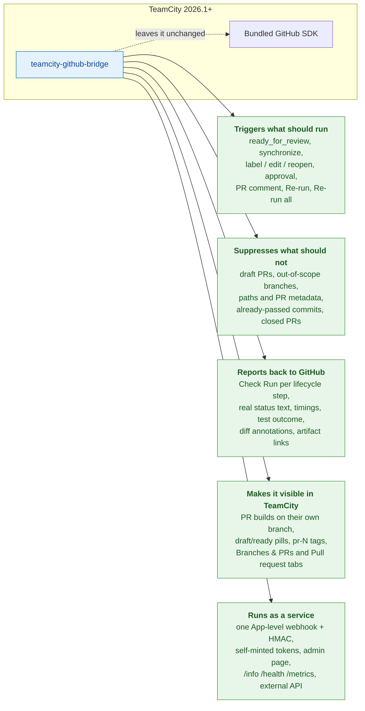
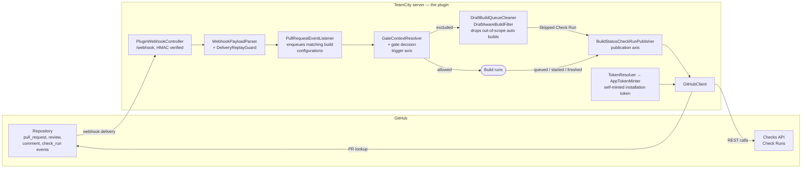

<p align="center">
  
</p>

# teamcity-github-bridge

> A TeamCity 2026.1+ server-side plugin that closes the gap between
> TeamCity and GitHub: draft PR awareness, automatic retrigger on
> ready-for-review, App-level webhooks with HMAC verification, rich
> GitHub Check Runs that carry the build's actual status text, and a
> native admin page in TeamCity's UI.

[](LICENSE)
[](https://www.jetbrains.com/teamcity/)
[](doc/development.md)
[](#status)
[](#status)

---

## The problem

TeamCity 2026.1's bundled GitHub integration leaves a few sharp edges
that bite real pipelines:

| Pain point | Effect on day-to-day work |
|---|---|
| `teamcity.pullRequest.isDraft` is not exposed | DSL has no clean way to skip a build for draft PRs. |
| `pullRequests { ignoreDrafts = true }` is silently ignored with GitHub App auth | Drafts get built anyway, burning CI minutes. |
| No retrigger when a PR transitions from draft to ready | Builds that were "skipped via service message" stay green - the PR can be merged with un-validated changes. **This is the safety bug that motivated the plugin.** |
| No App-level webhook endpoint, only per-repo webhooks via `teamcity-commit-hooks` | One webhook per repo to maintain by hand. |
| Hardcoded "TeamCity build finished" message on commit statuses | The build status text never reaches GitHub. |

This plugin is the place to fix these things outside of the JetBrains
release cycle.

Already solving this with an external webhook relay plus a few TeamCity
"service" builds that dedupe and cancel? Read
[**Why this plugin**](doc/why-this-plugin.md) — the case for making those
decisions inside the server instead, what you stop operating, and a
reversible migration path.

## What you get


```mermaid
flowchart LR
    classDef solved fill:#e8f5e9,stroke:#43a047,color:#1b5e20
    classDef plugin fill:#e3f2fd,stroke:#1976d2,color:#0d47a1

    subgraph TeamCity["TeamCity 2026.1+"]
        SDK["Bundled GitHub SDK"]
        BRIDGE["teamcity-github-bridge"]:::plugin
    end

    TRIG["<b>Triggers what should run</b><br/>ready_for_review, synchronize,<br/>label / edit / reopen, approval,<br/>PR comment, Re-run, Re-run all"]:::solved
    SKIP["<b>Suppresses what should not</b><br/>draft PRs, out-of-scope branches,<br/>paths and PR metadata,<br/>already-passed commits, closed PRs"]:::solved
    PUB["<b>Reports back to GitHub</b><br/>Check Run per lifecycle step,<br/>real status text, timings, test outcome,<br/>diff annotations, artifact links"]:::solved
    VIEW["<b>Makes it visible in TeamCity</b><br/>PR builds on their own branch,<br/>draft/ready pills, pr-N tags,<br/>Branches &amp; PRs and Pull request tabs"]:::solved
    OPS["<b>Runs as a service</b><br/>one App-level webhook + HMAC,<br/>self-minted tokens, admin page,<br/>/info /health /metrics, external API"]:::solved

    BRIDGE -. "leaves it unchanged" .-> SDK
    BRIDGE --> TRIG
    BRIDGE --> SKIP
    BRIDGE --> PUB
    BRIDGE --> VIEW
    BRIDGE --> OPS
```

Concretely:

**Triggering — what should run**

- Enqueues the matching build configurations on `ready_for_review`, every
  push, reopen, label or edit, an approval (`runOnApproval`), a PR comment
  phrase (`commentTrigger`, trusted commenters only) and GitHub's **Re-run** /
  **Re-run all checks** buttons.
- Per-build-configuration gates: branches, ready and draft PRs (drafts are
  opt-in), branch lists, changed paths (monorepo), PR title/body phrases and
  labels.
- Builds a PR on its own head branch instead of `pull/N` if you want readable
  branch names and one build per push.

**Suppression — what should not**

- Drops automatic builds that a gate excludes and says so with a
  *"Skipped: …"* Check Run; an explicit Run, comment or Re-run always goes
  through, and the bridge never removes a build it did not enqueue.
- Reuses a commit that already passed (`skipIfCommitPassed`).
- Stops running builds whose verdict has nowhere to go — the previous head
  after a push (reported *"Superseded by …"*, `skipped`), a closed or merged
  PR — never a personal build or one started by hand.

**Reporting — back to GitHub**

- One Check Run per build configuration, through every lifecycle step: queued
  (with position and estimated start), in progress, and a conclusion carrying
  the build's real status text, its timings, its test outcome (new failures
  first), artifact links and compiler diagnostics annotated on the diff.
- Names infrastructure failures as such, and optionally lets them not block
  the merge (`checkRun.infraNeutral`).
- Keeps rows honest: a green row never flips back to *Queued* for a chain
  duplicate, and a row left open by a restart or a missed event is concluded
  on its own.
- A stable check name per build configuration (`checkName`), and self-tests
  that warn when a required check can never arrive or two configurations
  post the same name.
- Personal builds publish nothing.

**Pull requests — opt-in writes**

- Assigns a new, unassigned pull request to its author.
- Labels pull requests by rules: changed paths, author or team, branches,
  title. Labels are only added, and one removed by hand stays removed.

**Inside TeamCity**

- `draft` / `ready` pills and `pr-N` tags on builds, a **Branches & PRs**
  project tab, a **Pull request** tab on every PR build, and 16
  `teamcity.github.bridge.*` build parameters (number, title, author,
  branches, merge base, changed files, …).

**Operations**

- One App-level webhook with mandatory, fail-closed HMAC-SHA256 verification
  and replay protection; self-minted installation tokens; a one-click
  **managed GitHub App**.
- In-product configuration (server, project, build feature), a self-test
  battery, `/info`, `/health`, `/metrics`, an authenticated external API, a
  dedicated log, dry-run and a repository allowlist.

What changed in each release is in [CHANGELOG.md](CHANGELOG.md); what is
planned, in [doc/roadmap.md](doc/roadmap.md).

## Quick start

**➡️ New here? Follow the [5-minute Quickstart](doc/quickstart.md)** — it
takes you from a fresh install to a green Check Run using the one-click
**managed GitHub App** flow (no private key, no manual webhook).

Build the plugin archive (everything runs in Docker — nothing is
installed on the host):

```bash
./dev package
# -> target/teamcity-github-bridge-<version>.zip

# Drop it into your TeamCity Data Dir and restart
cp target/teamcity-github-bridge-*.zip <TC_DATA_DIR>/plugins/
```

Then, in the product:

1. **Administration → GitHub Bridge**, tab **GitHub App** → **Create GitHub App**, and install it.
2. **Administration → \<project\> → GitHub Bridge**, tab **Repository**: set the repository and `connectionId=managed`.
3. Add the **GitHub Bridge integration** build feature to a build configuration.

Prefer to wire an existing App by hand? See
[github-app-setup.md → Option B](doc/github-app-setup.md) and
[webhook-setup.md](doc/webhook-setup.md).

## Architecture at a glance


```mermaid
flowchart LR
    subgraph GH["GitHub"]
        REPO["Repository<br/>pull_request, review,<br/>comment, check_run events"]
        CHECKS["Checks API<br/>Check Runs"]
    end

    subgraph TC["TeamCity server — the plugin"]
        WH["PluginWebhookController<br/>/webhook, HMAC verified"]
        PARSE["WebhookPayloadParser<br/>+ DeliveryReplayGuard"]
        LISTEN["PullRequestEventListener<br/>enqueues matching build<br/>configurations"]
        GATE["GateContextResolver<br/>+ gate decision<br/>trigger axis"]
        CLEAN["DraftBuildQueueCleaner<br/>DraftAwareBuildFilter<br/>drops out-of-scope auto builds"]
        BUILD(["Build runs"])
        PUB["BuildStatusCheckRunPublisher<br/>publication axis"]
        TOKEN["TokenResolver → AppTokenMinter<br/>self-minted installation token"]
        API["GitHubClient"]
    end

    REPO -- "webhook delivery" --> WH
    WH --> PARSE --> LISTEN --> GATE
    GATE -- "allowed" --> BUILD
    GATE -- "excluded" --> CLEAN
    CLEAN -- "Skipped Check Run" --> PUB
    BUILD -- "queued / started / finished" --> PUB
    PUB --> API
    TOKEN --> API
    API -- "REST calls" --> CHECKS
    API -- "PR lookup" --> REPO
```

See [doc/architecture.md](doc/architecture.md) for the full picture
(component diagram, sequence diagrams, threading model).

## Documentation map

> **Tip for AI readers**: each page below is self-contained. Start
> with the linked page closest to the question you are answering;
> they cross-link rather than nest.

**New to the plugin? Start with the [Quickstart](doc/quickstart.md).**
The [doc/ index](doc/README.md) maps every page to a task.

### Get it running

- [Quickstart](doc/quickstart.md) - fresh install to a green Check Run
  in 5 minutes via the managed-App flow.
- [Installation](doc/installation.md) - build the zip, drop it in
  the data dir, verify the load.
- [Upgrading](doc/upgrading.md) - what each release changes for the
  operator: GitHub permissions to revoke, defaults that change what
  reviewers see, and how to roll back.
- [GitHub App setup](doc/github-app-setup.md) - create the App,
  grant the right permissions, install on repos, wire up the
  TeamCity connection.
- [Webhook setup](doc/webhook-setup.md) - configure the App-level
  webhook using the live `/info` endpoint.
- [Configuration reference](doc/configuration.md) - every parameter
  the plugin understands.

### Operate it

- [Usage scenarios](doc/usage-scenarios.md) - what happens for each
  PR lifecycle event (open, draft, ready, merge, force-push, etc.),
  with sequence diagrams.
- [Branching workflows](doc/branching-workflows.md) - how the plugin fits a
  default branch + dated release branches + work branches model: which
  builds run where, who reports what, and the choices to make when
  setting it up.
- [HTTP API reference](doc/api-reference.md) - `/webhook`, `/info`,
  `/info.md` with curl examples.
- [Troubleshooting](doc/troubleshooting.md) - common failure modes
  and how to read the logs.

### Understand it

- [Why this plugin](doc/why-this-plugin.md) - the case against an external
  webhook relay and against the bundled integration, head-to-head tables,
  objections answered, migration path.
- [Architecture](doc/architecture.md) - components, data flow,
  threading, extension points.
- [Security model](doc/security.md) - trust boundaries, signature
  verification, fail-closed defaults, token opacity.

### Contribute

- [Developer guide](doc/development.md) - building with Docker,
  running tests, layout, conventions, how to add a feature.

### Project meta

- [Changelog](CHANGELOG.md) - per-version change log.
- [Contributing](CONTRIBUTING.md) - build, test, coding conventions, how to release.
- [Roadmap](doc/roadmap.md) - forward-looking work items.

## Status

**Stable**. Current version is **1.11.0**.
The plugin has been installed end-to-end against both vanilla
github.com and a live GitHub Enterprise TeamCity 2026.1 server. The
in-product self-test battery validates webhook delivery, HMAC
verification, token issuance (via the plugin's own self-mint path), the
GitHub REST round-trip and the configuration itself — the whole battery
passes on a correctly-configured installation.

The public API surface (the `teamcity.github.bridge.*` namespace,
the `/app/teamcity-github-bridge/*` endpoints, the
`/admin/bridge/*` form actions) is stable. Future minor releases
may add fields and endpoints; they will not rename or remove what
already exists.

See [CHANGELOG.md](CHANGELOG.md) for what shipped and
[doc/roadmap.md](doc/roadmap.md) for what is planned.

## License

Apache License 2.0 - see [LICENSE](LICENSE).
