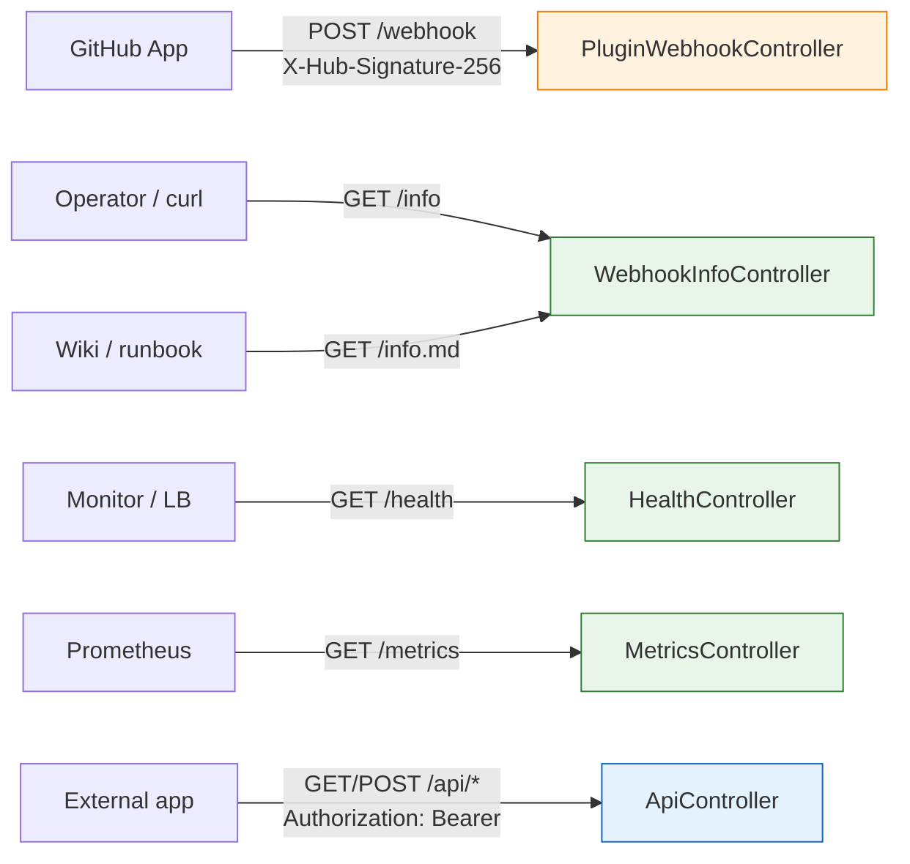

# HTTP API reference

The HTTP endpoints the plugin registers in TeamCity, with
request/response shapes and curl examples.

All endpoints are mounted under `/app/teamcity-github-bridge/`
(plus the admin form handlers under `/admin/bridge/`).

Most endpoints do not require TeamCity authentication: the webhook
is protected by HMAC, the info/health/metrics endpoints expose
nothing sensitive. The exception is the **external API** under
`/api/*`, which is protected by its own **bearer token** (set on
the admin page) rather than by a TeamCity session - see
[External authenticated API](#external-authenticated-api-api).

## Endpoint summary

| Method | Path | Purpose | Auth |
|---|---|---|---|
| `POST` | `/app/teamcity-github-bridge/webhook` | Receive GitHub webhooks | HMAC-SHA256 over the body |
| `GET`  | `/app/teamcity-github-bridge/info` | Live webhook config snapshot (JSON) | none |
| `GET`  | `/app/teamcity-github-bridge/info.md` | Same snapshot as Markdown | none |
| `GET`  | `/app/teamcity-github-bridge/health` | Liveness/readiness snapshot (JSON) | none |
| `GET`  | `/app/teamcity-github-bridge/metrics` | Counters in Prometheus text format | none |
| `GET`  | `/app/teamcity-github-bridge/api/status` | Config snapshot (JSON) | Bearer token |
| `GET`  | `/app/teamcity-github-bridge/api/events` | Recent webhook deliveries (JSON) | Bearer token |
| `GET`  | `/app/teamcity-github-bridge/api/metrics` | Counter snapshot (JSON) | Bearer token |
| `POST` | `/app/teamcity-github-bridge/api/trigger` | Enqueue a build | Bearer token |
| `GET`  | `/app/teamcity-github-bridge/app-callback` | GitHub App-manifest creation callback (stores the new App's credentials) | TC admin (`CHANGE_SERVER_SETTINGS`) + session `state` check |
| `GET`  | `/admin/admin.html?tab=bridgeAdmin&...` | Admin / help page (AdminPage tab, JSP-rendered) | TeamCity admin |
| `POST` | `/admin/bridge/saveSecret.html` | Manage secret, settings, and API token (forms on the admin page) | TC `CHANGE_SERVER_SETTINGS` + CSRF token |
| `POST` | `/admin/bridge/runTests.html` | Run the self-test battery (button on the admin page) | TC `CHANGE_SERVER_SETTINGS` + CSRF token |



## POST /webhook

Receives GitHub webhook deliveries. Always verifies the signature
before processing.

### Request

| Header | Required | Meaning |
|---|---|---|
| `X-GitHub-Event` | yes | The event type. Handled: `ping`, `pull_request` (incl. `closed`/`merged`), `pull_request_review`, `issue_comment`, `check_run` (`rerequested`). |
| `X-Hub-Signature-256` | yes | `sha256=<hex>` HMAC over the raw body |
| `Content-Type` | yes | Must be `application/json` |
| `X-GitHub-Delivery` | recommended | Unique delivery ID. Used for **replay protection**: when enabled, a redelivered payload carrying a delivery ID already seen is acked with `200 OK` (`duplicate delivery ignored`) but not re-processed. |

Body: a JSON payload as documented in
[GitHub's webhook events reference](https://docs.github.com/en/webhooks/webhook-events-and-payloads).

**Payload size bound.** The endpoint is anonymous and the HMAC is
verified only after the body is read, so the read is bounded at
**25 MB** (GitHub's documented webhook cap). A larger declared
`Content-Length`, or a stream that exceeds the bound, is rejected
with `413 Payload Too Large` (`Payload too large`) before the whole
body is buffered.

### Responses

| Status | Meaning |
|---|---|
| `200 OK` | Event handled. Body: `pong` for `ping`, `duplicate delivery ignored` for a replayed delivery, empty otherwise. |
| `204 No Content` | Event not recognised / unsupported (e.g. `push`). |
| `400 Bad Request` | `X-GitHub-Event` header missing. Body: `Missing X-GitHub-Event header`. |
| `401 Unauthorized` | Signature missing, malformed, or invalid; or `teamcity.github.bridge.webhook.secret` not configured. Body: `Invalid signature`. |
| `413 Payload Too Large` | Body exceeds the 25 MB bound. Body: `Payload too large`. |

### Handled actions

| Event | Acted on | Effect |
|---|---|---|
| `pull_request` | `ready_for_review`, plus `closed`/`merged` and other parsed actions | Enqueue or cancel builds per the listener logic. Actions that do not parse return `200 OK` without enqueuing. |
| `pull_request_review` | `approved` | An approval is handled; non-approval reviews are skipped. |
| `issue_comment` | `created` on a PR | A comment command on a pull request is handled; non-PR comments are skipped. |
| `check_run` | `rerequested` | A check-run re-run request triggers a re-run; other actions are skipped. |
| `ping` | always | Replies `pong`. |

Recognised-but-skipped events still return `200 OK`; unsupported
event types return `204 No Content`.

### Example: a ping delivery

```http
POST /app/teamcity-github-bridge/webhook HTTP/1.1
Host: teamcity.example.com
X-GitHub-Event: ping
X-Hub-Signature-256: sha256=4bf6...
Content-Type: application/json

{"zen": "Non-blocking is better than blocking."}
```

Response:

```http
HTTP/1.1 200 OK
Content-Type: text/plain; charset=UTF-8

pong
```

### Example: a ready_for_review delivery

```http
POST /app/teamcity-github-bridge/webhook HTTP/1.1
Host: teamcity.example.com
X-GitHub-Event: pull_request
X-Hub-Signature-256: sha256=8e2f...
Content-Type: application/json

{
  "action": "ready_for_review",
  "number": 189,
  "pull_request": {
    "number": 189,
    "head": {"ref": "Feature/raycast", "sha": "deadbeef1234..."},
    "base": {"ref": "main"}
  },
  "repository": {"full_name": "acme/widget"}
}
```

Response:

```http
HTTP/1.1 200 OK
```

### Manual test

```bash
secret='your-secret'
body='{"zen": "test"}'
sig=$(printf '%s' "$body" | openssl dgst -sha256 -hmac "$secret" | awk '{print $2}')

curl -i \
    -H "X-GitHub-Event: ping" \
    -H "X-Hub-Signature-256: sha256=$sig" \
    -H "Content-Type: application/json" \
    --data "$body" \
    https://<TC_HOST>/app/teamcity-github-bridge/webhook
```

You should get `200 pong`.

## GET /info

Returns the live webhook configuration as JSON, computed from the
current request (host, scheme) plus the plugin's known config.

### Request

No body, no auth.

```bash
curl https://<TC_HOST>/app/teamcity-github-bridge/info
```

### Response

```json
{
  "payloadUrl": "https://teamcity.example.com/app/teamcity-github-bridge/webhook",
  "contentType": "application/json",
  "sslVerification": true,
  "recommendedEvents": [
    "pull_request",
    "pull_request_review",
    "issue_comment",
    "check_run",
    "push",
    "check_suite",
    "ping"
  ],
  "secretConfigured": true,
  "logFile": "/data/teamcity_server/datadir/logs/teamcity-github-bridge.log",
  "logConfigured": true,
  "pluginVersion": "TeamCity 2026.1 (build 222521)"
}
```

| Field | Type | Meaning |
|---|---|---|
| `payloadUrl` | string | The absolute URL GitHub should POST events to. Computed from the request's host, scheme, port, and context path (with `X-Forwarded-Proto` and `X-Forwarded-Host` respected when present). |
| `contentType` | string | Always `application/json`. The plugin does not parse `application/x-www-form-urlencoded`. |
| `sslVerification` | boolean | `true` when the request reached the plugin over HTTPS (after honouring `X-Forwarded-Proto`). Reflected so the operator copies the right value into GitHub. |
| `recommendedEvents` | array of string | The events the operator should subscribe to in the App. Acted on: `pull_request`, `pull_request_review`, `issue_comment`, `check_run`, `ping`. Forward-listed: `push`, `check_suite`. |
| `secretConfigured` | boolean | `true` when `teamcity.github.bridge.webhook.secret` is set to a non-blank value. **Never echoes the secret itself.** |
| `logFile` | string | Absolute path where the plugin's dedicated log file lives (or *would* live) - always `<TC_DATA_DIR>/logs/teamcity-github-bridge.log`. |
| `logConfigured` | boolean | `true` when the dedicated log file currently exists, i.e. an operator has merged the log4j snippet (`teamcity-github-bridge-log4j-snippet.xml`) into `teamcity-server-log4j.xml`. |
| `pluginVersion` | string | The TeamCity server version string. Used as a sanity check (the plugin is alive). |

### Response codes

| Status | Meaning |
|---|---|
| `200 OK` | Always, when the plugin is loaded. |
| `404 Not Found` | The plugin is not loaded or the controller did not register. |

## GET /info.md

Same content as `/info` but rendered as Markdown for copy-paste
into a runbook or wiki.

### Example

```bash
curl https://<TC_HOST>/app/teamcity-github-bridge/info.md
```

Output:

```markdown
# GitHub App Webhook Configuration

Configure these values on your GitHub App webhook page
(`https://github.com/settings/apps/<your-app>` -> Webhook).

| Field | Value |
|-------|-------|
| Payload URL | `https://teamcity.example.com/app/teamcity-github-bridge/webhook` |
| Content type | `application/json` |
| SSL verification | Enable |
| Secret | configured server-side - reuse the same value |

## Subscribe to events

- `pull_request`
- `pull_request_review`
- `issue_comment`
- `check_run`
- `push`
- `check_suite`
- `ping`

Plugin version: TeamCity 2026.1 (build 222521)
```

## GET /health

Machine-pollable liveness/readiness snapshot for load balancers and
uptime monitors. Anonymous, GET-only. **Always returns `200 OK`**
(the endpoint being reachable proves the process is live); monitors
key off the `status` field rather than the HTTP code. A missing
secret yields `status: "degraded"`, not a non-200 response.

### Request

No body, no auth.

```bash
curl https://<TC_HOST>/app/teamcity-github-bridge/health
```

### Response

```json
{
  "status": "ok",
  "pluginVersion": "TeamCity 2026.1 (build 222521)",
  "secretConfigured": true,
  "logConfigured": true,
  "dryRun": false,
  "replayProtection": true
}
```

| Field | Type | Meaning |
|---|---|---|
| `status` | string | `"ok"` when the webhook secret is configured (the plugin can accept deliveries), `"degraded"` otherwise. |
| `pluginVersion` | string | The plugin version, or `"unknown"`. |
| `secretConfigured` | boolean | `true` when the webhook HMAC secret is set to a non-blank value. |
| `logConfigured` | boolean | `true` when the dedicated log file exists. |
| `dryRun` | boolean | `true` when dry-run mode is on (no Check Runs posted, no builds enqueued). |
| `replayProtection` | boolean | `true` when replay protection is enabled. |

### Response codes

| Status | Meaning |
|---|---|
| `200 OK` | Always, when the plugin is loaded (even when `status` is `degraded`). |
| `404 Not Found` | The plugin is not loaded or the controller did not register. |

## GET /metrics

Exposes the plugin's in-process counters in
[Prometheus text exposition format](https://prometheus.io/docs/instrumenting/exposition_formats/).
Anonymous (same trust posture as `/health` and `/info`). Counters
are process-lifetime totals and reset on server restart.

### Request

No body, no auth.

```bash
curl https://<TC_HOST>/app/teamcity-github-bridge/metrics
```

### Response

`Content-Type: text/plain; version=0.0.4; charset=UTF-8`. Each
counter is rendered as `bridge_<name>_total`:

```text
# TYPE bridge_builds_cancelled_total counter
bridge_builds_cancelled_total 3
# TYPE bridge_builds_enqueued_total counter
bridge_builds_enqueued_total 42
# TYPE bridge_check_runs_failed_total counter
bridge_check_runs_failed_total 0
# TYPE bridge_check_runs_posted_total counter
bridge_check_runs_posted_total 84
# TYPE bridge_webhooks_received_total counter
bridge_webhooks_received_total 128
# TYPE bridge_webhooks_rejected_total counter
bridge_webhooks_rejected_total 2
# TYPE bridge_webhooks_replayed_total counter
bridge_webhooks_replayed_total 1
# TYPE bridge_webhooks_too_large_total counter
bridge_webhooks_too_large_total 0
```

| Counter (`bridge_<name>_total`) | Incremented when |
|---|---|
| `webhooks_received` | Any webhook delivery is received. |
| `webhooks_rejected` | A delivery is rejected (missing `X-GitHub-Event`, or invalid/missing signature). |
| `webhooks_replayed` | A duplicate delivery is ignored by replay protection. |
| `webhooks_too_large` | A delivery exceeds the 25 MB payload bound (`413`). |
| `check_runs_posted` | A GitHub Check Run is published successfully. |
| `check_runs_failed` | Publishing a Check Run fails. |
| `builds_enqueued` | A build is added to the queue. |
| `builds_cancelled` | A queued/running build is cancelled. |

A counter only appears once it has been incremented at least once.

### Response codes

| Status | Meaning |
|---|---|
| `200 OK` | Metrics enabled; counters rendered. |
| `404 Not Found` | Metrics disabled in settings (toggle on the admin page), or the plugin is not loaded. |

## External authenticated API (`/api/*`)

A small authenticated HTTP API for external applications (CI
dashboards, ChatOps, monitoring). Unlike the other endpoints, it is
**not** anonymous: it is protected by a **bearer token** that the
operator sets on the admin page.

### Authentication

Send the token in the `Authorization` header:

```
Authorization: Bearer <token>
```

The provided token is compared to the configured one in
**constant time**. The four `/api/*` routes share this gate:

| Condition | Status | Body |
|---|---|---|
| No token configured (API disabled) | `503 Service Unavailable` | `{"error":"API disabled (no token configured)"}` |
| Missing / malformed / wrong token | `401 Unauthorized` | `{"error":"invalid or missing bearer token"}` |
| Unknown route under `/api/` | `404 Not Found` | `{"error":"no such API route for <METHOD> <path>"}` |

> The token is set/cleared via the admin form
> (`setApiToken` / `clearApiToken`, see below). It is never echoed
> back by any endpoint.

### GET /api/status

Configuration snapshot (JSON).

```bash
curl -H "Authorization: Bearer $BRIDGE_API_TOKEN" \
    https://<TC_HOST>/app/teamcity-github-bridge/api/status
```

```json
{
  "pluginVersion": "TeamCity 2026.1 (build 222521)",
  "secretConfigured": true,
  "dryRun": false,
  "replayProtection": true,
  "metricsEnabled": true,
  "repoAllowlist": ["acme/widget", "acme/gadget"]
}
```

| Field | Type | Meaning |
|---|---|---|
| `pluginVersion` | string | The plugin version, or `"unknown"`. |
| `secretConfigured` | boolean | `true` when the webhook HMAC secret is set. |
| `dryRun` | boolean | `true` when dry-run mode is on. |
| `replayProtection` | boolean | `true` when replay protection is enabled. |
| `metricsEnabled` | boolean | `true` when `/metrics` is served. |
| `repoAllowlist` | array of string | The configured repository allowlist (empty array = no restriction). |

### GET /api/events

The recent in-memory webhook delivery log (the same data the admin
page renders).

```bash
curl -H "Authorization: Bearer $BRIDGE_API_TOKEN" \
    https://<TC_HOST>/app/teamcity-github-bridge/api/events
```

```json
{
  "events": [
    {
      "timestampMs": 1749724800000,
      "event": "pull_request",
      "repo": "acme/widget",
      "action": "ready_for_review",
      "httpStatus": 200,
      "outcome": "ACCEPTED",
      "detail": "pull_request.ready_for_review handled"
    }
  ]
}
```

| Field | Type | Meaning |
|---|---|---|
| `timestampMs` | number | Receipt time (epoch milliseconds). |
| `event` | string | The `X-GitHub-Event` value (or `(missing)`). |
| `repo` | string \| null | Repository slug, when parsed. |
| `action` | string \| null | The event action, when parsed. |
| `httpStatus` | number | The HTTP status returned for the delivery. |
| `outcome` | string | `ACCEPTED`, `SKIPPED`, or `REJECTED`. |
| `detail` | string | Free-form detail string. |

### GET /api/metrics

The same counters as `/metrics`, but as a flat JSON map
(`{name: value}`). Names are the raw counter names (without the
`bridge_` prefix / `_total` suffix).

```bash
curl -H "Authorization: Bearer $BRIDGE_API_TOKEN" \
    https://<TC_HOST>/app/teamcity-github-bridge/api/metrics
```

```json
{
  "webhooks_received": 128,
  "webhooks_rejected": 2,
  "builds_enqueued": 42,
  "check_runs_posted": 84
}
```

Unlike `/metrics`, this route is served regardless of the
`metricsEnabled` setting (it is gated only by the bearer token).

### POST /api/trigger

Enqueue a build for a given build configuration and branch.

```bash
curl -X POST \
    -H "Authorization: Bearer $BRIDGE_API_TOKEN" \
    -H "Content-Type: application/json" \
    -d '{"buildTypeId":"Acme_Widget_Build","branch":"pull/12"}' \
    https://<TC_HOST>/app/teamcity-github-bridge/api/trigger
```

#### Request body

| Field | Required | Meaning |
|---|---|---|
| `buildTypeId` | yes | The build configuration's external ID. |
| `branch` | yes | The branch to build, e.g. `main` or a PR branch like `pull/12`. |

#### Response

```json
{ "queued": true, "detail": "enqueued build for Acme_Widget_Build on pull/12" }
```

| Field | Type | Meaning |
|---|---|---|
| `queued` | boolean | `true` if a build was added to the queue. |
| `detail` | string | Human-readable result / reason. |

| Status | Meaning |
|---|---|
| `200 OK` | Build queued (`queued: true`). |
| `409 Conflict` | Not queued (`queued: false`) - e.g. unknown build type or trigger refused. |
| `400 Bad Request` | Invalid JSON body, or missing `buildTypeId` / `branch`. |
| `401` / `503` | Auth failure / API disabled (see [Authentication](#authentication)). |

## GET /app-callback

Redirect target of the GitHub App-manifest creation flow (v1.7.0+).
After an admin clicks **Create GitHub App** on the admin page and
confirms on GitHub, GitHub redirects the operator's browser here with a
one-time `code` and the `state` the plugin seeded into the admin
session. The plugin exchanges the code for the new App's credentials
(`POST /app-manifests/{code}/conversions`) and stores the App ID,
private key (PEM), slug and webhook secret into the plugin settings, then
bounces back to the admin page with a result banner. See
[github-app-setup.md → Option A](github-app-setup.md#option-a-let-the-plugin-create-the-app-for-you-recommended).

This endpoint is **not** anonymous: unlike the webhook and `/api/*`
routes it relies on TeamCity's session auth. It is reached inside the
operator's authenticated browser session and additionally validates the
`state` parameter, which together defend against a forged callback.

### Request

GET, query parameters:

| Parameter | Required | Meaning |
|---|---|---|
| `code` | yes | The one-time manifest-conversion code GitHub appends to the redirect. |
| `state` | yes | The random value the admin page seeded into the session; must match. |

Authorization: a logged-in user with `CHANGE_SERVER_SETTINGS`. The
`state` must equal the value stored in the session under
`bridgeAppState` (consumed once on use).

### Responses

| Status | Meaning |
|---|---|
| `302` (redirect to the admin page with `?bridgeResult=appCreated`) | Code exchanged; App ID / private key / slug / webhook secret stored. |
| `302` (redirect with `?bridgeResult=appError`) | Missing/mismatched `state`, missing `code`, or the manifest conversion failed. |
| `403 Forbidden` | No user session, or the user lacks `CHANGE_SERVER_SETTINGS`. |

The endpoint never renders the App credentials; they go straight into
the plugin settings file and the admin page shows only the App slug.

## Admin page

The plugin registers an `AdminPage` tab visible at:

```
<TC_URL>/admin/admin.html?item=<...>&tab=bridgeAdmin
```

Navigate to it via `Administration -> Server Administration ->
GitHub Bridge` in the sidebar (the page is grouped under
`SERVER_RELATED_GROUP`).

The page shows:

- Plugin and TC versions.
- Webhook URL, with the secret and dedicated-log configuration
  status (red / yellow / green chips).
- Last 100 webhook deliveries in memory (event, action, repository,
  HTTP status, outcome, detail). Cleared on server restart; the
  dedicated log is the long-term record.
- A copy-paste card with the GitHub App webhook quick-config.
- A **GitHub App** card to create a managed App via the manifest flow
  (or, once created, verify its live permissions/events and deep-link to
  its GitHub settings/installation pages). See
  [GET /app-callback](#get-app-callback).
- A Help section linking to every page under `doc/` on GitHub plus
  a "Common 401 / 404 troubleshooting" fold.

Access is gated by TeamCity's standard admin auth - the JSP is
served from inside `AdminPage`, which inherits TC's admin
authorization filter.

## POST /admin/bridge/saveSecret.html

Mutates the plugin-owned settings file
`<TC_DATA_DIR>/config/teamcity-github-bridge.properties`. Backs the
several forms on the admin page (HMAC secret, plugin settings, and
the external-API token). Despite the legacy `saveSecret.html` name,
the `action` field selects which form was submitted.

### Request

POST, `Content-Type: application/x-www-form-urlencoded`, form fields:

| Field | Required | Values | Meaning |
|---|---|---|---|
| `action` | yes | `set`, `clear`, `saveSettings`, `setApiToken`, `clearApiToken` | What to do (see below). |
| `secret` | yes when `action=set` | non-blank string | New webhook HMAC secret. |
| `tc-csrf-token` | yes | TC's per-session CSRF token | Without it TC's `CSRFFilter` rejects the request with 403. |

Actions:

| `action` | Effect |
|---|---|
| `set` | Set the webhook HMAC secret to the supplied `secret`. |
| `clear` | Clear the webhook HMAC secret. |
| `saveSettings` | Save the plugin settings toggles (dry-run, replay protection, metrics, repo allowlist, etc.). |
| `setApiToken` | Set the external-API bearer token (enables the `/api/*` routes). |
| `clearApiToken` | Clear the external-API bearer token (disables the `/api/*` routes; they then return `503`). |

### Responses

| Status | Meaning |
|---|---|
| `302` (redirect to the admin page) | Operation accepted; the redirected admin page shows a banner indicating result. |
| `401 Unauthorized` | No user session. |
| `403 Forbidden` | The user does not have `CHANGE_SERVER_SETTINGS`, **or** CSRF token missing/invalid. |

All actions require `CHANGE_SERVER_SETTINGS` plus a valid CSRF
token. The endpoint never echoes the secret or API token back.

## POST /admin/bridge/runTests.html

Runs the full self-test battery against the live plugin instance.
Backs the "Run self-tests" button on the admin page.

### Request

POST, no body fields except CSRF.

| Field | Required | Meaning |
|---|---|---|
| `tc-csrf-token` | yes | Per-session CSRF token. |

### Responses

| Status | Meaning |
|---|---|
| `302` (redirect with `?bridgeResult=tested`) | Tests ran; results stashed in the user session and rendered on the next admin-page GET. |
| `401 Unauthorized` | No user session. |
| `403 Forbidden` | Missing `CHANGE_SERVER_SETTINGS` or invalid CSRF token. |

The tests run synchronously (target: under 5 seconds) and the
result list is one-shot: it is consumed on the next admin-page
render then cleared from the session.

### Self-tests

The button runs the full self-test battery (`PluginSelfTester`)
against the live plugin. The fixed checks are:

1. **Webhook secret configured** - is `teamcity.github.bridge.webhook.secret` set anywhere.
2. **Dedicated log file** - has `PluginLogConfigurator` attached the appender, or has an operator wired one manually.
3. **GitHub API reachable** - `GET https://api.github.com/zen` without auth.
4. **HMAC roundtrip** - sign a known payload with the configured secret, verify with `SignatureVerifier`.
5. **Webhook self-delivery** - HMAC-signed POST to our own webhook URL; expects `200 pong`.
6. **Token resolution / `<project>` / `<repo>`** - one row per opted-in buildType project; uses `TokenResolver.resolveAccessToken`.
7. **GitHub API auth / `<project>` / `<repo>`** - one row per project that produced a token; `GET /rate_limit` with the token.

Each test reports `PASS` / `WARN` / `FAIL` / `SKIP` with a free-form
detail string.

## Versioning

The endpoint paths are stable and considered API for this plugin.
Field names in the `/info` JSON response are additive: future
versions may add fields but will not rename or remove existing
ones. Operators may parse the JSON safely; the contract is to
ignore unknown fields.

If a breaking change is ever needed, a new path like
`/app/teamcity-github-bridge/v2/info` will be introduced alongside
the old one.

## Discoverability

The webhook configuration is surfaced on the admin "GitHub Bridge"
tab, which also manages the HMAC secret, plugin settings, and the
external-API token. The `/health`, `/metrics`, and `/api/*`
endpoints are documented here.

## Related pages

- [webhook-setup.md](webhook-setup.md) - how to use `/info` when
  configuring the App.
- [security.md](security.md) - signature verification details.
- [troubleshooting.md](troubleshooting.md) - what to do on 401 or
  404.
