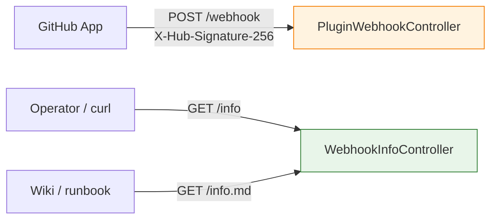

# HTTP API reference

The three HTTP endpoints the plugin registers in TeamCity, with
request/response shapes and curl examples.

All endpoints are mounted under `/app/teamcity-github-bridge/`.
None of them require TeamCity authentication; the webhook is
protected by HMAC and the info endpoints expose nothing sensitive.

## Endpoint summary

| Method | Path | Purpose | Auth |
|---|---|---|---|
| `POST` | `/app/teamcity-github-bridge/webhook` | Receive GitHub webhooks | HMAC-SHA256 over the body |
| `GET`  | `/app/teamcity-github-bridge/info` | Live webhook config snapshot (JSON) | none |
| `GET`  | `/app/teamcity-github-bridge/info.md` | Same snapshot as Markdown | none |



## POST /webhook

Receives GitHub webhook deliveries. Always verifies the signature
before processing.

### Request

| Header | Required | Meaning |
|---|---|---|
| `X-GitHub-Event` | yes | The event type (`ping`, `pull_request`, etc.) |
| `X-Hub-Signature-256` | yes | `sha256=<hex>` HMAC over the raw body |
| `Content-Type` | yes | Must be `application/json` |
| `X-GitHub-Delivery` | optional | Unique delivery ID (logged; will be used for replay protection in a future version) |

Body: a JSON payload as documented in
[GitHub's webhook events reference](https://docs.github.com/en/webhooks/webhook-events-and-payloads).

### Responses

| Status | Meaning |
|---|---|
| `200 OK` | Event handled. Body: `pong` for `ping`, empty otherwise. |
| `204 No Content` | Event recognised but not acted on (e.g. `push` in current version). |
| `400 Bad Request` | `X-GitHub-Event` header missing. |
| `401 Unauthorized` | Signature missing, malformed, or invalid; or `tcgh.webhook.secret` not configured. Body: `Invalid signature`. |

### Handled actions

For `pull_request`, the plugin acts only on `action=ready_for_review`.
Other actions return `200 OK` without enqueuing anything.

### Example: a ping delivery

```http
POST /app/teamcity-github-bridge/webhook HTTP/1.1
Host: teamcity.example.com
X-GitHub-Event: ping
X-Hub-Signature-256: sha256=4bf6...
Content-Type: application/json

{"zen": "Non-blocking is better than blocking."}
```

Response:

```http
HTTP/1.1 200 OK
Content-Type: text/plain; charset=UTF-8

pong
```

### Example: a ready_for_review delivery

```http
POST /app/teamcity-github-bridge/webhook HTTP/1.1
Host: teamcity.example.com
X-GitHub-Event: pull_request
X-Hub-Signature-256: sha256=8e2f...
Content-Type: application/json

{
  "action": "ready_for_review",
  "number": 189,
  "pull_request": {
    "number": 189,
    "head": {"ref": "Feature/raycast", "sha": "deadbeef1234..."},
    "base": {"ref": "main"}
  },
  "repository": {"full_name": "Silmaen/Owl"}
}
```

Response:

```http
HTTP/1.1 200 OK
```

### Manual test

```bash
secret='your-secret'
body='{"zen": "test"}'
sig=$(printf '%s' "$body" | openssl dgst -sha256 -hmac "$secret" | awk '{print $2}')

curl -i \
    -H "X-GitHub-Event: ping" \
    -H "X-Hub-Signature-256: sha256=$sig" \
    -H "Content-Type: application/json" \
    --data "$body" \
    https://<TC_HOST>/app/teamcity-github-bridge/webhook
```

You should get `200 pong`.

## GET /info

Returns the live webhook configuration as JSON, computed from the
current request (host, scheme) plus the plugin's known config.

### Request

No body, no auth.

```bash
curl https://<TC_HOST>/app/teamcity-github-bridge/info
```

### Response

```json
{
  "payloadUrl": "https://teamcity.example.com/app/teamcity-github-bridge/webhook",
  "contentType": "application/json",
  "sslVerification": true,
  "recommendedEvents": [
    "pull_request",
    "pull_request_review",
    "push",
    "check_suite",
    "ping"
  ],
  "secretConfigured": true,
  "pluginVersion": "TeamCity 2026.1 (build 222521)"
}
```

| Field | Type | Meaning |
|---|---|---|
| `payloadUrl` | string | The absolute URL GitHub should POST events to. Computed from the request's host, scheme, port, and context path. |
| `contentType` | string | Always `application/json`. The plugin does not parse `application/x-www-form-urlencoded`. |
| `sslVerification` | boolean | `true` when the request reached the plugin over HTTPS. Reflected so the operator copies the right value into GitHub. |
| `recommendedEvents` | array of string | The events the operator should subscribe to in the App. Currently acted on: `pull_request`, `ping`. Forward-listed: `pull_request_review`, `push`, `check_suite`. |
| `secretConfigured` | boolean | `true` when `tcgh.webhook.secret` is set to a non-blank value. **Never echoes the secret itself.** |
| `pluginVersion` | string | The TeamCity server version string. Used as a sanity check (the plugin is alive). |

### Response codes

| Status | Meaning |
|---|---|
| `200 OK` | Always, when the plugin is loaded. |
| `404 Not Found` | The plugin is not loaded or the controller did not register. |

## GET /info.md

Same content as `/info` but rendered as Markdown for copy-paste
into a runbook or wiki.

### Example

```bash
curl https://<TC_HOST>/app/teamcity-github-bridge/info.md
```

Output:

```markdown
# GitHub App Webhook Configuration

Configure these values on your GitHub App webhook page
(`https://github.com/settings/apps/<your-app>` -> Webhook).

| Field | Value |
|-------|-------|
| Payload URL | `https://teamcity.example.com/app/teamcity-github-bridge/webhook` |
| Content type | `application/json` |
| SSL verification | Enable |
| Secret | configured server-side - reuse the same value |

## Subscribe to events

- `pull_request`
- `pull_request_review`
- `push`
- `check_suite`
- `ping`

Plugin version: TeamCity 2026.1 (build 222521)
```

## Versioning

The endpoint paths are stable and considered API for this plugin.
Field names in the `/info` JSON response are additive: future
versions may add fields but will not rename or remove existing
ones. Operators may parse the JSON safely; the contract is to
ignore unknown fields.

If a breaking change is ever needed, a new path like
`/app/teamcity-github-bridge/v2/info` will be introduced alongside
the old one.

## Discoverability

The endpoints have no UI yet; you discover them via this document.
Future versions may surface them in the TeamCity admin UI (under a
"GitHub Bridge" tab).

## Related pages

- [webhook-setup.md](webhook-setup.md) - how to use `/info` when
  configuring the App.
- [security.md](security.md) - signature verification details.
- [troubleshooting.md](troubleshooting.md) - what to do on 401 or
  404.
