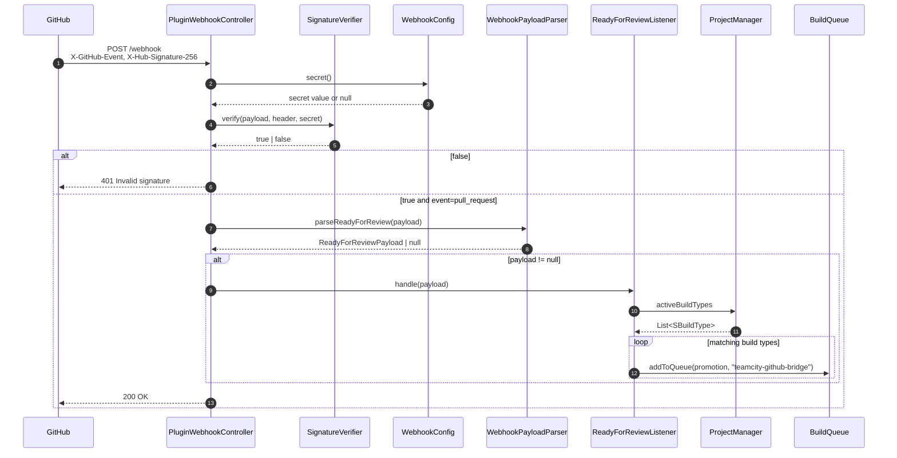
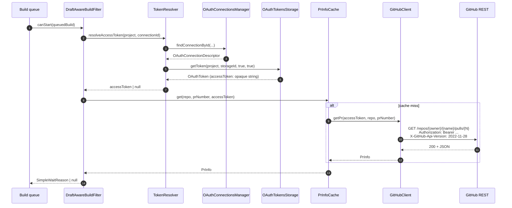

# Architecture

This page describes how the plugin is structured internally, how
Spring DI wires the components, and where the extension points to
TeamCity sit.

## High-level component diagram

```mermaid
flowchart TB
    classDef io fill:#e3f2fd,stroke:#1976d2
    classDef logic fill:#fff3e0,stroke:#f57c00
    classDef cache fill:#f3e5f5,stroke:#7b1fa2
    classDef sdk fill:#eceff1,stroke:#455a64
    classDef ui fill:#e8f5e9,stroke:#43a047

    subgraph TCSDK["TeamCity SDK"]
        OCM[OAuthConnectionsManager]:::sdk
        OTS[OAuthTokensStorage]:::sdk
        PM[ProjectManager]:::sdk
        WCM[WebControllerManager]:::sdk
        SBS[SBuildServer]:::sdk
        SP[ServerPaths]:::sdk
        PP[PagePlaces]:::sdk
        SBP[StartBuildPrecondition<br/>SPI]:::sdk
        BSA[BuildServerAdapter<br/>SPI]:::sdk
    end

    subgraph Plugin["teamcity-github-bridge"]
        TCB[TeamCityGitHubBridgePlugin<br/>lifecycle bean]:::logic
        WC[WebhookConfig]:::logic
        LPR[LogPathResolver]:::logic
        TR[TokenResolver]:::logic
        GC[GitHubClient<br/>REST + Jackson<br/>getPr / postCheckRun]:::io
        PIC[PrInfoCache<br/>TTL 60s]:::cache
        REL[RecentEventsLog<br/>ring buffer N=100]:::cache

        RFR[ReadyForReviewListener]:::logic
        DAF[DraftAwareBuildFilter]:::logic
        PBE[PrBuildEnricher<br/>buildStarted]:::logic
        PPT[PrPromotionTagger<br/>queue tag]:::logic
        DCR[DraftCheckRunReporter<br/>skipped Check Run]:::logic
        BSCRP[BuildStatusCheckRunPublisher<br/>in_progress / completed]:::logic

        PWC[PluginWebhookController]:::io
        WIC[WebhookInfoController]:::io
        ACP[AdminConsolePage<br/>TC admin tab]:::ui
        BEPE[BranchEnrichmentPageExtension<br/>draft/ready pills CSS+JS]:::ui
        WPP[WebhookPayloadParser]:::logic
        SV[SignatureVerifier]:::logic
    end

    OCM --> TR
    OTS --> TR
    TR --> DAF
    TR --> PBE
    TR --> PPT
    TR --> DCR
    TR --> BSCRP

    GC --> PIC
    GC --> DCR
    GC --> BSCRP
    PIC --> DAF
    PIC --> PBE
    PIC --> PPT
    PIC --> DCR

    PM --> RFR
    PIC --> RFR

    SBS --> RFR
    SBS --> PBE
    SBS --> PPT
    SBS --> DCR
    SBS --> BSCRP

    SP --> LPR
    LPR --> WIC
    LPR --> ACP

    WCM --> PWC
    WCM --> WIC
    PP --> ACP
    PP --> BEPE

    WC --> PWC
    WC --> WIC
    WC --> ACP
    SBS --> WIC
    SBS --> ACP

    PWC --> SV
    PWC --> WPP
    PWC --> REL
    REL --> ACP
    WPP --> RFR

    DAF -.implements.-> SBP
    PBE -.extends.-> BSA
    PPT -.extends.-> BSA
    DCR -.extends.-> BSA
    BSCRP -.extends.-> BSA
```



## Packages

```
io.github.dlachouette.teamcity.github
+-- TeamCityGitHubBridgePlugin   (main lifecycle bean)
+-- api/
|   +-- GitHubClient              (open class, HTTP + Jackson: getPr, postCheckRun)
|   +-- PrInfo                    (data class)
|   +-- RepoCoords                (data class + parser)
|   +-- TokenResolver             (connection -> access token, opaque)
|   +-- CheckRunRequest / CheckRunStatus / CheckRunConclusion
+-- cache/
|   +-- PrInfoCache               (TTL-based, ConcurrentHashMap)
+-- config/
|   +-- WebhookConfig             (reads teamcity.github.bridge.webhook.secret)
|   +-- LogPathResolver           (expected dedicated log path + exists check)
+-- enrich/
|   +-- PrBuildEnricher           (BuildServerAdapter.buildStarted)
|   +-- PrPromotionTagger         (BuildServerAdapter.buildTypeAddedToQueue)
+-- filter/
|   +-- DraftAwareBuildFilter     (StartBuildPrecondition)
+-- report/
|   +-- DraftCheckRunReporter         (queued draft -> skipped Check Run)
|   +-- BuildStatusCheckRunPublisher  (start/finish -> in_progress / completed Check Run)
+-- retrigger/
|   +-- ReadyForReviewListener    (enqueues via BuildTypeEx.addToQueue)
+-- web/
    +-- PluginWebhookController       (POST /webhook, HMAC, records to RecentEventsLog)
    +-- WebhookInfoController         (GET /info, /info.md)
    +-- WebhookInfo                   (config snapshot DTO)
    +-- WebhookPayloadParser          (Jackson on pull_request payloads)
    +-- SignatureVerifier             (HMAC SHA-256 + constant-time eq)
    +-- RecentEventsLog               (ring buffer, capacity 100)
    +-- AdminConsolePage              (AdminPage, JSP at admin/bridgeAdmin.jsp)
    +-- BranchEnrichmentPageExtension (SimplePageExtension, JSP at display/bridgeBranchEnrichment.jsp)
```

## Spring DI wiring

Declared in
`src/main/resources/META-INF/build-server-plugin-teamcity-github-bridge.xml`:

```xml
<beans default-autowire="constructor">
    <bean class="...TeamCityGitHubBridgePlugin"/>
    <bean class="...config.WebhookConfig"/>

    <bean class="...api.GitHubClient"/>
    <bean class="...api.TokenResolver"/>
    <bean class="...cache.PrInfoCache"/>

    <bean class="...retrigger.ReadyForReviewListener"/>
    <bean class="...filter.DraftAwareBuildFilter"/>

    <bean class="...web.PluginWebhookController"/>
    <bean class="...web.WebhookInfoController"/>
</beans>
```

`default-autowire="constructor"` makes Spring resolve every
constructor parameter against the available beans. TC's own beans
(`OAuthConnectionsManager`, `OAuthTokensStorage`, `ProjectManager`,
`WebControllerManager`, `SBuildServer`) are exposed by the TC core
context, which our XML inherits from.

## Data flow: inbound (GitHub -> TC)



## Data flow: outbound (TC -> GitHub)



## Threading model

- The TeamCity SDK calls our `StartBuildPrecondition` synchronously
  on the build queue thread. `DraftAwareBuildFilter.canStart` must
  return promptly, hence the cache layer in front of the HTTP call
  (a cold cache miss takes ~200 to ~800 ms).
- `PluginWebhookController.doHandle` is invoked on Jetty's
  request-handling thread. Verification and enqueuing complete in
  the same call.
- `PrInfoCache` uses `ConcurrentHashMap` for thread safety. The
  cache currently has no eviction policy beyond TTL on read; on a
  busy server with many PRs it stays bounded by the number of
  currently-open PRs touched by the precondition.

## Extension points

Where we plug into TC:

| TC interface / pattern | Used by |
|---|---|
| `ServerExtension` (lifecycle marker) | `TeamCityGitHubBridgePlugin` |
| `StartBuildPrecondition` | `DraftAwareBuildFilter` |
| `BaseController` + `WebControllerManager.registerController` | `PluginWebhookController`, `WebhookInfoController` |
| `OAuthConnectionsManager` (read-only) | `TokenResolver` |
| `OAuthTokensStorage` (read-only) | `TokenResolver` |
| `ProjectManager.activeBuildTypes` | `ReadyForReviewListener` |
| `BuildTypeEx.createBuildCustomizer` + `addToQueue` | `ReadyForReviewListener` |

No `BuildServerAdapter`, no `BuildFeature`, no custom UI yet. These
are tracked in [development.md#roadmap](development.md#roadmap).

## Packaging

Build output is a single zip:

```
teamcity-github-bridge-<version>.zip
+-- teamcity-plugin.xml                          (descriptor, root)
+-- server/
    +-- teamcity-github-bridge-<version>.jar    (our code + Spring XML)
    +-- kotlin-stdlib-1.9.25.jar
    +-- kotlin-reflect-1.7.22.jar
    +-- jackson-core-2.17.2.jar
    +-- jackson-databind-2.17.2.jar
    +-- jackson-annotations-2.17.2.jar
    +-- jackson-module-kotlin-2.17.2.jar
    +-- annotations-13.0.jar
```

`teamcity-plugin.xml` declares
`<deployment use-separate-classloader="true"/>` so the bundled
Kotlin runtime and Jackson do not collide with whatever TeamCity
itself loads.

## Forward compatibility considerations

- **Token format**: tokens are treated as opaque strings throughout.
  The new `ghs_*` ~520-character stateless format introduced in 2026
  works without code changes. The opt-in
  `X-GitHub-Stateless-S2S-Token` header applies to the token
  issuance call which TeamCity performs internally - we never touch
  it. See `api/TokenResolver.kt`.
- **GitHub Enterprise**: `teamcity.github.bridge.api.base` is read at every
  call (no caching), so an Enterprise instance can be configured
  via a single internal property.
- **API version**: `X-GitHub-Api-Version` is parameterised as
  `teamcity.github.bridge.api.version`, defaulting to `2022-11-28`. Bumping
  is a config change, not a recompile.

## Cross-references

- The bytecode-level inspection that drove these design choices is
  documented in
  [`teamcity-plugin-knowledge-base.md`](teamcity-plugin-knowledge-base.md)
  (French, transfer doc).
- See [security.md](security.md) for the trust boundaries and the
  signature-verification path in detail.
- See [development.md](development.md) for how to add a new bean
  or extend a flow.
