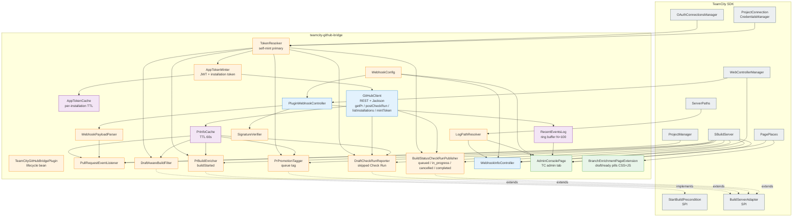
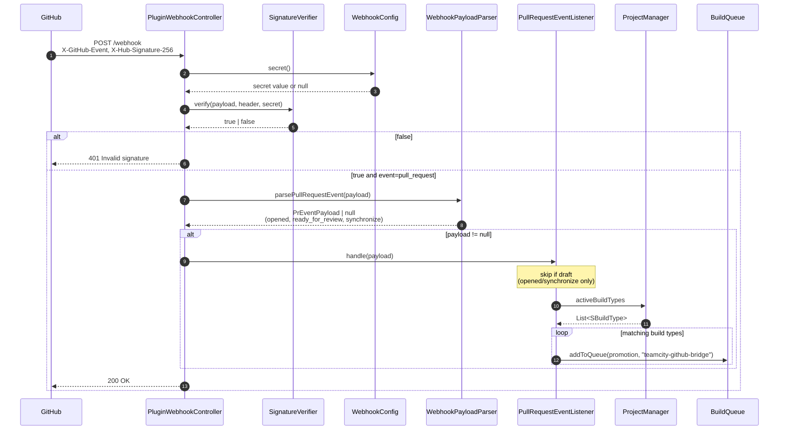
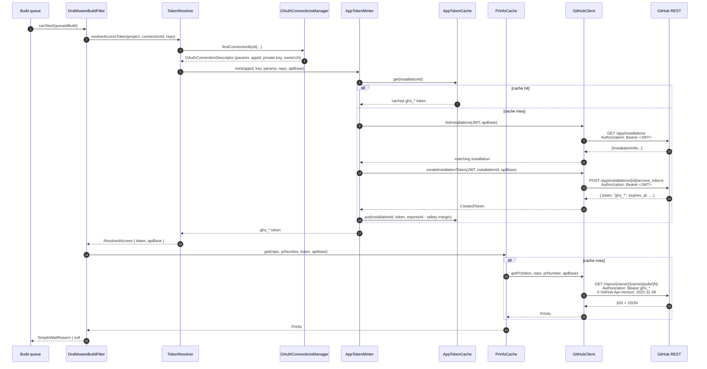

# Architecture

This page describes how the plugin is structured internally, how
Spring DI wires the components, and where the extension points to
TeamCity sit.

## High-level component diagram



## Packages

```
io.github.dlachouette.teamcity.github
+-- TeamCityGitHubBridgePlugin   (main lifecycle bean)
+-- api/
|   +-- GitHubClient              (open class, HTTP + Jackson: getPr, listPrFiles, postCheckRun, listIssueComments, createIssueComment, deleteIssueComment, listInstallations, createInstallationToken)
|   +-- PrInfo                    (data class)
|   +-- RepoCoords                (data class + parser)
|   +-- TokenResolver             (self-mint primary, credentials-manager fallback; returns ResolvedAccess = token + apiBase)
|   +-- ResolvedAccess            (data class: token + apiBase)
|   +-- AppTokenMinter            (signs RS256 JWT, lists installations, mints ghs_* token)
|   +-- RsaKeyParser              (PEM/PKCS#1+#8 private-key parsing, extracted from AppTokenMinter; pure, own tests)
|   +-- AppTokenCache             (per-installation TTL cache for minted tokens)
|   +-- InstallationInfo / CreatedToken (data classes for the App-level REST API)
|   +-- CheckRunRequest / CheckRunStatus / CheckRunConclusion
+-- cache/
|   +-- PrInfoCache               (TTL-based, ConcurrentHashMap)
+-- config/
|   +-- WebhookConfig             (reads webhook secret from plugin file + internal.properties fallback)
|   +-- PluginSettingsStorage     (reads/writes plugin-owned settings file)
|   +-- PluginLogConfigurator     (attaches RollingFileAppender at startup)
|   +-- LogPathResolver           (state of the dedicated log file)
|   +-- BridgeServerSettings      (typed accessor for every server-global setting/flag; resolves plugin-file -> legacy internal property -> default; pushes live values via applyTo)
+-- enrich/
|   +-- PrBuildEnricher           (BuildServerAdapter.buildStarted)
|   +-- PrPromotionTagger         (BuildServerAdapter.buildTypeAddedToQueue)
+-- filter/
|   +-- DraftAwareBuildFilter     (StartBuildPrecondition)
+-- parameters/
|   +-- PrParameterProvider  (publishes teamcity.github.bridge.isdraft)
+-- report/
|   +-- DraftCheckRunReporter         (draft/branch/path skip -> "Skipped" Check Run)
|   +-- BuildStatusCheckRunPublisher  (queued/started/interrupted/finished/queue-removed -> Check Run lifecycle; drives the sticky PR comment)
|   +-- PrSummaryCommenter            (single sticky per-PR summary comment, one row per check; JSON state in an HTML-comment marker; delete-then-create since HttpURLConnection cannot PATCH; off by default)
+-- queue/
|   +-- DraftBuildQueueCleaner    (removes queued draft PR builds; bypassed for manual user triggers)
+-- retrigger/
|   +-- PullRequestEventListener  (opened/ready_for_review/synchronize/closed + review-approved + comment-command + check_run re-run -> BuildTypeEx.addToQueue; external-API triggerBuild; path filtering; closed-PR queue cancellation)
+-- selftest/
|   +-- PluginSelfTester          (7 end-to-end checks driven by the admin button)
+-- web/
    +-- PluginWebhookController       (POST /webhook, HMAC, replay guard, records to RecentEventsLog; fans events out to the listener)
    +-- WebhookInfoController         (GET /info, /info.md)
    +-- WebhookInfo                   (config snapshot DTO)
    +-- WebhookPayloadParser          (Jackson on pull_request / pull_request_review / pull_request_review_comment / issue_comment / check_run payloads)
    +-- SignatureVerifier             (HMAC SHA-256 + constant-time eq)
    +-- DeliveryReplayGuard           (bounded LRU + TTL of X-GitHub-Delivery ids; drops replayed deliveries)
    +-- RecentEventsLog               (ring buffer, capacity 100)
    +-- BridgeMetrics                 (in-process counter registry; Prometheus text + JSON snapshots)
    +-- RequestUrlBuilder             (single home for X-Forwarded-* absolute-URL reconstruction behind the proxy)
    +-- HealthController              (GET /health, anonymous; "ok"/"degraded" liveness JSON)
    +-- MetricsController             (GET /metrics, anonymous; Prometheus text; 404 when metrics disabled)
    +-- ApiController                 (authenticated external API: GET /api/status|events|metrics, POST /api/trigger; bearer-token auth)
    +-- AdminConsolePage              (AdminPage, JSP at admin/bridgeAdmin.jsp)
    +-- AdminSettingsController       (POST /admin/bridge/saveSecret.html, CSRF-protected)
    +-- AdminTestController           (POST /admin/bridge/runTests.html, CSRF-protected)
    +-- BridgeProjectSettingsTab      (EditProjectTab in the Integrations group; form for the project-level bridge params)
    +-- BridgeProjectSettingsController (POST backing the tab; writes own project params, requires EDIT_PROJECT)
    +-- BranchEnrichmentPageExtension (SimplePageExtension, JSP at display/bridgeBranchEnrichment.jsp)
```

## Spring DI wiring

Declared in
`src/main/resources/META-INF/build-server-plugin-teamcity-github-bridge.xml`:

```xml
<beans default-autowire="constructor">
    <bean class="...TeamCityGitHubBridgePlugin"/>

    <bean class="...config.PluginSettingsStorage"/>
    <bean class="...config.PluginLogConfigurator"/>
    <bean class="...config.WebhookConfig"/>
    <bean class="...config.LogPathResolver"/>
    <bean class="...config.BridgeServerSettings"/>

    <bean class="...api.GitHubClient"/>
    <bean class="...api.AppTokenCache"/>
    <bean class="...api.AppTokenMinter"/>
    <bean class="...api.TokenResolver"/>
    <bean class="...cache.PrInfoCache"/>

    <bean class="...feature.GitHubBridgeBuildFeature"/>
    <bean class="...retrigger.PullRequestEventListener"/>
    <bean class="...filter.DraftAwareBuildFilter"/>
    <bean class="...parameters.PrParameterProvider"/>
    <bean class="...enrich.PrBuildEnricher"/>
    <bean class="...enrich.PrPromotionTagger"/>
    <bean class="...report.DraftCheckRunReporter"/>
    <bean class="...report.PrSummaryCommenter"/>
    <bean class="...report.BuildStatusCheckRunPublisher"/>
    <bean class="...queue.DraftBuildQueueCleaner"/>

    <bean class="...web.RecentEventsLog"/>
    <bean class="...web.DeliveryReplayGuard"/>
    <bean class="...web.BridgeMetrics"/>

    <bean class="...web.PluginWebhookController"/>
    <bean class="...web.WebhookInfoController"/>
    <bean class="...web.HealthController"/>
    <bean class="...web.MetricsController"/>
    <bean class="...web.ApiController"/>
    <bean class="...web.AdminConsolePage"/>
    <bean class="...web.AdminSettingsController"/>
    <bean class="...web.AdminTestController"/>
    <bean class="...web.BridgeProjectSettingsTab"/>
    <bean class="...web.BridgeProjectSettingsController"/>
    <bean class="...web.BranchEnrichmentPageExtension"/>

    <bean class="...selftest.PluginSelfTester"/>
</beans>
```

`default-autowire="constructor"` makes Spring resolve every
constructor parameter against the available beans. TC's own beans
(`OAuthConnectionsManager`, `ProjectConnectionCredentialsManager`,
`ProjectManager`, `WebControllerManager`, `SBuildServer`,
`AuthorizationInterceptor`, `PagePlaces`, `ServerPaths`) are
exposed by the TC core context, which our XML inherits from.

## Webhook events handled

`PluginWebhookController` verifies the HMAC signature, drops
replays via `DeliveryReplayGuard` (keyed on `X-GitHub-Delivery`),
then dispatches by `X-GitHub-Event` to `PullRequestEventListener`:

| Event | Action(s) | Handler | Effect |
|---|---|---|---|
| `pull_request` | `opened`, `reopened`, `ready_for_review`, `synchronize` | `handle` | Gate + path-filter, then enqueue matching BuildTypes. |
| `pull_request` | `labeled`, `unlabeled`, `edited` | `handle` | Re-evaluate the same commit and enqueue what became eligible. Never posts a `Skipped` row: the commit has not changed, so it would overwrite a result already published for it (`PrAction.reportsSkips`). |
| `pull_request` | `closed` (incl. merged) | `handle` -> `cancelQueuedForClosedPr` | Remove builds still queued for the PR head. |
| `pull_request_review` | `submitted` / `state=approved` | `handleReviewApproved` | Enqueue run-on-approval BuildTypes. |
| `pull_request_review_comment` | `created` | `handleCommentCommand` | Default comment-trigger event (inline PR diff comment): enqueue BuildTypes whose comment trigger phrase matches, if the author association is allowed. |
| `issue_comment` | `created` | `handleCommentCommand` | Same, for PR *conversation* comments. **Opt-in**: only delivered when the App has the **Issues** permission, which the plugin does not request by default. |
| `check_run` | `rerequested` | `handleRerun` | Re-run the BuildType behind the clicked Check Run (ignoring finished builds). |
| `check_suite` | `rerequested` | `handleRerunAll` | "Re-run all checks": re-run every opted-in BuildType for that head, optionally only those whose last build there failed (`rerunAll.onlyFailed`). |

## Server settings applied live

`BridgeServerSettings` is the single typed accessor for every
server-global tuning value and feature flag, resolving each key in
order: plugin-owned settings file (set from the admin page) ->
legacy `teamcity.github.bridge.*` internal property -> compiled-in
default. Per-operation values (API version, HTTP retry budget, PR
info cache TTL and stale grace) are pushed into the live
`GitHubClient` and `PrInfoCache` beans by
`BridgeServerSettings.applyTo(...)`, which is called at startup and
again every time the admin saves settings - so edits take effect
without a TeamCity restart. Feature flags it gates include
`dryRun`, `metrics.enabled`, `webhook.replay.enabled`,
`prComment.enabled`, the external-API `api.token`, the
`repo.allowlist`, and `comment.allowedAssociations`.

## Data flow: inbound (GitHub -> TC)



## Data flow: outbound (TC -> GitHub)



## Threading model

- The TeamCity SDK calls our `StartBuildPrecondition` synchronously
  on the build queue thread. `DraftAwareBuildFilter.canStart` must
  return promptly, hence the cache layer in front of the HTTP call
  (a cold cache miss takes ~200 to ~800 ms).
- `PluginWebhookController.doHandle` is invoked on Jetty's
  request-handling thread. Verification and enqueuing complete in
  the same call.
- `PrInfoCache` uses `ConcurrentHashMap` for thread safety. The
  cache currently has no eviction policy beyond TTL on read; on a
  busy server with many PRs it stays bounded by the number of
  currently-open PRs touched by the precondition.

## Extension points

Where we plug into TC:

| TC interface / pattern | Used by |
|---|---|
| `ServerExtension` (lifecycle marker) | `TeamCityGitHubBridgePlugin` |
| `StartBuildPrecondition` | `DraftAwareBuildFilter` |
| `BaseController` + `WebControllerManager.registerController` | `PluginWebhookController`, `WebhookInfoController` |
| `OAuthConnectionsManager` (read-only) | `TokenResolver` |
| `ProjectConnectionCredentialsManager` (read-only, forward-compat) | `TokenResolver` |
| `OAuthConnectionDescriptor.parameters` (App ID + private key + ownerUrl) | `AppTokenMinter` |
| `ProjectManager.activeBuildTypes` | `PullRequestEventListener` |
| `BuildTypeEx.createBuildCustomizer` + `addToQueue` | `PullRequestEventListener` |
| `BuildServerAdapter` (build lifecycle) | `BuildStatusCheckRunPublisher`, `PrBuildEnricher`, `PrPromotionTagger`, `DraftCheckRunReporter` |
| `BuildFeature` (opt-in per BuildType) | `GitHubBridgeBuildFeature` |
| `EditProjectTab` + `AdminPage` (custom UI) | `BridgeProjectSettingsTab`, `AdminConsolePage`, `BranchEnrichmentPageExtension` |
| `ProjectTab` (project-level view) | `BridgeBuildsTab` — the "Branches & PRs" list |
| `SBuildType.resolvedSettings.buildFeatures` (read-only) | `BridgeFeatureReader`, `BundledPublisherDetector` |
| `AuthorizationInterceptor.addPathNotRequiringAuth` (anonymous endpoints) | `HealthController`, `MetricsController`, `ApiController`, `WebhookInfoController`, `PluginWebhookController` |

## Packaging

Build output is a single zip:

```
teamcity-github-bridge-<version>.zip
+-- teamcity-plugin.xml                          (descriptor, root)
+-- server/
    +-- teamcity-github-bridge-<version>.jar    (our code + Spring XML)
    +-- kotlin-stdlib-1.9.25.jar
    +-- kotlin-reflect-1.7.22.jar
    +-- jackson-core-2.17.2.jar
    +-- jackson-databind-2.17.2.jar
    +-- jackson-annotations-2.17.2.jar
    +-- jackson-module-kotlin-2.17.2.jar
    +-- annotations-13.0.jar
```

`teamcity-plugin.xml` declares
`<deployment use-separate-classloader="true"/>` so the bundled
Kotlin runtime and Jackson do not collide with whatever TeamCity
itself loads.

## Forward compatibility considerations

- **Token format**: tokens are treated as opaque strings throughout.
  The new `ghs_*` ~520-character stateless format introduced in 2026
  works without code changes. The opt-in
  `X-GitHub-Stateless-S2S-Token` header applies to the token
  issuance call which TeamCity performs internally - we never touch
  it. See `api/TokenResolver.kt`.
- **GitHub Enterprise**: `teamcity.github.bridge.api.base` is read at every
  call (no caching), so an Enterprise instance can be configured
  via a single internal property.
- **API version**: `X-GitHub-Api-Version` is parameterised as
  `teamcity.github.bridge.api.version`, defaulting to `2022-11-28`. Bumping
  is a config change, not a recompile.

## Cross-references

- See [security.md](security.md) for the trust boundaries and the
  signature-verification path in detail.
- See [development.md](development.md) for how to add a new bean
  or extend a flow.
