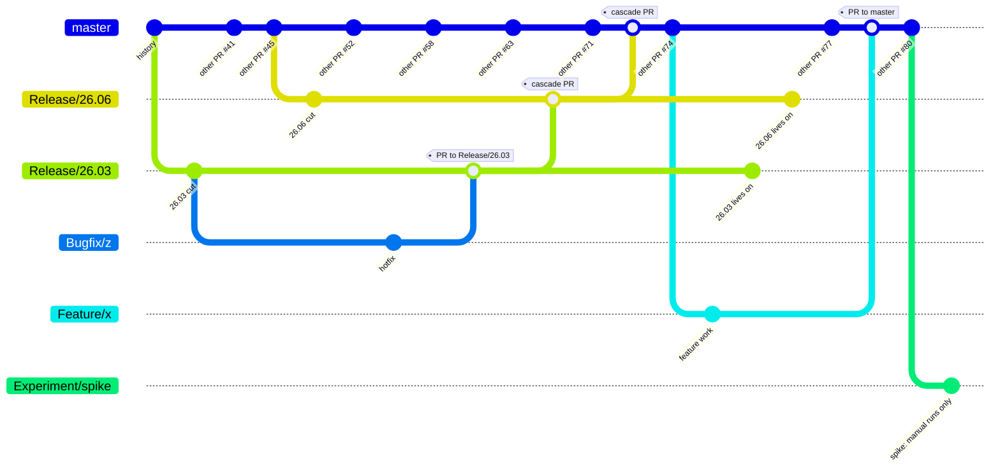
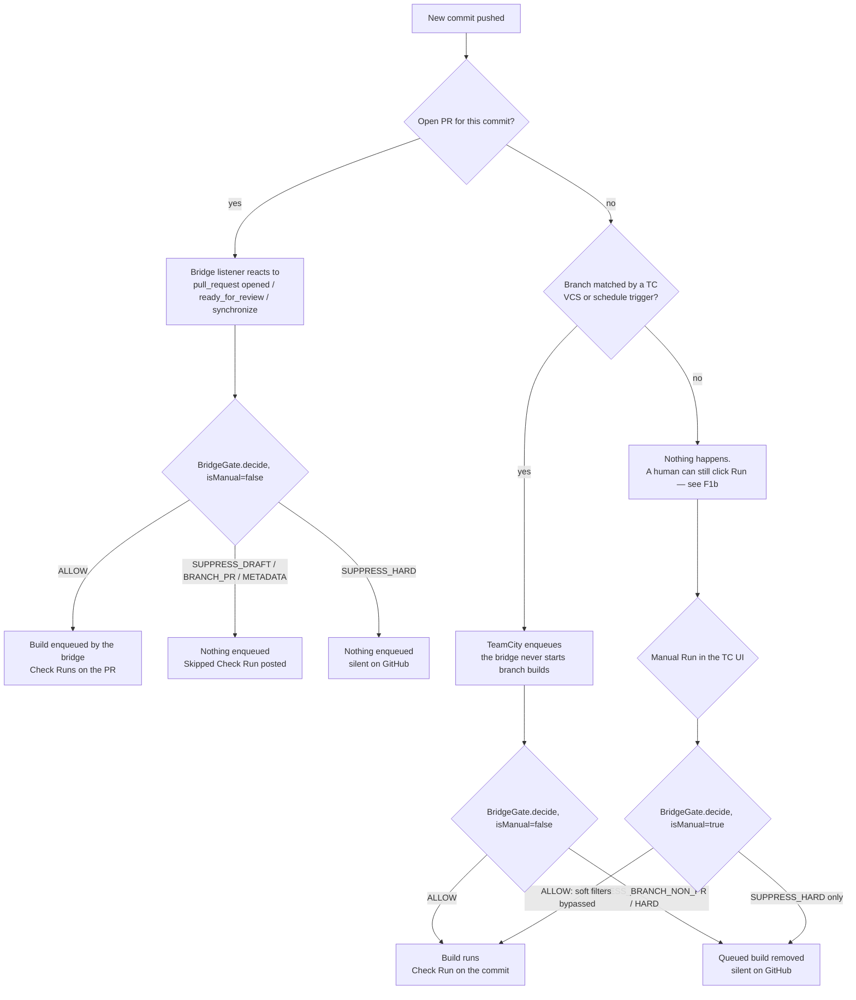
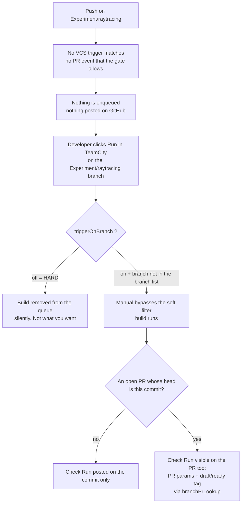
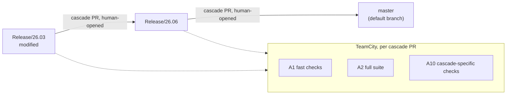
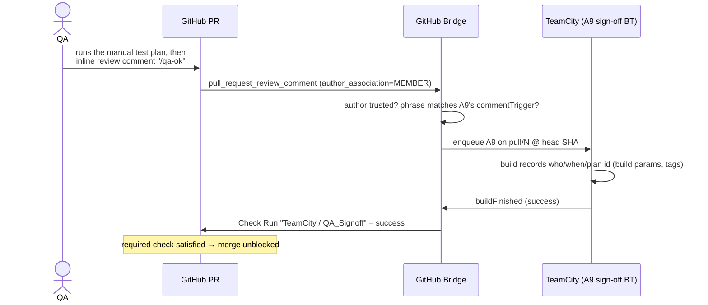
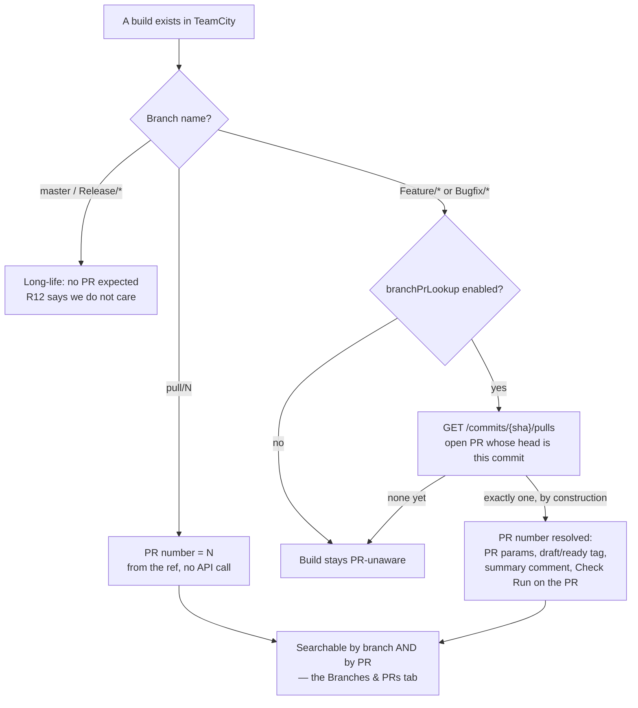
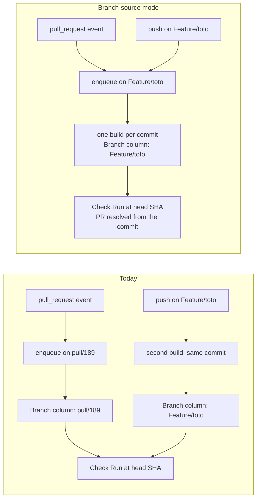

# Branching workflows: how code travels between GitHub and TeamCity

**Status:** requirements settled with the team on 2026-07-28 (rules R1–R19,
§0). The first agreed batch of enhancements is **implemented in 1.8.3**
(released as 1.9.0).

> **Scenarios here, backlog there.** This page describes the *flows*: which
> pipelines fire, when, and what GitHub shows. The decision history, the gap
> list and their implementation status live in
> **[tasks/branching-worklog.md](tasks/branching-worklog.md)**, which is
> updated together with the code.

Where [usage-scenarios.md](usage-scenarios.md) answers *"this webhook
arrives, what does the plugin do?"*, this page answers the other
question: *"a change moves through our branch model — which TeamCity
pipelines fire, when, and what does GitHub show?"*

Each scenario is written as: **trigger → TeamCity → GitHub feedback →
configuration → open questions**. Scenarios are numbered `F1…F28`
(`F` for *flow*) so they never collide with the plugin-mechanics
scenarios 1–21 of `usage-scenarios.md`.

> **Scope.** This page describes **one deployment** of the bridge — the
> primary case we want to serve well — not the plugin's general
> capabilities. Most rules below (closed branch namespace, no bundled status
> publisher, single required-check set) are *this team's* constraints and the
> plugin imposes none of them: read them as "what we must support".
> **Two are different** and were promoted to plugin defaults: R9 (forks are
> ignored — the bridge is attached to one repository) and R19
> (branch-source builds, as a per-project switch).

---

## 0. The branch model this page assumes



Reading the diagram:

- The `other PR #nn` dots on `master` stand for the other PRs merged in the
  meantime, whose branches are not drawn.
- `Release/*` branches **keep living after a cascade merge** (the "lives
  on" commits): they go on taking fixes and are cascaded again the
  following week, for the whole supported life of the release.
- `Feature/*` and `Bugfix/*` branches, by contrast, **die at their merge**
  and are deleted.
- `Experiment/spike` never merges and never triggers anything: it is the
  R6 case, detailed in F1b.

### Vocabulary: the generic model, and this project's instance

The rules below are written in **generic terms**, because the plugin must
serve any team, not just this one. The right-hand column is what those
terms mean *for this project*.

| Generic term (used throughout this page) | This project | How the plugin sees it |
|---|---|---|
| **`<default branch>`** | `master` | whatever GitHub reports as the repository default — the plugin hardcodes nothing, and `main` vs `master` is never a code path |
| **`<long-life branches>`** | `<default branch>` + `Release/YY.MM` (e.g. `Release/26.06`) | the set matched by `branchTrigger.branches`; long-lived, push-protected, no PR of their own |
| **`<work branches>`** | `Feature/*`, `Bugfix/*`, `Experiment/*` — **and nothing else** (R8) | the head ref of a PR, and/or a ref built directly by name. Today a PR build runs on the synthetic `pull/N` ref; R19/F28 replaces it with the head ref itself |

Note the capitalised prefixes: Git refs are case-sensitive, so every branch
spec and filter in this page uses that exact casing.

Rules taken as given:

| # | Rule |
|---|---|
| R1 | One **`<default branch>`** per repository — `master` here. The plugin stays generic: nothing below depends on its name. |
| R2 | Dated **`<long-life branches>`** `Release/YY.MM`. Several may be alive at once, and each **survives its cascade merges** — it keeps taking fixes until the release is retired. |
| R3 | **`<work branches>`** are merged into `<default branch>` **or** into a `Release/*` branch — always through a PR — and are **short-lived**: merged, then deleted. |
| R4 | At least weekly, a **cascade merge** propagates each modified `Release/*` up to the next release, and finally into `<default branch>`. |
| R5 | Every `<long-life branch>` is **push-protected**: no direct push, merges land through PRs only. |
| R6 | **`Experiment/*`** branches trigger **nothing** automatically, but must remain **manually startable** in TeamCity — with or without an associated PR. |
| R7 | `Feature/*` and `Bugfix/*` branches must be **buildable before any PR exists** — a developer wants feedback on a plain branch, PR or no PR. |
| R8 | The branch namespace is **closed**: GitHub forbids any name outside `<default branch>`, `Release/*`, `Feature/*`, `Bugfix/*`, `Experiment/*`. Branch specs can therefore be exhaustive, and a catch-all exclusion is safe. |
| R9 | **Forks are out of scope — by default, and as plugin behaviour.** The bridge is attached to **one repository**, never to its forks: a PR whose head lives in another repository must be ignored outright. Not a deployment convention, a plugin default — shipped in 1.8.3 (F23). |
| R10 | When the bridge is active on a build configuration, TeamCity's **bundled `commitStatusPublisher` must be off** on it. One status producer, never two. The plugin **warns only** — configuring builds correctly is the operator's job (F24). |
| R11 | On `<long-life branches>`, some pipelines run **on push**, others on a **schedule** (nightly / weekly). Both must coexist on the same branch. |
| R12 | A build on a `<work branch>` must be **automatically associated with its PR** when one exists (GitHub allows only one open PR per head branch, so existence is the whole question), including **retro-actively** for builds that ran before the PR was opened. Not needed on `<long-life branches>`. |
| R13 | The **cascade PRs are opened and merged by a human** (R4), because conflicts are frequent and a human must resolve them. |
| R14 | **One single set of required checks** for this project — no per-target-branch variation. Other deployments may differ. |
| R15 | **QA is a reviewer, not a gate.** QA has no formal status in GitHub today; findings are tracked in an external bug tracker. What QA needs from us is a **reference to a set of builds** (and their artefacts), not a blocking check. |
| ~~R16~~ | ~~A `<long-life branch>` turned red by a merge is the PR author's responsibility to investigate.~~ **Out of scope (2026-07-29):** TeamCity already does this with its **investigation auto-assignment**. The number is kept so the other cross-references stay valid. |
| ~~R17~~ | ~~No hard CI cost ceiling, but the set of tasks per PR is deliberately limited to keep CI load reasonable.~~ **Out of scope (2026-07-29):** how much CI a pull request costs is not this plugin's concern — it triggers what it is told to trigger. Number kept so the others stay stable. |
| R18 | What we validate is the **source branch**, not GitHub's merge preview. The merge-preview ref (`refs/pull/*/merge`) has never been used here — builds have always been of the branch as it stands. |
| R19 | Consequently, the target model is **branch-source builds**: the bridge builds and reports on the real branch ref (`Feature/toto`), not on a synthetic `pull/N` ref. Decided 2026-07-28, shipped in 1.8.3 (F28). |

Consequences that shape everything below:

- **Every** line of code crosses a PR at least once, so the **PR is the
  primary integration point**; `<long-life branches>` only ever see
  *post-merge* commits. (Which *ref* carries a PR build — `pull/N` today,
  the head ref after F28 — changes nothing here.)
- Because pushes are protected, a **red post-merge build on a
  `<long-life branch>` cannot be fixed by a push** — it needs another PR.
  Post-merge builds are therefore *alarms*, not gates; the gates live on the
  PR. Routing that alarm to whoever caused it is **TeamCity's** job, not the
  bridge's: investigation auto-assignment already does it (see F9).
- The cascade (R4/R13) is **human-driven**: PRs between two protected
  branches, opened and merged by a person. That is good news for us — the
  author is a normal team member, so comment triggers, approvals and
  labels all behave exactly as on a human PR, and the bot-association
  problem (G5) does not arise here. It also means conflict resolution
  (F14) is a *normal* part of the weekly flow, not an edge case.
- Experimental branches (R6) need **"reachable but silent"**: known to
  TeamCity (so a human can pick them in the Run dialog) yet excluded from
  every automatic trigger. That is a *soft* exclusion — see F1b, and note
  the `triggerOnBranch=off` trap described there.
- R7 + R12 together mean the interesting unit is **the commit, not the
  ref**: the same commit may be built from `Feature/x` (pre-PR) and from
  `pull/N` (post-PR), and both must report to the same place. That is what
  the `branchPrLookup` setting already does (F25) — and R19/F28 removes the
  duplication altogether by never creating the second ref.
- R8 (closed namespace) is what makes every branch spec in this page
  trustworthy: there is no "other" branch shape to defend against, so
  filters can be written as explicit include lists.
- R9 (forks ignored) removes the whole untrusted-contributor dimension:
  head refs are always local branch names, tokens always cover the head
  repo, and `author_association` is never that of an outsider. It is also
  what makes R19 possible at all — a fork's head ref does not exist locally.
  See F23.
- R15 (QA as reviewer) changes what "QA support" means: not a required
  Check Run, but **discoverability** — from GitHub, reach the set of builds
  and artefacts for a ref. See F17 and F26, which were rewritten around
  this answer.

> **Still open:** only the pre-PR build policy (R7 — on demand or automatic,
> see F1), and F28 largely settles it too: with branch-source builds the PR
> build *is* the branch build, so "automatic" stops costing anything.
> Everything else is decided — the worklog keeps the audit trail.

### Who actually starts a build

The single most useful thing to internalise: **the bridge only ever
starts PR builds.** Branch builds are started by TeamCity's own triggers
(VCS, schedule) or by a human; the bridge merely *gates* them and
*reports* them.

The diagram below describes today's behaviour, where a PR build runs on the
`pull/N` ref. Under R19/F28 the shape is unchanged — the bridge still starts
only PR builds — but it enqueues them on the **head ref**, and "is this a PR
context?" comes from the commit→PR lookup instead of the ref name. Read
every `pull/N` in F2–F19 as "the ref carrying the PR build".



---

## 1. Pipeline archetypes

Before the scenarios, the vocabulary. Each archetype is one TeamCity
build configuration (BT) carrying the **GitHub Bridge integration**
build feature, with its own gates. Check Run names appear on GitHub as
`TeamCity / <BT full name>`.

| Archetype | Runs on | Cost | Gate (plugin config) | Required in branch protection? |
|---|---|---|---|---|
| **A1 — PR fast checks** (compile + lint + unit) | PR ref (`pull/N`, or the head branch in branch-source mode), drafts included | low | `triggerOnPrReady=on`, `triggerOnPrDraft=on` | yes |
| **A2 — PR full suite** (integration, multi-platform) | PR ref, ready only | high | `triggerOnPrDraft=off` | yes |
| **A3 — PR heavy/opt-in suite** (perf, long soak, big matrix) | PR ref, on demand | very high | `labelFilter=+:ci-full` and/or `runOnApproval=true` and/or `commentTrigger=/full` | no (informational) |
| **A4 — Post-merge CI on default branch** (on push) | `<default branch>` (`master` here) | medium | TC **VCS trigger** + `triggerOnBranch=on`, `branchTrigger.branches=+:<default branch>` | n/a (no PR) |
| **A5 — Post-merge CI on release branches** (on push) | `Release/*` | medium | TC **VCS trigger** + `branchTrigger.branches=+:Release/*` | n/a |
| **A6 — Nightly / weekly suites** (R11) | default + all live `Release/*` | high | TC **schedule trigger** + its own branch filter; distinct BT name so the Check Run never collides with A4/A5 | n/a |
| **A7 — Release candidate packaging** | `Release/*` (tag or manual) | medium | manual / scheduled; bridge for the Check Run only | n/a |
| **A8 — QA environment deploy** | `Release/*`, sometimes `pull/N` | medium | manual, `commentTrigger=/deploy-qa`, or external API | no |
| **A9 — Manual-test sign-off** (records a human verdict) | PR ref or `Release/*` | ~0 | `commentTrigger=/qa-ok`, or manual run, or external API | **no** — R15: QA is a reviewer, not a gate. Kept as a reference pattern only (F17) |
| **A10 — Cascade merge validation** | `pull/N` of a cascade PR | medium | same as A1+A2; see F13 | yes |
| **A11 — Experimental / on-demand branch build** | `Experiment/*`, **manual only** | any | in the VCS branch spec, **not** in `branchTrigger.branches`, `triggerOnBranch` left **on**, no VCS trigger matching it | no |
| **A12 — Pre-PR work-branch build** (R7) | `Feature/*`, `Bugfix/*`, no PR yet | low–medium | same shape as A11, plus (optionally) a VCS trigger if pre-PR builds should be automatic; `branchPrLookup` attaches it to the PR once one exists. **In branch-source mode this archetype merges into A1/A2** — same ref, same build | no |

> **To decide:** which of these actually exist today in your TeamCity
> project tree, which are one BT vs a build chain, and which ones make up
> the single required-check set of R14.

---

## 2. Development phase

### F1 — `Feature/*` / `Bugfix/*` branch with no PR yet (R7)

**Actor:** a developer pushes `Feature/x` and wants a build **before**
opening any PR.

**What must be true:** the branch is in the VCS root's branch spec
(`+:Feature/*`, `+:Bugfix/*`) so it is selectable in TeamCity, and
`triggerOnBranch` stays **on** on the build configurations (the
`triggerOnBranch=off` trap of F1b applies identically here — "off" kills
manual runs too).

**Two policies to choose between — this is a real decision, not a detail:**

| Policy | How | Cost | Consequence |
|---|---|---|---|
| **On demand** (recommended default) | no VCS trigger on `Feature/*`; `branchTrigger.branches` excludes them; a human clicks Run (or an external tool calls `POST /api/trigger`) | one build per explicit request | same setup as A11/A12; nothing is wasted, but there is no automatic pre-PR signal |
| **Automatic on push** | add a VCS trigger and put `+:Feature/*` / `+:Bugfix/*` in `branchTrigger.branches` | **two builds per commit** once a PR exists (one on `Feature/x`, one on `pull/N`) | needs a deduplication story, see the caution below |

**⚠️ The double-build effect.** With the automatic policy, after the PR is
opened every push produces a branch build *and* a PR build of the same
code. The bridge's smart-skip only deduplicates within the `pull/N` ref,
so it will **not** collapse the two. Both post a Check Run at the same
commit SHA under the **same name** (`TeamCity / <BT>`), so they overwrite
each other's row on GitHub — last writer wins, and the row may flip
between the two builds' results.

**Fixed by branch-source mode (F28, shipped in 1.8.3):** with PR builds
running on the head ref there is no second ref and no second build, so the
automatic policy is free. In `pull` mode the effect still applies — mitigate
by keeping the on-demand policy or by using a distinct build configuration
for pre-PR builds.

**GitHub feedback:** with `branchPrLookup` on, a pre-PR build still gets
its Check Run at the commit; the moment a PR exists for that head, the
same row is visible in the PR's Checks tab (F25).

**Open question:** which policy per BT? A cheap A1-style suite is a good
candidate for automatic pre-PR builds; A2 is not.

### F1b — Experimental branch: nothing automatic, manual run always possible (R6)

**Actor:** a developer exploring a spike on `Experiment/raytracing`. They want
**zero** automatic builds, but the ability to launch any pipeline by hand
— sometimes with a PR open for review, sometimes with no PR at all.

**The configuration that achieves it:**

| Layer | Setting | Why |
|---|---|---|
| VCS root | branch spec **includes** `+:Experiment/*` | otherwise TeamCity doesn't know the branch and it cannot be selected in the Run dialog |
| TC triggers | no VCS/schedule trigger matching `Experiment/*` (or excluded in the trigger's branch filter) | this is what actually prevents automatic branch builds |
| Bridge, project | `branchTrigger.branches` = `+:<default>` + `+:Release/*` (no `Experiment/*`) | the bridge gate skips automatic `Experiment/*` builds |
| Bridge, project | `prTrigger.branches` = `-:Experiment/*` (or a BT-level override) | prevents automatic PR builds when an experimental branch *does* get a PR |
| Bridge, BT | `triggerOnBranch` left **ON** ⚠️ | see the trap below |

**⚠️ The trap (verified in the code).** `triggerOnBranch=off` is a **HARD**
block: `BridgeGate` returns `SUPPRESS_HARD` *even for a manual trigger*,
and `DraftBuildQueueCleaner` then **removes the manually started build
from the queue** (silently — no Check Run explains it). So "off" does not
mean "manual only", it means "never, at all". The way to get *manual
only* is the **soft** branch list: a branch not matched by
`branchTrigger.branches` is skipped automatically, but
`BridgeGate.decide(isManual=true)` returns `ALLOW`, so a human clicking
**Run** in TeamCity gets the build **and** the Check Run.



**GitHub feedback:** a manual `Experiment/*` build still publishes its Check Run
at the built commit. With the `branchPrLookup.enabled` server flag (the
"attach branch builds to their PR" setting), a build launched on the plain
branch ref also resolves the open PR whose head is that commit, so it
gets the PR parameters, the `draft`/`ready` tag and the summary comment —
i.e. a manual experimental build looks the same whether it was started
from `Experiment/raytracing` or from `pull/N`.

**Open questions:**
- The whole setup hinges on one glob, so `Experiment/*` must be a
  convention nobody bypasses: a spike branch named anything else falls
  into F1 (invisible to TeamCity) or, worse, into whatever `Feature/*`
  rules apply. Worth enforcing with a GitHub ruleset on branch names?
- If an experimental branch gets a PR (for review, not for merge), the
  automatic path posts **"Skipped: branch out of scope"** on every PR
  event. Acceptable noise, or should those PRs stay completely undecorated
  (`triggerOnPrReady=off` per BT ⇒ silent, but then manual PR builds are
  HARD-blocked too — same trap)?
- Should experimental branches be excluded from TC's *cleanup* rules
  differently (they can pile up)?

### F2 — Draft PR opened (work in progress)

**Trigger:** `pull_request.opened` with `draft=true`.
**TeamCity:** A1 (fast checks) is enqueued; A2/A3 are suppressed.
**GitHub:** A1 transitions Queued → In progress → success/failure. A2
shows **"Skipped: draft PR"** (`conclusion=skipped`).
**Config:** A1 `triggerOnPrDraft=on`; A2 `triggerOnPrDraft=off`.
**Note:** GitHub treats a `skipped` conclusion as satisfying a required
check, so a draft PR whose A2 is skipped is not blocked *by the check*
— it's blocked by being a draft. Worth verifying on your GitHub
Enterprise version before relying on it.

### F3 — Draft → ready for review

**Trigger:** `pull_request.ready_for_review`.
**TeamCity:** A2 is enqueued now. A1 is *smart-skipped* if a build
already exists for `(pull/N, head SHA)` — no duplicate.
**GitHub:** the A2 row flips from "Skipped: draft PR" to Queued → In
progress → result, at the same head SHA.
**Config:** nothing extra.

### F4 — New commit on a ready PR

**Trigger:** `pull_request.synchronize`.
**TeamCity:** A1 + A2 re-enqueued at the new SHA. Builds already
running on the *previous* SHA are **not** cancelled (deliberate: the
plugin never stops a running build).
**GitHub:** new Check Run rows at the new SHA; the old SHA's rows stay
as history.
**Open question:** on a busy PR this burns agents on obsolete SHAs. Do
you want a "cancel superseded PR builds" behaviour? That's an
enhancement (the plugin only removes *queued* builds today) — and
TeamCity's own queue optimiser already handles part of it.

### F5 — Expensive suite kept out of the default path

How many tasks a pull request runs is a TeamCity configuration decision
(former R17, out of scope): the bridge does not manage queue load. What it
does provide is a way to express **scope** — "this suite is not part of the
default check set, ask for it" — through three combinable mechanisms for A3:

| Mechanism | Config | How a dev asks for it |
|---|---|---|
| Label | `labelFilter=+:ci-full` | add the `ci-full` label |
| Approval | `runOnApproval=true` | a reviewer approves the PR |
| Comment | `commentTrigger=/full` | inline review comment `/full` on the diff |
| Title/body phrase | `requirePhrase=/full` | write `/full` in the PR description |

**Important, verified in the code:** `runOnApproval=true` and
`commentTrigger` are *additional* trigger paths — they do **not** remove
the build from the normal `opened`/`synchronize` path. A BT with only
`runOnApproval=true` still runs on every PR push. To make A3 genuinely
on-demand you must *also* filter it out of the automatic path
(`labelFilter`, `requirePhrase`, or a PR branch filter). Since **1.8.3 that
combination works**: the comment/approval enqueue is stamped as an explicit
command and the queue cleaner no longer undoes it (G11).

**Known limitation:** the plugin does **not** react to
`pull_request.labeled` or `pull_request.edited`. Adding the `ci-full`
label (or editing the title) does not by itself trigger anything — the
label is only *evaluated* at the next `opened` / `synchronize` /
approval / comment event. Practically: label first, then comment
`/full` (or push). Tracked as **G1** in the [worklog](tasks/branching-worklog.md).

**Note on comment triggers:** they fire on
`pull_request_review_comment` (inline comments on the diff), not on the
PR conversation thread, and only for authors whose
`author_association` is in `comment.allowedAssociations` (default
`OWNER,MEMBER,COLLABORATOR`).

### F6 — Monorepo: a PR that touches only docs

**Trigger:** any PR event.
**TeamCity:** BTs whose `pathFilter` doesn't match any changed file are
dropped before enqueue.
**GitHub:** **"Skipped: paths out of scope"**.
**Config:** e.g. A2 `pathFilter=+:src/**`, doc-only BT `+:doc/**`.
**Caution:** path filtering **fails open** (token failure or empty file
list ⇒ everything runs) — intentional, but it means a path filter expresses
*scope*, never a guarantee: not a security boundary, and not a cost control
you can rely on.

### F7 — PR that targets a `Release/*` branch instead of the default branch

**Trigger:** `pull_request.opened`, `base=Release/26.06`.
**TeamCity:** identical to F2/F3 — the plugin builds the PR ref whatever the
base. (Per R18 that ref resolves to the PR **head**, not GitHub's
merge preview; check your VCS root's branch spec if in doubt.)
**GitHub:** same Check Runs.
**Known limitation:** there is **no base-branch (target-branch)
filter**. `prTrigger.branches` matches the PR's *source* branch
(`headRef`), not its target. So "run the release-hardening suite only
for PRs targeting `Release/*`" is not expressible in the feature config
today.
**Workaround available now:** the build reads
`teamcity.github.bridge.pullRequest.targetBranch` and self-skips inside
the build script (or via a TC parameter condition).
**Settled (R14):** one single set of required checks for this project — a
PR targeting `Release/26.06` is gated exactly like a PR targeting
`<default branch>`. So G2 (target-branch filter) is **not** needed here;
it stays on the list only for other deployments.
**Open question:** should a fix landing on `Release/26.06` also be
validated against `<default branch>` *before* merge (forward-port check),
or is the weekly cascade (F13) the only validation of that direction? With
a human cascade (R13) the answer is probably "the cascade is enough,
because a human is watching it".

### F8 — A PR build goes red

**Trigger:** A2 fails.
**GitHub:** `conclusion=failure`; the Check Run's `output.text` carries
the build's failure reasons, and `details_url` deep-links to the
TeamCity build page. (Line-level annotations are not emitted yet.)
**Recovery paths:**
1. Push a fix ⇒ F4.
2. Click **Re-run** on the Check Run ⇒ `check_run.rerequested`, the
   plugin enqueues a fresh build at the same SHA even though a finished
   one exists (flaky-test escape hatch).
3. Comment the trigger phrase ⇒ same effect if `commentTrigger` is set.
**Open question:** re-run is currently open to anyone who can see the
Checks tab (GitHub gates it on write access). Fine? Or should re-runs be
restricted like comment triggers?

### F9 — PR is approved, then merged

**Trigger:** `pull_request.closed` with `merged=true`.
**TeamCity:**
1. Builds still **queued** on `pull/N` are removed from the queue
   (comment: `teamcity-github-bridge: PR #N merged`). Running builds
   finish.
2. The merge commit on the protected base triggers **A4/A5** through
   TeamCity's own VCS trigger — the plugin does **not** listen to
   `push`.
**GitHub:** post-merge Check Runs are posted at the merge commit SHA on
the protected branch (visible on the commit, not on the closed PR).
**Config:** A4/A5 need `triggerOnBranch=on` **and** a VCS trigger (or a
scheduled trigger) — the bridge gates and reports branch builds but
never *starts* them.
**Who owns a red post-merge build:** **TeamCity does the routing.** Its
*investigation auto-assignment* already attributes a broken build on a
protected branch to whoever most likely caused it, which is exactly what is
needed here — so the bridge stays out of it. It was briefly specified as a
bridge feature (name the merged PR and its author on the failing build) and
that idea is **dropped**: it would duplicate a mechanism TeamCity does better,
with an extra GitHub call per failing branch build.

What the bridge still contributes on that path is the *signal*: the Check Run
on the merge commit, with the failure reasons in its body, so the breakage is
visible from GitHub as well as from TeamCity.

### F10 — Direct push to a protected branch

**Trigger:** someone tries `git push origin master`.
**GitHub:** rejected by branch protection; no webhook, no TeamCity
involvement.
**Note:** if an admin bypasses protection, the push *does* land and A4
runs (F9 step 2) — nothing in the plugin distinguishes an
admin-bypass commit from a merge commit. Acceptable, or worth a check?

---

## 3. Release branches and the weekly cascade

### F11 — A new `Release/26.09` branch is cut

**Trigger:** ops branches from the default branch.
**TeamCity:** if `branchTrigger.branches` uses `+:Release/*`, the new
branch is picked up with **zero configuration**; the VCS root's branch
spec must also include it.
**GitHub:** first Check Runs appear on the branch as soon as A5 runs.
**Checklist to formalise:**
- VCS root branch spec covers `Release/*`.
- `branchTrigger.branches` covers `Release/*` (project level, so all
  BTs inherit).
- Which BTs must be *pinned* to a specific release (e.g. A7 packaging
  with a version number)?
- Retention/cleanup policy for the previous release's builds.

### F12 — Hotfix on an older release branch

**Trigger:** `Bugfix/z` → PR → `Release/26.03`.
**Flow:** F2/F3/F7 for validation, F9 on merge, then A5 on
`Release/26.03`, then A7 packaging of the patch, then the cascade
(F13) carries it to `Release/26.06` and to the default branch.
**Forward-port validation (same answer as F7):** the weekly cascade is the
validation of that direction, and R13 makes it human-driven, so somebody is
watching. The residual risk window — the fix lives in `Release/26.03` but is
unvalidated against `<default branch>` until the cascade runs — is accepted.
**Open question:** should the packaging pipeline (A7) run automatically after
every hotfix merge, or only on demand?

### F13 — Weekly cascade merge

**Trigger:** a **human** (R13) opens `Release/26.03 → Release/26.06`, then
`Release/26.06 → <default branch>`. Because both ends are protected, each
hop is a PR.



**TeamCity:** each cascade PR is an ordinary `pull/N` — A1/A2/A10 run,
Check Runs are posted, required checks gate the merge exactly like any
other PR. With R14 (one single required set) there is nothing special to
configure at all.

**Why R13 (human cascade) simplifies this a lot:**

- the PR author is a team member, so **comment triggers, approvals and
  labels behave normally** — no bot-association problem (G5), no need to
  drive anything through the external API;
- somebody is watching the cascade, so a **conflict (F14) is handled on the
  spot** rather than silently blocking the weekly propagation;
- an approval-gated suite (A3, `runOnApproval`) is actually reachable on a
  cascade PR, because a human reviews it.

**Still worth knowing:**
- **Chaining:** hop 2 can only start once hop 1 is merged, so the cascade
  is inherently serial and its total latency ≈ the sum of the slowest
  required check per hop. R14 says we accept that (same required set
  everywhere); if it ever becomes painful, a `cascade` label + `labelFilter`
  is how you would trim the set without inventing per-target rules.
- A3 without any filter runs on the cascade PR's `opened` event like on any
  PR (F5) — check that this is intended for the expensive suites.

**Open question:** should the cascade be *blocked*, or just reported, when
the source release branch's own post-merge build (A5) is already red before
the cascade starts? Merging a known-red branch upward propagates the
breakage — but with a human driving, this may simply be a judgement call
rather than a rule to encode.

### F14 — Cascade merge with conflicts (frequent, by R13)

**Trigger:** the cascade PR cannot merge cleanly — this happens **often**,
which is precisely why the cascade is human-driven.
**TeamCity:** nothing dramatic — **because we build the head, not the merge
preview** (R18). The PR's head branch exists and is perfectly buildable, so
the checks run and report normally; it is only the *merge* that GitHub
refuses. (A deployment that did build `refs/pull/*/merge` would be in the
opposite situation: GitHub cannot produce that ref while the PR conflicts, so
the builds would be absent or stuck on the last good merge commit.)
**GitHub:** the PR shows the conflict and blocks merging; the checks
themselves are green/red on their own merit.
**Resolution path:** the human resolves the conflict — typically by merging
the target into their local copy and pushing the resolution to the cascade
PR's head branch. Each such push is a plain `synchronize` (F4), so the
checks re-run on the resolved tree and the PR is validated normally. No
special support is needed from the plugin; the only thing to be careful
about is **not reading a stale Check Run** from before the resolution
(GitHub keys rows on the SHA, so this is handled automatically).
**Open question:** do you want an alert when a cascade PR sits unmerged for
more than N days (conflict abandoned mid-way)? Nothing in the plugin does
this; the metrics endpoint plus an external watcher is the practical route.

### F15 — A release branch is retired

**Trigger:** `Release/26.03` reaches end of support.
**Checklist:** remove it from the VCS branch spec (or narrow
`branchTrigger.branches`), stop A6 nightlies for it, decide whether the
cascade skips it, archive/pin its last packaging build.
**Note:** nothing breaks if you forget — you just keep paying for
builds on a dead branch. A periodic review of live `Release/*` branches
vs the branch spec is worth a calendar entry.

---

## 4. QA and manual test phases

**Read R15 first — it reframes this whole section.** QA is a **reviewer**,
not a gate: no formal GitHub status today, findings tracked in an external
bug tracker, and no QA-specific tooling to integrate (so "post an arbitrary
Check Run from outside" was dropped from the backlog). What QA actually
asks for is a **reference to a set of builds** and their artefacts, which
they can reach from GitHub — they do have GitHub access.

So the useful work was **F26** (make the builds and artefacts discoverable
from the PR — shipped in 1.8.3) and **F16** (let them start a deployment). The blocking-check pattern of F17 is documented but **not what
this project wants** — keep it in mind only if the stance ever changes.
Archetype A9 is therefore *not* a required check (see §1).

### F16 — Deploying a release candidate to a QA environment

**Trigger:** on demand (QA lead) or after A7 packaging succeeds.
**Ways to start it today:**
1. **Manual run in TeamCity** — always allowed; a manual trigger
   bypasses the soft filters (branch list, path, metadata).
2. **Inline PR comment** `/deploy-qa` — `commentTrigger` on A8, works
   only in a PR context and only for trusted associations.
3. **External API** —
   `POST /api/trigger {"buildTypeId":"...","branch":"Release/26.06"}`
   with the bridge's bearer token. This is the only path that works on
   a plain branch (no PR) from outside TeamCity.
**GitHub:** A8's Check Run is posted at the built SHA — on a
`Release/*` commit it shows on the commit page; there is no PR to
decorate.
**Settled (R15):** the deployment is a **TeamCity build**, there is no
external QA tool to integrate. So path 1 (manual run) and path 2 (comment
trigger) are the realistic ones, and the plugin needs no new endpoint for
this.
**Caveat on path 2:** a comment trigger only fires for authors whose
`author_association` is trusted — i.e. people with **write** access. If QA
accounts are read-only on the repository, they can *see* everything but
cannot start anything from GitHub; the deployment then has to be started by
a developer, or by a schedule, or from TeamCity directly.
**Open question:** one QA environment per release branch, or a shared one?
(Affects whether A8 can run concurrently for two branches.)

### F17 — Recording a manual-test verdict as a GitHub check — *not wanted here (R15)*

> **Not this project's model.** R15 says QA is a reviewer with no formal
> GitHub status, so **do not** make a QA verdict a required check. This
> scenario is kept because it is the reference pattern if the stance ever
> changes (a customer-facing release train, an audited product…), and
> because the mechanism it exposes is the one that used to block the
> on-demand suites of F5 and the re-run of skipped rows of F27.

The pattern that would work with today's feature set: make the human
verdict **a TeamCity build** (archetype A9), so the bridge turns it into a
Check Run that branch protection can require.



**Why this works:** a Check Run is keyed on `(name, head SHA)`, so a new
commit **automatically invalidates the sign-off** — the new SHA has no
`QA_Signoff` row, and the required check blocks the merge again. That is
exactly the semantics you want for manual QA.

**The catch that used to make this impossible — fixed in 1.8.3 (G11).** A9
must *not* be enqueued by the normal PR path, otherwise it reports success
before anyone has tested; but every mechanism that kept it off the automatic
path also killed the comment-triggered build, because the queue cleaner
re-evaluated the full gate with `isManual=false`. Commands are now stamped
and gated like a manual Run, so the clean shape works:
`triggerOnPrReady=on` + `requirePhrase=<never present>` +
`commentTrigger=/qa-ok`.

**The pre-1.8.3 workaround**, kept for reference — a *label* the tester sets
before commenting:

```
A9 "QA sign-off" build feature:
  triggerOnPrReady = on          (required: off ⇒ SUPPRESS_HARD ⇒ the
                                  comment-triggered build is killed too)
  triggerOnPrDraft = off
  triggerOnBranch  = off
  labelFilter      = +:qa-in-progress
  commentTrigger   = /qa-ok
```

Flow: tester adds the `qa-in-progress` label → tests → comments
`/qa-ok` → the build is enqueued and *survives* the cleaner because the
label makes `metadataAllows` pass → green `QA_Signoff` Check Run. Until
the label is added, the automatic path also skips A9 (a "Skipped: PR
metadata out of scope" row appears, which GitHub counts as satisfying a
required check — so make A9 required only if that's acceptable, or
accept the label as the real gate).

Caveat: once the label is on, the *next* `synchronize` will auto-run A9
and mark it green without any human testing. So the label must be
removed on every push — i.e. this pattern needs discipline (or a small
GitHub Action that strips `qa-in-progress` on `synchronize`).

**Questions to revisit only if R15 ever changes** (a blocking QA gate):
whether a rejection posts a red
`QA_Signoff` or simply leaves the row absent; and whether the tester's
identity must appear in GitHub (the comment is already the audit trail, and
the bridge puts the commenter in the trigger comment).

### F18 — QA finds a bug

**Trigger:** QA finds a defect while reviewing.
**What happens (R15):** the finding goes to the **external bug tracker**,
not to GitHub. If it results in a fix, that fix is an ordinary push to the
PR branch ⇒ F4: new SHA, all Check Runs re-run, previous results become
history.
**Consequence for us:** nothing to build. The one thing worth having is the
**reverse link** — from the build/artefact QA tested to the exact commit and
PR — so a tracker ticket can name a precise build. The PR parameters already
published by the bridge (`pullRequest.number`, `headSha`, …) are what a build
should stamp into its artefacts or build number for that purpose.
**Open question:** should the tracker ticket reference the **TeamCity build
id** or the **commit SHA**? The SHA survives build cleanup; the build id
points at the artefacts. Probably both.

### F19 — QA campaign on a release branch (no PR)

**Trigger:** end-of-sprint validation of `Release/26.06` as a whole.
**Problem:** there is no PR, so no Checks tab to gather anything, and
required checks do not apply. With R15 this is fine — nothing needs to be
*gated*. What QA needs is a **reference to the set of builds** for that
branch (R15/answer 11).
**What that means concretely:**
- The Check Runs of A5/A6/A7 are posted on the branch's head **commit**, so
  they are reachable from the commit page on GitHub — discoverable, but only
  if you know which commit to look at.
- The natural "one link for QA" object is therefore either a **GitHub
  Release / tag** on the validated commit (which then shows its checks), or
  the **Branches & PRs** tab filtered on that branch (F25).
**Open question:** what is the artefact of record for "release X was
QA-validated" — a TeamCity pin, a tracker ticket, a GitHub release? The
bridge should *decorate* that object, not invent a competing one.

---

## 5. Operations and edge cases

### F20 — On long-lived branches: some builds on push, others scheduled (R11)

**Requirement:** on the default branch and each live `Release/*`, part of
the pipelines must run **at every push** (A4/A5) and part on a
**schedule** — nightly, weekly, whatever (A6). Both on the same branch.

**Who owns what:** TeamCity owns the *when* (VCS trigger vs schedule
trigger, per build configuration); the bridge owns the *whether* and the
*reporting*. There is no scheduling in the plugin, and none is needed —
the bridge gate treats a scheduled build exactly like a VCS-triggered one
(`isManual=false`, branch list applies).

| Cadence | TC trigger on the BT | Bridge config | Notes |
|---|---|---|---|
| every push | VCS trigger, branch filter `+:<default>` / `+:Release/*` | `triggerOnBranch=on`, branch list matching | the post-merge alarm of F9 |
| nightly | schedule trigger, "only if there are pending changes" **off** if you want a build even on an unchanged branch | same | catches environment rot, not just code changes |
| weekly | schedule trigger | same | good place for the very expensive matrix |

**⚠️ Check Run name collisions.** A Check Run is keyed on
`(name, head SHA)`. Two different build configurations that build the same
commit therefore **must not share a name**, or the second overwrites the
first — a nightly failure would erase the green post-merge row on the same
commit. Since the name is `TeamCity / <BT full name>`, distinct build
configurations are automatically distinct; the risk only appears if you
reuse one BT for both cadences (e.g. two triggers on the same BT). Rule of
thumb: **one cadence per build configuration**.

**Open question:** for the scheduled suites, do you want a GitHub Check
Run at all? They report on a commit that is often already merged and
green; some teams prefer them to stay TeamCity-only (drop the bridge
feature from those BTs) and to alert through TC notifications instead.

### F21 — TeamCity is down during a merge window

**Trigger:** maintenance while PRs are being merged.
**Behaviour:** GitHub retries webhook deliveries for up to 24 h, so PR
events land after restart. But **post-merge branch builds depend on
TeamCity's VCS polling**, which simply resumes and picks up the new
commits. Queued builds are restored from disk.
**Risk:** required checks on open PRs stay pending during the outage —
merges are blocked, which is the safe direction.

### F22 — Rolling this out safely

Use **dry-run** first: the plugin logs `[dry-run] would enqueue …` /
`would POST … Check Run` without doing anything. Watch a full week —
including one cascade window (F13) — then turn it off. Enable the repo
allowlist while piloting on a single repository.

---

## 6. Platform rules of this deployment, and the wish list

F23–F25 are **rules** (R9, R10, R12); F26–F27 are **wishes**; F28 is a
**decided change of model** (R18/R19) that came out of a live experiment.

### F23 — Forks are ignored (R9)

**The rule, restated:** the bridge is attached to **one repository**, never
to its forks. A PR whose head lives elsewhere is not "unsupported", it is
**out of scope and must be ignored**. As of 2026-07-28 this is a *plugin
default*, not just this team's policy.

**What it buys us.** Every PR head is a branch of the same repository, so:

- the head ref is always one of `Feature/*` / `Bugfix/*` / `Experiment/*` /
  `Release/*` — the PR branch filter (`prTrigger.branches`, matched on
  `headRef`) is meaningful and exhaustive;
- the installation token always covers the head repo, so PR-file listing
  (path filters, F6) and PR metadata reads never hit a permission wall;
- `author_association` is never that of an outsider, which makes the
  comment-trigger allowlist (`OWNER,MEMBER,COLLABORATOR`) effectively
  "anyone who can push" rather than a security boundary;
- there is no "untrusted code builds with our credentials" problem — the
  classic reason CI systems refuse to run fork PRs automatically.

**Implemented in 1.8.3 (G19).** The head repository is parsed from the
`pull_request` / `pull_request_review` payloads and from the REST answer
(`PrInfo.headRepo`, which covers the comment path); an event whose head lives
elsewhere is logged, counted (`fork_events_ignored`) and dropped. A blank head
repo — GitHub omits it for a deleted fork — fails open rather than being
treated as foreign. This was the prerequisite for F28: a fork's head ref does
not exist locally and could not be built at all.

**If forks are ever allowed later:** revisit this list first — it is the
shortest path to a security review — and keep those projects on the `pull/N`
model (the per-project switch of F28 exists exactly for that).

### F24 — The bundled `commitStatusPublisher` is banned when the bridge is on (R10)

**Why:** the two produce parallel, competing signals on GitHub — TC's
Commit Status ("TeamCity build finished", generic) and the bridge's Check
Run (rich text, `details_url`, skip reasons). Branch protection can end up
requiring the wrong one, and reviewers see two rows per build.

**Decided (question 9): the plugin warns, and never acts.** Auto-disabling
the bundled feature is rejected — choosing what reports to GitHub is a
configuration decision that belongs to the operator, refusing to publish
would be worse than a duplicate row, and the mechanics have no public API
anyway (roadmap Item 4 now records this decision). What the bridge owes the
operator is a warning they cannot miss; acting on it is their call.

Two things follow:

- **Turn on `legacyAliases.enabled`.** With the bundled feature off,
  publishing the legacy `teamcity.pullRequest.*` parameter names is
  collision-free, and existing build scripts keep working. That flag exists
  precisely for this transition.
- **Surface the conflict.** A build configuration carrying both features is
  a misconfiguration: one `WARN` log line per buildType per server start,
  plus a self-test row on the admin page listing the offenders. No
  behaviour change. Tracked as **G15** in the [worklog](tasks/branching-worklog.md).
- **Document it for users, not just here.** The requirement now appears in
  the user-facing docs — [quickstart.md](quickstart.md) step 4 (removing the
  bundled feature is part of opting a build configuration in),
  [configuration.md](configuration.md#choosing-the-right-setup) (recommended
  setup + why the plugin will not do it for you) and
  [troubleshooting.md](troubleshooting.md#symptom-pr-shows-two-teamcity-entries-commit-status--check-run)
  (including the template-inherited case, which is easy to miss since the
  bridge reads the *resolved* feature set).

### F25 — Branch ↔ PR association, and one view searchable by branch or by PR (R12)

**The requirement:** **one unified view** of builds — branches with *and*
without a PR — searchable by **either** key (branch name or PR number), with
the association made automatically and **retro-actively**. Long-life branches
are out of scope (they have no PR of their own).

**Why it is simple in this model:** GitHub allows **at most one open PR per
head branch**, so `Feature/x ↔ PR #189` is a 1:1 mapping and the only
question is whether the PR *exists*. No disambiguation logic is needed.



**What exists today:**

| Piece | Status |
|---|---|
| From `pull/N` → PR number | trivial, the ref carries it |
| From `Feature/x` (plain branch build) → PR number | the `branchPrLookup` setting resolves the open PR whose head is the built commit (`GET /commits/{sha}/pulls`), caches it for the PR-info TTL, and then enriches the build exactly like a `pull/N` build: PR parameters, `draft`/`ready` tag, summary comment |
| PR number as a build **parameter** | `teamcity.github.bridge.pullRequest.number` — usable in a TC build-list filter or a custom column via parameters |
| `draft` / `ready` **tags** on the promotion | rendered as coloured pills (`BranchEnrichmentPageExtension`) |
| A **unified searchable view** | **shipped in 1.8.3** — project tab *Branches & PRs* (G12), with the PR number persisted as a `pr-<n>` build tag |

**Why not just fix TeamCity's list:** its "Branch" column has no public
override hook (roadmap Item 2 documents the SDK dead end), so bending it is a
DOM-rewriting exercise — and F28 makes the column readable anyway by removing
`pull/N` at the source.

**Settled (R12 / answer 10) — what to build:**

1. **One unified view** covering branches *with* and *without* a PR — not
   two lists. A build appears once, carrying both keys.
2. **Search by either key**: type a PR number **or** a branch name and get
   the matching builds. So both keys must be indexed, not just displayed.
3. **Retro-association**: a build that ran on `Feature/x` *before* the PR
   existed gains its PR link once the PR is opened — `pull_request.opened` and
   `synchronize` back-fill the PR tag on the builds already at that head.

All three shipped in 1.8.3 as the **Branches & PRs** project tab: our own
index over (branch, PR, SHA, build), which sidesteps the SDK dead end
entirely. Branch-source mode (F28) simplifies it further — one branch
namespace, the PR number as an attribute — and makes retro-association
mostly unnecessary, since the build was never on a different ref.

**Open question:** does the unified view live at project level, at build
configuration level, or both? (A project-level page is the one QA would be
given a link to — see F19/F26.)

### F26 — QA review without handing out branch names (wish)

**Today:** QA is given a *branch name*; they then launch, by hand in
TeamCity, builds normally reserved for long-lived branches (installer
generation, deployment). It works, but it means QA needs TeamCity
knowledge, the choice of build is implicit, and the resulting artefacts are
discoverable only inside TeamCity.

**What GitHub could carry instead** (ordered by cost):

1. **Artifact links in the Check Run / PR comment.** The bridge already
   writes `output.text` (failure reasons) and a sticky PR comment (a
   `Check | Result | [details]` table pointing at the TC build page). Adding
   the build's **artifact URLs** — the installer, the package — would give
   QA a click-through from the PR itself. Cheap, high value: **G14**.
2. **A QA-facing trigger on the PR.** `commentTrigger=/deploy-qa` on the
   deployment build configuration (A8) lets QA start the deployment from
   the PR thread, with no TeamCity access at all — subject to the
   comment-author allowlist, and to the G11 caveat if that BT is filtered
   out of the automatic path.
3. **GitHub Deployments / environments.** The idiomatic GitHub surface for
   "this ref is deployed to QA, here is the link" is the Deployments API,
   which the plugin does not use at all today. It would give the PR a real
   *Environment* box with a URL and history instead of an ad-hoc comment.
   Bigger piece of work: **G14b**.

**Settled (R15 / answer 11) — what QA actually wants:** *"first and
foremost, a reference to a set of builds"*, and **they do have GitHub
access**. That makes the ranking concrete:

- **G14 (artifact links) is the deliverable.** A PR (or a commit) that
  carries the list of relevant builds *with links to their artefacts* is
  exactly "a reference to a set of builds". The sticky PR comment is already
  the right container — it lists every check with a `[details]` link; adding
  artefact URLs turns it into the QA hand-off document. No new concept, no
  new page, no TeamCity account needed.
- **G12's unified view is the non-PR half of the same answer.** For a
  release-branch campaign (F19) there is no PR to carry the table, so the
  shareable object is a plugin page URL for that ref.
- **G14b (Deployments/environments)** stays a nice-to-have: it would give a
  real *Environment* box with the QA URL, but it does not answer "a set of
  builds" any better than a table does.

**Consequence to accept:** the QA-visible pipelines (installer, deployment)
should become **normal opted-in build configurations that report on PRs**,
instead of being "reserved for long-life branches". That is the real change
of stance; everything else is presentation.

**Open question:** does QA have GitHub **write** access, or read-only?
Read-only is fine for *reading* the hand-off table, but it blocks comment
triggers (F16 path 2) — in that case the deployment must be started by a
developer or a schedule.

### F27 — Re-run from GitHub: skipped, successful, all, only-failed (wish)

**Works today:** the **Re-run** button on a Check Run sends
`check_run.rerequested`; `handleRerun` maps the Check Run name back to its
build configuration and enqueues a fresh build **even if a finished one
exists** at that SHA (`ignoreFinished=true`). That covers re-running a
**successful** build, not just a failed one.

**Does not work today:**

| Wish | Why it fails now | Fix |
|---|---|---|
| Re-run a **skipped** row | the build was enqueued, then the queue cleaner re-applied the gate with `isManual=false` and removed it again | **fixed (G11, 1.8.3)** — commands are gated like a manual Run |
| **Re-run all** checks | `check_suite.rerequested` was answered "204 unsupported event" | **fixed (G13, 1.8.3)** — every opted-in build configuration at that head is re-run |
| **Re-run only the failed** ones | no such GitHub event for third-party apps; it had to be *our* semantics | **fixed (G13, 1.8.3)** — `rerunAll.onlyFailed` restricts the re-run to configurations whose last build at that commit failed |

**Note on the skipped case:** it was the most valuable of the three,
because it turns every "Skipped: …" row into a one-click escape hatch —
exactly what an operator wants when a path filter or a label rule was too
aggressive. It came for free with the same fix as the on-demand build
configurations of F5/F17.

### F28 — Branch-source builds instead of `pull/N` (R19, decided)

**The observation that started this.** A build launched by hand on
`Feature/toto` in TeamCity shows **`Feature/toto`** in the Branch column,
found its PR on its own, updated the PR's status, **and** got the `draft`
pill — all of it, with no `pull/N` ref involved. If that works, `pull/N` is
carrying no weight any more; it just makes every TeamCity screen less
readable than it could be.

**Why `pull/N` exists at all:** the bridge chooses it — the listener calls
`customizer.setDesiredBranchName("pull/$prNumber")`, and the VCS root maps
`pull/*` onto GitHub's PR refs. That indirection exists for exactly one
reason: **fork PRs**, whose head branch does not exist in the repository.
With R9 (forks ignored) and R7 (`+:Feature/*` already in the branch spec),
that reason is gone here.

**Rejected alternative — rewriting the Branch column.** There is no public
SDK hook (roadmap Item 2: no `BuildBranchInfoProvider`, no
`BranchDisplayNameProvider`, `Branch.getDisplayName()` read-only, and
`setDesiredBranchName` changes the *real* ref, not the display). The only
lever is client-side DOM rewriting, like the existing pills. **Dropped as
purely cosmetic** — the point is not to relabel `pull/N`, it is not to
create it.

**What the mode does:** when a PR event arrives, enqueue on the PR's
**head ref** (`Feature/toto`) instead of `pull/N`, and let the existing
commit→PR resolution (`branchPrLookup`) supply the PR context.



**What it unlocks — this is the real argument, not the cosmetics:**

- **One build per commit.** The double-build effect of F1 disappears
  because there is no second ref to build: **G16 becomes moot**, and the
  open question 8 ("pre-PR on demand or automatic?") answers itself —
  automatic on push costs nothing extra, since the PR build *is* the branch
  build.
- **The unified view (R12/G12) gets much simpler**: one branch namespace,
  the PR number as an attribute rather than a competing ref. Retro-
  association (G12b) also stops mattering: the build was never on a
  different ref to begin with.
- **R18 is honoured by construction** — we validate the branch, which is
  what we always did.

**What it cost — this was a code change, not a setting.** Shipped in 1.8.3;
the table records what moved, because the same reasoning applies to anything
else that used to key on the ref name:

| Site | Today | Needed |
|---|---|---|
| `BridgeGate.decide` | `branchName.startsWith("pull/")` routes to PR gating vs branch gating | route on *PR presence*, otherwise every PR build is gated as a plain branch — `triggerOnPrDraft`, the metadata filters and the PR branch filter would all be silently bypassed |
| `BranchSpecMatcher.matches(branch, headRef)` | matches `headRef` when the ref is `pull/*` | the ref *is* the head ref — the special case collapses |
| `PullRequestEventListener` dedup / smart-skip | keys on `(pull/N, headSha)` | key on `(headRef, headSha)` |
| `cancelQueuedForClosedPr` | removes queued builds on `pull/N` | remove them on the head ref |
| `PrPromotionTagger` | `pull/`-only (queue-time promotion tag) | same PR-presence lookup, or drop it in favour of `PrBuildEnricher`, which already tags the running build for both cases — that is why the `draft` pill appeared on the `Feature/toto` run |
| `DraftBuildQueueCleaner`, `BuildStatusCheckRunPublisher.willBeSuppressed` | reuse the gate | follow the gate change |

**Prerequisite: the fork guard (G19), shipped first.** In branch-source mode
a fork PR is unbuildable — its head ref does not exist locally — so it must be
recognised and ignored, which is what G19 added.

**Migration:** the switch is the **per-project setting**
`teamcity.github.bridge.prBuildRef = pull | branch` (project page: *Build PRs
on their own branch*), defaulting to `pull` for existing installations and for
any deployment that allows forks. See
[configuration.md](configuration.md#branch-source-pr-builds-v190).

**Open question:** what happens to the history of `pull/N` builds when a
project switches? Nothing breaks — TeamCity keeps them as builds of a
branch that stops receiving new ones — but the unified view of G12 should
probably show both, keyed by SHA rather than by ref.

---

## 7. Summary: GitHub event → TeamCity → GitHub

| Where the code is | GitHub event | Who starts the build | Archetypes | GitHub feedback |
|---|---|---|---|---|
| `Feature/*` / `Bugfix/*`, no PR (R7) | *(push only)* | a human clicking Run, `POST /api/trigger`, or a VCS trigger if the automatic policy is chosen | A12 | Check Run on the commit; attached to the PR as soon as one exists (`branchPrLookup`) |
| experimental branch, no PR | *(push only)* | **a human clicking Run** | A11, or any BT | Check Run on the commit (nothing until someone runs it) |
| experimental branch with a PR | any PR event | nobody automatically; a human clicking Run | A11 | "Skipped: branch out of scope" automatically; a real Check Run once run by hand |
| draft PR | `pull_request.opened(draft)` | bridge listener | A1 | A1 result + A2 "Skipped: draft PR" |
| PR ready | `ready_for_review` | bridge listener | A1, A2 | full check set |
| PR updated | `synchronize` | bridge listener | A1, A2 | new rows at new SHA |
| PR, opt-in suite | comment / approval / label+event | bridge listener | A3 | extra rows |
| PR, out-of-scope paths/metadata | any PR event | — | — | "Skipped: paths / PR metadata out of scope" |
| PR merged | `closed(merged=true)` | bridge drains queue; **VCS trigger** builds the base | A4 / A5 | Check Runs on the merge commit |
| protected branch, on push | *(push, not handled by the plugin)* | TC **VCS** trigger | A4, A5, A7 | Check Runs on the commit |
| protected branch, scheduled (R11) | *(none — time-based)* | TC **schedule** trigger | A6 | Check Runs on the branch head; distinct BT ⇒ distinct name, no collision |
| cascade PR | `pull_request.opened` (bot) | bridge listener | A1, A2, A10 | same as a human PR |
| QA deploy | comment / API / manual | bridge or API | A8 | Check Run on the built SHA |
| QA verdict | inline comment `/qa-ok` | bridge listener | A9 | `QA_Signoff` Check Run — **reference pattern only**, not used here (R15) |
| red **or green** check, re-run | `check_run.rerequested` | bridge listener | the same BT | fresh row, same SHA (works today, F27) |
| **skipped** check, re-run | `check_run.rerequested` | bridge enqueues, then the cleaner removes it | — | the same "Skipped" row comes back — needs **G11** |
| **re-run all / only failed** | `check_suite.rerequested` | nobody — event ignored | — | nothing happens — needs **G13** |
| PR from a **fork** | any PR event | bridge listener (it cannot tell) | any | builds and reports as if local — must be **ignored** (R9), needs **G19** |

> Every `pull/N` in this table is "the ref carrying the PR build". After
> **G18** (F28) that ref is the head branch itself, and the first row merges
> into the PR rows — same build, same Check Run, readable branch name.

---

## 8. Where the backlog lives

The gap list (G1–G19) and the decision audit trail used to sit here. They
moved to **[tasks/branching-worklog.md](tasks/branching-worklog.md)**, which
is updated with the code: what was decided and when, what each gap is, its
status, and which files carry it. This page stays what it says on the tin —
the scenarios.

## See also

- [usage-scenarios.md](usage-scenarios.md) — per-webhook mechanics
  (scenarios 1–21).
- [configuration.md](configuration.md) — every setting and where it
  lives.
- [roadmap.md](roadmap.md) — where the G-items above would land.
