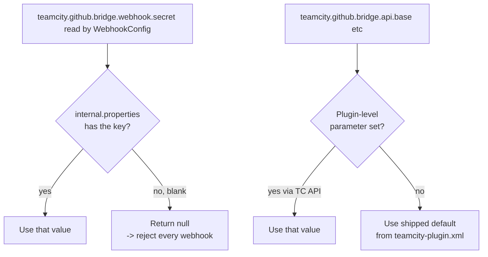

# Configuration reference

Every knob the plugin exposes, in one page.

## Configuration surfaces

```
+-----------------------------------------------------------+
| 1. Plugin-level defaults                                  |
|    -> teamcity-plugin.xml (shipped, edit only to rebuild) |
+-----------------------------------------------------------+
| 2. Server-wide internal properties                        |
|    -> <TC_DATA_DIR>/config/internal.properties            |
|    -> hot-reloaded, no restart needed                     |
+-----------------------------------------------------------+
| 3. Per-buildType parameters                               |
|    -> BuildType -> Parameters                             |
|    -> instant effect                                      |
+-----------------------------------------------------------+
```

## 1. Plugin-level defaults (shipped)

Declared in `src/main/resources/teamcity-plugin.xml`. You override
them by setting an internal property with the same name (option 2
below) - the plugin reads the property first, then falls back to
this default.

| Parameter | Default | Purpose |
|---|---|---|
| `teamcity.github.bridge.api.base` | `https://api.github.com` | Override for GitHub Enterprise. |
| `teamcity.github.bridge.api.version` | `2022-11-28` | The `X-GitHub-Api-Version` header value sent on REST calls. |
| `teamcity.github.bridge.prinfo.cache.ttl.seconds` | `60` | TTL for the in-memory PR info cache. |
| `teamcity.github.bridge.webhook.path` | `/app/teamcity-github-bridge/webhook` | The endpoint path. Changing this also affects what `/info` returns. |

## 2. Server-wide internal properties

Set in `<TC_DATA_DIR>/config/internal.properties`. Hot-reloaded.

| Property | Default | Required | Purpose |
|---|---|---|---|
| `teamcity.github.bridge.webhook.secret` | _unset_ | **yes** (or set via the admin page) | HMAC secret used to verify webhook signatures. Without this, every request is rejected with 401. Since v0.6.0 you can also set this from the admin page; the plugin's own file (`teamcity-github-bridge.properties`) takes precedence over this key. |
| `teamcity.github.bridge.api.base` | (plugin default) | no | Override for GitHub Enterprise; e.g. `https://github.acme.com/api/v3`. |
| `teamcity.github.bridge.prinfo.cache.ttl.seconds` | `60` | no | Increase if you hit GitHub rate limits; decrease for tighter loops. |

### Published build parameters (v0.10.0+)

For every build that opts into the plugin (i.e. has both
`teamcity.github.bridge.repo` and `teamcity.github.bridge.connectionId` set), the plugin
publishes a complete set of 8 PR-related parameters that build
steps can read. They mirror what the bundled `pullRequests`
build feature would have provided, plus extras (`isPullRequest`,
`isDraft`, `headSha`) that TC never published. Consumers who
configure the three opt-in parameters can disable the bundled
`pullRequests` feature entirely.

| Parameter | Value when **not** a PR | Value on a PR (resolved) | Source |
|---|---|---|---|
| `teamcity.github.bridge.isPullRequest` | `false` | `true` | derived from branch name |
| `teamcity.github.bridge.isDraft` | `false` | `true` if `draft=true`, else `false` | GitHub API |
| `teamcity.github.bridge.pullRequest.number` | `""` | `"189"` | branch name (no API call needed) |
| `teamcity.github.bridge.pullRequest.title` | `""` | `"Add raycast shadows"` | GitHub API |
| `teamcity.github.bridge.pullRequest.author` | `""` | `"alice"` | GitHub API |
| `teamcity.github.bridge.pullRequest.sourceBranch` | `""` | `"feature/raycast"` | GitHub API |
| `teamcity.github.bridge.pullRequest.targetBranch` | `""` | `"main"` | GitHub API |
| `teamcity.github.bridge.pullRequest.headSha` | `""` | `"deadbeef1234..."` | GitHub API |

All keys are **always emitted** for opted-in builds, with empty
strings on non-PR branches, so DSL conditions never fail with
"Unresolved parameter". On PR branches where the GitHub API call
fails (token outage, repo not reachable), the parameters degrade
to `isPullRequest=true` + `number=N` (extracted from the branch
name) and empty strings for the rest.

Parameters are visible server-side in the build's "Parameters"
tab and on the agent (`%teamcity.github.bridge.pullRequest.number%`,
etc.).

Use them in DSL conditions, script steps, status messages:

```kotlin
// DSL: skip a heavy step on draft PRs
script {
    scriptContent = "echo running heavy step"
    conditions { equals("teamcity.github.bridge.isDraft", "false") }
}

// DSL: only run on PR builds
script {
    scriptContent = "echo PR-specific check"
    conditions { equals("teamcity.github.bridge.isPullRequest", "true") }
}
```

```bash
# Agent-side: tag the build with the PR title
echo "##teamcity[buildNumber '%teamcity.github.bridge.pullRequest.number% - %teamcity.github.bridge.pullRequest.title%']"

# Or pick a different target environment based on the destination branch
if [ "%teamcity.github.bridge.pullRequest.targetBranch%" = "main" ]; then
    deploy_to_staging
fi
```

#### Migration from the bundled `pullRequests` feature

If you previously consumed the bundled feature's variables, swap
them for these:

| Bundled (`teamcity.pullRequest.*`) | This plugin (`teamcity.github.bridge.pullRequest.*`) |
|---|---|
| `teamcity.pullRequest.number` | `teamcity.github.bridge.pullRequest.number` |
| `teamcity.pullRequest.title` | `teamcity.github.bridge.pullRequest.title` |
| `teamcity.pullRequest.author` | `teamcity.github.bridge.pullRequest.author` |
| `teamcity.pullRequest.source.branch` | `teamcity.github.bridge.pullRequest.sourceBranch` |
| `teamcity.pullRequest.target.branch` | `teamcity.github.bridge.pullRequest.targetBranch` |
| `teamcity.pullRequest.branch.pullrequests` | `teamcity.github.bridge.pullRequest.number` (same data) |
| _not published by TC_ | `teamcity.github.bridge.isPullRequest` |
| _not published by TC_ | `teamcity.github.bridge.isDraft` |
| _not published by TC_ | `teamcity.github.bridge.pullRequest.headSha` |

> **Renaming note (v0.10.0)**: the earlier variable
> `teamcity.github.bridge.isdraft` (all lowercase, shipped in
> v0.8.0) was renamed to `teamcity.github.bridge.isDraft` for
> consistency with the rest of the namespace. If you referenced
> it in DSL, update accordingly.

### Plugin-owned settings file (v0.6.0+)

`<TC_DATA_DIR>/config/teamcity-github-bridge.properties` holds
values that the admin page writes. Currently a single key:

| Key | Purpose |
|---|---|
| `webhook.secret` | Same role as `teamcity.github.bridge.webhook.secret` above, but stored separately so the plugin never has to mutate `internal.properties`. Wins over `teamcity.github.bridge.webhook.secret` if both are set. |

You can edit this file by hand if you prefer, but the admin page is
the supported path.

Example `internal.properties` entry:

```properties
# teamcity-github-bridge: HMAC secret for the App-level webhook
teamcity.github.bridge.webhook.secret=0a4f0c9b5e8e3c1d2a4b6c8d9e0f1a2b3c4d5e6f7a8b9c0d
```

## 3. Per-buildType parameters

The bridge is opt-in: a build configuration is affected only if it
declares all three parameters. This avoids touching unrelated build
types.

| Parameter | Required | Example | Purpose |
|---|---|---|---|
| `teamcity.github.bridge.ignoreDrafts` | yes | `true` | Setting to `"true"` enables draft suppression and inclusion in the ready-for-review retrigger. |
| `teamcity.github.bridge.repo` | yes | `acme/widget` | The `owner/name` slug as GitHub reports it in `repository.full_name`. |
| `teamcity.github.bridge.connectionId` | yes | `PROJECT_EXT_42` | The TeamCity GitHub App connection ID resolved by `OAuthConnectionsManager`. Visible in the URL of the project's Connections page. The connection must carry the App ID and private key — the plugin reads them directly to self-mint installation tokens (no need to click "Test connection" first since v1.2.0). |

### How to set them

#### Via the UI

`Edit Configuration -> Parameters -> Add new parameter`. Pick
`Configuration parameter` (not env var, not system property).

#### Via a template (recommended for many build types)

Put them on a parent template and the children inherit:

```
+------------------------------------------------+
| Template: GitHubAwarePR                        |
|   parameters:                                  |
|     teamcity.github.bridge.ignoreDrafts        = true            |
|     teamcity.github.bridge.repo         = acme/widget     |
|     teamcity.github.bridge.connectionId = PROJECT_EXT_42  |
+------------------------------------------------+
          |
          v inherits
+------------------------------------------------+
| BuildType: Build_LinuxX64_Clang                |
| BuildType: Build_LinuxX64_Gcc                  |
| BuildType: Build_WindowsX64_Clang              |
+------------------------------------------------+
```

#### Via Kotlin DSL

```kotlin
object GitHubAwarePR : Template({
    id("GitHubAwarePR")
    name = "GitHub-aware PR template"
    params {
        param("teamcity.github.bridge.ignoreDrafts", "true")
        param("teamcity.github.bridge.repo", "acme/widget")
        param("teamcity.github.bridge.connectionId", "PROJECT_EXT_42")
    }
})
```

### Behaviour on draft PRs

Once a build configuration is opted in (the three parameters above
set), the plugin **removes** any queued build for a draft PR from
the queue (`DraftBuildQueueCleaner`). It does not hold the build
with a wait reason; the queue stays clean.

The user still sees the deliberate skip on GitHub through the
`skipped` Check Run posted by `DraftCheckRunReporter` (visible in
the PR's "Checks" tab as `TeamCity / <buildType> -> Skipped:
draft PR`). When the PR is marked ready for review, the App-level
webhook fires and `ReadyForReviewListener` re-enqueues a fresh
build on the latest revision.

If the cleaner fails (typically because the GitHub API was
unreachable when the build hit the queue), `DraftAwareBuildFilter`
serves as a safety net: the build is held with the wait reason
`PR #N is draft and ...ignoreDrafts is enabled` until the next
attempt resolves the PR state.

**Manual user triggers always run.** Since v1.3.0, the entire
draft-suppression path (filter, cleaner, skipped-Check-Run reporter,
and the queued Check Run gate) checks
`SQueuedBuild.triggeredBy.isTriggeredByUser` and yields when an
operator clicks "Run" in the TC UI on a draft PR. VCS-driven
triggers and snapshot-dependency triggers still follow the
suppression flow.

### Enable on a build configuration

1. Pick a build configuration that runs on PR refs (`+:refs/pull/*/head`
   or similar in its VCS root branchSpec).
2. Add the three parameters above.
3. Save. The next queued build hits the plugin's
   `StartBuildPrecondition`; if the PR is draft, the build is held
   with a wait reason `"PR #N is draft and teamcity.github.bridge.ignoreDrafts is enabled"`.

There is **no UI badge** indicating the plugin is active on a build
type. The presence of the three parameters is the sole signal.
Future versions may add a Build Feature for clearer UX; tracked in
[development.md#roadmap](development.md#roadmap).

## Parameter precedence



Notes:
- Internal properties win over plugin-level parameters when both
  are set.
- Per-buildType parameters do not override server-wide settings; they
  configure which builds participate.

## Logging tuning

The plugin uses IntelliJ openapi `Logger` which delegates to log4j
when running inside TeamCity.

### Dedicated log file

As of v0.6.0 the plugin **attaches its own log appender at startup**.
No manual setup needed:

- File: `<TC_DATA_DIR>/logs/teamcity-github-bridge.log` (same dir
  as `teamcity-server.log`).
- Rotation: size-based, 10 MB per file, 10 historical files (~100 MB
  retention).
- Pattern: `[<ISO-8601 timestamp>] <LEVEL> <ClassName> - <message>`.
- Routing: all `io.github.dlachouette.teamcity.github.*` log entries
  go to this file with `additivity="false"`, i.e. they no longer
  duplicate to `teamcity-server.log`.

The admin page reports the state under `Dedicated log`:
- **auto-configured** - the plugin attached the appender at startup
  (the common case).
- **operator-configured** - an existing appender on the package
  logger was detected; the plugin left it alone.
- **not configured** - rare, only when the appender attachment threw.
  See troubleshooting.

### Manual override (advanced)

If you prefer to take control of the routing - different rotation,
remote syslog, etc. - configure your own appender for the
`io.github.dlachouette.teamcity.github` logger in
`<TC_DATA_DIR>/config/teamcity-server-log4j.xml`. The plugin
detects an existing appender and skips its own attachment.

The shipped reference snippet
(`/teamcity-github-bridge-log4j-snippet.xml` inside the plugin jar -
also available at `src/main/resources/teamcity-github-bridge-log4j-snippet.xml`
in the repository) can be merged into `<TC_DATA_DIR>/config/teamcity-server-log4j.xml`,
inside the root `<log4j:configuration>` element:

```xml
<appender name="TCGH_BRIDGE" class="org.apache.log4j.rolling.RollingFileAppender">
    <rollingPolicy class="jetbrains.buildServer.util.TCRollingPolicy">
        <param name="FileNamePattern"
               value="${teamcity_logs}/teamcity-github-bridge.log.%d{yyyy-MM-dd}.gz"/>
        <param name="ActiveFileName" value="${teamcity_logs}/teamcity-github-bridge.log"/>
        <param name="MaxHistory" value="14"/>
    </rollingPolicy>
    <layout class="org.apache.log4j.PatternLayout">
        <param name="ConversionPattern" value="[%d{HH:mm:ss.SSS}] %-5p %c{1} - %m%n"/>
    </layout>
</appender>

<logger name="io.github.dlachouette.teamcity.github" additivity="false">
    <level value="INFO"/>
    <appender-ref ref="TCGH_BRIDGE"/>
</logger>
```

TeamCity hot-reloads log4j on file change; no restart needed.

Result: plugin entries land in `<TC_DATA_DIR>/logs/teamcity-github-bridge.log`,
rolled daily, gzipped, 14 days retention. The server-wide
`teamcity-server.log` no longer contains
`io.github.dlachouette.*` entries.

Verify by curling `/info`:

```bash
curl -s https://<TC_HOST>/app/teamcity-github-bridge/info | jq '.logConfigured, .logFile'
# true
# "/data/teamcity_server/datadir/logs/teamcity-github-bridge.log"
```

### Quick debug logging without a dedicated file

If you only want debug temporarily and do not care about routing:

```xml
<!-- <TC_DATA_DIR>/config/teamcity-server-log4j.xml -->
<logger name="io.github.dlachouette.teamcity.github" additivity="false">
    <level value="DEBUG"/>
    <appender-ref ref="ROLL"/>
</logger>
```

Reload via `Administration -> Diagnostics -> Logging` or restart.

## Check Run publisher coverage

Since v0.7.0 the plugin's `BuildStatusCheckRunPublisher` posts
GitHub Check Runs on every lifecycle event of **every** build
configuration that carries the two parameters
`teamcity.github.bridge.repo` + `teamcity.github.bridge.connectionId`. This includes:

- PR builds with `teamcity.github.bridge.ignoreDrafts=true` (the original draft-aware path).
- PR builds with `teamcity.github.bridge.ignoreDrafts=false` (opt-out subsets).
- Builds on `main` after merge.
- Any other branch covered by the buildType's VCS root.

Previously the publisher also required `teamcity.github.bridge.ignoreDrafts == "true"`
and a `pull/` branch ref; both guards were removed (roadmap
[Gap A4](roadmap.md#gap-a4)). As a result you can now disable the
bundled `commitStatusPublisher` for every opted-in build type and
still have full GitHub PR coverage from the plugin.

## Check Run publisher coexistence with the bundled `commitStatusPublisher`

As of v0.4.0, the plugin's `BuildStatusCheckRunPublisher` posts
GitHub Check Runs on every lifecycle event for an opted-in build
type. The bundled `commitStatusPublisher` keeps posting Commit
Statuses (with the hard-coded `"TeamCity build finished"`
description) unless you disable it.

### What the plugin emits

Since v1.3.0 every lifecycle transition is mapped to a Check Run.
GitHub dedups by `(name, head_sha)` so the same row transitions
through every state.

| Event | Check Run `status` | Check Run `conclusion` | `output.title` |
|---|---|---|---|
| Build added to queue | `queued` | (none) | `Queued` |
| Held in draft queue | `completed` | `skipped` | `Skipped: draft PR` |
| Build starts | `in_progress` | (none) | `Building` |
| Build interrupted (early stop signal) | `completed` | `cancelled` | `Build cancelled` |
| Build removed from queue by a user | `completed` | `cancelled` | `Cancelled before start` |
| Build finishes (success / warning) | `completed` | `success` | `Build passed` |
| Build finishes (failure / error) | `completed` | `failure` | `Build failed` |
| Build finishes (cancelled) | `completed` | `cancelled` | `Build cancelled` |
| Build status `UNKNOWN` | `completed` | `neutral` | `Build status: ...` |

`output.summary` carries the build's `statusDescriptor.text` (i.e.
whatever the agent set via
`##teamcity[buildStatus text='...']`). Truncated at 60 000
characters with a `(truncated)` marker if longer.

Every Check Run carries a `details_url` so the "Details" link from
the GitHub Checks tab jumps directly to the build page in TC
(`WebLinks.getViewResultsUrl` for running/finished builds, the
buildType's home page for skipped / queue-cancelled rows since the
queue item is gone within milliseconds). If TC's server rootUrl is
unset the URL is silently dropped and GitHub falls back to its own
Check Run page.

The publisher dedups against `DraftCheckRunReporter` so a
draft-suppressed build receives a single `skipped` row instead of a
`queued`/`skipped` flicker: `publishQueued` consults `PrInfoCache`
and yields when `ignoreDrafts=true` + `pull/N` branch + PR is draft.

### Choosing the right setup

| Goal | Action |
|---|---|
| Keep both publishers (informational fallback) | Do nothing. Update branch protection to require **only** Check Run names like `TeamCity / <buildType full name>`. Commit Statuses appear but are not blocking. |
| Single source of truth | Disable the bundled `commitStatusPublisher` on the opted-in build types via the existing UI (Build Features tab). The plugin's Check Runs become the only TC signal. |

The "disable per-buildType" path is currently manual; a future
release will provide a Build Feature for one-click opt-out.

## Validation

The plugin does not actively validate the parameters at save time
(no UI hook yet). What it does:

- **`teamcity.github.bridge.repo` malformed** -> `RepoCoords.parse` throws
  `IllegalArgumentException`, caught and logged. The build is
  allowed to proceed (fail-open).
- **`teamcity.github.bridge.connectionId` not found** -> `TokenResolver`
  returns null, logged as warning. Build proceeds (fail-open).
- **`teamcity.github.bridge.ignoreDrafts` value other than `"true"`** -> treated as
  disabled. No error.

To validate without queuing a build, watch the server log while you
manually trigger a `ping` from the GitHub App settings.

## Next

- See it in action: [usage-scenarios.md](usage-scenarios.md).
- What to do when something looks wrong: [troubleshooting.md](troubleshooting.md).
