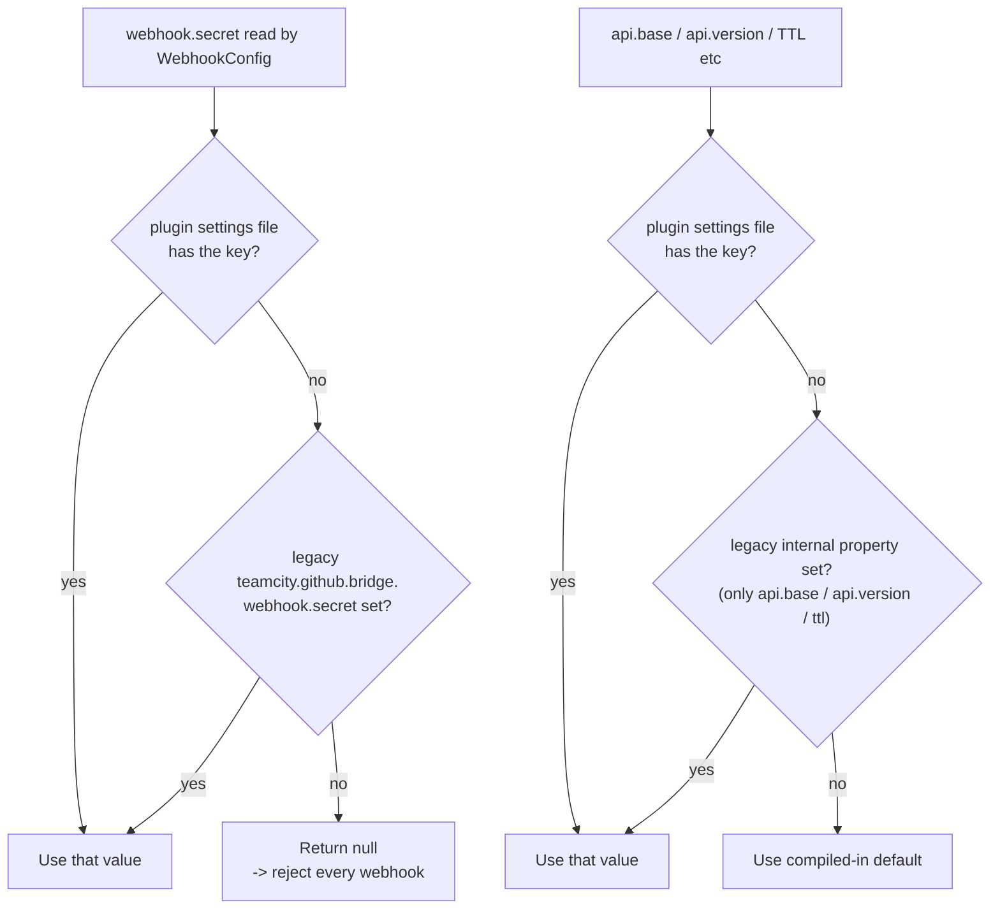

# Configuration reference

Every knob the plugin exposes, in one page.

## Configuration surfaces

As of v1.7.0 the plugin ships **two in-product configuration pages**, so
the bulk of the configuration is no longer hand-edited parameters:

- **Server-wide page** — `Administration -> Server Administration ->
  GitHub Bridge`. Edits the server-wide settings + feature flags and
  holds the **webhook secret** and **API token** forms. Writes to
  the plugin-owned settings file; applied immediately (no restart).
- **Project page** — `Administration -> <project> -> GitHub Bridge`
  (under the *Integrations* group). Edits the six project-level
  parameters that opt a project into the bridge.
- **Per-BuildType build feature** — `Edit Configuration -> Build
  Features -> Add -> GitHub Bridge integration`. The presence of the
  feature is the per-task opt-in; its fields tune the trigger paths.

```
+-----------------------------------------------------------------+
| 1. Plugin-level defaults (shipped)                              |
|    -> teamcity-plugin.xml (legacy internal-property fallbacks)  |
+-----------------------------------------------------------------+
| 2. Server-wide settings + flags + secrets                       |
|    -> Administration -> Server Administration -> GitHub Bridge  |
|    -> stored in <TC_DATA_DIR>/config/                           |
|       teamcity-github-bridge.properties                         |
|    -> applied immediately, no restart needed                    |
+-----------------------------------------------------------------+
| 3. Per-project parameters (opt-in)                              |
|    -> Administration -> <project> -> GitHub Bridge              |
|    -> repo, connectionId, branch/PR trigger toggles + lists     |
+-----------------------------------------------------------------+
| 4. Per-BuildType "GitHub Bridge integration" build feature      |
|    -> Edit Configuration -> Build Features                      |
|    -> trigger gates, branch/path overrides, comment trigger     |
+-----------------------------------------------------------------+
```

## 1. Plugin-level defaults (shipped)

Declared in `src/main/resources/teamcity-plugin.xml`. The preferred
way to override them is the admin page (option 2 below), which writes
the short keys into the plugin settings file. The internal properties
listed here remain as **legacy fallbacks** — the plugin reads the
plugin settings file first, then the legacy internal property, then
this compiled default (see the resolution order in section 2).

| Legacy internal property | Default | Purpose |
|---|---|---|
| `teamcity.github.bridge.api.base` | _blank_ (derive per connection) | Override of the GitHub REST API base (GitHub Enterprise). |
| `teamcity.github.bridge.api.version` | `2022-11-28` | The `X-GitHub-Api-Version` header value sent on REST calls. |
| `teamcity.github.bridge.prinfo.cache.ttl.seconds` | `60` | TTL for the in-memory PR info cache. |
| `teamcity.github.bridge.webhook.path` | `/app/teamcity-github-bridge/webhook` | The endpoint path. Changing this also affects what `/info` returns. |

> All other server-wide settings (stale grace, HTTP retry, the feature
> flags, allowlist, comment-author list) have **no** legacy
> internal-property alias — set them from the admin page or directly in
> the plugin settings file.

## 2. Server-wide settings, flags and secrets

Edited from `Administration -> Server Administration -> GitHub Bridge`.
The page writes them to the plugin-owned settings file
`<TC_DATA_DIR>/config/teamcity-github-bridge.properties` and applies them
**immediately, without a restart** — `BridgeServerSettings.applyTo`
re-pushes the per-operation values (API version, cache TTL/grace, retry
budget) into the live beans on every save. You can edit the file by hand,
but the admin page is the supported path.

### Resolution order (per key)

Each tuning value is resolved in three steps (`BridgeServerSettings`):

1. the plugin-owned settings file (set from the admin page),
2. the legacy `teamcity.github.bridge.*` internal property (the keys
   historically declared in `teamcity-plugin.xml`, kept so operators who
   set them by hand keep working) — only a subset of keys has a legacy
   alias,
3. the compiled-in default.

### Tuning settings

Stored under the short keys below in
`teamcity-github-bridge.properties`. The "Legacy property" column lists
the `internal.properties` key that still works as a fallback (step 2).

| Key | Default | Legacy property | Admin-page field | Purpose |
|---|---|---|---|---|
| `api.base` | _blank_ (derive per connection) | `teamcity.github.bridge.api.base` | API base override | Global override of the GitHub REST API base. Blank = derive per connection from its GitHub URL (`github.com` → `api.github.com`, GHE → `<host>/api/v3`). Set for a single-host GHE. |
| `api.version` | `2022-11-28` | `teamcity.github.bridge.api.version` | API version | `X-GitHub-Api-Version` header value sent on REST calls. |
| `prinfo.cache.ttl.seconds` | `60` | `teamcity.github.bridge.prinfo.cache.ttl.seconds` | PR-info cache TTL (s) | TTL for the in-memory PR info cache. Increase if you hit rate limits; decrease for tighter loops. |
| `prinfo.cache.staleGrace.seconds` | `300` | _(none)_ | Stale grace (s) | How long a stale PR-info entry may still be served when a refresh fetch fails. |
| `http.retry.maxAttempts` | `3` (clamped 1–10) | _(none)_ | HTTP retry attempts | Max attempts per GitHub HTTP call. |
| `http.retry.baseDelayMs` | `500` (clamped 0–60000) | _(none)_ | base delay (ms) | Base backoff delay between retries. |
| `repo.allowlist` | _empty_ (= all) | _(none)_ | Repository allowlist | One `owner/name` per line. Empty = act on all repositories. Matching is case-insensitive. |
| `comment.allowedAssociations` | `OWNER,MEMBER,COLLABORATOR` | _(none)_ | Comment-trigger authors | GitHub `author_association` values trusted to start builds via PR comments (comma/newline-separated, upper-cased). Empty = open to all commenters. |
| `prTag.prefix` | `pr-` | _(none)_ | PR tag prefix | Prefix of the PR tag written when `prTag.enabled` is on — `pr-` gives `pr-189`. Configurable because tags are shared with whatever else a team puts there. Blank or containing a space falls back to the default rather than producing a bare number. Changing it does **not** rewrite existing tags: builds tagged with the old prefix keep it and stop being matched. |

### Feature flags

Boolean checkboxes on the admin page. Stored under the same keys.

| Key | Default | Admin-page label | Purpose |
|---|---|---|---|
| `webhook.replay.enabled` | `true` | Webhook replay protection | Reject replayed webhook deliveries. |
| `dryRun` | `false` | Dry-run | Log intended actions, perform none. |
| `metrics.enabled` | `true` | Metrics endpoint | Expose the metrics endpoint. |
| `legacyAliases.enabled` | `false` | Publish legacy `teamcity.pullRequest.*` aliases | Also publish the bundled feature's variable names alongside the `teamcity.github.bridge.pullRequest.*` ones. |
| `prComment.enabled` | `false` | Sticky PR summary comment | Post/update a summary comment on the PR thread. Needs the App's pull-requests/issues **write** permission, hence off by default. |
| `checkRun.artifactLinks` | `true` | List artifacts in the Check Run and PR comment | Add an **Artifacts** section (top-level artifact files, capped at 10) to the completed Check Run and an `[artifacts]` link to each row of the sticky comment, so a reviewer or a tester reaches the installer/package straight from the PR. Costs one local artifact listing per finished build; no GitHub call. |
| `queueCleanup.enabled` | `true` | Queue cleanup | Master switch for everything that takes a build **out** of the queue: draft suppression, the scope filters, `skipIfCommitPassed` and the drain of a closed PR. Off = the bridge only ever *adds* builds and reports on them; it never removes nor holds one, whatever the gate decided. Only ever applied to build configurations carrying the build feature (see the scope invariant above). |
| `prTag.enabled` | `true` | Tag PR builds with their PR number | Persist the PR number as a build tag, so a build stays findable by PR long after it ran — it is what the **Branches & PRs** project tab and TeamCity's own tag filter search on. Turn it off to keep the tag list clean; the PR column then falls back to what the ref says (`pull/N` yes, a work branch no). |
| `rerunAll.onlyFailed` | `false` | "Re-run all checks" re-runs only the failed ones | Restrict `check_suite.rerequested` (the GitHub **Re-run all checks** button) to build configurations whose last build at that commit **failed**. Off = re-run every opted-in build configuration, which is what the button says. A configuration that never ran at that commit has no failure to re-run and is left alone either way. |
| `branchPrLookup.enabled` | `true` | Attach branch builds to their PR | For a build launched on a plain branch ref (not a `pull/N` ref), resolve the pull request from the built commit (`GET /commits/{sha}/pulls`) so the build gets the PR parameters, the `draft`/`ready` tag and the summary comment. Only **open** PRs whose **head** is that exact commit qualify; the answer (including "no PR") is cached for the PR-info TTL. Off = branch builds stay strictly PR-unaware. |

### Managed GitHub App (v1.7.0+)

The plugin can register and own its own GitHub App via the manifest flow
on the admin page (GitHub App card; see
[github-app-setup.md → Option A](github-app-setup.md#option-a-let-the-plugin-create-the-app-for-you-recommended)).
This is an **alternative to a TeamCity OAuth connection**: when a build
type sets `connectionId` to the sentinel value `managed`, `TokenResolver`
mints installation tokens from the App credentials stored under these
keys instead of resolving a TeamCity connection.

These keys are **populated automatically** by the manifest creation flow
(and the GitHub-generated webhook secret is written to `webhook.secret`).
You normally do not hand-edit them; doing so means pasting an App ID, a
full PEM private key and a slug by hand.

| Key | Default | Populated by | Purpose |
|---|---|---|---|
| `app.id` | _unset_ | manifest flow | The managed App's numeric App ID. |
| `app.privateKey` | _unset_ | manifest flow | The managed App's private key (full PEM). Used to sign App JWTs and self-mint installation tokens. Treat as a credential — see [security.md](security.md). |
| `app.slug` | _unset_ | manifest flow | The managed App's slug, used to deep-link to its GitHub settings/installation pages and shown on the admin card. |

The API base for managed-App calls comes from the `api.base` override
when set, otherwise `api.github.com`. **For GitHub Enterprise you must
set `api.base`** (`<host>/api/v3`), since there is no TeamCity connection
URL to derive it from in the managed case.

### Secrets (stored separately, set via dedicated forms)

These two are never part of a bulk "Save server settings" submit — each
has its own form, so a settings save never clears them. Values are never
echoed back; rotate by submitting a new one.

| Key | Default | Required | Admin-page form | Purpose |
|---|---|---|---|---|
| `webhook.secret` | _unset_ | **yes** | HMAC secret form | HMAC-SHA256 secret used to verify webhook signatures. Without it every request is rejected with 401. Wins over the legacy `teamcity.github.bridge.webhook.secret` in `internal.properties` if both are set. Generate with `openssl rand -hex 48`. |
| `api.token` | _unset_ (= API disabled) | no | External API form | Bearer token that enables the authenticated API under `/app/teamcity-github-bridge/api/` (status, events, metrics, build trigger). No token = API disabled. Pass as `Authorization: Bearer <token>`. Generate with `openssl rand -hex 32`. |

### Published build parameters (v0.10.0+)

For every build that opts into the plugin (i.e. has both
`teamcity.github.bridge.repo` and `teamcity.github.bridge.connectionId` set), the plugin
publishes a complete set of 8 PR-related parameters that build
steps can read. They mirror what the bundled `pullRequests`
build feature would have provided, plus extras (`isPullRequest`,
`isDraft`, `headSha`) that TC never published. Consumers who
configure the three opt-in parameters can disable the bundled
`pullRequests` feature entirely.

| Parameter | Value when **not** a PR | Value on a PR (resolved) | Source |
|---|---|---|---|
| `teamcity.github.bridge.isPullRequest` | `false` | `true` | derived from branch name |
| `teamcity.github.bridge.isDraft` | `false` | `true` if `draft=true`, else `false` | GitHub API |
| `teamcity.github.bridge.pullRequest.number` | `""` | `"189"` | branch name (no API call needed) |
| `teamcity.github.bridge.pullRequest.title` | `""` | `"Add raycast shadows"` | GitHub API |
| `teamcity.github.bridge.pullRequest.author` | `""` | `"alice"` | GitHub API |
| `teamcity.github.bridge.pullRequest.sourceBranch` | `""` | `"feature/raycast"` | GitHub API |
| `teamcity.github.bridge.pullRequest.targetBranch` | `""` | `"main"` | GitHub API |
| `teamcity.github.bridge.pullRequest.headSha` | `""` | `"deadbeef1234..."` | GitHub API |
| `teamcity.github.bridge.triggerSource` | _absent_ | `command` when the build was started by an explicit GitHub command (PR comment, review approval, Re-run button, `POST /api/trigger`); absent otherwise | set by the bridge on the promotion |

All keys are **always emitted** for opted-in builds, with empty
strings on non-PR branches, so DSL conditions never fail with
"Unresolved parameter". On PR branches where the GitHub API call
fails (token outage, repo not reachable), the parameters degrade
to `isPullRequest=true` + `number=N` (extracted from the branch
name) and empty strings for the rest.

A build launched on a **plain branch ref** (`Feature/x`, not `pull/N`)
gets the same populated values when that commit is the head of an open
PR — see `branchPrLookup.enabled` under
[Feature flags](#feature-flags). When the commit heads no open PR (or
the flag is off) the non-PR defaults above apply.

Parameters are visible server-side in the build's "Parameters"
tab and on the agent (`%teamcity.github.bridge.pullRequest.number%`,
etc.).

Use them in DSL conditions, script steps, status messages:

```kotlin
// DSL: skip a heavy step on draft PRs
script {
    scriptContent = "echo running heavy step"
    conditions { equals("teamcity.github.bridge.isDraft", "false") }
}

// DSL: only run on PR builds
script {
    scriptContent = "echo PR-specific check"
    conditions { equals("teamcity.github.bridge.isPullRequest", "true") }
}
```

```bash
# Agent-side: tag the build with the PR title
echo "##teamcity[buildNumber '%teamcity.github.bridge.pullRequest.number% - %teamcity.github.bridge.pullRequest.title%']"

# Or pick a different target environment based on the destination branch
if [ "%teamcity.github.bridge.pullRequest.targetBranch%" = "main" ]; then
    deploy_to_staging
fi
```

#### Migration from the bundled `pullRequests` feature

If you previously consumed the bundled feature's variables, swap
them for these:

| Bundled (`teamcity.pullRequest.*`) | This plugin (`teamcity.github.bridge.pullRequest.*`) |
|---|---|
| `teamcity.pullRequest.number` | `teamcity.github.bridge.pullRequest.number` |
| `teamcity.pullRequest.title` | `teamcity.github.bridge.pullRequest.title` |
| `teamcity.pullRequest.author` | `teamcity.github.bridge.pullRequest.author` |
| `teamcity.pullRequest.source.branch` | `teamcity.github.bridge.pullRequest.sourceBranch` |
| `teamcity.pullRequest.target.branch` | `teamcity.github.bridge.pullRequest.targetBranch` |
| `teamcity.pullRequest.branch.pullrequests` | `teamcity.github.bridge.pullRequest.number` (same data) |
| _not published by TC_ | `teamcity.github.bridge.isPullRequest` |
| _not published by TC_ | `teamcity.github.bridge.isDraft` |
| _not published by TC_ | `teamcity.github.bridge.pullRequest.headSha` |

> **Renaming note (v0.10.0)**: the earlier variable
> `teamcity.github.bridge.isdraft` (all lowercase, shipped in
> v0.8.0) was renamed to `teamcity.github.bridge.isDraft` for
> consistency with the rest of the namespace. If you referenced
> it in DSL, update accordingly.

### Plugin-owned settings file (v0.6.0+)

`<TC_DATA_DIR>/config/teamcity-github-bridge.properties` holds every
value the admin page writes — all the tuning keys, feature flags and
both secrets listed in the tables above (`api.base`, `api.version`,
`prinfo.cache.ttl.seconds`, `prinfo.cache.staleGrace.seconds`,
`http.retry.maxAttempts`, `http.retry.baseDelayMs`, `repo.allowlist`,
`comment.allowedAssociations`, `webhook.replay.enabled`, `dryRun`,
`metrics.enabled`, `legacyAliases.enabled`, `prComment.enabled`,
`branchPrLookup.enabled`, `webhook.secret`, `api.token`) plus, when a
managed App has been created
(v1.7.0+), the managed-App credentials `app.id`, `app.privateKey` (PEM)
and `app.slug`. The plugin never has to mutate `internal.properties`.

You can edit this file by hand if you prefer, but the admin page is
the supported path.

Example file:

```properties
# <TC_DATA_DIR>/config/teamcity-github-bridge.properties
webhook.secret=0a4f0c9b5e8e3c1d2a4b6c8d9e0f1a2b3c4d5e6f7a8b9c0d
api.version=2022-11-28
prinfo.cache.ttl.seconds=60
http.retry.maxAttempts=3
metrics.enabled=true
```

The legacy `internal.properties` aliases still work for the three keys
that have them (e.g. the secret as
`teamcity.github.bridge.webhook.secret`):

```properties
# <TC_DATA_DIR>/config/internal.properties (legacy fallback)
teamcity.github.bridge.webhook.secret=0a4f0c9b5e8e3c1d2a4b6c8d9e0f1a2b3c4d5e6f7a8b9c0d
```

## 3. Per-project parameters

The mandatory configuration lives at the **project** level: it is shared
by every opted-in BuildType in the project (and inherited by
sub-projects unless they set their own). Edit it from
`Administration -> <project> -> GitHub Bridge` (Integrations group); the
page writes the project's own configuration parameters. Two independent
"trigger paths" can be enabled per project — `branchTrigger` (non-PR
branches like `main`, `Release/*`) and `prTrigger` (PR branches,
`pull/N`) — each with its own enable toggle and branch list.

| Parameter | Default | Project-page field | Purpose |
|---|---|---|---|
| `teamcity.github.bridge.repo` | _empty_ | GitHub repository | **Mandatory.** The `owner/name` slug as GitHub reports it in `repository.full_name`, e.g. `acme/widget`. |
| `teamcity.github.bridge.connectionId` | _empty_ | GitHub App connection ID | **Mandatory.** Either (a) the TeamCity GitHub App connection ID resolved by `OAuthConnectionsManager` (Administration → `<project>` → Connections; visible in that page's URL) — the connection must carry the App ID and private key, which the plugin reads directly to self-mint installation tokens (no need to click "Test connection" first since v1.2.0); or (b) the sentinel value `managed` (v1.7.0+) to mint from the plugin-managed App created via the manifest flow instead of a TeamCity connection (see [Managed GitHub App](#managed-github-app-v170) and [github-app-setup.md → Option A](github-app-setup.md#option-a-let-the-plugin-create-the-app-for-you-recommended)). |
| `teamcity.github.bridge.branchTrigger.enabled` | `true` (anything but `false`) | Trigger on non-PR branches | Project-level kill switch for the non-PR branch path. Off = the bridge never triggers builds on non-PR branches for this project. |
| `teamcity.github.bridge.branchTrigger.branches` | _empty_ (= all) | Non-PR branch filter | VCS branch-filter syntax (`+:pattern` / `-:pattern` per line, `/regex/` for Java regex). Empty = match every branch. |
| `teamcity.github.bridge.prTrigger.enabled` | `true` (anything but `false`) | Trigger on pull requests | Project-level kill switch for the PR path. Off = the bridge never triggers PR builds for this project. |
| `teamcity.github.bridge.prTrigger.branches` | _empty_ (= all) | PR source-branch filter | Matched against the PR's **source** branch name (e.g. `Feature/foo`), not the `pull/N` literal. Empty = match every PR. |
| `teamcity.github.bridge.prBuildRef` | `pull` | Build PRs on their own branch | Which ref a PR build runs on. `pull` (default) = the synthetic `pull/N` ref, mapped by the VCS root's branch spec — the only option that works for PRs from forks. `branch` = the PR's **own head branch** (e.g. `Feature/foo`): readable in every TeamCity screen, and a push builds **once** instead of twice once a PR exists, because there is no second ref for the same commit. See [Branch-source PR builds](#branch-source-pr-builds-v190) below. |

A BuildType participates only when (a) the surrounding project chain
provides both `repo` and `connectionId`, **and** (b) the BuildType
carries the *GitHub Bridge integration* build feature (section 4). The
project params are read through `buildType.project.parameters` (the
documented project-chain inheritance path), so setting them on a parent
project is enough.

### How to set them

#### Via the project page (recommended)

`Administration -> <project> -> GitHub Bridge`, fill the six fields,
Save. Sub-projects inherit unless they override.

#### Via Kotlin DSL

They are ordinary project parameters:

```kotlin
object MyProject : Project({
    params {
        param("teamcity.github.bridge.repo", "acme/widget")
        param("teamcity.github.bridge.connectionId", "PROJECT_EXT_42")
        param("teamcity.github.bridge.branchTrigger.enabled", "true")
        param("teamcity.github.bridge.branchTrigger.branches", "+:main\n+:Release/*")
        param("teamcity.github.bridge.prTrigger.enabled", "true")
        param("teamcity.github.bridge.prTrigger.branches", "")
    }
})
```

## 4. Per-BuildType build feature: "GitHub Bridge integration"

The per-task opt-in is the **build feature**, added under
`Edit Configuration -> Build Features -> Add -> GitHub Bridge
integration` (one per BuildType; multiple are not allowed). Its presence
opts the BuildType into the trigger paths, draft suppression and Check
Run lifecycle. The feature is read through the BuildType's
`resolvedSettings`, so a feature inherited from a **BuildType template**
counts even without re-attaching it locally.

The feature exposes per-task fields along **two independent axes**:

- **Publication** — `publishChecks` alone decides whether this build
  configuration reports to GitHub. It does **not** depend on what started the
  build: a PR event, a VCS trigger, a schedule, a manual Run and a GitHub
  command all report, or none do.
- **Triggering** — the `triggerOn*` flags and the branch/path/metadata filters
  decide what the bridge *starts*, and what it may drop from the queue. They
  only ever apply to **automatic** builds: an explicit Run or GitHub command is
  never removed from the queue by the bridge.

The bridge takes a build out of the queue in exactly two cases, both automatic:
a scope filter excluded it (draft PR, branch list, path filter, PR metadata), or
`skipIfCommitPassed` found the same commit already green.

> **Queue cleanup can be switched off server-wide** with the
> `queueCleanup.enabled` flag on the admin page — the bridge then only adds
> builds and reports on them.
>
> **And it never leaves the opted-in set.** A build configuration is
> only ever touched when it carries this build feature — directly or inherited
> from a BuildType template — **and** its project chain provides
> `teamcity.github.bridge.repo` + `connectionId`. A build configuration
> without the feature is invisible to the cleanup, whatever the branch, the
> trigger or the server settings. Publication is not part of that decision:
> `publishChecks=false` silences GitHub reporting, it does not exempt the
> configuration's automatic builds from its own trigger filters.

| Feature param | Kind | Default | Feature-form field | Purpose |
|---|---|---|---|---|
| `publishChecks` | publication | `true` | Publish to GitHub | Does this build configuration report to GitHub at all? Unchecked = invisible on GitHub whatever happens (no Check Run, no skip row, no PR comment) while still receiving the PR parameters and tags. This is the **only** input to publication — see the two axes above. |
| `triggerOnBranch` | trigger | `true` | Run on non-PR branches | Does the bridge trigger this build configuration on non-PR branches? Unchecked = no automatic branch build **and nothing removed either**: a Run, a schedule or a VCS trigger still works, and still reports. |
| `triggerOnPrReady` | trigger | `true` | Run on PR (ready) | Is this build configuration part of the PR check set (ready PRs and draft→ready transitions)? Unchecked = the bridge never enqueues it from a PR event and posts no `Skipped` row for it; an explicit Run or command still works and reports. |
| `triggerOnPrDraft` | trigger | `true` | Run on PR (draft) | Also trigger on draft PR events. **Requires `triggerOnPrReady=true`** (validated at save; a stored `ready=off, draft=on` is clamped to off). Unchecked: an **automatic** draft build is dropped with a `Skipped: draft PR` Check Run, while an explicit Run or GitHub command on a draft still runs. |
| `skipIfCommitPassed` | trigger | `false` | Reuse a passed commit | When an **automatic** build is queued for a commit that already passed in this build configuration, drop it and republish that success (`Build passed (reused #87)`, linking to the build that ran). Matched on the commit alone, any ref — GitHub keys a Check Run on `(name, commit)`, so two refs of one commit are one row. A manual Run, a GitHub command and the Re-run buttons always re-run. **Leave off for scheduled suites**: a nightly is expected to re-run on an unchanged commit. |
| `branchTriggerBranchesOverride` | SOFT | _empty_ (inherit) | Branches list override (non-PR) | When set, **REPLACES** the project's `branchTrigger.branches` for this BuildType. Same VCS branch-filter syntax. Empty = inherit project's list. |
| `prTriggerBranchesOverride` | SOFT | _empty_ (inherit) | Branches list override (PR source) | When set, **REPLACES** the project's `prTrigger.branches` for this BuildType. Matched against the PR source branch. Empty = inherit. Auto enqueues for excluded PRs post a `Skipped: branch out of scope` Check Run. |
| `pathFilter` | SOFT | _empty_ (= all paths) | Changed-path filter (monorepo) | **New.** When set, the listener only enqueues this BuildType for a PR if at least one of the PR's changed files matches. VCS-filter syntax (`+:src/api/**` / `-:docs/*` per line; `*` spans `/`). Enforced **only for PR webhook triggers** (it needs the PR file list from GitHub). A non-matching PR gets a `Skipped: paths out of scope` Check Run. |
| `runOnApproval` | — | `false` | Run on PR approval | **New.** When checked, the BuildType is enqueued on PR approval (`pull_request_review` submitted = approved) — for expensive suites you only want to run after review. Independent of the ready/synchronize triggers. Requires the App to send `pull_request_review` events. |
| `commentTrigger` | — | _empty_ (disabled) | PR comment trigger phrase | **New.** Optional trigger phrase (e.g. `/rebuild`). When a PR comment contains it (case-insensitive substring) **and** the commenter is trusted (server-side `comment.allowedAssociations`, collaborators-only by default), this BuildType is enqueued. Fires on inline PR review comments (`pull_request_review_comment`), which the App subscribes to by default. General PR *conversation* comments (`issue_comment`) also work but are **opt-in**: GitHub only delivers them when the App has the **Issues** permission, which the plugin does not request by default. Empty = disabled. |
| `requirePhrase` | SOFT | _empty_ (no requirement) | PR metadata: require phrase | **New (v1.8.0).** Run only if the PR's **title OR body** contains this text (case-insensitive substring). Empty = no requirement. PR builds only. Excluded auto triggers post a `Skipped: PR metadata out of scope` Check Run; a manual "Run" bypasses it. |
| `skipPhrase` | SOFT | _empty_ (no skip) | PR metadata: skip phrase | **New (v1.8.0).** Skip the build if the PR's **title OR body** contains this text (case-insensitive substring), e.g. `[skip ci]`. Empty = never skipped on this basis. PR builds only. Excluded auto triggers post a `Skipped: PR metadata out of scope` Check Run; a manual "Run" bypasses it. |
| `labelFilter` | SOFT | _empty_ (run regardless of labels) | PR metadata: label filter | **New (v1.8.0).** VCS-filter syntax over the PR's **label names** (`+:ci` = run only if labelled `ci`, `-:no-ci` = skip if labelled `no-ci`; one rule per line). Empty = run regardless of labels. PR builds only. Excluded auto triggers post a `Skipped: PR metadata out of scope` Check Run; a manual "Run" bypasses it. |

The three PR-metadata filters (`requirePhrase`, `skipPhrase`,
`labelFilter`) are evaluated together by `BridgeGate.metadataAllows`:
the build is excluded if the title/body contains `skipPhrase`, **or**
`requirePhrase` is set and absent from the title/body, **or**
`labelFilter` is set and no rule matches the PR's labels. They are
**SOFT** (a manual operator "Run" bypasses them, like the branch/path
filters) and apply to **PR builds only**.

`branchTriggerBranchesOverride`, `prTriggerBranchesOverride`,
`pathFilter` and `labelFilter` are validated at save time against the
branch-spec syntax; an invalid spec is rejected with an inline error.

### Via Kotlin DSL

```kotlin
object Build_LinuxX64_Clang : BuildType({
    // ...
    features {
        feature {
            type = "github-bridge"
            param("triggerOnBranch", "true")
            param("triggerOnPrReady", "true")
            param("triggerOnPrDraft", "false")             // ready-only
            param("pathFilter", "+:src/**\n-:docs/**")      // monorepo
            param("runOnApproval", "true")                  // run after approval
            param("commentTrigger", "/rebuild")             // PR-comment trigger
            param("skipPhrase", "[skip ci]")                // skip if PR title/body says so
            param("labelFilter", "+:ci\n-:no-ci")           // run only on `ci`, skip `no-ci`
            // requirePhrase left blank = no phrase requirement.
            // branchTriggerBranchesOverride / prTriggerBranchesOverride
            // left blank to inherit the project's lists.
        }
    }
})
```

### Attaching via a template (recommended for many build types)

Put both the project params (on a parent project) and the build feature
(on a shared BuildType template) once; children inherit both:

```
+------------------------------------------------+        +------------------------------------------------+
| Project: Widgets                               |        | Template: GitHubAware                          |
|   params:                                      |        |   features:                                    |
|     teamcity.github.bridge.repo = acme/widget  |        |     github-bridge { triggerOnPrDraft = false } |
|     ...connectionId = PROJECT_EXT_42           |        +------------------------------------------------+
|     ...prTrigger.enabled = true                |                       |
+------------------------------------------------+                       v inherits feature
          | inherits project params                       +------------------------------------------------+
          v                                                | BuildType: Build_LinuxX64_Clang                |
   (every BuildType in the project)                        | BuildType: Build_WindowsX64_Clang              |
                                                           +------------------------------------------------+
```

### Behaviour on draft PRs

Once a BuildType is opted in (project provides `repo` + `connectionId`,
the BuildType carries the feature, and `triggerOnPrDraft` is unchecked),
the plugin **removes** any queued build for a draft PR from the queue
(`DraftBuildQueueCleaner`). It does not hold the build with a wait
reason; the queue stays clean.

The user still sees the deliberate skip on GitHub through the
`skipped` Check Run posted by `DraftCheckRunReporter` (visible in
the PR's "Checks" tab as `TeamCity / <buildType> -> Skipped:
draft PR`). When the PR is marked ready for review, opened
directly as ready, or pushed to as a ready PR, the App-level
webhook fires and `PullRequestEventListener` re-enqueues a fresh
build on the latest revision.

If the cleaner fails (typically because the GitHub API was
unreachable when the build hit the queue), `DraftAwareBuildFilter`
serves as a safety net: the build is held with a draft wait reason
until the next attempt resolves the PR state.

**Manual user triggers always run.** Since v1.3.0, the entire
draft-suppression path (filter, cleaner, skipped-Check-Run reporter,
and the queued Check Run gate) checks
`SQueuedBuild.triggeredBy.isTriggeredByUser` and yields when an
operator clicks "Run" in the TC UI on a draft PR. VCS-driven
triggers and snapshot-dependency triggers still follow the
suppression flow.

### Enable on a build configuration

1. Set the project params (section 3): at minimum `repo` and
   `connectionId`, on the project or a parent project. Use the
   `Administration -> <project> -> GitHub Bridge` page.
2. Add the *GitHub Bridge integration* build feature to the BuildType
   (or a shared BuildType template). Tune its fields (section 4) — e.g.
   uncheck *Run on PR (draft)* for a ready-only suite.
3. Make sure the BuildType's VCS root branchSpec covers the refs you
   want (`+:refs/pull/*/head` for PRs, plus your non-PR branches).
4. Save. The next queued build hits the plugin's gate; a draft PR build
   is suppressed per the rules above.

The build feature is the **UI signal** that the plugin is active on a
BuildType (it shows under Build Features with a summary like
`triggers: branches + PR (ready only)`). The project params alone are
not enough — the feature must also be present.

## Configuration precedence



Notes:
- The plugin settings file wins over the legacy `internal.properties`
  aliases, which win over the compiled default.
- Project params and the build feature do not override server-wide
  settings; they configure **which** builds participate and **how** they
  are triggered. The BT-level branch/path overrides REPLACE the matching
  project-level branch list when set.

## Logging tuning

The plugin uses IntelliJ openapi `Logger` which delegates to log4j
when running inside TeamCity.

### Dedicated log file

As of v0.6.0 the plugin **attaches its own log appender at startup**.
No manual setup needed:

- File: `<TC_DATA_DIR>/logs/teamcity-github-bridge.log` (same dir
  as `teamcity-server.log`).
- Rotation: size-based, 10 MB per file, 10 historical files (~100 MB
  retention).
- Pattern: `[<ISO-8601 timestamp>] <LEVEL> <ClassName> - <message>`.
- Routing: all `io.github.dlachouette.teamcity.github.*` log entries
  go to this file with `additivity="false"`, i.e. they no longer
  duplicate to `teamcity-server.log`.

The admin page reports the state under `Dedicated log`:
- **auto-configured** - the plugin attached the appender at startup
  (the common case).
- **operator-configured** - an existing appender on the package
  logger was detected; the plugin left it alone.
- **not configured** - rare, only when the appender attachment threw.
  See troubleshooting.

### Manual override (advanced)

If you prefer to take control of the routing - different rotation,
remote syslog, etc. - configure your own appender for the
`io.github.dlachouette.teamcity.github` logger in
`<TC_DATA_DIR>/config/teamcity-server-log4j.xml`. The plugin
detects an existing appender and skips its own attachment.

The shipped reference snippet
(`/teamcity-github-bridge-log4j-snippet.xml` inside the plugin jar -
also available at `src/main/resources/teamcity-github-bridge-log4j-snippet.xml`
in the repository) can be merged into `<TC_DATA_DIR>/config/teamcity-server-log4j.xml`,
inside the root `<log4j:configuration>` element:

```xml
<appender name="TCGH_BRIDGE" class="org.apache.log4j.rolling.RollingFileAppender">
    <rollingPolicy class="jetbrains.buildServer.util.TCRollingPolicy">
        <param name="FileNamePattern"
               value="${teamcity_logs}/teamcity-github-bridge.log.%d{yyyy-MM-dd}.gz"/>
        <param name="ActiveFileName" value="${teamcity_logs}/teamcity-github-bridge.log"/>
        <param name="MaxHistory" value="14"/>
    </rollingPolicy>
    <layout class="org.apache.log4j.PatternLayout">
        <param name="ConversionPattern" value="[%d{HH:mm:ss.SSS}] %-5p %c{1} - %m%n"/>
    </layout>
</appender>

<logger name="io.github.dlachouette.teamcity.github" additivity="false">
    <level value="INFO"/>
    <appender-ref ref="TCGH_BRIDGE"/>
</logger>
```

TeamCity hot-reloads log4j on file change; no restart needed.

Result: plugin entries land in `<TC_DATA_DIR>/logs/teamcity-github-bridge.log`,
rolled daily, gzipped, 14 days retention. The server-wide
`teamcity-server.log` no longer contains
`io.github.dlachouette.*` entries.

Verify by curling `/info`:

```bash
curl -s https://<TC_HOST>/app/teamcity-github-bridge/info | jq '.logConfigured, .logFile'
# true
# "/data/teamcity_server/datadir/logs/teamcity-github-bridge.log"
```

### Quick debug logging without a dedicated file

If you only want debug temporarily and do not care about routing:

```xml
<!-- <TC_DATA_DIR>/config/teamcity-server-log4j.xml -->
<logger name="io.github.dlachouette.teamcity.github" additivity="false">
    <level value="DEBUG"/>
    <appender-ref ref="ROLL"/>
</logger>
```

Reload via `Administration -> Diagnostics -> Logging` or restart.

## Branch-source PR builds (v1.9.0+)

By default a PR build runs on the synthetic **`pull/N`** ref: TeamCity shows
`pull/189` in its Branch column, and a work branch that also has a VCS
trigger builds **twice** per push (once as `Feature/foo`, once as
`pull/189`) with both builds fighting over the same Check Run row.

Set the project's **Build PRs on their own branch** checkbox
(`teamcity.github.bridge.prBuildRef = branch`) and the bridge enqueues PR
builds on the PR's **head branch** instead. Then:

- every TeamCity screen shows the real branch name;
- a push builds **once** — there is no second ref for the same commit, so a
  pre-PR build and the PR build are the same build;
- the PR context is resolved from the built commit, which the mode enables
  implicitly (it does not depend on `branchPrLookup.enabled`).

**Requirements**

| Requirement | Why |
|---|---|
| The head branches are in the VCS root's branch spec (e.g. `+:refs/heads/Feature/*`) | TeamCity must know the branch to build it |
| Pull requests come from branches of the same repository | A fork's head ref does not exist locally. The bridge **ignores fork PRs** in both modes (see below), so this is a statement of scope, not a risk |
| The gates you rely on are the PR ones | In this mode the plugin decides "is this a PR build?" from the commit, not from the ref name, so `triggerOnPrDraft`, the PR branch filter and the metadata filters keep applying |

The switch is **per project** and defaults to `pull`, so existing
installations are unaffected: nothing changes until you tick the box.
Builds that already ran on `pull/N` stay in the history as builds of a ref
that stops receiving new ones.

## Forks are out of scope

The bridge is attached to **one repository**, never to its forks: a pull
request whose head branch lives in another repository is logged, counted
(`fork_events_ignored`) and dropped — no build, no Check Run. This applies
in both `prBuildRef` modes and is not configurable.

If GitHub omits the head repository (it does for a deleted fork) the event
is processed normally rather than dropped: treating a missing field as
"foreign" would silently stop reporting.

## Check Run publisher coverage

Since v0.7.0 the plugin's `BuildStatusCheckRunPublisher` posts
GitHub Check Runs on every lifecycle event of **every** opted-in
BuildType — i.e. one that carries the *GitHub Bridge integration*
feature while its project chain provides `teamcity.github.bridge.repo`
+ `teamcity.github.bridge.connectionId`. This includes:

- PR builds running on draft PRs (`triggerOnPrDraft` checked).
- PR builds restricted to ready PRs (`triggerOnPrDraft` unchecked).
- Builds on `main` after merge.
- Any other branch covered by the buildType's VCS root.

Earlier versions gated the publisher on a draft-only flag and a
`pull/` branch ref; both guards were removed. As a result you can now
disable the bundled `commitStatusPublisher` for every opted-in build
type and still have full GitHub PR coverage from the plugin.

## Check Run publisher coexistence with the bundled `commitStatusPublisher`

As of v0.4.0, the plugin's `BuildStatusCheckRunPublisher` posts
GitHub Check Runs on every lifecycle event for an opted-in build
type. The bundled `commitStatusPublisher` keeps posting Commit
Statuses (with the hard-coded `"TeamCity build finished"`
description) unless you disable it.

### What the plugin emits

Since v1.3.0 every lifecycle transition is mapped to a Check Run.
GitHub dedups by `(name, head_sha)` so the same row transitions
through every state.

| Event | Check Run `status` | Check Run `conclusion` | `output.title` |
|---|---|---|---|
| Build added to queue | `queued` | (none) | `Queued` |
| Held in draft queue | `completed` | `skipped` | `Skipped: draft PR` |
| Build starts | `in_progress` | (none) | `Building` |
| Build interrupted (early stop signal) | `completed` | `cancelled` | `Build cancelled` |
| Build removed from queue by a user | `completed` | `cancelled` | `Cancelled before start` |
| Build finishes (success / warning) | `completed` | `success` | `Build passed` |
| Build finishes (failure / error) | `completed` | `failure` | `Build failed` |
| Build finishes (cancelled) | `completed` | `cancelled` | `Build cancelled` |
| Build status `UNKNOWN` | `completed` | `neutral` | `Build status: ...` |

`output.summary` carries the build's `statusDescriptor.text` (i.e.
whatever the agent set via
`##teamcity[buildStatus text='...']`). Truncated at 60 000
characters with a `(truncated)` marker if longer.

Every Check Run carries a `details_url` so the "Details" link from
the GitHub Checks tab jumps directly to the build page in TC
(`WebLinks.getViewResultsUrl` for running/finished builds, the
buildType's home page for skipped / queue-cancelled rows since the
queue item is gone within milliseconds). If TC's server rootUrl is
unset the URL is silently dropped and GitHub falls back to its own
Check Run page.

The publisher dedups against `DraftCheckRunReporter` so a
draft-suppressed build receives a single `skipped` row instead of a
`queued`/`skipped` flicker: `publishQueued` consults `PrInfoCache`
and yields when the BuildType skips drafts (`triggerOnPrDraft`
unchecked) on a `pull/N` branch whose PR is draft.

### Choosing the right setup

> ⚠️ **Recommended, and assumed by the rest of this documentation:
> disable the bundled `commitStatusPublisher` on every build configuration
> that carries the GitHub Bridge feature.** One producer of GitHub status
> per build, never two.

| Goal | Action | Verdict |
|---|---|---|
| **Single source of truth** (recommended) | Remove or disable the bundled `commitStatusPublisher` on the opted-in build configurations (Build Features tab). The plugin's Check Runs become the only TeamCity signal, and you can safely turn on `legacyAliases.enabled` so build scripts keep seeing the `teamcity.pullRequest.*` parameter names. | ✅ |
| Keep both publishers (informational fallback) | Leave the bundled feature on and make branch protection require **only** Check Run names like `TeamCity / <buildType full name>`. Commit Statuses still appear on every PR but are not blocking. | ⚠️ tolerated, noisy |

**The plugin will not do it for you — by design.** Disabling the bundled
feature is a *configuration decision about what reports to GitHub*, and it
belongs to the operator: silently suppressing another plugin's output would
be surprising, and refusing to work would break reporting for the very
builds you are trying to observe. What the bridge does instead is **warn**
when it sees a build configuration carrying both features — in the log and
in the admin page's self-tests — and then get on with its job. Acting on
that warning is up to you.

> **Status:** the warning itself is planned, not shipped yet (see
> [roadmap.md](roadmap.md#item-4---warn-when-the-bundled-commitstatuspublisher-is-also-active)).
> Until it lands, the check is manual: look at the Build Features tab of
> each opted-in build configuration, or watch for duplicate rows on a PR
> ([troubleshooting.md](troubleshooting.md#symptom-pr-shows-two-teamcity-entries-commit-status--check-run)).

## Validation

The build feature's branch/path overrides and label filter
(`branchTriggerBranchesOverride`, `prTriggerBranchesOverride`,
`pathFilter`, `labelFilter`) are validated against the
branch-spec syntax at save time, and `triggerOnPrDraft` without
`triggerOnPrReady` is rejected with an inline error. The mandatory
project params are not validated at save; instead the plugin fails open
at runtime:

- **`teamcity.github.bridge.repo` malformed or absent** -> `RepoCoords.parse`
  / the reader rejects the config; the BuildType is treated as not
  opted-in. Logged.
- **`teamcity.github.bridge.connectionId` not found** -> `TokenResolver`
  returns null, logged as warning. Build proceeds (fail-open).
- **trigger toggles with any value other than `false`** -> treated as
  enabled (`true`). No error.

To validate without queuing a build, run the admin page's
**Run self-tests**, or watch the server log while you manually trigger a
`ping` from the GitHub App settings.

## Next

- See it in action: [usage-scenarios.md](usage-scenarios.md).
- What to do when something looks wrong: [troubleshooting.md](troubleshooting.md).
