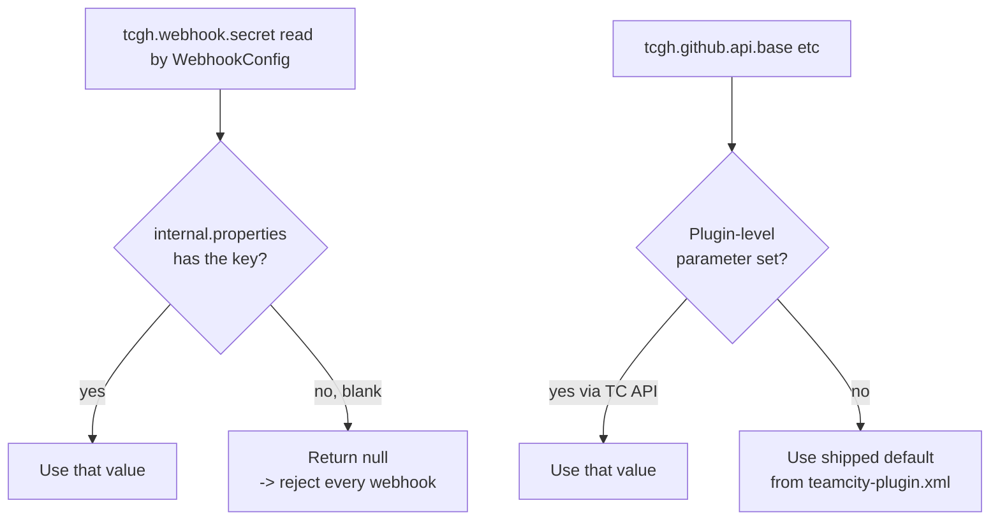

# Configuration reference

Every knob the plugin exposes, in one page.

## Configuration surfaces

```
+-----------------------------------------------------------+
| 1. Plugin-level defaults                                  |
|    -> teamcity-plugin.xml (shipped, edit only to rebuild) |
+-----------------------------------------------------------+
| 2. Server-wide internal properties                        |
|    -> <TC_DATA_DIR>/config/internal.properties            |
|    -> hot-reloaded, no restart needed                     |
+-----------------------------------------------------------+
| 3. Per-buildType parameters                               |
|    -> BuildType -> Parameters                             |
|    -> instant effect                                      |
+-----------------------------------------------------------+
```

## 1. Plugin-level defaults (shipped)

Declared in `src/main/resources/teamcity-plugin.xml`. You override
them by setting an internal property with the same name (option 2
below) - the plugin reads the property first, then falls back to
this default.

| Parameter | Default | Purpose |
|---|---|---|
| `tcgh.github.api.base` | `https://api.github.com` | Override for GitHub Enterprise. |
| `tcgh.github.api.version` | `2022-11-28` | The `X-GitHub-Api-Version` header value sent on REST calls. |
| `tcgh.prinfo.cache.ttl.seconds` | `60` | TTL for the in-memory PR info cache. |
| `tcgh.webhook.path` | `/app/teamcity-github-bridge/webhook` | The endpoint path. Changing this also affects what `/info` returns. |

## 2. Server-wide internal properties

Set in `<TC_DATA_DIR>/config/internal.properties`. Hot-reloaded.

| Property | Default | Required | Purpose |
|---|---|---|---|
| `tcgh.webhook.secret` | _unset_ | **yes** | HMAC secret used to verify webhook signatures. Without this, every request is rejected with 401. |
| `tcgh.github.api.base` | (plugin default) | no | Override for GitHub Enterprise; e.g. `https://github.acme.com/api/v3`. |
| `tcgh.prinfo.cache.ttl.seconds` | `60` | no | Increase if you hit GitHub rate limits; decrease for tighter loops. |

Example `internal.properties` entry:

```properties
# tcgh-bridge: HMAC secret for the App-level webhook
tcgh.webhook.secret=0a4f0c9b5e8e3c1d2a4b6c8d9e0f1a2b3c4d5e6f7a8b9c0d
```

## 3. Per-buildType parameters

The bridge is opt-in: a build configuration is affected only if it
declares all three parameters. This avoids touching unrelated build
types.

| Parameter | Required | Example | Purpose |
|---|---|---|---|
| `tcgh.ignoreDrafts` | yes | `true` | Setting to `"true"` enables draft suppression and inclusion in the ready-for-review retrigger. |
| `tcgh.github.repo` | yes | `Silmaen/Owl` | The `owner/name` slug as GitHub reports it in `repository.full_name`. |
| `tcgh.github.connectionId` | yes | `PROJECT_EXT_42` | The TeamCity GitHub App connection ID resolved by `OAuthConnectionsManager`. Visible in the URL of the project's Connections page. |

### How to set them

#### Via the UI

`Edit Configuration -> Parameters -> Add new parameter`. Pick
`Configuration parameter` (not env var, not system property).

#### Via a template (recommended for many build types)

Put them on a parent template and the children inherit:

```
+------------------------------------------------+
| Template: GitHubAwarePR                        |
|   parameters:                                  |
|     tcgh.ignoreDrafts        = true            |
|     tcgh.github.repo         = Silmaen/Owl     |
|     tcgh.github.connectionId = PROJECT_EXT_42  |
+------------------------------------------------+
          |
          v inherits
+------------------------------------------------+
| BuildType: Build_LinuxX64_Clang                |
| BuildType: Build_LinuxX64_Gcc                  |
| BuildType: Build_WindowsX64_Clang              |
+------------------------------------------------+
```

#### Via Kotlin DSL

```kotlin
object GitHubAwarePR : Template({
    id("GitHubAwarePR")
    name = "GitHub-aware PR template"
    params {
        param("tcgh.ignoreDrafts", "true")
        param("tcgh.github.repo", "Silmaen/Owl")
        param("tcgh.github.connectionId", "PROJECT_EXT_42")
    }
})
```

### Enable on a build configuration

1. Pick a build configuration that runs on PR refs (`+:refs/pull/*/head`
   or similar in its VCS root branchSpec).
2. Add the three parameters above.
3. Save. The next queued build hits the plugin's
   `StartBuildPrecondition`; if the PR is draft, the build is held
   with a wait reason `"PR #N is draft and tcgh.ignoreDrafts is enabled"`.

There is **no UI badge** indicating the plugin is active on a build
type. The presence of the three parameters is the sole signal.
Future versions may add a Build Feature for clearer UX; tracked in
[development.md#roadmap](development.md#roadmap).

## Parameter precedence



Notes:
- Internal properties win over plugin-level parameters when both
  are set.
- Per-buildType parameters do not override server-wide settings; they
  configure which builds participate.

## Logging tuning

The plugin uses IntelliJ openapi `Logger` which delegates to log4j
when running inside TeamCity. To turn on debug logging:

```xml
<!-- <TC_DATA_DIR>/config/teamcity-server-log4j.xml -->
<logger name="io.github.dlachouette.teamcity.github" additivity="false">
    <level value="DEBUG"/>
    <appender-ref ref="ROLL"/>
</logger>
```

Reload via `Administration -> Diagnostics -> Logging` or restart.

## Validation

The plugin does not actively validate the parameters at save time
(no UI hook yet). What it does:

- **`tcgh.github.repo` malformed** -> `RepoCoords.parse` throws
  `IllegalArgumentException`, caught and logged. The build is
  allowed to proceed (fail-open).
- **`tcgh.github.connectionId` not found** -> `TokenResolver`
  returns null, logged as warning. Build proceeds (fail-open).
- **`tcgh.ignoreDrafts` value other than `"true"`** -> treated as
  disabled. No error.

To validate without queuing a build, watch the server log while you
manually trigger a `ping` from the GitHub App settings.

## Next

- See it in action: [usage-scenarios.md](usage-scenarios.md).
- What to do when something looks wrong: [troubleshooting.md](troubleshooting.md).
