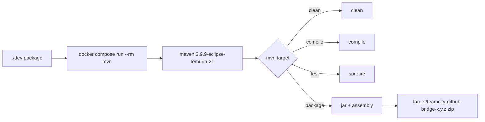

# Developer guide

Everything you need to contribute to the plugin, or to fork it and
add a feature.

## What you need on the host

| Tool | Version | Why |
|---|---|---|
| `docker` (with Compose plugin) | recent | Builds, tests, and packaging run inside the official `maven:3.9.9-eclipse-temurin-21` image. Nothing else is required. |
| `git` | any | Source control. |
| A code editor or IDE | optional | IntelliJ IDEA Community is the closest match; see [IDE setup](#ide-setup) below. |

You do **not** need:
- A local JDK (it lives in the container).
- A local Maven (same).
- A TeamCity install to compile or run tests (only to validate end-to-end).

## Project layout

```
teamcity-github/
+-- README.md                     # landing page
+-- LICENSE                       # Apache 2.0
+-- pom.xml                       # Maven config (Kotlin 1.9.25, JDK 21, TC SDK 2026.1)
+-- docker-compose.yml            # `mvn` service definition
+-- dev                           # bash wrapper around docker compose
+-- .dockerignore
+-- .gitignore
+-- .cache/                       # Maven local repo + HOME, git-ignored
+-- doc/
|   +-- *.md                      # human + AI-facing documentation
|   +-- historical/               # early design transfer documents (kept for context)
+-- src/
    +-- main/
    |   +-- assembly/plugin.xml   # builds the plugin.zip layout
    |   +-- resources/
    |   |   +-- teamcity-plugin.xml                       # plugin descriptor
    |   |   +-- META-INF/build-server-plugin-teamcity-github-bridge.xml  # Spring DI
    |   |   +-- teamcity-github-bridge-log4j-snippet.xml  # log4j fragment for ops
    |   |   +-- buildServerResources/
    |   |       +-- admin/bridgeAdmin.jsp                   # admin/help page
    |   |       +-- display/bridgeBranchEnrichment.jsp      # draft/ready pill CSS+JS
    |   +-- kotlin/io/github/dlachouette/teamcity/github/
    |       +-- TeamCityGitHubBridgePlugin.kt
    |       +-- api/        # GitHubClient, TokenResolver, AppTokenMinter, RsaKeyParser, AppTokenCache, DTOs (PrInfo, RepoCoords, CheckRunRequest, etc.)
    |       +-- cache/      # PrInfoCache (TTL-based)
    |       +-- config/     # WebhookConfig, PluginSettingsStorage, PluginLogConfigurator, LogPathResolver, BridgeServerSettings
    |       +-- enrich/     # PrBuildEnricher (buildStarted), PrPromotionTagger (queue tag)
    |       +-- feature/    # GitHubBridgeBuildFeature (opt-in Build Feature)
    |       +-- filter/     # DraftAwareBuildFilter (StartBuildPrecondition)
    |       +-- parameters/ # PrParameterProvider (publishes teamcity.github.bridge.isdraft)
    |       +-- queue/      # DraftBuildQueueCleaner (drops queued draft PR builds)
    |       +-- report/     # DraftCheckRunReporter, BuildStatusCheckRunPublisher, PrSummaryCommenter
    |       +-- retrigger/  # PullRequestEventListener (opened/ready_for_review/synchronize/closed + review/comment/re-run)
    |       +-- selftest/   # PluginSelfTester (admin self-test battery)
    |       +-- web/        # ~12 controllers/pages: PluginWebhookController, WebhookInfoController, HealthController,
    |                       #   MetricsController, ApiController, AdminConsolePage, AdminSettingsController, AdminTestController,
    |                       #   BridgeProjectSettingsTab/Controller, BranchEnrichmentPageExtension, plus SignatureVerifier,
    |                       #   WebhookPayloadParser, DeliveryReplayGuard, RecentEventsLog, BridgeMetrics, RequestUrlBuilder
    +-- test/kotlin/io/github/dlachouette/teamcity/github/
        +-- api/  cache/  config/  enrich/  feature/  filter/
        +-- parameters/  queue/  report/  retrigger/  selftest/  web/  testsupport/
```

For the per-class breakdown and the Spring DI wiring, see
[architecture.md](architecture.md) - it is the current source of truth
for the package layout.

## The Docker-only workflow



Everything goes through `./dev`:

```bash
./dev help              # show all commands
./dev compile           # mvn compile
./dev test              # mvn test
./dev package           # mvn clean package (produces the zip)
./dev mvn <args>        # any mvn invocation
./dev shell             # interactive bash in the container
./dev pull              # refresh the maven image
./dev reset-cache       # nuke .cache/m2 (force re-download)
```

The Maven local repository lives in `.cache/m2/` (project-scoped,
git-ignored). The `HOME` directory of the container user is
`.cache/home/`. Neither pollutes your host.

## Build internals

`pom.xml` does three things in `package`:
1. **Kotlin compile** via `kotlin-maven-plugin` (1.9.25, jvmTarget 21).
2. **JAR** via `maven-jar-plugin`.
3. **Plugin ZIP** via `maven-assembly-plugin`, controlled by
   `src/main/assembly/plugin.xml`, which lays out the directory
   structure TeamCity expects.

To inspect the ZIP without unpacking it:

```bash
unzip -l target/teamcity-github-bridge-*.zip
```

Expected entries: `teamcity-plugin.xml` at the root and
`server/*.jar` for the code + bundled runtime.

## Running the tests

```bash
./dev test
```

Surefire 3.x picks up JUnit 5 automatically. 180+ unit tests
covering the pure logic; a representative sample:

| Class | What it tests |
|---|---|
| `RepoCoordsTest` | Parser for the `owner/name` slug. |
| `GitHubClientParsingTest` | Jackson parsing of PR JSON. |
| `CheckRunPayloadTest` | JSON encoding of Check Run requests, status / conclusion handling, `details_url`. |
| `WebhookPayloadParserTest` | Jackson parsing of webhook payloads. |
| `SignatureVerifierTest` | HMAC verification, including the GitHub-published vector and constant-time comparison. |
| `PrInfoCacheTest` | TTL, invalidation, fallback on fetch failure. |
| `RecentEventsLogTest` | Ring buffer capacity, FIFO eviction, thread safety. |
| `PrBuildEnricherTest` | Pure helper that computes build number + tag enrichment from PR info. |
| `PrPromotionTaggerTest` | Pure helper that computes the draft/ready tag plan on the promotion. |
| `DraftCheckRunReporterTest` | Pure helper that decides whether to emit a Check Run + the shape of the request. |
| `BuildStatusCheckRunPublisherTest` | TC `Status` -> GitHub Check Run conclusion mapping, summary truncation, `isOptedIn`. |
| `PrParameterProviderTest` | Pure helper that maps branch + PR draft state to the `teamcity.github.bridge.isdraft` value. |
| `PluginSettingsStorageTest` | Atomic read/write round-trips for the plugin's properties file. |

### The `LoggerBootstrap` indirection

The IntelliJ openapi `Logger.getInstance(...)` returns `null` when
no `Logger.Factory` is set, which is the case in a vanilla JVM.
TeamCity sets a factory at startup; tests don't run inside
TeamCity.

Therefore every test class that loads a plugin class with a
`private val LOG = Logger.getInstance(...)` static must call:

```kotlin
class MyTest {
    init { LoggerBootstrap.install() }
}
```

This installs `DefaultLogger` as the factory. Forgetting it leads
to `NoClassDefFound: Could not initialize class ...` which is
opaque; the `init { ... }` is one line and idempotent.

## Adding a new bean

1. Write the class in the right package under
   `src/main/kotlin/.../teamcity/github/`.
2. Declare it in `build-server-plugin-teamcity-github-bridge.xml`:
   ```xml
   <bean class="io.github.dlachouette.teamcity.github.<pkg>.MyBean"/>
   ```
3. Use constructor injection - the Spring config uses
   `default-autowire="constructor"`. TC and our own beans are
   resolved automatically.

Example skeleton:

```kotlin
package io.github.dlachouette.teamcity.github.somefeature

import com.intellij.openapi.diagnostic.Logger

class MyBean(
    private val collaborator: SomeCollaborator,
) {
    fun doSomething() {
        LOG.info("doing something")
    }

    companion object {
        private val LOG = Logger.getInstance(MyBean::class.java.name)
    }
}
```

## Adding a new test

```kotlin
package io.github.dlachouette.teamcity.github.somefeature

import io.github.dlachouette.teamcity.github.testsupport.LoggerBootstrap
import org.junit.jupiter.api.Assertions.*
import org.junit.jupiter.api.Test

class MyBeanTest {
    init { LoggerBootstrap.install() }   // required if MyBean uses Logger

    @Test
    fun `the happy path`() {
        // arrange, act, assert
    }
}
```

Run with `./dev test`. The wrapper logs the exact mvn command.

## Code style

- Kotlin, idiomatic.
- Constructor-only injection.
- No `lateinit`. No `var` properties unless they are pure caches
  (e.g. `PrInfoCache.ttlMs`, `PrInfoCache.clock` are vars only to
  support test injection).
- Logging: `Logger.getInstance(MyClass::class.java.name)` in a
  companion object. Never log secrets, tokens, or the App private
  key.
- Comments: only when the **why** is non-obvious. Don't restate the
  code. Don't reference issue numbers; PR descriptions are for
  that.
- Tests: `@Test` methods named with backticked sentences,
  arrange/act/assert structure.

## Working without a running TeamCity

You can iterate on parser logic, signature verification, and cache
behaviour entirely with the unit tests. For anything that touches
the TC SDK at runtime (e.g. `BuildTypeEx.addToQueue`), there is no
substitute for installing the zip on a real TC instance.

For SDK signature questions, inspect the bytecode:

```bash
./dev shell
# inside the container
cd .cache/m2
find . -name "*-2026.1.jar" | xargs -I {} unzip -l {} | grep TheClassYouNeed
unzip -j /workspace/.cache/m2/org/jetbrains/teamcity/server-openapi/2026.1/server-openapi-2026.1.jar 'jetbrains/buildServer/serverSide/SBuildType.class' -d /tmp
javap /tmp/SBuildType.class
```

## Releasing

The current release process is manual.

1. Bump versions in three places:
   - `pom.xml` `<version>`
   - `src/main/resources/teamcity-plugin.xml` `<version>`
   - `README.md` status section if needed
2. `./dev package`
3. Smoke-test on a non-prod TC.
4. Tag: `git tag v<x.y.z> && git push --tags`.
5. Attach the zip to a GitHub Release.

A CI workflow that does this on tag push is planned (see roadmap).

## Roadmap

See [roadmap.md](roadmap.md) for the current roadmap.

## Conventions for contributors

- One feature per PR. Keep diffs small and reviewable.
- Tests required for pure-logic changes (parsers, verifiers, cache).
- For SDK-touching changes, include the `javap` output that
  motivated the signature choice in the PR description.
- No new dependencies without a one-line justification. Jackson is
  in; pulling in something heavier needs a discussion.
- Update the relevant doc page (`doc/*.md`) in the same PR. The
  README's "Status" section is updated at release time only.

## Pointer to historical context

Early design notes from the first integration of this plugin live
under [`historical/`](historical/). They cover the original SDK
exploration, the trapdoors hit at the time, and the rationale
behind some still-load-bearing decisions. Useful when you wonder
"why did they design it this way"; not maintained as current
documentation.
