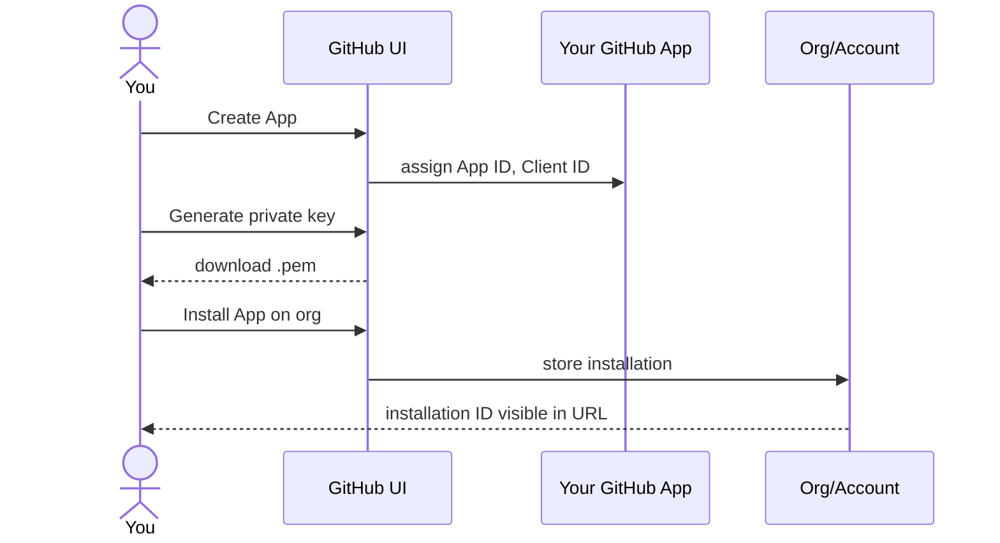

# GitHub App setup

This page walks through creating a GitHub App that this plugin can
talk to. There are two ways to do it: let the plugin create a
pre-configured App for you (**Option A**, recommended), or create it
manually and wire a TeamCity connection (**Option B**). See
[Two ways to get the App](#two-ways-to-get-the-app).

## Why a GitHub App and not a PAT

| | Personal Access Token (PAT) — **avoid in CI** | GitHub App — **what this plugin uses** |
|---|---|---|
| Identity | Tied to a person | Tied to a service |
| Credential lifetime | Long-lived secret | 1 h installation tokens, refreshed automatically |
| Staff turnover | The person leaves → token revoked → CI breaks | Survives turnover |
| Permissions | The same scopes as the person | Scoped to what the App declares |
| Auditability | Hard to audit | Its own audit-log entries |

The plugin assumes **GitHub App authentication only**. No PAT, no
per-user OAuth tokens. This is a deliberate constraint to keep the
trust model simple.

## Two ways to get the App

- **Option A — let the plugin create it for you (recommended, v1.7.0+).**
  The admin page builds a pre-configured App manifest (correct webhook
  URL, exact permissions, exact events), GitHub shows you a confirmation
  screen, and on create the plugin stores the credentials for you. You
  then install it and point build configs at the sentinel
  `connectionId=managed`. No TeamCity connection, no `.pem` to handle by
  hand. Jump to [Option A](#option-a-let-the-plugin-create-the-app-for-you-recommended).
- **Option B — create the App manually and wire a TeamCity connection.**
  The classic flow: create the App on GitHub yourself, grant
  permissions, generate a private key, and register a TeamCity GitHub
  App connection whose ID you reference per build type. Jump to
  [Option B](#option-b-create-the-app-manually).

The two options are mutually exclusive per build configuration: a build
type either references `connectionId=managed` (Option A) or a TeamCity
connection ID like `PROJECT_EXT_42` (Option B).

## Option A: let the plugin create the App for you (recommended)

Available since v1.7.0. The plugin uses GitHub's
[App-manifest creation flow](https://docs.github.com/en/apps/sharing-github-apps/registering-a-github-app-from-a-manifest)
to register a fully pre-configured App in a few clicks. This is the
recommended path — for the fastest end-to-end walkthrough see the
[quickstart](quickstart.md).

### A.1 Start the creation flow

1. Go to `Administration -> Server Administration -> GitHub Bridge`.
2. Find the **GitHub App** card. When no managed App exists yet it shows
   a **Create GitHub App** button and an optional **GitHub
   organisation** field.
3. Leave the org field blank for a personal App, or type an org slug
   (e.g. `my-org`) to create an org-owned App.
4. Click **Create GitHub App**.

Under the hood the plugin builds an App manifest pre-filled with:

- `name` — the App name.
- `url` / `redirect_url` — the plugin callback on this server.
- `hook_attributes.url` — **this server's webhook URL** (the same value
  shown under *Plugin status -> Webhook URL*), `active: true`.
- `public: false` — a private App.
- `default_permissions`:

  | Permission | Level |
  |---|---|
  | `metadata` | `read` |
  | `checks` | `write` |
  | `pull_requests` | `read` |
  | `contents` | `read` |

  > `pull_requests` is **read** as of v1.10.0. The plugin's only write is
  > the Check Run lifecycle, which is the `checks` permission; write on
  > pull requests was needed by the sticky summary comment, and that was
  > removed. An installation that granted write can revoke it.

- `default_events`: `pull_request`, `pull_request_review`,
  `pull_request_review_comment`, `check_run`, `check_suite`.

  > Conversation-comment triggers (the `issue_comment` event) are
  > **opt-in**: GitHub only delivers `issue_comment` when the App holds
  > the **Issues** permission, which the manifest deliberately does not
  > request. Comment triggers fire on inline PR review comments
  > (`pull_request_review_comment`) out of the box; to also trigger from
  > general PR conversation comments, add the Issues permission and
  > subscribe to `issue_comment` manually.

The form POSTs the manifest to
`https://github.com/settings/apps/new?state=<random>` (or
`https://github.com/organizations/<org>/settings/apps/new?state=<random>`
when an org is given), carrying a random `state` the plugin seeded into
your admin session.

### A.2 Confirm on GitHub

GitHub shows a confirmation screen listing the App name, permissions and
events from the manifest. Review and confirm. GitHub then creates the
App and redirects your browser back to the plugin callback:

```
GET /app/teamcity-github-bridge/app-callback?code=<one-time-code>&state=<random>
```

The callback requires a logged-in admin (`CHANGE_SERVER_SETTINGS`) and
validates the returned `state` against the one in your session (CSRF
defence). It then exchanges the one-time `code` via
`POST /app-manifests/{code}/conversions` and stores into the plugin
settings file, automatically:

- the **App ID** (`app.id`),
- the **private key** (PEM, `app.privateKey`),
- the **App slug** (`app.slug`),
- the **webhook secret** GitHub generated (`webhook.secret`).

You never handle the `.pem` by hand. On success the admin page shows a
green *managed App configured* banner with the App slug.

### A.3 Install the App

Creating an App does **not** install it on any repository. From the
GitHub App card click **Install / manage installations** (deep-links to
`https://github.com/apps/<slug>/installations/new`):

1. Choose the account/org that owns your repos.
2. Pick `All repositories` or `Only select repositories`.
3. Confirm the install.

### A.4 Point build configurations at the managed App

Instead of a TeamCity connection ID, set the sentinel value on each
opted-in build type's `connectionId` (or on a parent project / template):

```
teamcity.github.bridge.connectionId = managed
```

`TokenResolver` then mints installation tokens directly from the stored
App credentials. The REST API base comes from the **API base override**
setting (`api.base`) when set, otherwise `api.github.com` — so for
GitHub Enterprise you must set `api.base` to `<host>/api/v3`.

### A.5 Verify

On the GitHub App card click **Verify App configuration**. The plugin
authenticates as the App (App JWT), calls `GET /app`, and diffs the
App's *live* permissions and subscribed events against what the plugin
requires (the table in [A.1](#a1-start-the-creation-flow)). It reports
any missing permissions/events. The card also deep-links to:

- `https://github.com/settings/apps/<slug>` — *Open App settings on
  GitHub* (to add a missing permission/event), and
- `https://github.com/apps/<slug>/installations/new` — *Install / manage
  installations*.

> If verify reports missing permissions after you add them on GitHub,
> remember installed Apps must also have the new permissions accepted by
> the installer (`Settings -> Applications -> Configure -> Accept new
> permissions`).

That is the whole flow: **create -> confirm on GitHub -> credentials
auto-stored -> install -> set `connectionId=managed` -> verify**. You do
not need the manual steps below or a TeamCity connection.

## Option B: create the App manually

If you prefer to register the App yourself (or already have one for the
bundled `commitStatusPublisher`), follow the steps below. You can reuse
an existing App — just verify the permissions and skip to
[Step 5](#step-5-create-the-teamcity-connection).

## Step 1: create the App

1. Go to `https://github.com/settings/apps/new`
   (or for organization-owned apps:
   `https://github.com/organizations/<org>/settings/apps/new`).

2. Fill in:
   - **GitHub App name**: e.g. `teamcity-bridge-<team>`. Must be
     globally unique on github.com.
   - **Homepage URL**: your TeamCity URL is fine, e.g.
     `https://teamcity.example.com`.
   - **Callback URL**: not needed for the plugin (we never run the
     OAuth user flow). Leave default.
   - **Setup URL**: leave blank.
   - **Webhook URL**: leave blank for now - you'll set this in
     [webhook-setup.md](webhook-setup.md) once you have a secret.
   - **Webhook secret**: leave blank for now (same reason).

3. Permissions - request only what is needed. See the table below.

## Step 2: grant the right permissions

Grant exactly the canonical set the plugin requires (the same set
the Option A manifest requests):

| Resource | Access | Why the plugin needs it |
|---|---|---|
| **Metadata** | Read | Mandatory baseline (GitHub Apps always need this) |
| **Checks** | Write | Post Check Runs with rich state |
| **Pull requests** | Read | `GET /repos/{owner}/{repo}/pulls/{N}` for the draft status, and the commit-to-PR lookup. **Read is enough**: the plugin's only write is the Check Run lifecycle, which is the *Checks* permission. |
| **Contents** | Read | Required transitively for repository visibility |

Do **not** grant **Commit statuses** or **Webhooks** — this plugin
does not need them. (TeamCity's bundled `commitStatusPublisher` /
connection-test flow may ask for them; those are for coexistence
only, not required by this plugin.)

Subscribe to events (you can add these now or wait until
[webhook-setup.md](webhook-setup.md)). The plugin consumes:

- [x] Pull request
- [x] Pull request review
- [x] Pull request review comment
- [x] Check run
- [x] Meta (recommended - notifies on App config changes; `ping` is
      automatic)

You may also subscribe to **Push** and **Check suite**, but only for
coexistence with the bundled plugins / future use — this plugin does
not consume them today.

> **Issue comment is opt-in.** GitHub only exposes the **Issue comment**
> event when the App has the **Issues** permission, which this plugin
> deliberately does not request (it stays scoped to pull requests, not
> issues). Comment triggers work on inline PR review comments
> (`pull_request_review_comment`) without it. To also trigger from
> general PR conversation comments, add the **Issues** permission and
> subscribe to **Issue comment** yourself.

## Step 3: generate a private key

After creating the App, scroll to `Private keys -> Generate a private
key`. A `.pem` file downloads.

> Treat this file like an SSH private key. Anyone with it can act as
> your App on every installed repo. Store it in a password manager
> or a secrets vault.

## Step 4: install the App on repositories

GitHub Apps are installed per-account or per-organization, then
restricted to specific repositories.

1. From your App's page, click `Install App` (left sidebar).
2. Choose the account/org that owns the repos.
3. Pick `All repositories` or `Only select repositories`. Per-repo
   selection is more conservative; you can extend later.
4. Confirm the install. GitHub assigns an **Installation ID** that
   you can see in the URL of the install page: `.../installations/<ID>`.



## Step 5: create the TeamCity connection

In TeamCity:

1. Go to the project that should host the connection (typically the
   root project for org-wide access).
2. `Connections -> Add Connection -> GitHub App`.
3. Fill in:
   - **Display name**: e.g. `GitHub App (teamcity-bridge)`
   - **GitHub URL**: `https://github.com` (or your Enterprise base)
   - **App ID**: from the App's "About" page
   - **Client ID**: from the App's "About" page
   - **Client secret**: from the App's "About" page (generate one
     if none exists - the plugin does not use the secret directly,
     but TeamCity requires it for the connection schema)
   - **Private key**: paste the contents of the `.pem` file
   - **Webhook secret**: leave blank for now
4. Save. TeamCity validates the credentials by issuing a test
   installation token.

After save, the connection has an ID visible in the URL:
`.../admin/editProject.html?projectId=...&tab=oauthConnections&editingConnection=PROJECT_EXT_<n>`.
This `PROJECT_EXT_<n>` value is what you'll paste as
`teamcity.github.bridge.connectionId` on each opted-in build type.

What the *Connections* section of project `MyTeam` then shows — the **ID** is
the value to copy:

| Connection | Type | ID | Status |
|---|---|---|---|
| GitHub App (teamcity-bridge) | GitHub App | `PROJECT_EXT_42` | Connected |

## Warnings you may see during `Test connection`

TeamCity exercises every feature its bundled GitHub integration is
able to use, not just what this plugin needs. The result is a list
of warnings that look alarming but are mostly informational. The
connection still saves and works for this plugin's purposes.

### `Test webhook event wasn't received`

TeamCity attempted to send a ping to the webhook configured on the
App and timed out waiting. This is expected on a fresh App: you
have not yet configured a webhook URL or a secret.

**Action**: ignore for now. Come back to it after following
[webhook-setup.md](webhook-setup.md). Re-running `Test connection`
once the webhook is configured against
`https://<TC>/app/teamcity-github-bridge/webhook` will clear the
warning.

### `Permission "Repository - Contents" requires write access`

Needed by the bundled features **labelling pull requests** and
**branch merging** from inside TeamCity. This plugin only ever
issues `GET /repos/.../pulls/N`, so **Read** is sufficient.

**Action**: leave at Read. The two bundled features will be
disabled; if you do not use them today, you lose nothing.

### `Permission "Account - Email addresses" requires read access`

Needed only to **authenticate TeamCity users via their GitHub
account** (the OAuth user flow). This plugin uses the GitHub App
itself, not per-user OAuth, so the permission is irrelevant.

**Action**: skip unless your operators want TC SSO via GitHub.

### `Permission "Organization - Members" requires read access`

Same logic as the previous one: only used to **restrict TC SSO**
to members of specific organisations.

**Action**: skip unless you also want TC SSO via GitHub.

### `Webhook is not configured to trigger all supported events: [push, pull_request, check_suite, check_run]`

TeamCity lists every event it can consume across all its bundled
GitHub features. The breakdown:

| Event                       | Consumer                                                       |
| --------------------------- | -------------------------------------------------------------- |
| `pull_request`              | **this plugin** (draft/ready-for-review detection)             |
| `push`                      | the bundled `teamcity-commit-hooks` plugin (per-repo webhooks) |
| `check_suite`, `check_run`  | the bundled `commitStatusPublisher` plugin                     |

**Action**: at minimum tick `pull_request` for this plugin. Add
`push` and `check_suite` if you also want the bundled plugins to
keep working alongside the bridge.

## Step 6: verify the connection works

The simplest check is to look at the connection page. If TeamCity
shows `Status: Connected` and `Installations: <count>`, the
App-to-TC handshake is fine.

For a deeper check, attempt to retrieve an installation token via
the TeamCity admin UI:

1. `Project -> Connections -> <your-connection> -> Refresh token`
2. TeamCity asks GitHub for a new installation token.
3. On success, the page shows `Token refreshed at <timestamp>`.

> If you see `403 Resource not accessible by integration`, the App
> is missing a permission. Add it on the App page, then in GitHub
> visit `Settings -> Applications -> Configure -> Accept new
> permissions`.

## Next step

You have an App and a TeamCity connection (Option B) or a managed App
(Option A). Now wire up the webhook so GitHub can notify TeamCity about
events: continue with [webhook-setup.md](webhook-setup.md).

> For an **Option A** managed App the webhook URL and secret were set
> automatically from the manifest, so the webhook is already configured —
> you only need to make sure the App is installed on your repositories.
