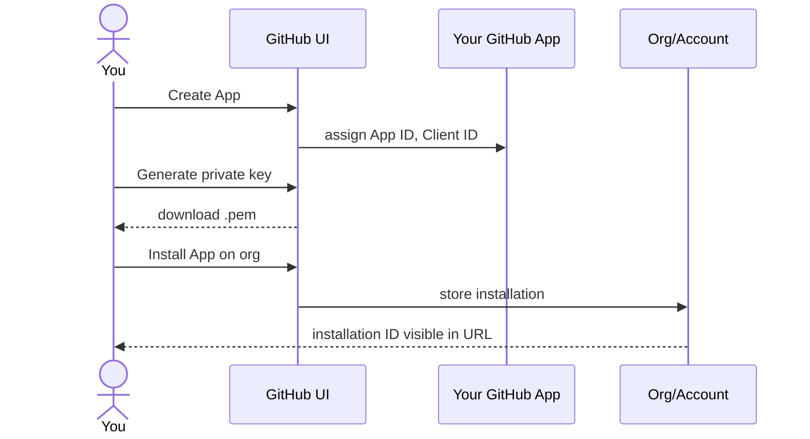

# GitHub App setup

This page walks through creating a GitHub App that this plugin can
talk to. If you already have one (for the bundled
`commitStatusPublisher`, for instance), you can reuse it - just
verify the permissions and skip to [Step 5](#step-5-create-the-teamcity-connection).

## Why a GitHub App and not a PAT

```
+-----------------------+        +-----------------------+
|   Personal Access     |        |     GitHub App        |
|   Token (PAT)         |        |   (this plugin)       |
+-----------------------+        +-----------------------+
|  - Tied to a person   |        |  - Tied to a service  |
|  - Long-lived secret  |        |  - 1h installation    |
|  - User can leave the |        |    tokens, refreshed  |
|    company -> token   |        |    automatically      |
|    revoked, CI breaks |        |  - Survives staff     |
|  - Same scopes as the |        |    turnover           |
|    person             |        |  - Scoped permissions |
|  - Hard to audit      |        |  - Audit log entries  |
+-----------------------+        +-----------------------+
              !                              v
        avoid in CI                    use this
```

The plugin assumes **GitHub App authentication only**. No PAT, no
per-user OAuth tokens. This is a deliberate constraint to keep the
trust model simple.

## Step 1: create the App

1. Go to `https://github.com/settings/apps/new`
   (or for organization-owned apps:
   `https://github.com/organizations/<org>/settings/apps/new`).

2. Fill in:
   - **GitHub App name**: e.g. `teamcity-bridge-<team>`. Must be
     globally unique on github.com.
   - **Homepage URL**: your TeamCity URL is fine, e.g.
     `https://teamcity.example.com`.
   - **Callback URL**: not needed for the plugin (we never run the
     OAuth user flow). Leave default.
   - **Setup URL**: leave blank.
   - **Webhook URL**: leave blank for now - you'll set this in
     [webhook-setup.md](webhook-setup.md) once you have a secret.
   - **Webhook secret**: leave blank for now (same reason).

3. Permissions - request only what is needed. See the table below.

## Step 2: grant the right permissions

| Resource | Access | Why the plugin needs it |
|---|---|---|
| **Pull requests** | Read | Query draft status via `GET /repos/{owner}/{repo}/pulls/{N}` |
| **Contents** | Read | Required transitively for repository visibility |
| **Metadata** | Read | Mandatory baseline (GitHub Apps always need this) |
| **Commit statuses** | Read & write | (Future) post enriched commit statuses |
| **Checks** | Read & write | (Future) post check runs with rich state |
| **Webhooks** | Read & write | Required so the plugin can read the App-level webhook config |

Subscribe to events (you can add these now or wait until
[webhook-setup.md](webhook-setup.md)):

- [x] Pull request
- [x] Pull request review (optional, for future review-state hooks)
- [x] Push (optional, future)
- [x] Check suite (optional, future)
- [x] Meta (recommended - notifies on App config changes)

## Step 3: generate a private key

After creating the App, scroll to `Private keys -> Generate a private
key`. A `.pem` file downloads.

> Treat this file like an SSH private key. Anyone with it can act as
> your App on every installed repo. Store it in a password manager
> or a secrets vault.

## Step 4: install the App on repositories

GitHub Apps are installed per-account or per-organization, then
restricted to specific repositories.

1. From your App's page, click `Install App` (left sidebar).
2. Choose the account/org that owns the repos.
3. Pick `All repositories` or `Only select repositories`. Per-repo
   selection is more conservative; you can extend later.
4. Confirm the install. GitHub assigns an **Installation ID** that
   you can see in the URL of the install page: `.../installations/<ID>`.



## Step 5: create the TeamCity connection

In TeamCity:

1. Go to the project that should host the connection (typically the
   root project for org-wide access).
2. `Connections -> Add Connection -> GitHub App`.
3. Fill in:
   - **Display name**: e.g. `GitHub App (teamcity-bridge)`
   - **GitHub URL**: `https://github.com` (or your Enterprise base)
   - **App ID**: from the App's "About" page
   - **Client ID**: from the App's "About" page
   - **Client secret**: from the App's "About" page (generate one
     if none exists - the plugin does not use the secret directly,
     but TeamCity requires it for the connection schema)
   - **Private key**: paste the contents of the `.pem` file
   - **Webhook secret**: leave blank for now
4. Save. TeamCity validates the credentials by issuing a test
   installation token.

After save, the connection has an ID visible in the URL:
`.../admin/editProject.html?projectId=...&tab=oauthConnections&editingConnection=PROJECT_EXT_<n>`.
This `PROJECT_EXT_<n>` value is what you'll paste as
`tcgh.github.connectionId` on each opted-in build type.

```
Project: MyTeam
  +------------------------------------------------+
  |  Connections                                   |
  |                                                |
  |  +------------------------------------------+  |
  |  |  GitHub App (teamcity-bridge)            |  |
  |  |  ID: PROJECT_EXT_42  <-- copy this       |  |
  |  |  Type: GitHub App                        |  |
  |  |  Status: Connected                       |  |
  |  +------------------------------------------+  |
  +------------------------------------------------+
```

## Warnings you may see during `Test connection`

TeamCity exercises every feature its bundled GitHub integration is
able to use, not just what this plugin needs. The result is a list
of warnings that look alarming but are mostly informational. The
connection still saves and works for this plugin's purposes.

### `Test webhook event wasn't received`

TeamCity attempted to send a ping to the webhook configured on the
App and timed out waiting. This is expected on a fresh App: you
have not yet configured a webhook URL or a secret.

**Action**: ignore for now. Come back to it after following
[webhook-setup.md](webhook-setup.md). Re-running `Test connection`
once the webhook is configured against
`https://<TC>/app/teamcity-github-bridge/webhook` will clear the
warning.

### `Permission "Repository - Contents" requires write access`

Needed by the bundled features **labelling pull requests** and
**branch merging** from inside TeamCity. This plugin only ever
issues `GET /repos/.../pulls/N`, so **Read** is sufficient.

**Action**: leave at Read. The two bundled features will be
disabled; if you do not use them today, you lose nothing.

### `Permission "Account - Email addresses" requires read access`

Needed only to **authenticate TeamCity users via their GitHub
account** (the OAuth user flow). This plugin uses the GitHub App
itself, not per-user OAuth, so the permission is irrelevant.

**Action**: skip unless your operators want TC SSO via GitHub.

### `Permission "Organization - Members" requires read access`

Same logic as the previous one: only used to **restrict TC SSO**
to members of specific organisations.

**Action**: skip unless you also want TC SSO via GitHub.

### `Webhook is not configured to trigger all supported events: [push, pull_request, check_suite, check_run]`

TeamCity lists every event it can consume across all its bundled
GitHub features. The breakdown:

| Event                       | Consumer                                                       |
| --------------------------- | -------------------------------------------------------------- |
| `pull_request`              | **this plugin** (draft/ready-for-review detection)             |
| `push`                      | the bundled `teamcity-commit-hooks` plugin (per-repo webhooks) |
| `check_suite`, `check_run`  | the bundled `commitStatusPublisher` plugin                     |

**Action**: at minimum tick `pull_request` for this plugin. Add
`push` and `check_suite` if you also want the bundled plugins to
keep working alongside the bridge.

## Step 6: verify the connection works

The simplest check is to look at the connection page. If TeamCity
shows `Status: Connected` and `Installations: <count>`, the
App-to-TC handshake is fine.

For a deeper check, attempt to retrieve an installation token via
the TeamCity admin UI:

1. `Project -> Connections -> <your-connection> -> Refresh token`
2. TeamCity asks GitHub for a new installation token.
3. On success, the page shows `Token refreshed at <timestamp>`.

> If you see `403 Resource not accessible by integration`, the App
> is missing a permission. Add it on the App page, then in GitHub
> visit `Settings -> Applications -> Configure -> Accept new
> permissions`.

## Next step

You have an App and a TeamCity connection. Now wire up the webhook
so GitHub can notify TeamCity about events: continue with
[webhook-setup.md](webhook-setup.md).
