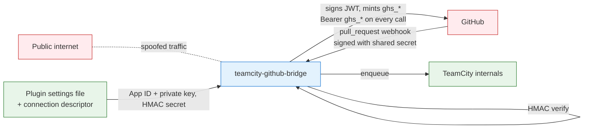
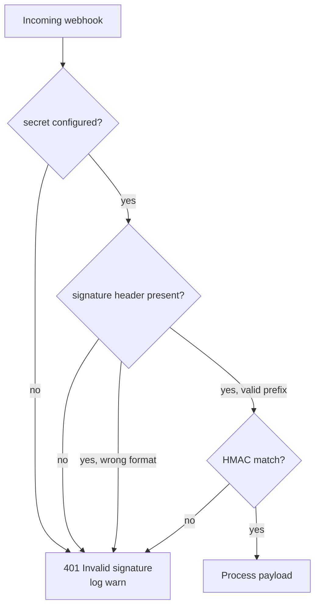
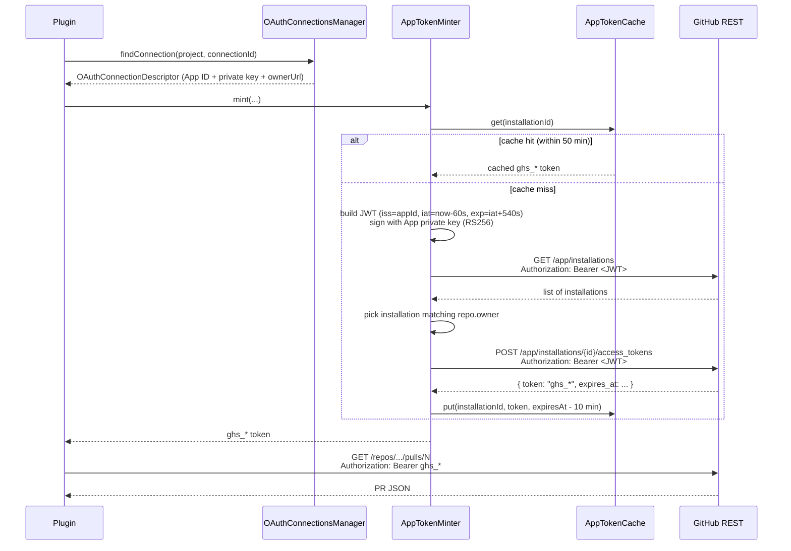

# Security model

Trust boundaries, authentication choices, and defaults that protect
the integration even when something is misconfigured.

## Trust boundaries at a glance



The plugin treats anything coming in from the network as untrusted
until proven otherwise. The proof is:
- For inbound webhooks: a valid HMAC-SHA256 signature over the raw
  body, using the shared secret stored in the plugin settings file
  `<TC_DATA_DIR>/config/teamcity-github-bridge.properties`
  (`internal.properties` remains a legacy fallback for the webhook
  secret only).
- For outbound API calls: the plugin reads the GitHub App's
  private key from the TC connection descriptor, signs a
  short-lived RS256 JWT as the App, and mints a 1-hour
  installation token via the GitHub REST API. The minted token
  is cached locally with a 50-minute TTL (safety margin under
  GitHub's 60-minute lifetime). The private key never leaves
  the TC server; only the minted `ghs_*` installation token
  reaches GitHub on subsequent REST calls.

## Inbound: webhook signature verification

GitHub signs every webhook delivery with HMAC-SHA256 using the
shared secret. The plugin computes the expected signature and
compares using a constant-time equality check (`SignatureVerifier`).

```
+-------------------+      raw body bytes      +-------------------+
|     GitHub        | -----------------------> |   PluginWebhook   |
|                   |                          |   Controller      |
|  computes:        |     X-Hub-Signature-256  |                   |
|  hmac_sha256(     | -----------------------> |   1. read body    |
|    secret,        |  sha256=<hex>            |   2. compute      |
|    raw_body)      |                          |      HMAC over    |
|                   |                          |      body         |
|                   |                          |   3. constant-    |
|                   |                          |      time compare |
+-------------------+                          +-------------------+
                                                        |
                                            +-----------+-----------+
                                            |                       |
                                       match: 200             mismatch: 401
                                       process payload         drop, log warn
```

Properties:
- **Algorithm**: HMAC-SHA256 with `Mac.getInstance("HmacSHA256")`,
  the JDK's stock implementation.
- **Encoding**: hex, lowercase. Header looks like
  `sha256=0123abcd...`.
- **Body bytes**: the verifier signs over the **raw bytes** of the
  request body, read once via `request.inputStream.readBytes()` to
  avoid any framework reformatting.
- **Comparison**: constant-time, length-prefixed; rejects mismatched
  lengths immediately.

### Anonymous registration (deliberate)

TeamCity protects every path under `/app/*` with built-in
authentication by default. The plugin's HTTP controllers explicitly
register their paths with
`AuthorizationInterceptor.addPathNotRequiringAuth(path)` to opt out
of that protection:

| Path | Anonymous because |
|---|---|
| `/app/teamcity-github-bridge/webhook` | GitHub does not send TeamCity credentials. HMAC-SHA256 over the body is the real auth. |
| `/app/teamcity-github-bridge/info` and `/info.md` | The response intentionally exposes no secrets - only `secretConfigured: true|false`, the public payload URL, the dedicated log path, and the plugin version. |

The **admin page** (`/admin/...?tab=bridgeAdmin`) is **not** anonymous.
It is registered through `AdminPage`, which inherits TeamCity's
standard admin authorisation filter. Only users with the relevant
permission see the page; the JSP template never renders secrets,
only the boolean `secretConfigured` and the path of the dedicated
log file.

Without the anonymous opt-out, GitHub deliveries would hit `401
Authentication required` from TeamCity's auth filter before any of
the plugin's code (including HMAC verification) could run.

### Fail-closed on the webhook



If the operator forgets to set `teamcity.github.bridge.webhook.secret`, every delivery
is rejected. The plugin loudly logs
`Webhook secret is not configured (...)` on every request, so the
misconfiguration is impossible to miss in the log.

The alternative - allowing unauthenticated webhooks when no secret
is set - is unsafe: anyone could `curl -X POST` the endpoint and
trigger arbitrary builds.

### What the verification does NOT do

- It does **not** validate the GitHub App ID. Any party with the
  shared secret can produce a valid signature. The secret is
  therefore as sensitive as a password and lives in the plugin
  settings file `<TC_DATA_DIR>/config/teamcity-github-bridge.properties`
  (`internal.properties` is a legacy fallback for the webhook secret
  only). Protect the file with filesystem permissions.
- It does **not** check the `X-GitHub-Hook-Installation-Target-Id`
  or `X-GitHub-Hook-ID` headers. Future versions may pin the App's
  installation IDs.
- It does **not** rate-limit. Behind a reverse proxy, configure
  rate limits there.

### Replay protection

A valid HMAC proves a payload was produced by a holder of the shared
secret, but it cannot distinguish the **original** delivery from a
**replay** of a captured one. `DeliveryReplayGuard` closes that gap:
every delivery carries an opaque `X-GitHub-Delivery` UUID, and the
plugin tracks the recently-seen ids in a bounded LRU.

```
signature OK ──> deliveryId seen within TTL?
                   │                    │
              yes (replay)          no (new)
                   │                    │
        200 "duplicate delivery     record id,
        ignored" — NOT re-processed  process normally
```

- **Order:** the signature is verified **first**; the replay check
  runs only on already-authenticated requests.
- **Acknowledged, not processed:** a replay returns `200 OK` (so
  GitHub does not interpret a 4xx as failure and keep retrying) but
  no build/Check Run side-effect runs. It is recorded in the recent
  events log as `SKIPPED` and counted under `webhooks.replayed`.
- **Bounds:** LRU of `DEFAULT_MAX_ENTRIES` (2000) ids, each with a
  24-hour TTL — an id older than the TTL is treated as new again,
  matching GitHub's own retry envelope. The structure is bounded so
  it cannot itself become a memory-growth vector.
- **Toggle:** enabled by default (`webhook.replay.enabled`); can be
  turned off from the admin page if an operator must replay
  deliveries deliberately.

### Payload size bound

The webhook endpoint is anonymous and the HMAC can only be computed
**after** the body bytes are in hand. An unbounded read would let an
attacker who can reach the endpoint exhaust server memory with a huge
body before authentication ever runs. The controller therefore caps
the body at **25 MB** (`MAX_PAYLOAD_BYTES`, GitHub's own documented
maximum) before signature verification:

- A declared `Content-Length` over the cap is rejected immediately.
- The body is streamed via a `readBounded` helper that aborts and
  rejects once the cap is crossed, so an over-large chunked body is
  never fully buffered.
- Either case returns `413 Payload Too Large`, logs a warning, and
  increments `webhooks.too_large`.

This mitigates an unauthenticated memory-exhaustion vector on the one
endpoint that must stay anonymous.

## Outbound: GitHub App installation tokens

The plugin authenticates outbound REST calls with bearer tokens
issued by the GitHub App. The plugin reads the App's private key
from the TC connection descriptor (the same place TeamCity stores
it), signs a JWT, and mints a 1-hour installation token via
GitHub's REST API. The private key never leaves the TC host.



### Token opacity

All token-handling code treats the string as opaque. There is no
length check, no substring, no prefix matching anywhere in the
codebase. This is verified by review and tested by the test suite
on round-tripped fixtures.

Why this matters: in 2026, GitHub introduced a new stateless
installation token format. Tokens may be ~520 characters and start
with `ghs_`. Tools with hardcoded length expectations break. The
opt-in header `X-GitHub-Stateless-S2S-Token: enabled` belongs on
the issuance call - which TeamCity performs - and is therefore
transparent to the plugin.

See the commented contract at the top of `api/TokenResolver.kt`.

### Token storage

| Where | What | Lifetime |
|---|---|---|
| GitHub App settings | App private key (.pem) | persistent, rotate annually |
| TeamCity `<connection>` config | App ID, Client ID, Client Secret, private key, optionally webhook secret | persistent, encrypted in TC config |
| Plugin settings file (managed App) | Managed App ID, private key (PEM), slug, webhook secret — only when an App was created via the manifest flow | persistent, plain text in `<TC_DATA_DIR>/config/teamcity-github-bridge.properties` (same trust level as the webhook secret) |
| Plugin memory (`AppTokenCache`) | Installation access tokens, keyed by installation ID | 50 minutes (GitHub-side lifetime is 60 min; we keep a 10 min safety margin) |
| Plugin memory (`PrInfoCache`) | PR JSON snippets (number, title, author, draft, ...) | 60 seconds |
| Plugin memory (during request) | Access token in `String` | discarded at end of call |

The plugin never writes tokens to disk, never logs them at any
level, and never includes them in error messages.

## External API: bearer-token authentication

The plugin exposes an authenticated HTTP API for external tooling
(`ApiController`) under `/app/teamcity-github-bridge/api/*`:

| Route | Method | Effect |
|---|---|---|
| `/api/status` | GET | JSON snapshot (versions, flags, allowlist) |
| `/api/events` | GET | recent webhook events |
| `/api/metrics` | GET | counter snapshot |
| `/api/trigger` | POST | **enqueues a build** (`buildTypeId`, `branch`) |

These paths are registered with
`addPathNotRequiringAuth` like the webhook — they do **not** use
TeamCity's session auth — so the plugin enforces its own bearer-token
check on every call:

- **Token source:** a single bearer token stored in plugin settings,
  set/cleared from its own admin form (`api.token`). It is held
  separately so a bulk settings save never clears it.
- **No token => API disabled:** if no token is configured,
  `isApiEnabled()` is false and every route returns
  `503 Service Unavailable`. The API is opt-in.
- **Constant-time compare:** the provided `Authorization: Bearer …`
  value is compared to the stored token with
  `MessageDigest.isEqual`, avoiding a timing side-channel. A missing
  or malformed header, or a mismatch, returns `401`.
- **Sensitive credential:** because `/api/trigger` can enqueue
  builds, the token is as sensitive as the webhook secret. Treat it
  as a credential: scope it to the minimum number of clients, never
  log or commit it, and **rotate** it on the admin page if it may
  have leaked (no token blocks the whole API instantly).

## Managed GitHub App creation (manifest flow)

Since v1.7.0 an admin can have the plugin create a GitHub App via
GitHub's App-manifest flow (admin page → GitHub App card →
*Create GitHub App*). The browser POSTs a manifest to GitHub, GitHub
shows a confirmation screen, and on create it redirects back to the
plugin callback `GET /app-callback?code=...&state=...`
(`AppManifestController`). The security properties of that callback:

- **Admin-only.** The callback rejects with `403` unless the request
  carries a TeamCity session whose user has `CHANGE_SERVER_SETTINGS` —
  the same permission that guards every other settings mutation. Unlike
  the webhook and `/api/*` routes, it is **not** registered anonymous; it
  relies on the operator's authenticated browser session.
- **State check (CSRF defence).** Before opening GitHub's creation page
  the admin page seeds a random `state` into the session
  (`bridgeAppState`). The callback only proceeds when the returned
  `state` matches the session value, and consumes it once. A forged or
  replayed callback (no matching session `state`) is dropped with an
  `appError` banner and no credentials are stored.
- **Credential handling.** On success the plugin exchanges the one-time
  `code` (`POST /app-manifests/{code}/conversions`) and writes the App
  ID, **private key (PEM)**, slug and the GitHub-generated **webhook
  secret** into the plugin settings file. These never appear in the
  redirect, the page, or any log line.

### The managed App is a powerful credential

The stored managed-App private key is **as sensitive as the connection
descriptor's private key and the webhook secret**: anyone who can read
it can act as the App on every installed repository. It lives in
`<TC_DATA_DIR>/config/teamcity-github-bridge.properties` in plain text
(the same file and trust level as the webhook secret and API token), so
the file must be protected by filesystem permissions and never committed
or copied off-host.

Consequences:

- A build type opting into `connectionId=managed` mints installation
  tokens straight from this key — no per-build-type credential scoping.
  Keep the App installed on **only** the repositories that need it, and
  grant only the [least-privilege permissions](#github-app-permissions-principle-of-least-privilege)
  the plugin requires.
- Rotate the App's private key on GitHub if the settings file may have
  leaked; paste the new PEM into `app.privateKey` (or re-run the create
  flow for a fresh App).

## Pull requests from forks are ignored

The bridge is attached to **one repository**, never to its forks. A
`pull_request` (or review, or comment) event whose head branch lives in
another repository is logged, counted (`fork_events_ignored`) and dropped: no
build, no Check Run.

That removes the classic hazard of CI-on-fork-PRs — untrusted code building
with the server's credentials — by construction rather than by policy. The
head repository is read from `head.repo.full_name` in the payload and from the
REST answer (`PrInfo.headRepo`), which also covers the comment path, whose
payload carries no head repo.

**Fail-open on a missing head repository.** GitHub omits `head.repo` when the
fork has been deleted; such an event is processed normally rather than
dropped, because treating an absent field as "foreign" would silently stop
reporting on legitimate pull requests. The consequence is bounded: the head
ref of a deleted fork does not exist locally, so there is nothing to build.

## Comment-triggered builds: author authorization

PR comment commands can start builds via `handleCommentCommand`. The
trigger fires on inline PR review comments
(`pull_request_review_comment`), the event the App subscribes to by
default; general PR conversation comments (`issue_comment`) are handled
the same way but are **opt-in** (they need the **Issues** permission,
which the plugin does not request by default — see below). Without a
guard, **any** GitHub user who can comment on a PR — including
arbitrary outside contributors — could start CI. The plugin gates this
on the comment author's GitHub `author_association`:

- Only comments whose author_association is on the allowlist are
  acted on. The default is `OWNER,MEMBER,COLLABORATOR` — i.e. people
  with write access to the repo.
- A comment from a non-allowed association is logged and dropped
  before any build is enqueued (`isCommentAuthorAllowed`).
- The allowlist is configured server-side
  (`comment.allowedAssociations`). Setting it empty deliberately
  opens the trigger to everyone — only do this on a private repo.

This keeps the build-trigger surface tied to repo write access
rather than to "anyone who can type a comment".

## Privilege of the trigger paths (system user)

All inbound paths that enqueue builds or post to GitHub —
`pull_request`, `pull_request_review` (run-on-approval),
`pull_request_review_comment` (comment command; `issue_comment` too
when the opt-in Issues permission is granted), `check_run` (re-run from
GitHub),
and the external `/api/trigger` endpoint — run inside
`SecurityContextEx.runAsSystemUnchecked`, i.e. as the TeamCity
**system user**. This is the same privilege the original
`pull_request` listener has always used, now extended to the new
paths.

Consequence: the upstream authorization for these actions is **not**
TeamCity's per-user permission model but the checks documented above —
the HMAC signature (all webhook paths), the bearer token
(`/api/trigger`), and the comment author_association allowlist
(comment commands). Those checks are the access control for system-user
build triggering; keep them strict.

## GitHub App permissions: principle of least privilege

The plugin requests the minimum access for what it does:

| Permission | Access | Why |
|---|---|---|
| Metadata | Read | Mandatory baseline |
| Checks | Write | Check Run lifecycle |
| Pull requests | Read & **write** | Read for `GET /repos/.../pulls/N`; **write** is required only for the sticky PR summary comment (off by default — see below) |
| Contents | Read | Required transitively |

The plugin does **not** require **Commit statuses**, **Webhooks**, or
**Issues** permissions. (TeamCity's bundled features may request the
first two; that is for coexistence only, not for this plugin.) The
**Issues** permission is intentionally omitted to keep the App scoped
to pull requests, not issues — which is why GitHub does not deliver the
`issue_comment` event by default. Comment triggers work via
`pull_request_review_comment` without it; granting the **Issues**
permission (and subscribing to `issue_comment`) is an **opt-in** for
operators who also want to trigger from PR conversation comments.

Note the **increased scope**: the sticky PR comment feature needs the
App's pull-requests **write** permission, which previous versions did
not require. The feature is **off by default**
(`prComment.enabled=false`): with it disabled the plugin never writes
to a PR, so operators who do not want the comment can decline the
write grant. Only enable the write permission if you turn the sticky
comment on.

## Fail-open vs fail-closed: where each applies

The plugin uses different defaults on different paths because the
consequences differ.

| Path | Default on failure | Rationale |
|---|---|---|
| Webhook signature invalid | **Closed** (reject 401) | A spoofed webhook could trigger arbitrary builds. Cost of false negative is high. |
| Webhook body over 25 MB | **Closed** (reject 413, before HMAC) | Unauthenticated memory-exhaustion vector on the anonymous endpoint. |
| Duplicate webhook delivery id | **Closed** to side-effects (ACK 200, do not re-process) | A replay must not double-trigger; ACK keeps GitHub from retrying. |
| External API token missing/wrong | **Closed** (503 if unset, 401 if wrong) | The trigger route enqueues builds; only an authenticated caller may. |
| Comment author not on allowlist | **Closed** (drop, no build) | Build triggering must track repo write access, not comment access. |
| Token resolution fails | **Open** (allow build) | We don't want a credential issue to block the CI pipeline. Cost of false negative (drafts build) is just CI minutes. |
| GitHub API returns 4xx/5xx | **Open** (allow build) | Same reasoning. |
| PR info cache stale | Use stale value | Better than reaching out to GitHub during a queue-blocking call. |
| Webhook payload malformed | **Open** (return 200, no action) | Logging the issue is enough; refusing to ACK risks GitHub disabling the webhook after retries. |

This is a deliberate split: the **trust boundary** is hard
(fail-closed), the **best-effort enrichment** is soft (fail-open).

## Log hygiene

The plugin uses `Logger.getInstance(class.java.name)`. By
convention, no log statement contains the access token, the App
private key, or the webhook secret. Search the source for
`accessToken` to verify: it is referenced only in two places
(`TokenResolver.resolveAccessToken` and `GitHubClient.getPr`) and
never reaches a logger call.

The `secret()` accessor on `WebhookConfig` returns the raw secret;
it is **only** passed into `SignatureVerifier`, never into a
logger or an exception message.

If you tighten audit further, set the logger
`io.github.dlachouette.teamcity.github` to `INFO` (the default
visible to operators) and only enable `DEBUG` when investigating.

## Threat model summary

| Threat | Mitigation |
|---|---|
| Attacker spoofs a `ready_for_review` webhook to trigger builds | HMAC signature required; constant-time comparison |
| Attacker steals the webhook secret | Rotate in the plugin settings file (`<TC_DATA_DIR>/config/teamcity-github-bridge.properties`); new secret live in <1s |
| Attacker steals an installation token from logs | Plugin never logs tokens; ~1h TTL limits blast radius |
| GitHub Apps revoked without notice | Plugin fails open on the draft check; webhooks would just stop arriving |
| Replay of a captured webhook | Deliveries deduped by `X-GitHub-Delivery` (bounded LRU + 24h TTL); a redelivered id is acknowledged (200) but not re-processed. See *Inbound: replay protection*. |
| Unauthenticated memory exhaustion on the webhook endpoint | Request body capped at 25 MB and rejected (413) **before** the HMAC is verified. See *Inbound: payload size bound*. |
| Outside user triggers a build via a PR comment | Comment commands act only when the comment author's GitHub `author_association` is on the allowlist (OWNER/MEMBER/COLLABORATOR by default). |
| Stolen external API bearer token (can enqueue builds) | Token stored in plugin settings, compared constant-time; no token => API disabled (503). Rotate it like any credential. |
| Forged App-creation callback (`/app-callback`) | Requires an admin session (`CHANGE_SERVER_SETTINGS`) **and** a `state` matching the one seeded into the session; mismatch is dropped with no credential stored. |
| Stolen managed-App private key from the settings file | As sensitive as the connection private key; protect the settings file with filesystem permissions. Rotate the App key (or recreate the App) on suspicion of leak; keep the App installed only on needed repos. |
| Operator forgets to set the secret | Fail-closed (401), loud per-request warnings |
| Build type opted in without the connection ID | Token resolution returns null; fail-open allows build with a warning |

## Hardening checklist for operators

- [ ] `teamcity.github.bridge.webhook.secret` set to a random >=32-byte string,
      stored in the plugin settings file
      (`<TC_DATA_DIR>/config/teamcity-github-bridge.properties`;
      `internal.properties` is a legacy fallback for this secret only).
- [ ] TeamCity is fronted by TLS (the plugin assumes HTTPS in the
      `payloadUrl` returned by `/info`).
- [ ] GitHub App private key rotated at least annually.
- [ ] GitHub App permissions limited to the table above; remove any
      grant that isn't on the list.
- [ ] GitHub App installed on only the repositories that need it,
      not on `All repositories`.
- [ ] TeamCity server log retention long enough to investigate
      incidents (look for `PluginWebhookController` and
      `DraftAwareBuildFilter` entries).
- [ ] Webhook URL not exposed to the public internet without a
      reverse proxy that rate-limits (optional but recommended).
- [ ] Webhook replay protection left **on**
      (`webhook.replay.enabled`, the default).
- [ ] External API bearer token (`api.token`) set only if the API is
      needed; rotated on suspicion of leak; left unset (API disabled)
      otherwise.
- [ ] Comment-trigger allowlist (`comment.allowedAssociations`) kept
      at write-access associations; not emptied on a public repo.
- [ ] Pull-requests **write** granted only if the sticky PR comment
      (`prComment.enabled`) is turned on.
- [ ] If using a **managed App** (`connectionId=managed`), the plugin
      settings file is protected by filesystem permissions (it holds the
      App private key in plain text); the App is installed on only the
      needed repos; its key is rotated on suspicion of leak.
