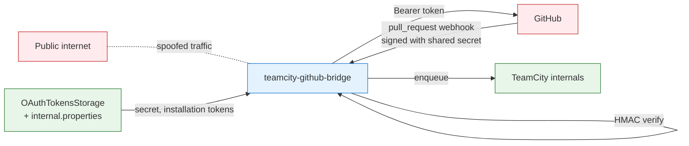
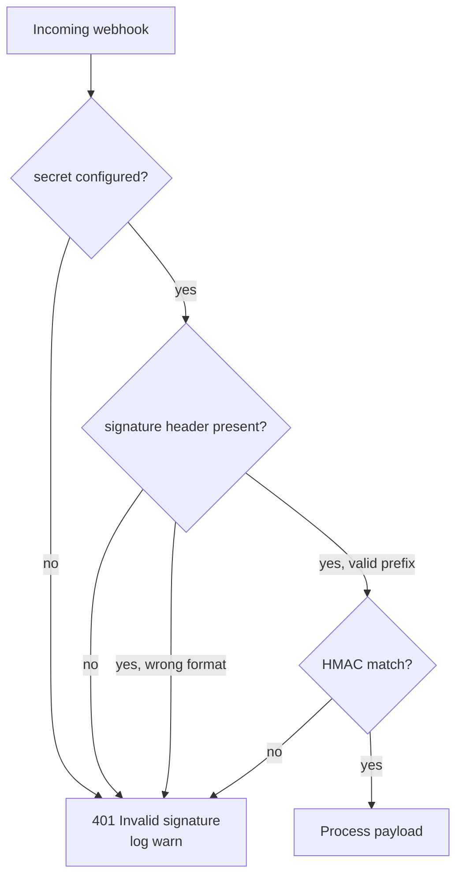
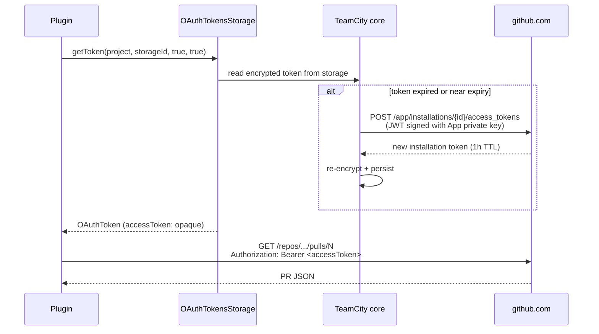

# Security model

Trust boundaries, authentication choices, and defaults that protect
the integration even when something is misconfigured.

## Trust boundaries at a glance



The plugin treats anything coming in from the network as untrusted
until proven otherwise. The proof is:
- For inbound webhooks: a valid HMAC-SHA256 signature over the raw
  body, using the shared secret stored in TeamCity's
  `internal.properties`.
- For outbound API calls: TeamCity owns the credentials; the plugin
  only sees a short-lived bearer token via
  `OAuthTokensStorage.getToken(...)`.

## Inbound: webhook signature verification

GitHub signs every webhook delivery with HMAC-SHA256 using the
shared secret. The plugin computes the expected signature and
compares using a constant-time equality check (`SignatureVerifier`).

```
+-------------------+      raw body bytes      +-------------------+
|     GitHub        | -----------------------> |   PluginWebhook   |
|                   |                          |   Controller      |
|  computes:        |     X-Hub-Signature-256  |                   |
|  hmac_sha256(     | -----------------------> |   1. read body    |
|    secret,        |  sha256=<hex>            |   2. compute      |
|    raw_body)      |                          |      HMAC over    |
|                   |                          |      body         |
|                   |                          |   3. constant-    |
|                   |                          |      time compare |
+-------------------+                          +-------------------+
                                                        |
                                            +-----------+-----------+
                                            |                       |
                                       match: 200             mismatch: 401
                                       process payload         drop, log warn
```

Properties:
- **Algorithm**: HMAC-SHA256 with `Mac.getInstance("HmacSHA256")`,
  the JDK's stock implementation.
- **Encoding**: hex, lowercase. Header looks like
  `sha256=0123abcd...`.
- **Body bytes**: the verifier signs over the **raw bytes** of the
  request body, read once via `request.inputStream.readBytes()` to
  avoid any framework reformatting.
- **Comparison**: constant-time, length-prefixed; rejects mismatched
  lengths immediately.

### Anonymous registration (deliberate)

TeamCity protects every path under `/app/*` with built-in
authentication by default. The plugin's HTTP controllers explicitly
register their paths with
`AuthorizationInterceptor.addPathNotRequiringAuth(path)` to opt out
of that protection:

| Path | Anonymous because |
|---|---|
| `/app/teamcity-github-bridge/webhook` | GitHub does not send TeamCity credentials. HMAC-SHA256 over the body is the real auth. |
| `/app/teamcity-github-bridge/info` and `/info.md` | The response intentionally exposes no secrets - only `secretConfigured: true|false`, the public payload URL, the dedicated log path, and the plugin version. |

The **admin page** (`/admin/...?tab=bridgeAdmin`) is **not** anonymous.
It is registered through `AdminPage`, which inherits TeamCity's
standard admin authorisation filter. Only users with the relevant
permission see the page; the JSP template never renders secrets,
only the boolean `secretConfigured` and the path of the dedicated
log file.

Without the anonymous opt-out, GitHub deliveries would hit `401
Authentication required` from TeamCity's auth filter before any of
the plugin's code (including HMAC verification) could run.

### Fail-closed on the webhook



If the operator forgets to set `teamcity.github.bridge.webhook.secret`, every delivery
is rejected. The plugin loudly logs
`Webhook secret is not configured (...)` on every request, so the
misconfiguration is impossible to miss in the log.

The alternative - allowing unauthenticated webhooks when no secret
is set - is unsafe: anyone could `curl -X POST` the endpoint and
trigger arbitrary builds.

### What the verification does NOT do

- It does **not** validate the GitHub App ID. Any party with the
  shared secret can produce a valid signature. The secret is
  therefore as sensitive as a password and must be stored only in
  `internal.properties` (which TeamCity treats as secrets).
- It does **not** check the `X-GitHub-Hook-Installation-Target-Id`
  or `X-GitHub-Hook-ID` headers. Future versions may pin the App's
  installation IDs.
- It does **not** rate-limit. Behind a reverse proxy, configure
  rate limits there.

## Outbound: GitHub App installation tokens

The plugin authenticates outbound REST calls with bearer tokens
issued by the GitHub App. It never sees, signs with, or stores the
App's private key - that is TeamCity's job.



### Token opacity

All token-handling code treats the string as opaque. There is no
length check, no substring, no prefix matching anywhere in the
codebase. This is verified by review and tested by the test suite
on round-tripped fixtures.

Why this matters: in 2026, GitHub introduced a new stateless
installation token format. Tokens may be ~520 characters and start
with `ghs_`. Tools with hardcoded length expectations break. The
opt-in header `X-GitHub-Stateless-S2S-Token: enabled` belongs on
the issuance call - which TeamCity performs - and is therefore
transparent to the plugin.

See the commented contract at the top of `api/TokenResolver.kt`.

### Token storage

| Where | What | Lifetime |
|---|---|---|
| GitHub App settings | App private key (.pem) | persistent, rotate annually |
| TeamCity `<connection>` config | App ID, Client ID, Client Secret, private key, optionally webhook secret | persistent, encrypted in TC config |
| `OAuthTokensStorage` (TC DB) | Installation access tokens | ~1h, refreshed automatically |
| Plugin memory (PrInfoCache) | PR JSON snippets (number, title, author, draft, ...) | 60 seconds |
| Plugin memory (during request) | Access token in `String` | discarded at end of call |

The plugin never writes tokens to disk, never logs them at any
level, and never includes them in error messages.

## GitHub App permissions: principle of least privilege

The plugin requests **read-only** access to the resources it needs:

| Permission | Access | Why |
|---|---|---|
| Pull requests | Read | Only for `GET /repos/.../pulls/N` |
| Contents | Read | Required transitively |
| Metadata | Read | Mandatory baseline |
| Commit statuses | Read & write | For future commit-status enrichment |
| Checks | Read & write | For future Check Runs support |
| Webhooks | Read & write | Required so TC can resolve App webhook config |

Future versions that post commit statuses or check runs will use
the same connection without adding more permissions.

## Fail-open vs fail-closed: where each applies

The plugin uses different defaults on different paths because the
consequences differ.

| Path | Default on failure | Rationale |
|---|---|---|
| Webhook signature invalid | **Closed** (reject 401) | A spoofed webhook could trigger arbitrary builds. Cost of false negative is high. |
| Token resolution fails | **Open** (allow build) | We don't want a credential issue to block the CI pipeline. Cost of false negative (drafts build) is just CI minutes. |
| GitHub API returns 4xx/5xx | **Open** (allow build) | Same reasoning. |
| PR info cache stale | Use stale value | Better than reaching out to GitHub during a queue-blocking call. |
| Webhook payload malformed | **Open** (return 200, no action) | Logging the issue is enough; refusing to ACK risks GitHub disabling the webhook after retries. |

This is a deliberate split: the **trust boundary** is hard
(fail-closed), the **best-effort enrichment** is soft (fail-open).

## Log hygiene

The plugin uses `Logger.getInstance(class.java.name)`. By
convention, no log statement contains the access token, the App
private key, or the webhook secret. Search the source for
`accessToken` to verify: it is referenced only in two places
(`TokenResolver.resolveAccessToken` and `GitHubClient.getPr`) and
never reaches a logger call.

The `secret()` accessor on `WebhookConfig` returns the raw secret;
it is **only** passed into `SignatureVerifier`, never into a
logger or an exception message.

If you tighten audit further, set the logger
`io.github.dlachouette.teamcity.github` to `INFO` (the default
visible to operators) and only enable `DEBUG` when investigating.

## Threat model summary

| Threat | Mitigation |
|---|---|
| Attacker spoofs a `ready_for_review` webhook to trigger builds | HMAC signature required; constant-time comparison |
| Attacker steals the webhook secret | Rotate via `internal.properties`; new secret live in <1s |
| Attacker steals an installation token from logs | Plugin never logs tokens; ~1h TTL limits blast radius |
| GitHub Apps revoked without notice | Plugin fails open on the draft check; webhooks would just stop arriving |
| Replay of a captured webhook | Not mitigated currently; HMAC alone does not prevent replay. To be added: timestamp check via the `X-GitHub-Delivery` header. |
| Operator forgets to set the secret | Fail-closed (401), loud per-request warnings |
| Build type opted in without the connection ID | Token resolution returns null; fail-open allows build with a warning |

## Hardening checklist for operators

- [ ] `teamcity.github.bridge.webhook.secret` set to a random >=32-byte string and
      stored only in `internal.properties`.
- [ ] TeamCity is fronted by TLS (the plugin assumes HTTPS in the
      `payloadUrl` returned by `/info`).
- [ ] GitHub App private key rotated at least annually.
- [ ] GitHub App permissions limited to the table above; remove any
      grant that isn't on the list.
- [ ] GitHub App installed on only the repositories that need it,
      not on `All repositories`.
- [ ] TeamCity server log retention long enough to investigate
      incidents (look for `PluginWebhookController` and
      `DraftAwareBuildFilter` entries).
- [ ] Webhook URL not exposed to the public internet without a
      reverse proxy that rate-limits (optional but recommended).
