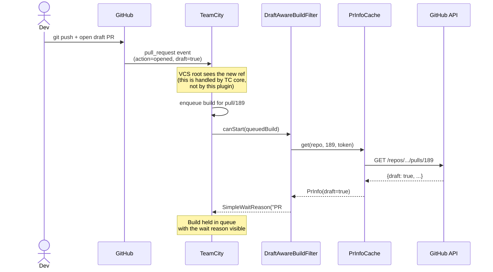
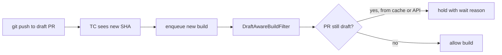
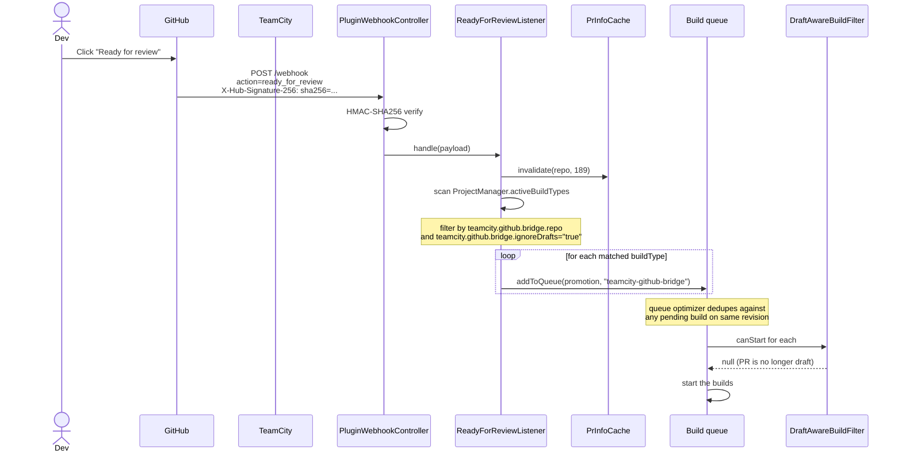
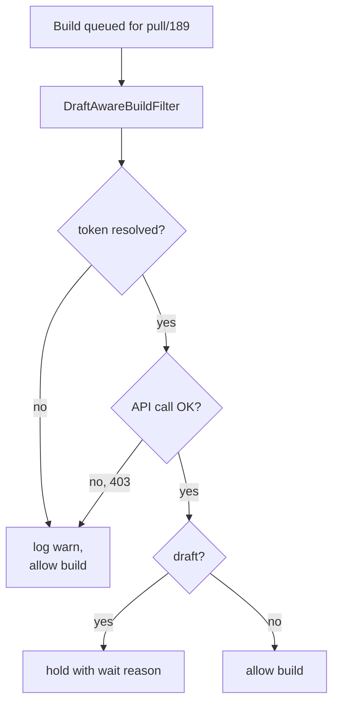
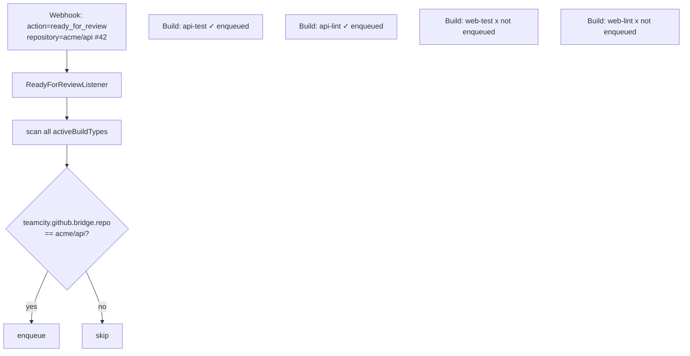
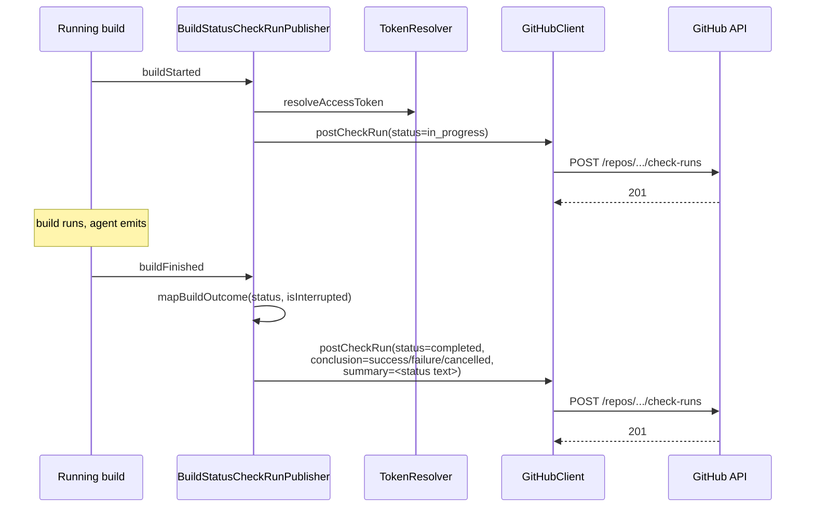

# Usage scenarios

Concrete walkthroughs of what happens when, who fires what, and what
the operator should expect to see in the TeamCity UI.

Each scenario assumes the plugin is installed and a build
configuration has the three opt-in parameters
(`teamcity.github.bridge.ignoreDrafts`, `teamcity.github.bridge.repo`, `teamcity.github.bridge.connectionId`)
set as described in [configuration.md](configuration.md).

## Scenario 1: a draft PR is opened

**Actor**: a developer pushes a branch and opens a draft PR.

**Expected outcome**: builds are queued for the PR but held with a
visible wait reason; no compute is consumed.



In the TeamCity UI, the queued build shows:

```
+----------------------------------------------------+
| Build queue                                        |
|  o  pull/189  Build_LinuxX64_Clang  10:23         |
|     Waiting reason: PR #189 is draft and          |
|                     teamcity.github.bridge.ignoreDrafts is enabled. |
+----------------------------------------------------+
```

## Scenario 2: developer pushes a new commit to the draft

**Actor**: same developer, force-push or new commit.

**Expected outcome**: same as scenario 1 - the new revision is held
on the same wait reason.



The PR info cache has a TTL of 60 seconds, so a recent draft check
is reused. If 60 seconds have elapsed since the previous check, the
plugin re-queries GitHub. Either way, no extra compute is spent on
the build itself.

## Scenario 3: developer marks the PR ready for review

**Actor**: same developer clicks "Ready for review" in the GitHub
UI.

**Expected outcome**: every matching build configuration is
enqueued with a fresh build for `pull/189`. Each then passes the
`DraftAwareBuildFilter` because the cache is invalidated and the PR
is no longer draft.



In the TeamCity UI, the build queue shows fresh entries with the
comment:

```
+----------------------------------------------------+
|  o  pull/189  Build_LinuxX64_Clang   10:31        |
|     Triggered by: teamcity-github-bridge          |
|     Comment: Retriggered by teamcity-github-      |
|              bridge after PR #189 became ready    |
|              for review                           |
+----------------------------------------------------+
```

## Scenario 4: PR is reverted to draft

**Actor**: developer converts back to draft.

**Expected outcome**: the plugin does nothing on the `converted_to_draft`
action. If a new commit comes in while in draft state, scenario 1
applies again. In-flight builds are not cancelled - they finish on
the revision they were started for.

This is a deliberate design choice: the plugin never cancels builds.
Cancellation has surprising side effects in TC (it counts as a red
build on GitHub commit status) so we only ever **hold** or **enqueue**.

## Scenario 5: the GitHub App is missing a permission

**Actor**: ops accidentally removes the "Pull requests" permission.

**Expected outcome**: the plugin fails open. Builds proceed without
the draft check, with a warning in the log.

```
[INFO  ] PluginWebhookController - Registered webhook controller at /app/teamcity-github-bridge/webhook
[WARN  ] GitHubClient - GitHub returned 403 for Silmaen/Owl#189
[WARN  ] DraftAwareBuildFilter - Cannot fetch PR info for Silmaen/Owl#189; allowing build to proceed
```



Fail-open is preferred to fail-closed here because:
- The plugin is non-critical for safety; missing the suppression
  costs CI minutes, not correctness.
- A hard fail would surprise teams when GitHub has an outage.

The retrigger flow (scenario 3) is unaffected because it does not
query the API - it trusts the signed webhook payload.

## Scenario 6: the webhook secret is missing

**Actor**: brand-new install, ops forgot to set `teamcity.github.bridge.webhook.secret`.

**Expected outcome**: every webhook delivery is rejected with HTTP
401 and a loud warning in the log.

```
[WARN  ] PluginWebhookController - Webhook secret is not configured (set internal property teamcity.github.bridge.webhook.secret) - refusing request
[WARN  ] PluginWebhookController - Webhook with invalid or missing signature rejected (event=ping)
```

GitHub's `Recent Deliveries` shows:

```
+----------------------------------------------------------+
|  x  ping  10:33  401  Response: Invalid signature        |
+----------------------------------------------------------+
```

This is fail-closed by design. See
[security.md](security.md#fail-closed-on-the-webhook) for the
rationale.

## Scenario 7: TeamCity restart between draft and ready

**Actor**: ops restarts TC while a PR is still in draft.

**Expected outcome**:
- In-flight builds are restored from the queue on restart.
- The PR info cache is empty after restart - the next
  `canStart` check re-queries GitHub.
- The webhook is unaffected because the GitHub App keeps
  delivering; on restart, the controller re-registers at
  `/app/teamcity-github-bridge/webhook` and resumes.

```
TC up  -> draft PR opened, builds held
TC down (5 min) -> GitHub deliveries get 5xx, GitHub retries
TC up  -> webhook re-registered, retried deliveries land,
          held builds re-evaluated, still held (PR still draft)
```

GitHub retries failed webhook deliveries up to 24h, so a brief
maintenance window is non-fatal.

## Scenario 8: build type without the bridge enabled

**Actor**: build type does **not** have `teamcity.github.bridge.ignoreDrafts=true`.

**Expected outcome**: nothing the plugin does affects it.

- `DraftAwareBuildFilter` short-circuits on the missing parameter:
  ```kotlin
  if (buildType.parameters[PARAM_IGNORE_DRAFTS] != "true") return null
  ```
  -> filter returns `null` (allow), the build proceeds as usual.
- `ReadyForReviewListener` filters by the same parameter, so the
  build type is never enqueued by the retrigger flow.

This isolation guarantees the plugin is **safe to deploy** to a
TeamCity server: nothing changes until a team opts in by setting
the three parameters.

## Scenario 9: multi-repo project

**Actor**: a project has builds for two repos (`acme/api` and
`acme/web`), both opted in.

**Expected outcome**: a webhook for `acme/api` only retriggers
builds with `teamcity.github.bridge.repo=acme/api`. Builds for `acme/web` are
untouched.



## Scenario 10: a build finishes (Check Run publication)

**Actor**: a build configuration opted into the bridge finishes (success or failure).

**Expected outcome**: a GitHub Check Run is posted carrying the
build's actual status text, replacing the bundled
`commitStatusPublisher`'s hard-coded
`"TeamCity build finished"` description for that build.



What appears on the PR:

| State | GitHub UI shows |
|---|---|
| In progress | `TeamCity / <buildType full name>` with status "Expected" -> "In progress" |
| Success | Check Run "Build passed", `output.summary` = the build's `statusDescriptor.text` (e.g. "3 warnings; 0 errors") |
| Failure | Check Run "Build failed", same summary source |
| Cancelled | Check Run "Build cancelled" (any underlying status, when the build was interrupted) |

> **Coexistence with the bundled `commitStatusPublisher`**: until
> you disable the bundled publisher on the opted-in build types,
> GitHub shows **both** a Commit Status (TC's, generic text) and a
> Check Run (this plugin's, rich text). Reconfigure branch
> protection rules to require the Check Run name(s) and treat the
> Commit Statuses as informational. A future iteration will provide
> a Build Feature to silence the bundled publisher per buildType.

## Scenario 11: operator visits the admin page

**Actor**: a TC admin opening the in-product help page.

**Expected outcome**: the admin lands on a self-contained dashboard
that tells them at a glance whether the plugin is healthy.

Navigation: `Administration -> Server Administration -> GitHub
Bridge`.

```
+----------------------------------------------------------+
| TeamCity GitHub Bridge                                   |
+----------------------------------------------------------+
| Plugin status                                            |
|   Plugin version:    0.5.0                               |
|   TeamCity version:  TeamCity 2026.1 (build 222521)      |
|   Webhook URL:       https://.../app/.../webhook         |
|   HMAC secret:       [configured]                        |
|   Dedicated log:     [configured] /.../...-bridge.log    |
|   Config snapshot:   JSON | Markdown                     |
+----------------------------------------------------------+
| Recent events (last 12 in-memory)                        |
|   2026-05-25 14:02:30  pull_request  ready_for_review    |
|                        Silmaen/Owl   200  accepted       |
|   2026-05-25 14:01:55  ping                              |
|                                      200  accepted       |
|   ...                                                    |
+----------------------------------------------------------+
| GitHub App webhook quick-config                          |
|   (paste-ready table for the App's webhook page)         |
+----------------------------------------------------------+
| Help & documentation                                     |
|   - README                                               |
|   - Installation, GitHub App setup, Webhook setup, ...   |
|   - Common 401 / 404 troubleshooting (fold)              |
+----------------------------------------------------------+
```

The "Recent events" table is in-memory only (ring buffer of 100
entries, cleared on TC restart). The dedicated log file is the
long-term audit. If you do not see any events after a webhook
delivery, recheck signature and URL with the troubleshooting fold
on the same page.

## Scenario 12: draft / ready pill rendering in TC lists

**Actor**: any user looking at a build configuration page or the
queue page.

**Expected outcome**: builds carrying the `draft` or `ready` tag
(placed by `PrPromotionTagger` - scenario 1 / 3) display a coloured
pill instead of TC's default grey chip.

```
Builds list
+----+--------------------+--------+------------------------------+
| #  | Build              | Branch | Tags                         |
+----+--------------------+--------+------------------------------+
| 87 | #87 Feature/raycast| pull/189 | [draft] (amber)            |
| 86 | #86 main           | main     |                            |
| 85 | #85 Feature/foo    | pull/188 | [ready] (green)            |
+----+--------------------+--------+------------------------------+
```

How it works: a `SimplePageExtension` registered in
`ALL_PAGES_FOOTER_PLUGIN_CONTAINER` injects a small CSS + JS
fragment into every page. The JS walks the rendered tag anchors
and adds a CSS class when the text matches `draft` or `ready`. No
network calls, no DOM dependencies beyond TC's stock tag markup;
safe to ship.

If TC ever changes the markup the styling silently stops, the page
remains intact.

## Scenario 13: queue dedup

**Actor**: a build is already running for `pull/189` when the
ready-for-review webhook arrives.

**Expected outcome**: no duplicate build. TeamCity's queue optimiser
deduplicates by (buildType, revision).

The plugin always calls `buildType.addToQueue(promotion, "teamcity-github-bridge")`;
it never tries to be clever about whether one is already running.
That decision lives in TC core.

## Summary table

| Trigger | Plugin action | Build / GitHub outcome |
|---|---|---|
| Draft PR opened | Promotion tagged `draft` + skipped Check Run posted + filter holds | Held in queue with wait reason, pill visible, GitHub PR shows "Skipped: draft PR" |
| Push to draft | Same path again on new revision | Same |
| Marked ready for review | Listener enqueues + promotion tagged `ready` + filter allows | Builds run, ready pill visible, in-progress Check Run posted |
| Build starts | `BuildStatusCheckRunPublisher.buildStarted` | GitHub Check Run status = `in_progress`, title "Building" |
| Build finishes (success) | `BuildStatusCheckRunPublisher.buildFinished` | GitHub Check Run status = `completed`, conclusion `success`, summary = build's `statusDescriptor.text` |
| Build finishes (failure) | Same hook, different mapping | conclusion `failure` |
| Build cancelled | Same hook, `isInterrupted` short-circuits | conclusion `cancelled` |
| Reverted to draft | None | In-flight builds continue, new ones held |
| API error during draft check | Logged warning | Build allowed (fail-open) |
| Missing webhook secret | Webhook rejected 401 | No retrigger; warning logged; visible in admin page recent events |
| Build type not opted in | None | No change |

## See also

- [Security model](security.md) - why the plugin fails closed on
  webhooks and open on API errors.
- [Troubleshooting](troubleshooting.md) - what to do when a
  scenario doesn't behave as expected.
