# Usage scenarios

Concrete walkthroughs of what happens when, who fires what, and what
the operator should expect to see in the TeamCity UI.

Each scenario assumes the plugin is installed and a build
configuration is **opted in**, which today means two things (see
[configuration.md](configuration.md)):

1. The **"GitHub Bridge integration" build feature** is attached to
   the build configuration (Build Features tab). Its presence is the
   per-task opt-in; without it the plugin never touches the build.
2. The surrounding project's **GitHub Bridge** tab carries the two
   mandatory project-level parameters:
   `teamcity.github.bridge.repo` (the `owner/name` slug) and
   `teamcity.github.bridge.connectionId`. The connection id is either
   `managed` (the server-managed GitHub App created from the admin
   page) or a TeamCity connection id such as `PROJECT_EXT_42`.

Draft handling is **per build feature**, not a project parameter. The
old `teamcity.github.bridge.ignoreDrafts` opt-in parameter no longer
exists. Instead the feature exposes a `triggerOnPrDraft` checkbox
(default **on** = build drafts too). When it is **off**, draft PR
builds are suppressed; see Scenario 1.

> The scenarios below split the PR lifecycle into draft-opened,
> push-to-draft, ready transition, etc. Two ways of getting builds
> enqueued exist in parallel:
>
> - **VCS-trigger path**: TC's own VCS trigger on `+:pull/*` enqueues
>   a build on every push. If `triggerOnPrDraft` is off, the draft
>   build is then **removed from the queue** by `DraftBuildQueueCleaner`
>   (with `DraftAwareBuildFilter` as a fallback safety net). Used in
>   Scenarios 1, 2.
> - **Plugin-event path** (the "drop VCS triggers" pattern):
>   `PullRequestEventListener` reacts to `pull_request.opened`,
>   `ready_for_review`, and `synchronize` and enqueues directly. No
>   VCS trigger needed; with `triggerOnPrDraft` off, a draft is simply
>   never enqueued in the first place. See Scenario 3 — the sequence
>   diagram covers all three trigger actions. A PR opened **directly
>   as ready** is the `opened` row.

## Scenario 1: a draft PR is opened (and the BT skips drafts)

**Actor**: a developer pushes a branch and opens a draft PR, against
a build configuration whose GitHub Bridge feature has
`triggerOnPrDraft` **unchecked**.

**Expected outcome**: any build TC's VCS trigger enqueues for the
draft is **removed from the queue** by `DraftBuildQueueCleaner`, and a
**"Skipped: draft PR"** Check Run is posted on the PR. No compute is
consumed and the queue stays clean. (If `triggerOnPrDraft` were left
at its default **on**, the draft would build normally.)

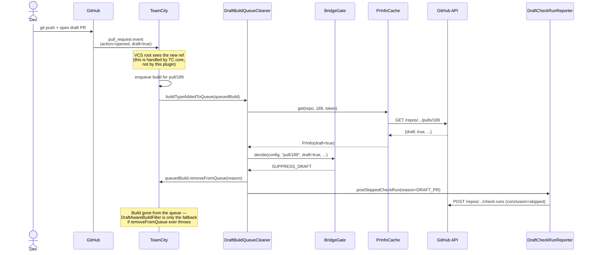

On the PR's Checks tab, GitHub shows:

> ⊘ **TeamCity / Build_LinuxX64_Clang** — Skipped: draft PR
> _(conclusion: `skipped`)_

The build no longer lingers in the TeamCity queue at all; the
`DraftAwareBuildFilter` `canStart` precondition is kept only as a
fallback that holds the build if `removeFromQueue` ever fails.

## Scenario 2: developer pushes a new commit to the draft

**Actor**: same developer, force-push or new commit, same BT with
`triggerOnPrDraft` off.

**Expected outcome**: same as scenario 1 - the new revision's build
is removed from the queue and a fresh "Skipped: draft PR" Check Run
is posted at the new head SHA.

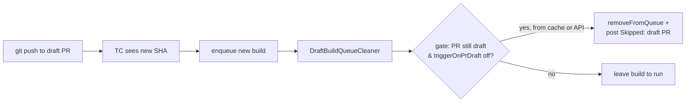

The PR info cache has a short TTL (the **PR-info cache TTL** server
setting, default 60s), so a recent draft check is reused. If the TTL
has elapsed since the previous check, the plugin re-queries GitHub.
Either way, no extra compute is spent on the build itself.

## Scenario 3: any non-draft `pull_request` event fires

**Actor**: developer either clicks "Ready for review", opens a PR
directly as ready, or pushes a new commit to an already-ready PR.

**Expected outcome**: for every matching build configuration that
does **not** already have a build on this `pull/N` ref at the same
head SHA, a fresh build is enqueued. Each then passes the
`DraftBuildQueueCleaner` / `DraftAwareBuildFilter` gate because the
cache is invalidated and the PR is no longer draft.

The three trigger actions map to:

| GitHub action | Trigger | Skip path |
|---|---|---|
| `opened` (`draft: false`) | PR opened directly as ready. | Each matching BT — fresh PR has no history, so smart-skip never matches. |
| `ready_for_review` | Draft → ready transition. | Smart-skip catches builds that already ran during draft (e.g. via manual trigger) at the same SHA. |
| `synchronize` (`draft: false`) | Push to a ready PR. | Smart-skip catches duplicate deliveries on the same SHA. |

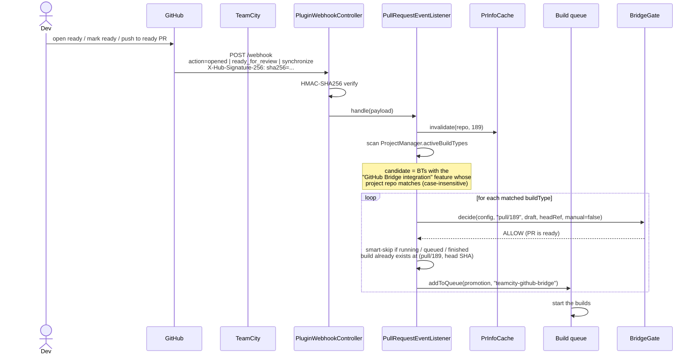

In the TeamCity UI, the build queue shows fresh entries with the
comment:

| Queued build | Branch | Triggered by | Comment |
|---|---|---|---|
| Build_LinuxX64_Clang, 10:31 | `pull/189` | teamcity-github-bridge | Retriggered by teamcity-github-bridge after `pull_request.opened` on PR #189 |

## Scenario 4: PR is reverted to draft

**Actor**: developer converts back to draft.

**Expected outcome**: the plugin does nothing on the `converted_to_draft`
action. If a new commit comes in while in draft state and the BT has
`triggerOnPrDraft` off, scenario 1 applies again (queue removal +
"Skipped: draft PR"). In-flight builds are not cancelled - they
finish on the revision they were started for.

This is a deliberate design choice: the plugin never **stops a
running build**. Stopping a running build has surprising side effects
in TC (it counts as a red build on GitHub commit status). The plugin
will only **remove a not-yet-started build from the queue** (e.g. the
draft suppression in Scenario 1, or a closed PR in Scenario 18) or
**enqueue** a new one.

## Scenario 5: the GitHub App is missing a permission

**Actor**: ops accidentally removes the "Pull requests" permission.

**Expected outcome**: the plugin fails open. Builds proceed without
the draft check, with a warning in the log.

```
[INFO  ] PluginWebhookController - Registered webhook controller at /app/teamcity-github-bridge/webhook
[WARN  ] GitHubClient - GitHub returned 403 for acme/widget#189
[WARN  ] DraftBuildQueueCleaner - Cannot fetch PR info for acme/widget#189; leaving build in queue
```

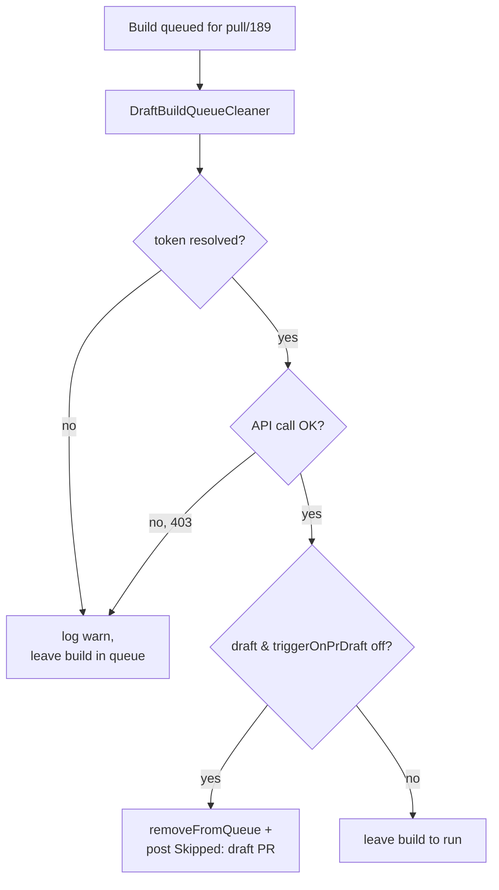

Fail-open is preferred to fail-closed here because:
- The plugin is non-critical for safety; missing the suppression
  costs CI minutes, not correctness.
- A hard fail would surprise teams when GitHub has an outage.

The retrigger flow (scenario 3) is unaffected because it does not
query the API - it trusts the signed webhook payload.

## Scenario 6: the webhook secret is missing

**Actor**: brand-new install, ops forgot to set `teamcity.github.bridge.webhook.secret`.

**Expected outcome**: every webhook delivery is rejected with HTTP
401 and a loud warning in the log.

```
[WARN  ] PluginWebhookController - Webhook secret is not configured (set internal property teamcity.github.bridge.webhook.secret) - refusing request
[WARN  ] PluginWebhookController - Webhook with invalid or missing signature rejected (event=ping)
```

GitHub's `Recent Deliveries` shows:

> ✗ `ping` — 10:33 — **401** — Response: `Invalid signature`

This is fail-closed by design. See
[security.md](security.md#fail-closed-on-the-webhook) for the
rationale.

## Scenario 7: TeamCity restart between draft and ready

**Actor**: ops restarts TC while a PR is still in draft.

**Expected outcome**:
- In-flight builds are restored from the queue on restart.
- The PR info cache is empty after restart - the next
  `canStart` check re-queries GitHub.
- The webhook is unaffected because the GitHub App keeps
  delivering; on restart, the controller re-registers at
  `/app/teamcity-github-bridge/webhook` and resumes.

```
TC up  -> draft PR opened, builds held
TC down (5 min) -> GitHub deliveries get 5xx, GitHub retries
TC up  -> webhook re-registered, retried deliveries land,
          held builds re-evaluated, still held (PR still draft)
```

GitHub retries failed webhook deliveries up to 24h, so a brief
maintenance window is non-fatal.

## Scenario 8: build type without the bridge enabled

**Actor**: build type that does **not** have the "GitHub Bridge
integration" build feature (or whose project is missing
`teamcity.github.bridge.repo` / `connectionId`).

**Expected outcome**: nothing the plugin does affects it.

- `BridgeFeatureReader.read(buildType)` returns `null` when the
  feature is absent or the project chain lacks repo + connectionId,
  so every gate site short-circuits:
  ```kotlin
  val config = BridgeFeatureReader.read(buildType) ?: return
  ```
  -> `DraftBuildQueueCleaner` / `DraftAwareBuildFilter` leave the
  build untouched and it proceeds as usual.
- `PullRequestEventListener` only scans build types that carry the
  feature, so the build type is never enqueued by the retrigger flow.

This isolation guarantees the plugin is **safe to deploy** to a
TeamCity server: nothing changes until a team opts in by adding the
build feature and setting the project's repo + connectionId.

## Scenario 9: multi-repo project

**Actor**: a project has builds for two repos (`acme/api` and
`acme/web`), both opted in.

**Expected outcome**: a webhook for `acme/api` only retriggers
builds with `teamcity.github.bridge.repo=acme/api`. Builds for `acme/web` are
untouched.

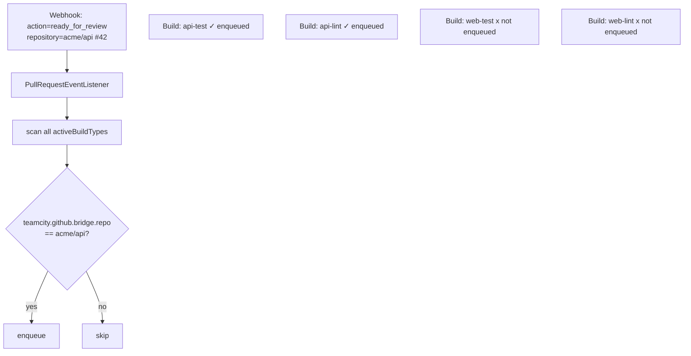

## Scenario 10: a build finishes (Check Run publication)

**Actor**: a build configuration opted into the bridge finishes (success or failure).

**Expected outcome**: a GitHub Check Run is posted at every
lifecycle transition (queued / running / interrupted / finished /
queue-cancelled), carrying the build's actual status text. GitHub
dedups by `(name, head_sha)` so the same row transitions through
every state.

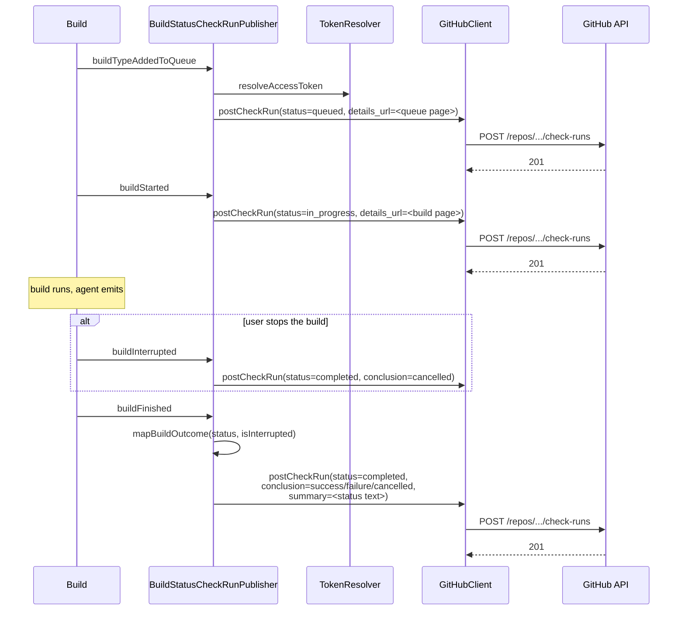

What appears on the PR:

| State | GitHub UI shows |
|---|---|
| Queued | `TeamCity / <buildType full name>` with status "Expected" + clock icon, title "Queued". `details_url` points at the TC queue. |
| In progress | Same row transitions to "In progress", title "Building". `details_url` points at the TC build page. |
| Interrupted (user stops it) | Check Run "Build cancelled", conclusion `cancelled`. Posted early so the row never gets stuck at "In progress" if `buildFinished` doesn't enchain. |
| Cancelled in queue (user removes it) | Check Run "Cancelled before start", conclusion `cancelled`. Only fires for user-initiated removals (the draft-suppression cleaner is silent so its `Skipped` row stays). |
| Success | Check Run "Build passed", `output.summary` = the build's `statusDescriptor.text` (e.g. "3 warnings; 0 errors") |
| Failure | Check Run "Build failed", same summary source |
| Cancelled (finished) | Check Run "Build cancelled" (any underlying status, when `isInterrupted` is true) |

Every Check Run carries a `details_url` so the "Details" link from
the GitHub Checks tab jumps directly to the relevant TC page
instead of the server root.

> **Disable the bundled `commitStatusPublisher` on opted-in build
> configurations.** As long as both are enabled, GitHub shows **two**
> rows per build — a Commit Status (TeamCity's, generic text) and a
> Check Run (this plugin's, rich text). The plugin never silences the
> bundled publisher: what reports to GitHub is an operator decision, so
> it will only **warn** about the conflict. If you choose to keep both,
> make branch protection require the Check Run name(s) and treat the
> Commit Statuses as informational. See
> [configuration.md](configuration.md#choosing-the-right-setup).

## Scenario 11: operator visits the admin page

**Actor**: a TC admin opening the in-product help page.

**Expected outcome**: the admin lands on a self-contained dashboard
that tells them at a glance whether the plugin is healthy.

Navigation: `Administration -> Server Administration -> GitHub
Bridge`.

The page is one column of cards, in this order:

1. **Getting started** — the four steps: create and install the GitHub App
   (card below), point a project at it (`repo` + `connectionId=managed`), add
   the *GitHub Bridge integration* build feature, then verify the App
   configuration, run the self-tests and open a PR.
2. **Plugin status** — plugin version, TeamCity version, the webhook URL to
   paste into GitHub, whether the HMAC secret is configured (with
   *Set/Replace* and *Clear*), whether the dedicated log is configured, and
   the config snapshot links (JSON / Markdown).
3. **GitHub App** — *Create GitHub App* (the manifest comes pre-filled with
   the webhook URL, the permissions and the events). Once configured: the
   managed App slug, *Open settings*, *Install / manage installations*, the
   reminder that `connectionId=managed`, and *Verify App configuration*
   (`GET /app`, diffs the live permissions and subscribed events against
   what the plugin needs).
4. **Server settings** — applied immediately, no restart:
   - API base override, API version, PR-info cache TTL, stale grace,
     HTTP retry attempts and base delay.
   - Feature flags: webhook replay protection, dry-run, metrics endpoint,
     legacy `teamcity.pullRequest.*` aliases, sticky PR summary comment,
     attach branch builds to their PR, "Re-run all checks" re-runs only the
     failed ones, list artifacts in the Check Run and PR comment, annotate
     the diff with compiler diagnostics, **queue cleanup** (the server-wide
     off switch), and tag PR builds with their PR number.
   - Repository allowlist and comment-trigger authors.
5. **External API** — enabled/disabled, plus the API token form
   (*Set* / *Disable*).
6. **Self-tests** — the *Run self-tests* button (scenario 11.b).
7. **Recent events** — the last N deliveries held in memory, e.g.
   `2026-05-25 14:02:30  pull_request  ready_for_review  acme/widget  200
   accepted`. The full history is in the dedicated log.
8. **GitHub App webhook quick-config** — a paste-ready table for the App's
   webhook page.
9. **Help & documentation** — what the plugin does, links to the README and
   every page of `doc/`, and a fold with the common 401 / 404 causes.

The page is organised top-to-bottom as: a **Getting started** card
(the four-step opt-in), **Plugin status**, a **GitHub App** card
(one-click create from a pre-filled manifest, deep links to the App's
settings / installations on GitHub, and a **Verify App configuration**
button that calls `GET /app` and diffs the App's live permissions and
subscribed events against what the plugin needs), an editable **Server
settings** form (tuning + feature-flag checkboxes, saved to the
plugin properties file and applied without a restart), the **External
API** token form, the **Run self-tests** button, and the **Recent
events** table.

The "Recent events" table is in-memory only (ring buffer cleared on
TC restart). The dedicated log file is the long-term audit. If you do
not see any events after a webhook delivery, recheck signature and URL
with the troubleshooting fold on the same page.

The **HMAC secret form** sets or rotates the webhook secret (CSRF
protected, writes to
`<TC_DATA_DIR>/config/teamcity-github-bridge.properties`); the secret
is never echoed back. The same properties file backs the **API token**
and **Server settings** forms.

## Scenario 11.b: operator runs the self-tests

**Actor**: an admin clicks **Run self-tests** on the admin page.

**Expected outcome**: a synchronous POST validates every part of the
plugin pipeline and renders the results as a colour-coded table.

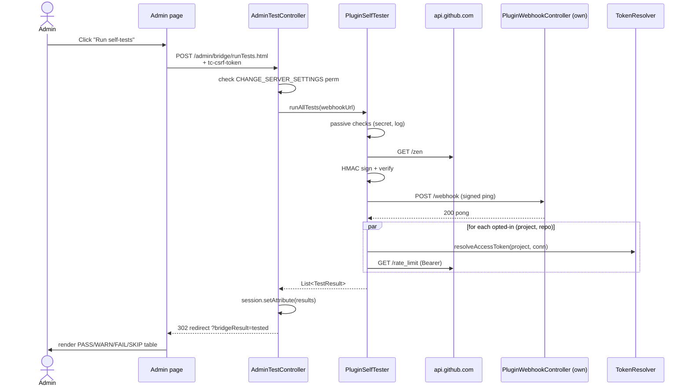

The test categories (config checks, GitHub reachability, HMAC
roundtrip, webhook self-delivery, and per-project token resolution)
are described in [api-reference.md](api-reference.md#self-tests).

Typical reading:
- All PASS: the plugin is healthy. Webhooks will land, tokens will
  resolve, builds on opted-in PRs will get Check Runs.
- "Webhook self-delivery" FAIL while the API reachability passes:
  the reverse proxy strips a header or the secret was rotated on
  one side only.
- "Token resolution" FAIL on every project: the connection ID is
  wrong (it must be `managed` for the server-managed App, or a real
  TeamCity connection id like `PROJECT_EXT_42`), the App is not
  installed on the repo, or — for a TC connection — it has never been
  "Test connected" in TC (which is what mints the first token).
- "GitHub API auth" FAIL after "Token resolution" PASS: GitHub
  rejected the token. The App's installation may have been revoked
  on the org side.

## Scenario 12: draft / ready pill rendering in TC lists

**Actor**: any user looking at a build configuration page or the
queue page.

**Expected outcome**: builds carrying the `draft` or `ready` tag
(placed by `PrPromotionTagger` - scenario 1 / 3) display a coloured
pill instead of TC's default grey chip.

Builds list, as TeamCity renders it:

| # | Build | Branch | Tags |
|---|---|---|---|
| 87 | #87 | `Feature/raycast` | `pr-189` &nbsp; **draft** _(amber pill)_ |
| 86 | #86 | `master` | |
| 85 | #85 | `Feature/foo` | `pr-188` &nbsp; **ready** _(green pill)_ |

_(Branch shows the head branch because this project runs
`prBuildRef = branch`; with the default `pull` mode the column would read
`pull/189`.)_

How it works: a `SimplePageExtension` registered in
`ALL_PAGES_FOOTER_PLUGIN_CONTAINER` injects a small CSS + JS
fragment into every page. The JS walks the rendered tag anchors
and adds a CSS class when the text matches `draft` or `ready`. No
network calls, no DOM dependencies beyond TC's stock tag markup;
safe to ship.

If TC ever changes the markup the styling silently stops, the page
remains intact.

## Scenario 13: queue dedup

**Actor**: a build is already running for `pull/189` when the
ready-for-review webhook arrives.

**Expected outcome**: no duplicate build. TeamCity's queue optimiser
deduplicates by (buildType, revision).

The plugin always calls `buildType.addToQueue(promotion, "teamcity-github-bridge")`;
it never tries to be clever about whether one is already running.
That decision lives in TC core.

## Scenario 14: a collaborator comments "/rebuild"

**Actor**: a repo collaborator posts an inline review comment
containing the configured trigger phrase (e.g. `/rebuild`) on an open
PR's diff; an outside contributor posts the same phrase.

**Expected outcome**: the collaborator's comment enqueues every
opted-in BuildType whose `commentTrigger` phrase appears in the body
(case-insensitive). The outside contributor's comment is ignored.

This fires on the inline PR review comment event
(`pull_request_review_comment`), which the App subscribes to by
default. General PR *conversation* comments (`issue_comment`) trigger
the same way but are **opt-in**: GitHub only delivers them when the App
has the **Issues** permission, which the plugin does not request by
default.

The author is trusted by GitHub's `author_association`: by default
`OWNER`, `MEMBER`, `COLLABORATOR` (people with write access). Anyone
else - a drive-by `NONE`/`CONTRIBUTOR` commenter - cannot start
builds.

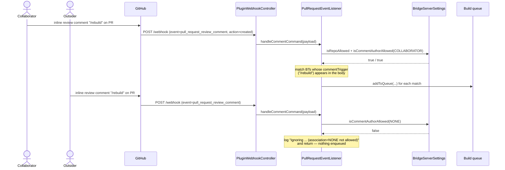

The trusted set is tunable via the
`comment.allowedAssociations` setting. An empty value opens the
trigger to everyone (use with care).

## Scenario 15: a review approval triggers a gated suite

**Actor**: a reviewer clicks **Approve** on a PR.

**Expected outcome**: every opted-in BuildType that requested
**run-on-approval** (typically an expensive suite deliberately held
back until a human has approved) is enqueued. Normal
ready/synchronize gating is independent of this path.

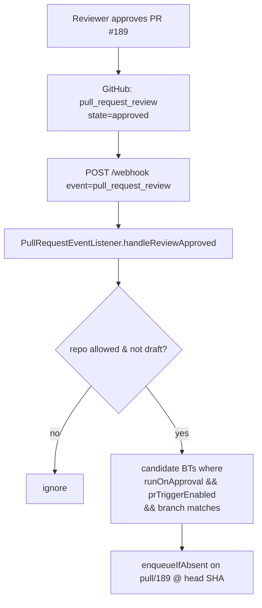

A BuildType that does **not** set run-on-approval is untouched by
this event; it still participates in the normal opened /
ready_for_review / synchronize path.

## Scenario 16: re-run from the GitHub Checks UI

**Actor**: a developer clicks **Re-run** on a TeamCity Check Run in
the PR's Checks tab.

**Expected outcome**: GitHub sends a `check_run` event with
`action=rerequested`. The plugin maps the Check Run name back to its
BuildType and enqueues a fresh build - even though a finished build
already exists at that head SHA (re-running a finished build is
exactly the intent).

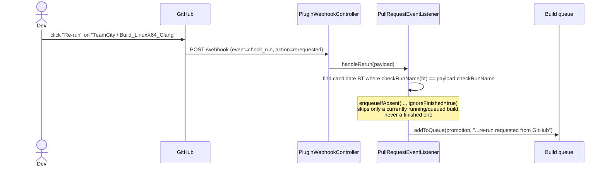

If the Check Run name matches no BuildType (e.g. it belongs to
another CI), the listener logs `matched no BuildType` and returns.

## Scenario 17: monorepo path filtering

**Actor**: a developer opens a PR that touches only `docs/`, in a
repo where one BuildType (`api-test`) is filtered to `src/api/**`.

**Expected outcome**: `api-test` is **skipped** with a Check Run
"Skipped: paths out of scope"; BuildTypes without a path filter (or
whose filter matches a changed file) are enqueued normally.

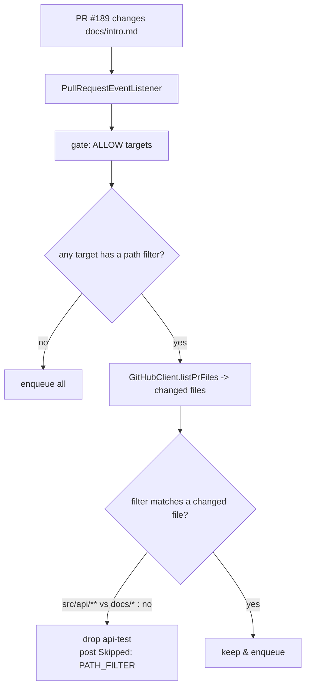

Path filtering **fails open**: if the token cannot be resolved or
the changed-files list comes back empty, all targets are kept rather
than silently swallowed. The changed-files list is fetched once,
lazily, and only when at least one target actually uses a filter.

## Scenario 18: PR is closed or merged

**Actor**: a developer merges the PR, or closes it without merging.

**Expected outcome**: every build still **queued** for that PR's
head is removed from the queue, so closing a PR mid-build stops
burning agent minutes. Running builds are left to finish (stopping
them would need an acting user and extra permissions).

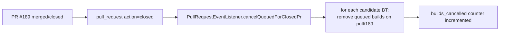

The removal comment reads `teamcity-github-bridge: PR #189 merged`
(or `closed`). The plugin still never cancels *running* builds - the
no-cancel-running stance from Scenario 4 stands.

## Scenario 19: querying status and triggering a build via the external API

**Actor**: an external tool (CI orchestrator, ChatOps bot) calls the
authenticated HTTP API. The API is enabled only when an API bearer
token has been set on the admin page; otherwise every call returns
`503`.

**Expected outcome**: `GET /api/status` returns a JSON snapshot;
`POST /api/trigger` enqueues a build.

```bash
TOKEN='the-api-token-set-on-the-admin-page'
BASE='https://<TC_HOST>/app/teamcity-github-bridge/api'

# Health/config snapshot
curl -s -H "Authorization: Bearer $TOKEN" "$BASE/status" | jq
# -> {"pluginVersion":"<version>","secretConfigured":true,"dryRun":false,
#     "replayProtection":true,"metricsEnabled":true,"repoAllowlist":[...]}

# Recent webhook events
curl -s -H "Authorization: Bearer $TOKEN" "$BASE/events" | jq '.events[0]'

# Counter snapshot (JSON; same numbers as /metrics in Prometheus form)
curl -s -H "Authorization: Bearer $TOKEN" "$BASE/metrics" | jq

# Trigger a build of a BuildType on a branch
curl -s -X POST -H "Authorization: Bearer $TOKEN" \
     -H 'Content-Type: application/json' \
     -d '{"buildTypeId":"MyProject_ApiTest","branch":"pull/189"}' \
     "$BASE/trigger"
# -> {"queued":true,"detail":"queued MyProject_ApiTest on pull/189"}
```

Responses:
- `503 {"error":"API disabled (no token configured)"}` - no API
  token set on the admin page.
- `401 {"error":"invalid or missing bearer token"}` - token absent
  or wrong (compared constant-time).
- `409` with `{"queued":false,...}` - the trigger could not enqueue
  (unknown build type, etc.).

When dry-run is on, `POST /api/trigger` returns
`{"queued":true,"detail":"dry-run: would enqueue ..."}` without
adding a build.

## Scenario 20: dry-run mode

**Actor**: an operator turns on **dry-run** in the admin settings to
stage a rollout without side effects.

**Expected outcome**: every mutating action is logged with a
`[dry-run]` prefix but not performed - no builds enqueued, no builds
removed from the queue, no Check Runs or PR comments posted. Webhook
verification, candidate matching, gating, and path filtering still
run, so the log shows exactly what *would* have happened.

```
[INFO] PullRequestEventListener - [dry-run] would enqueue MyProject_ApiTest for acme/widget#189 (no build added)
[INFO] BuildStatusCheckRunPublisher - [dry-run] would POST queued Check Run for acme/widget@<sha>
[INFO] PullRequestEventListener - [dry-run] would remove queued MyProject_ApiTest for acme/widget#190
```

Dry-run is the recommended first step when enabling the bridge on a
busy server: watch the dedicated log for a few real PRs, confirm the
right BuildTypes are matched, then turn it off.

## Scenario 21: PR-metadata gate (title / body phrase + labels)

**Actor**: a developer opens (or pushes to) a PR against a build
configuration whose GitHub Bridge feature sets one or more of the
**PR-metadata** fields — `requirePhrase`, `skipPhrase`, `labelFilter`
(v1.8.0+).

**Expected outcome**: the automatic trigger is **soft-filtered** on the
PR's title, body and labels before the build is enqueued. When the PR is
out of scope, the BuildType is **not** enqueued and a **"Skipped: PR
metadata out of scope"** Check Run is posted (`SkipReason.METADATA_FILTER`).
Like the branch/path filters these are **soft**: a manual "Run" in the TC
UI always bypasses them. The gate applies to **PR builds only**.

Three independent rules, evaluated together by `BridgeGate.metadataAllows`:

| Field | Example | Effect |
|---|---|---|
| `skipPhrase` | `[skip ci]` | PR titled `Fix typo [skip ci]` → **skipped**; the build is not enqueued and the metadata Check Run is posted. |
| `requirePhrase` | `/full` | Build runs only if the PR title or body contains `/full`; otherwise → **skipped**. |
| `labelFilter` | `+:ci` | Build runs only when the PR carries the `ci` label; an unlabelled (or `-:no-ci`-matching) PR → **skipped**. |

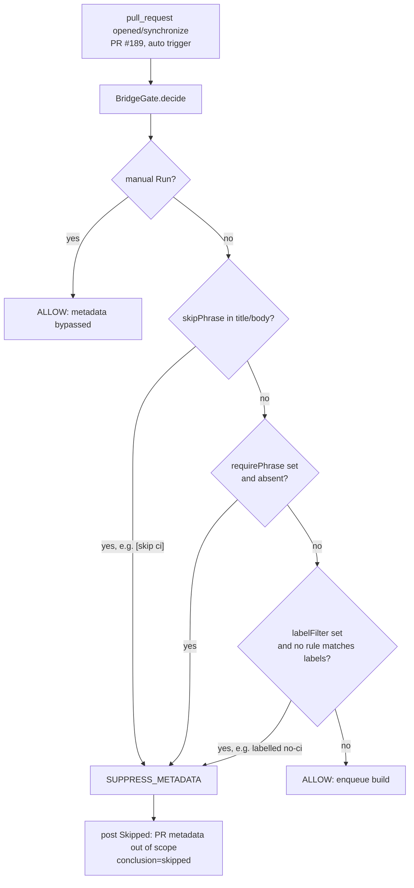

On the PR's Checks tab, an excluded build shows:

> ⊘ **TeamCity / Build_LinuxX64_Clang** — Skipped: PR metadata out of scope
> _(conclusion: `skipped`)_

A common pairing: leave `requirePhrase` blank, set `labelFilter` to
`+:ci` so an expensive suite runs **only** when a reviewer adds the `ci`
label, and set `skipPhrase` to `[skip ci]` so a title-tagged PR opts out
entirely. To force a run anyway, an operator clicks "Run" — the manual
trigger bypasses all three filters.

## Scenario 22: a project builds PRs on their own branch

**Actor**: an operator ticks **Build PRs on their own branch** on the
project's GitHub Bridge tab (`prBuildRef=branch`, v1.9.0+).

**Expected outcome**: PR builds run on the PR's head branch instead of
`pull/N`. TeamCity's Branch column shows `Feature/raycast`, and a push to
a branch that already has a PR produces **one** build rather than two.

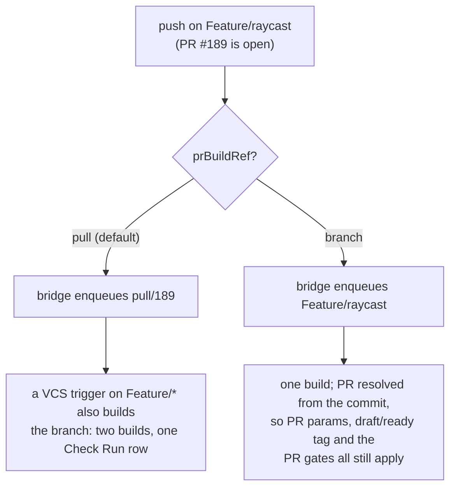

The PR gates are unchanged: the plugin decides "is this a PR build?" from
the built commit, not from the ref name, so `triggerOnPrDraft`, the PR
branch filter and the metadata filters keep working. The head branches
must be in the VCS root's branch spec, and pull requests from forks are
ignored (they always are — see
[configuration.md](configuration.md#forks-are-out-of-scope)).

## Scenario 23: "Re-run all checks" and re-running a skipped row

**Actor**: a developer clicks **Re-run all checks** on the PR, or **Re-run**
on a row that reads "Skipped: paths out of scope".

**Expected outcome**: both work (v1.9.0+).

| Click | GitHub event | Plugin action |
|---|---|---|
| **Re-run** on one check (passed, failed or **skipped**) | `check_run.rerequested` | maps the Check Run name back to its build configuration and enqueues a fresh build, even past a finished one |
| **Re-run all checks** | `check_suite.rerequested` | enqueues every opted-in build configuration for that head |

Re-running a **skipped** row now actually starts a build: an explicit
GitHub command is treated like a manual Run, so the branch, path and
metadata filters that skipped the build in the first place no longer
suppress it. Two things still hold it back: a **project-level** kill switch
(`prTrigger.enabled=false`), which mutes the bridge for that path entirely,
and a build configuration whose publication is off — it runs, it just says
nothing on GitHub.

With the **`rerunAll.onlyFailed`** setting on, "Re-run all checks" is
restricted to build configurations whose last build at that commit failed.

> The managed App subscribes to `check_suite` as of v1.9.0. On an App
> created earlier, **Verify App configuration** on the admin page reports
> `check_suite` as a missing event — add it in the App's webhook settings,
> otherwise the "Re-run all checks" button stays silent.

## Scenario 24: finding the builds of a branch — or of a PR

**Actor**: anyone opening the project's **Branches & PRs** tab (v1.9.0+).

**Expected outcome**: one list of the bridge's builds — queued, running and
the last 30 finished per build configuration — each row carrying **both**
keys: the branch it ran on and the PR it belongs to. Typing `Feature/` finds
a branch; typing `189` or `#189` finds a pull request; the columns sort by
time, branch or PR.

| Branch | PR | Build configuration | Build | State | Artifacts |
|---|---|---|---|---|---|
| `Feature/raycast` **ready** | #189 | Build_Linux | 87 | Build passed | artifacts |
| `Feature/raycast` **ready** | #189 | Build_Windows | queued | Queued | |
| `master` | | Nightly_All | 86 | Build passed | artifacts |

**How the PR column is filled**: from the build's **PR tag** (`pr-189` by
default), which the plugin writes when the build runs and back-fills on
`pull_request.opened` for builds that ran *before* the PR existed. A
`pull/N` ref supplies the number on its own. No GitHub API call is made to
render the page.

The tag is optional (`prTag.enabled`) and its prefix is configurable
(`prTag.prefix`) — see
[configuration.md](configuration.md#feature-flags). With tagging off, the
PR column only shows what the ref says: a `pull/N` build keeps its number, a
build on a work branch loses it.

## Scenario 25: publication and triggering are two separate switches

**Actor**: an operator configuring a build configuration that should not
clutter pull requests, or one that should never appear on GitHub at all.

**Expected outcome**: two independent decisions.

| Want | Set |
|---|---|
| Reports to GitHub, but the bridge never starts it on a PR (installer, deploy, nightly) | `publishChecks` **on**, `triggerOnPrReady` **off** — invisible until someone (or a schedule) starts it, then fully reported |
| Never appears on GitHub, whatever happens | `publishChecks` **off** — the build still gets the PR parameters and the `draft`/`ready` tags, it just says nothing |
| Normal PR check | both **on** (defaults) |

**Publication does not depend on the trigger source.** A build configuration
that publishes reports a PR event, a VCS trigger, a schedule, a manual Run and
a GitHub command alike. Only `publishChecks` silences it.

**And the bridge never removes what it did not start.** Unchecking a
`triggerOn*` flag means "do not trigger this automatically" — a Run, a
schedule or a VCS trigger goes through untouched. The queue is only ever
cleaned in two automatic cases: a scope filter excluded the build (draft PR,
branch list, path filter, PR metadata), or the next scenario.

Two more guarantees about queue cleanup, both worth knowing before rollout:
it only ever touches a build configuration that **carries this build
feature** (and whose project provides `repo` + `connectionId`) — anything
else is invisible to it; and it can be switched **off server-wide** with the
**Queue cleanup** flag on the admin page, after which the bridge only adds
builds and reports on them.

## Scenario 26: the same commit is queued again after it already passed

**Actor**: a build configuration with **Reuse a passed commit**
(`skipIfCommitPassed`) checked, and a commit that already went green there —
e.g. a cascade merge that changed nothing for this configuration, or a PR
event arriving after the branch build already ran the same commit.

**Expected outcome**: the queued build is removed and the earlier success is
republished at that commit, so GitHub stays green without spending an agent.

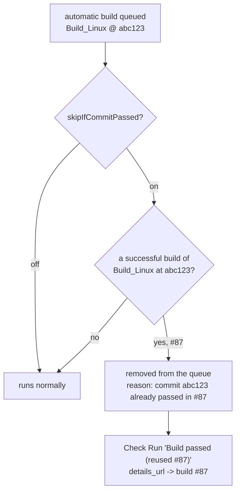

Matched on the **commit alone**, any ref: a build of `Feature/x` and a build
of `pull/189` at the same commit are the same Check Run row for GitHub, so
running both is pure waste.

**Never applied to an explicit request.** A manual Run, a comment command and
the **Re-run** / **Re-run all checks** buttons mean "do it again", and they
do. And leave the box **unchecked** for scheduled suites: a nightly on an
unchanged commit is exactly how environment rot gets caught.

## Scenario 27: a compiler error is annotated in the diff

**Actor**: a build fails to compile on a PR.

**Expected outcome**: on top of the red Check Run and the failure reasons in
its body, GitHub shows the diagnostics **on the offending lines** of the PR's
diff (v1.9.0+, `checkRun.annotations`, default on).

```
src/render/ray.cpp
   40 |   auto hit = scene.intersect(r);
   41 |
   42 |   return hit.trace();
      |          ^^^^^^^^^^^
      |  ✗ error: no member named 'trace'         <- Check Run annotation
```

Parsed from the build problems TeamCity already reports — no build-log
scanning — in both shapes a C++ toolchain produces:

| Toolchain | Diagnostic line |
|---|---|
| clang / gcc | `/opt/agent/work/xxx/src/render/ray.cpp:42:7: error: no member named 'trace'` |
| MSVC | `C:\agent\work\xxx\src\win\dialog.cpp(88,12): error C2065: undeclared identifier` |

Paths are made **repo-relative** against the build's checkout directory. A
diagnostic pointing outside it — a system header, a toolchain file — is
skipped, because GitHub rejects an annotation whose path is not in the
repository. Capped at the 50 annotations GitHub accepts per request, with
duplicates collapsed (a failing build repeats the same diagnostic across
targets).

Test failures are **not** annotated: TeamCity reports a class and a method,
not a file and a line.

## Scenario 28: a label is added, a title is edited, a PR is reopened

**Actor**: a reviewer adds the `ci-full` label, an author edits the PR title
to drop `[skip ci]`, or someone reopens a closed PR (v1.9.0+).

**Expected outcome**: the bridge re-evaluates and enqueues what just became
eligible — a label is now a **trigger**, not only a filter.

| Action | Behaviour |
|---|---|
| `reopened` | like `opened`: full evaluation, skip rows included |
| `labeled` / `unlabeled` | re-evaluate the same commit; enqueue what became eligible |
| `edited` (title/body) | idem, for the `requirePhrase` / `skipPhrase` gate |

**Why the last two post no "Skipped" row.** A Check Run is keyed on
`(name, commit)`. These actions do not change the commit, so a build has
often already reported for it — posting `Skipped: PR metadata out of scope`
would **overwrite that result**, turning a green row into a skip because
someone removed a label. So the re-evaluation actions only ever *add* builds;
they never write a skip row.

## Summary table

| Trigger | Plugin action | Build / GitHub outcome |
|---|---|---|
| Draft PR opened | Promotion tagged `draft` + skipped Check Run posted + cleaner removes from queue | Queue stays clean, pill visible, GitHub PR shows "Skipped: draft PR" |
| Push to draft | Same path again on new revision | Same |
| Marked ready for review | Listener enqueues + promotion tagged `ready` + filter allows | Builds run, ready pill visible, queued / in_progress Check Run posted |
| Build added to queue | `BuildStatusCheckRunPublisher.buildTypeAddedToQueue` | Check Run `status=queued`, title "Queued" (skipped for draft-suppressed builds so they don't race with the skipped row) |
| Build starts | `BuildStatusCheckRunPublisher.buildStarted` | Check Run `status=in_progress`, title "Building" |
| Build stopped manually (mid-run) | `BuildStatusCheckRunPublisher.buildInterrupted` (early) + `buildFinished` (final) | Check Run `status=completed, conclusion=cancelled` |
| Build cancelled while still in queue | `BuildStatusCheckRunPublisher.buildRemovedFromQueue` (only when removed by a user) | Check Run "Cancelled before start", conclusion `cancelled` |
| Build finishes (success) | `BuildStatusCheckRunPublisher.buildFinished` | Check Run `status=completed`, conclusion `success`, summary = build's `statusDescriptor.text` |
| Build finishes (failure) | Same hook, different mapping | conclusion `failure` |
| Build cancelled (final) | Same hook, `isInterrupted` short-circuits | conclusion `cancelled` |
| User clicks "Run" on a draft PR (or comments the trigger phrase) | An explicit request bypasses the draft rule and the soft filters, and is never removed from the queue (1.9.0+) | Build actually runs, and reports |
| Reverted to draft | None | In-flight builds continue, new ones held |
| API error during draft check | Logged warning | Build allowed (fail-open) |
| Missing webhook secret | Webhook rejected 401 | No retrigger; warning logged; visible in admin page recent events |
| Build type not opted in | None | No change |
| Build configuration with `publishChecks` off | Nothing published, whatever the trigger | Invisible on GitHub; PR parameters and tags still applied |
| Automatic build of a commit that already passed (`skipIfCommitPassed`) | Removed from the queue, earlier success republished | `Build passed (reused #87)` at the same commit |
| Trusted collaborator comments the trigger phrase | `PullRequestEventListener.handleCommentCommand` enqueues matching BTs | Builds run; outside commenters are ignored |
| PR review approved | `handleReviewApproved` enqueues run-on-approval BTs | Gated suites run |
| Re-run clicked in GitHub Checks UI | `handleRerun` (`ignoreFinished=true`) | Fresh build runs even past a finished one |
| PR touches only out-of-scope paths | `applyPathFilter` drops the BT, posts Skipped | GitHub PR shows "Skipped: paths out of scope" |
| PR title/body/labels out of scope (`requirePhrase`/`skipPhrase`/`labelFilter`) | `BridgeGate` returns `SUPPRESS_METADATA`, posts Skipped (auto only) | GitHub PR shows "Skipped: PR metadata out of scope"; manual Run bypasses |
| PR closed / merged | `cancelQueuedForClosedPr` removes queued builds | Queue drained; running builds finish |
| PR from a fork | Event dropped (logged, `fork_events_ignored`) | Nothing runs — the bridge serves one repository, never its forks |
| Trigger phrase / approval / re-run on a build the filters excluded | Enqueued as an explicit **command**: the scope filters are bypassed and nothing removes it afterwards | The build actually runs (no "Skipped" row comes back to undo it) |
| "Re-run all checks" clicked | `handleRerunAll` enqueues every opted-in BT for that head (optionally only the failed ones) | Whole check set re-runs |
| Build finishes with artifacts | Check Run `output.text` lists them; sticky comment gains an `[artifacts]` link | One click from the PR to the installer/package |
| Build fails with compiler diagnostics | `BuildProblemAnnotations` parses them into `output.annotations` | Errors/warnings pinned to their line in the PR's diff |
| Label added / removed, title edited | Re-evaluated: newly eligible builds are enqueued, **no** skip row posted | The green rows of that commit are left untouched |
| PR reopened | Treated like `opened` | Full check set runs again |
| Opted-in BT also carrying the bundled publisher | `WARN` at startup + a **Single status publisher** self-test row | The operator is told; nothing is disabled for them |
| External API trigger | `triggerBuild` via `/api/trigger` | Build enqueued (or dry-run no-op) |
| Dry-run enabled | Every mutation logged `[dry-run]`, none performed | No builds/Check Runs/comments; log shows intent |

## See also

- [Security model](security.md) - why the plugin fails closed on
  webhooks and open on API errors.
- [Troubleshooting](troubleshooting.md) - what to do when a
  scenario doesn't behave as expected.
