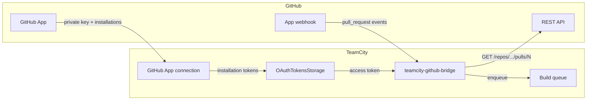
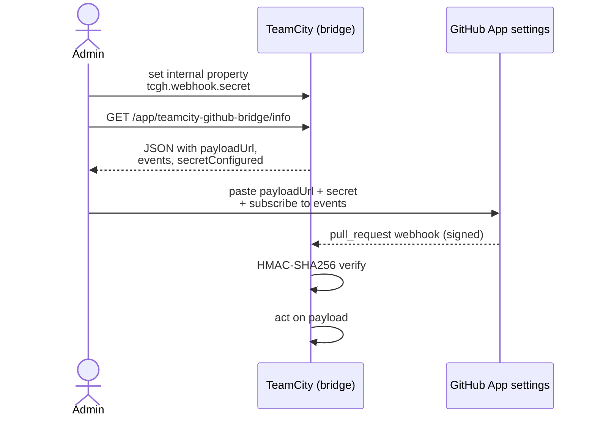
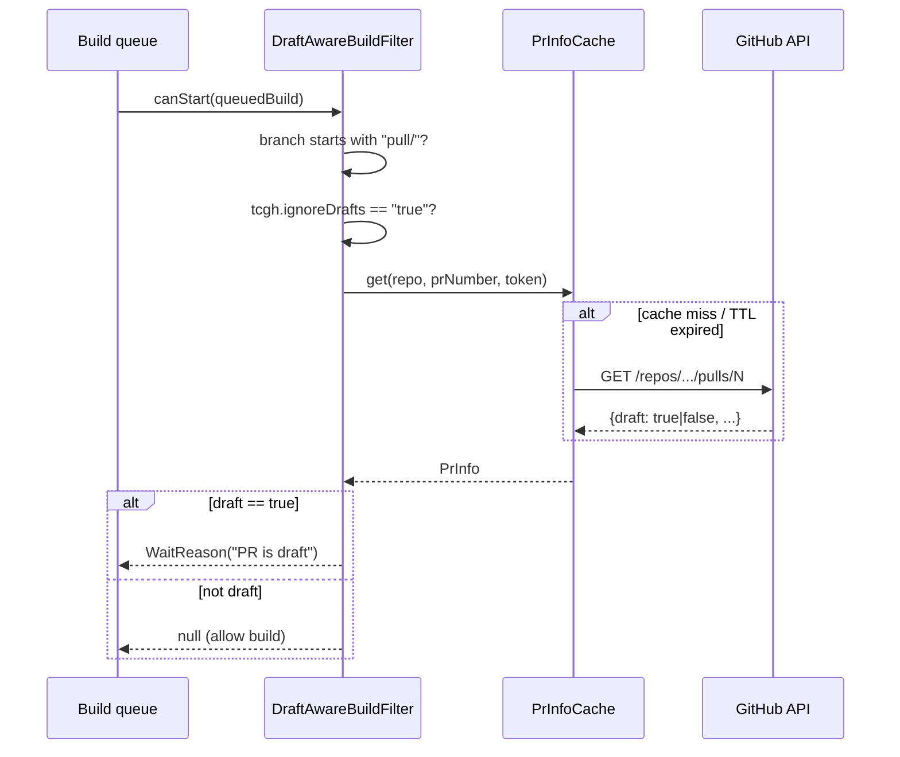
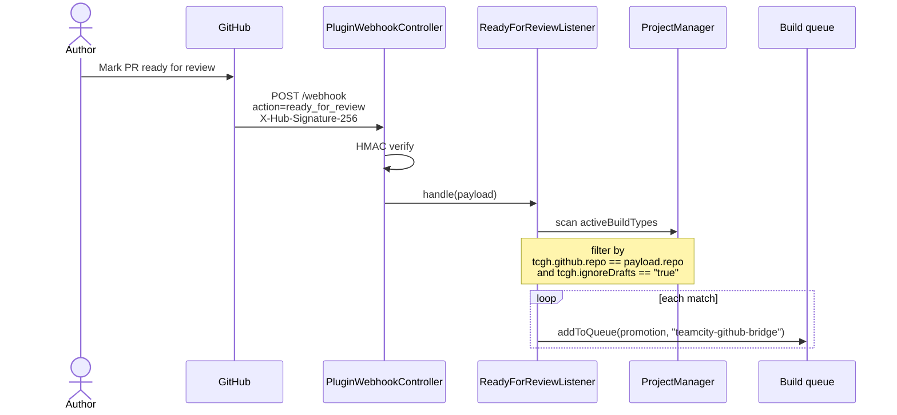

# TeamCity GitHub Bridge - Usage Guide

This plugin fills the gaps in TeamCity 2026.1's bundled GitHub
integration. It detects PR draft state, retriggers builds when a PR
moves from draft to ready for review, and exposes ready-to-paste
webhook configuration for the GitHub App.

All TeamCity to GitHub communication goes through a **single GitHub
App** plus its **App-level webhook**. No personal access tokens, no
per-user OAuth tokens.

## Table of contents

1. [Architecture overview](#architecture-overview)
2. [Install the plugin](#install-the-plugin)
3. [Configure the GitHub App connection in TeamCity](#configure-the-github-app-connection-in-teamcity)
4. [Configure the App-level webhook](#configure-the-app-level-webhook)
5. [Enable the bridge on a build configuration](#enable-the-bridge-on-a-build-configuration)
6. [How the draft suppression works](#how-the-draft-suppression-works)
7. [How the ready-for-review retrigger works](#how-the-ready-for-review-retrigger-works)
8. [Internal properties reference](#internal-properties-reference)
9. [Troubleshooting](#troubleshooting)

---

## Architecture overview



Outbound traffic (TeamCity to GitHub) uses installation tokens that
the TeamCity GitHub App connection refreshes silently. Tokens are
treated as opaque strings; the plugin makes no assumption about their
format or length. This is forward compatible with the new stateless
`ghs_*` token format introduced in 2026 - the opt-in header
`X-GitHub-Stateless-S2S-Token` belongs on the token issuance call
which TeamCity performs internally.

Inbound traffic (GitHub to TeamCity) uses a single App-level webhook
whose URL points at the plugin endpoint. Every payload is HMAC-SHA256
verified against a shared secret before processing.

## Install the plugin

1. Build the plugin archive (Docker-only, nothing installed on the
   host):

   ```bash
   ./dev package
   ```

2. Copy the resulting archive to the TeamCity Data Directory:

   ```bash
   cp target/teamcity-github-bridge-*.zip <TC_DATA_DIR>/plugins/
   ```

3. Restart the server, or upload the archive interactively via
   `Administration -> Plugins List -> Upload Plugin Zip`.

4. Confirm the plugin loaded by checking
   `<TC_DATA_DIR>/logs/teamcity-server.log` for the line:

   ```
   TeamCity GitHub Bridge plugin loaded
   ```

## Configure the GitHub App connection in TeamCity

The plugin reuses TeamCity's existing GitHub App connection mechanism
(no custom storage). For each project that needs the bridge:

1. Go to `<Project> -> Connections -> Add Connection`.
2. Pick **GitHub App** and paste:
   - App ID
   - Client ID and Client Secret
   - Private key (PEM)
3. Save and note the connection ID (visible in the URL bar as
   `PROJECT_EXT_<n>`). This ID is the value of the per-buildType
   parameter `tcgh.github.connectionId` below.

The GitHub App must have at least these installation permissions:

| Resource | Access |
|---|---|
| Pull requests | Read |
| Contents | Read |
| Metadata | Read |
| Webhooks (App-level) | enabled |

## Configure the App-level webhook

The plugin exposes its live webhook configuration so you can copy it
straight into the GitHub App settings.



### Steps

1. **Generate a strong secret** (>=32 random bytes) and set it on the
   TeamCity server in `<TC_DATA_DIR>/config/internal.properties`:

   ```
   tcgh.webhook.secret=<your-long-random-string>
   ```

   then reload the configuration (or restart). The plugin refuses any
   request without a valid signature, so this is fail-closed by
   design.

2. **Inspect the live config** to get the values you need to paste in
   GitHub:

   ```bash
   curl -s https://<TC_HOST>/app/teamcity-github-bridge/info | jq
   ```

   Example response:

   ```json
   {
     "payloadUrl": "https://teamcity.example.com/app/teamcity-github-bridge/webhook",
     "contentType": "application/json",
     "sslVerification": true,
     "recommendedEvents": ["pull_request", "pull_request_review", "push", "check_suite", "ping"],
     "secretConfigured": true,
     "pluginVersion": "TeamCity 2026.1 (build 222521)"
   }
   ```

   A Markdown rendering ready to paste into a wiki is available at
   `/app/teamcity-github-bridge/info.md`.

3. **Open the GitHub App webhook page** at
   `https://github.com/settings/apps/<your-app>` and copy the values:

   | GitHub field | Value |
   |---|---|
   | Active | yes |
   | Payload URL | the `payloadUrl` from above |
   | Content type | `application/json` |
   | Secret | the same string set in `tcgh.webhook.secret` |
   | SSL verification | enable |

4. **Subscribe to events.** At minimum: `Pull request`. The plugin
   currently consumes `pull_request` (`ready_for_review` action) and
   `ping` (health check). `push` and `check_suite` are not yet acted
   upon but are listed for forward compatibility.

5. **Verify the wiring.** GitHub will send a `ping` event right after
   you save the webhook. In the App's `Recent Deliveries` panel you
   should see `200 OK` with `pong` in the response body.

## Enable the bridge on a build configuration

For each build configuration that should benefit from the draft
suppression and retrigger behavior, set these parameters
(`<BuildType> -> Parameters -> Add new parameter`):

| Parameter | Required | Purpose |
|---|---|---|
| `tcgh.ignoreDrafts` | yes | Set to `true` to suppress builds for draft PRs. |
| `tcgh.github.repo` | yes | `owner/name` slug of the GitHub repository this build watches. |
| `tcgh.github.connectionId` | yes | The TeamCity GitHub App connection ID (from `Project -> Connections`). |

You can put them on a shared template if many build types target the
same repo.

## How the draft suppression works

When a build is about to start on a `pull/N` branch, the plugin runs
a `StartBuildPrecondition`:



Notes:
- The PR info is cached per `(repo, number)` with a 60 second TTL,
  configurable via `tcgh.prinfo.cache.ttl.seconds` (plugin parameter).
- A network failure or missing token does NOT suppress the build:
  the plugin fails open to avoid blocking the pipeline on
  GitHub-side outages. The error is logged.
- The wait reason is visible in the TeamCity build queue UI.

## How the ready-for-review retrigger works

When GitHub fires a `pull_request` event with action
`ready_for_review`, the plugin enqueues a fresh build for every
matching build configuration:



Notes:
- The plugin trusts the verified payload's `action` field; it does
  NOT re-query the GitHub API to confirm the draft transition (the
  signature already authenticates GitHub).
- TeamCity's queue optimizer deduplicates: if a build is already in
  the queue or running for that exact revision, no duplicate is added.
- Builds are enqueued with the comment `Retriggered by
  teamcity-github-bridge after PR #N became ready for review` so they
  are easy to spot in the history.

## Internal properties reference

Set these in `<TC_DATA_DIR>/config/internal.properties`:

| Property | Default | Purpose |
|---|---|---|
| `tcgh.webhook.secret` | _unset_ | HMAC secret used to verify webhook signatures. **Must be set** or the plugin rejects everything with 401. |

Plugin-level parameters (declared in `teamcity-plugin.xml`):

| Parameter | Default | Purpose |
|---|---|---|
| `tcgh.github.api.base` | `https://api.github.com` | Override for GitHub Enterprise. |
| `tcgh.github.api.version` | `2022-11-28` | The `X-GitHub-Api-Version` header value sent on REST calls. |
| `tcgh.prinfo.cache.ttl.seconds` | `60` | TTL for the in-memory PR info cache. |
| `tcgh.webhook.path` | `/app/teamcity-github-bridge/webhook` | The endpoint path. Change with care - it is also referenced by `/app/teamcity-github-bridge/info`. |

## Troubleshooting

### `curl /info` returns `secretConfigured: false`

The internal property `tcgh.webhook.secret` is missing or blank. Set
it in `<TC_DATA_DIR>/config/internal.properties` and reload the
config. Until you do, every webhook delivery will be rejected with
`401 Invalid signature`.

### GitHub `Recent Deliveries` shows `401 Invalid signature`

- The secret on GitHub does not match the one in
  `tcgh.webhook.secret`. Regenerate the secret on both sides and
  reload.
- Or the payload is being tampered with by an intermediate proxy.
  Disable any reverse proxy that rewrites the body.

### A build still runs even though the PR is draft

- Check that all three parameters are set on the build type:
  `tcgh.ignoreDrafts`, `tcgh.github.repo`, `tcgh.github.connectionId`.
- Look for log lines like `Cannot resolve token for <buildType>;
  allowing build to proceed` - the connection ID may be wrong, or
  the GitHub App is not installed on the target repo.
- The plugin fails open on errors. To diagnose, increase the
  `io.github.dlachouette.teamcity.github` logger to DEBUG via
  `<TC_DATA_DIR>/config/teamcity-server-log4j.xml`.

### Builds are not retriggered on ready-for-review

- Verify the webhook delivered successfully in GitHub's `Recent
  Deliveries`.
- Confirm the build type's `tcgh.github.repo` parameter matches the
  exact `owner/name` slug GitHub sent in `repository.full_name`.
- The plugin only retriggers build types that also have
  `tcgh.ignoreDrafts == "true"` - this avoids double-triggering on
  configurations that never opted into the bridge.

### `Webhook secret is not configured` keeps appearing in the server log

The plugin logs this on every incoming request when the secret is
missing. This is intentional: it makes the misconfiguration loud.
Set `tcgh.webhook.secret` to silence it.
