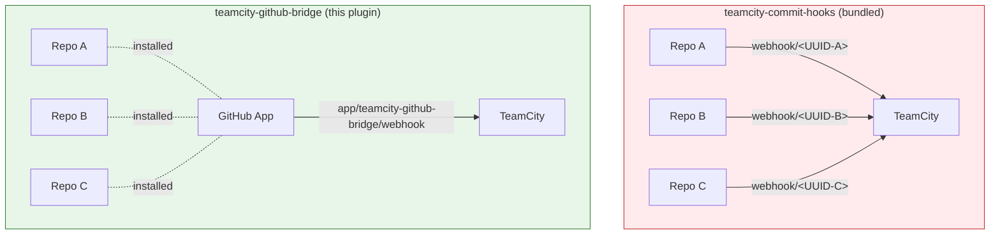
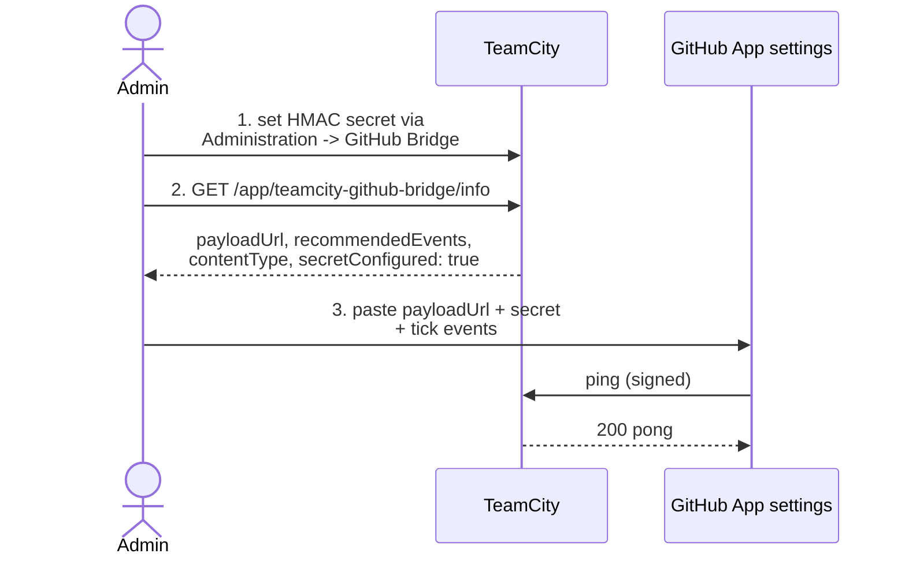

# Webhook setup

> **Using the managed App (recommended)?** If you set the App up via
> `Administration -> GitHub Bridge -> Create GitHub App` (the
> managed-App flow, see [quickstart.md](quickstart.md)), the webhook
> **URL and secret are configured automatically** — you can skip this
> page entirely.

Once a [GitHub App](github-app-setup.md) is wired to TeamCity, the
remaining piece is making GitHub deliver events back to the plugin.
This page covers the **manual** path for Apps that were not created
through the managed flow.

This plugin uses a **single App-level webhook** per GitHub App. No
per-repo webhooks to maintain.

## How it differs from `teamcity-commit-hooks`



You can keep `commit-hooks` for repos that need it; the two plugins
do not conflict.

## Configure the webhook in three steps



### Step 1: configure the HMAC secret on the TeamCity side

Generate a strong random string (>=32 bytes):

```bash
openssl rand -hex 48
# 0a4f0c9b5e8e3c1d2a4b...
```

**Via the plugin's admin page (recommended)**

Open `Administration -> Server Administration -> GitHub Bridge`.
Under `HMAC secret` paste the random string into the form and
click **Save**. The plugin writes the value to its own file,
`<TC_DATA_DIR>/config/teamcity-github-bridge.properties` (key
`webhook.secret`), and the next webhook delivery uses the new secret
immediately.

You can also **Clear secret** from the same form, which removes the
key and re-enables fail-closed mode (every delivery rejected with
401 until a new secret is set).

The plugin-owned file is also writable directly if you prefer the
filesystem:

```properties
webhook.secret=<paste the string here>
```

It is hot-reloaded; no restart needed.

**Via `internal.properties` (legacy fallback, still supported)**

The plugin also reads the legacy key from TC's
`internal.properties`, kept for operators who configured the secret
manually before the admin page existed. Prefer the admin form above;
use this only when you cannot reach the admin page.

Go to `Administration -> Server Administration -> Diagnostics ->
Internal Properties` (direct URL:
`https://<TC>/admin/admin.html?item=diagnostics&tab=internalProperties`)
and add:

```properties
teamcity.github.bridge.webhook.secret=<paste the string here>
```

or edit `<TC_DATA_DIR>/config/internal.properties` directly with the
same key. If both sources are populated, the plugin's own file takes
precedence (visible in the admin page as "via this page" vs "via
internal.properties - legacy").

> **Important**: do **not** confuse this secret with the "Webhook
> secret" field inside the GitHub App connection form (`Project ->
> Connections -> Edit GitHub App -> Webhook secret`). That field is
> stored on the connection descriptor and is consumed by TeamCity's
> **bundled** integrations only; this plugin does not read it.

> The plugin **rejects any request without a valid signature** with
> HTTP 401. Until this secret is set, GitHub will see 401 on every
> delivery - that's intentional, fail-closed.

### Step 2: fetch the live config from the plugin

```bash
curl -s https://<TC_HOST>/app/teamcity-github-bridge/info | jq
```

Example output:

```json
{
  "payloadUrl": "https://teamcity.example.com/app/teamcity-github-bridge/webhook",
  "contentType": "application/json",
  "sslVerification": true,
  "recommendedEvents": ["pull_request", "pull_request_review", "issue_comment", "check_run", "push", "check_suite", "ping"],
  "secretConfigured": true,
  "logFile": "<TC_DATA_DIR>/logs/teamcity-github-bridge.log",
  "logConfigured": true,
  "pluginVersion": "<version>"
}
```

A Markdown rendering ready to paste into a wiki/runbook is at:

```bash
curl -s https://<TC_HOST>/app/teamcity-github-bridge/info.md
```

### Step 3: configure GitHub

Open your App at `https://github.com/settings/apps/<your-app>` and
scroll to **Webhook**.

| GitHub field | Value | Source |
|---|---|---|
| Active | Checked | n/a |
| Webhook URL | `payloadUrl` from `/info` | step 2 |
| Content type | `application/json` | required (the plugin parses JSON, not URL-encoded form data) |
| Secret | the random string from step 1 | step 1 |
| SSL verification | Enable | required - the plugin assumes TLS |

```
GitHub App > Webhook
+------------------------------------------------+
| [x] Active                                     |
|                                                |
| Webhook URL                                    |
| [ https://teamcity.example.com/app/teamcity-]  |
| [ github-bridge/webhook                      ] |
|                                                |
| Content type                                   |
| [ application/json                v]           |
|                                                |
| Secret                                         |
| [ ************************************      ] |
|                                                |
| SSL verification                               |
| (o) Enable SSL verification                    |
| ( ) Disable                                    |
+------------------------------------------------+
```

Then scroll to **Subscribe to events** and tick the following. These
match `recommendedEvents` from `/info`. Most are actively consumed by
the plugin today; **push** and **check_suite** are recommended for
coexistence / future use but are **not** consumed by the plugin
today (subscribing now means no resubscription later):

- [x] **Pull request** - required for draft / ready-for-review
  detection, synchronize (push to PR), and PR close/merge handling
  (closing or merging a PR cancels its still-queued builds).
- [x] **Pull request review** - powers **run-on-approval**: a build
  can be gated until a reviewer approves, at which point the review
  event enqueues it.
- [x] **Issue comment** - powers **comment triggers**: posting the
  configured phrase on a PR (an `issue_comment`) enqueues builds,
  restricted to trusted commenters (collaborators by default).
- [x] **Check run** - powers the **Re-run** button in GitHub's
  Checks UI: a `check_run` `rerequested` event re-enqueues the build
  straight from the PR's checks tab.
- [x] **Push** - branch pushes outside the PR flow. *Recommended for
  coexistence / future use; not consumed by the plugin today.*
- [x] **Check suite** - companion to the Check Run lifecycle.
  *Recommended for coexistence / future use; not consumed by the
  plugin today.*
- [x] **Ping** - delivered once on save; used for the health-check
  round-trip below.

> **Permission note**: the **sticky PR summary comment** feature
> (a single maintained comment on the PR summarising build status)
> requires the GitHub App to have **pull requests / issues** set to
> **Read & write**. Without write permission the plugin still runs,
> but it cannot post or update the comment. See
> [github-app-setup.md](github-app-setup.md) for granting
> permissions.

Click `Save changes`.

## Verify the wiring

GitHub sends a `ping` event right after you save. You can see it in
`Advanced -> Recent Deliveries`:

```
Recent Deliveries
+----------------------------------------------------------+
|  v  ping            12:34:56  200  Response: pong        |
+----------------------------------------------------------+
```

If you see `200 pong`, the round-trip is complete.

If you see `401 Invalid signature`:
- The secret on GitHub and the one configured server-side (admin
  page, or the legacy `teamcity.github.bridge.webhook.secret`) differ.
- Or a reverse proxy is rewriting the request body. Check your
  ingress config; the plugin signs over the raw body bytes.

If you see `404 Not Found`:
- The plugin is not loaded. Re-check the server log
  ([installation.md#step-3-verify-the-load](installation.md#step-3-verify-the-load)).
- Or the URL is wrong - it must be exactly `/app/teamcity-github-bridge/webhook`.

## What the plugin does with each event

| Event | Action | Acknowledged with |
|---|---|---|
| `ping` | Nothing; health check. | `200 pong` |
| `pull_request` with `action: opened` (and `draft: false`) | Look up matching build configs, enqueue a build for `pull/N` on each (skipping any that already have a running / queued / finished build at the same head SHA). | `200 OK` |
| `pull_request` with `action: ready_for_review` | Same as above. Draft → ready transition; payload's `draft` is false by GitHub's contract. | `200 OK` |
| `pull_request` with `action: synchronize` (and `draft: false`) | Same as above. Push to a ready PR. | `200 OK` |
| `pull_request` with `action: opened` or `synchronize`, `draft: true` | No enqueue — drafts intentionally suppressed. | `200 OK` |
| `pull_request` with `action: closed` (incl. merged) | Cancel any of the PR's builds still sitting in the queue. | `200 OK` |
| `pull_request` (other actions: `labeled`, `edited`, ...) | Ignored. | `200 OK` |
| `pull_request_review` with `action: submitted`, approved | Run-on-approval: enqueue matching builds gated on review approval. | `200 OK` |
| `issue_comment` with `action: created` on a PR | If the body matches the configured trigger phrase and the commenter is trusted (collaborator by default), enqueue matching builds. | `200 OK` |
| `check_run` with `action: rerequested` | Re-enqueue the build behind the Check Run (the **Re-run** button in GitHub's Checks UI). | `200 OK` |
| Any other event | Ignored. | `204 No Content` |

Duplicate deliveries (same `X-GitHub-Delivery` id) are detected and
dropped when replay protection is enabled, so GitHub re-sends do not
double-enqueue.

See [usage-scenarios.md](usage-scenarios.md) for end-to-end flows.

## Rotating the secret

Eventually you'll want to rotate. The plugin does not support
overlapping secrets, so coordinate the rotation:

1. Generate a new secret.
2. Paste it into the admin form (`Administration -> Server
   Administration -> GitHub Bridge -> HMAC secret`) and **Save**. The
   new secret is live on the next delivery. (Legacy fallback: update
   `teamcity.github.bridge.webhook.secret` in TeamCity's
   `internal.properties`, which TeamCity hot-reloads within a second.)
3. Update the secret on the GitHub App webhook page and save.
4. There is a small window (sub-second) where one delivery may be
   rejected. GitHub auto-retries failed deliveries, so this is
   non-fatal but worth mentioning.

## What's next

- Continue with [configuration.md](configuration.md) to enable the
  bridge on a build type.
- Or read [usage-scenarios.md](usage-scenarios.md) to understand
  what triggers what.
