

  

# Why this plugin

> **The short version.** Connecting TeamCity to GitHub properly means making
> decisions *about the build queue, at the moment a build is queued*. Only code
> running inside the TeamCity server can do that. Everything else — an external
> webhook relay, a set of "service" build configurations, a cron job against the
> REST API — is doing the same work one step too late, with less information,
> and with its own server to keep alive.
>
> This plugin is that code: one zip in your data directory, no extra service, no
> extra host, no extra credential store, and 408 unit tests behind it.

**Audience.** You already have TeamCity talking to GitHub *somehow* and you are
wondering whether to keep it. There are three realistic options, and this page
argues about all three:

| Option | What it is |
|---|---|
| **A. Bundled integration** | TeamCity's own `pullRequests` + `commitStatusPublisher` features. |
| **B. External glue** | A small service (Flask/Node/Lambda…) subscribed to GitHub webhooks, driving TeamCity through its REST API — usually plus a handful of TeamCity "service" build configurations that deduplicate, cancel and re-trigger. |
| **C. This plugin** | Server-side TeamCity plugin, in-process, using the same extension points TeamCity uses itself. |

Option B is not a strawman: it is the *correct* first answer. It is how you get
something working in an afternoon, in a language you like, without learning the
TeamCity plugin SDK. Most teams that need more than option A end up there. The
argument below is not "that was a bad idea" — it is **"the thing you built has a
ceiling, and the ceiling is architectural, not a matter of effort."**

---

## 1. The whole argument in one diagram

The question that decides everything: **where does the "should this build run?"
decision happen?**

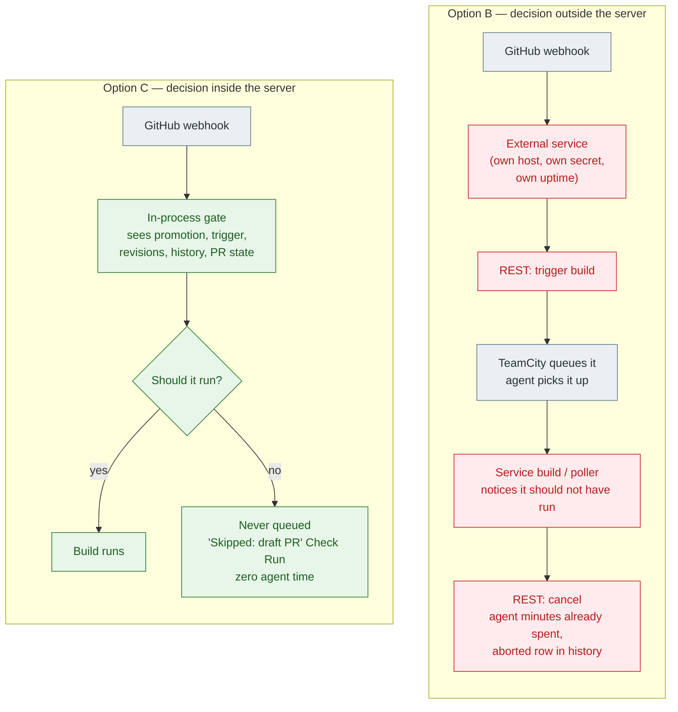

Option B can only ever *react to* the queue. Option C *is part of* the queue.
Everything in the rest of this page follows from that one difference.

---

## 2. What being inside the server actually buys you

Each row below is a thing this plugin does. The last column is not "B is worse
at this" — it is *why B structurally cannot do it well*, no matter how good the
code is.

| Capability | How the plugin does it | Why external glue can't match it |
|---|---|---|
| **A draft-PR build never starts** | `DraftBuildQueueCleaner` removes it, and `StartBuildPrecondition` holds it as a safety net with a visible wait reason. | Outside, the build is already queued before you hear about it. Best case you cancel it — after an agent took it. You pay the minutes and get an `aborted` row in the history of every draft PR. |
| **Cancel a running build whose verdict nobody will read** | On a new push, builds on the previous head are stopped — but never a personal build, never one a human started, and never the *last* one in flight for that ref. On PR close/merge, all of them go. | Those guards need `triggeredBy.isTriggeredByUser`, `promotion.revisions`, and "is a replacement already in flight?" — live queue state at decision time. Over REST you get a snapshot that is already stale, and races produce the worst outcome: cancelling the *replacement*. |
| **Don't rebuild a commit that already passed** | The queued build is dropped and the earlier green Check Run is republished. | Requires reading build history *and* holding the queue in the same instant. From outside, the agent has usually already started. |
| **The Check Run says what the build actually said** | `output.summary` carries the build's real `statusDescriptor.text` (whatever `##teamcity[buildStatus text='…']` set). | The bundled publisher hard-codes `"TeamCity build finished"`. External glue must re-fetch and re-derive the text over REST — a second round trip, a second source of truth, a second thing to get wrong. |
| **Where the build's time went** | Total, working time, and the wait split between *dependencies* and *free agent* — read off the SDK objects the event already carries. | Reconstructable over REST, at the cost of several calls per build and your own model of TeamCity's timing semantics. |
| **What the tests did** | Counts in the Check Run title GitHub shows in the merge box; failing tests in the body, new failures first, muted ones apart. | Same: more REST calls, your own re-implementation of "new failure" and "muted". |
| **Compiler errors pinned to the diff** | clang/gcc and MSVC diagnostics become GitHub annotations on file + line — read from the build problems, or from the build log when the runner produced none (a Command Line step reports only "exit code 1"). | The relay would have to pull each failed build's whole log over REST, and it does not know the agent's checkout directory — without which a diagnostic's absolute path cannot be made repo-relative, and GitHub rejects the annotation. |
| **PR metadata inside the build** | 8 parameters (`…pullRequest.number`, `.title`, `.author`, `.sourceBranch`, `.targetBranch`, `.headSha`, `.isDraft`, `.isPullRequest`) always emitted, usable in DSL conditions — including for builds *not* triggered by a webhook (VCS trigger, schedule, manual Run). | External glue can only inject parameters on the builds it triggers itself. A manually-started build gets nothing. |
| **Visible in TeamCity's own UI** | `draft`/`ready` pills in build lists, a **Branches & PRs** project tab searchable by branch *or* PR number, an admin page with recent events and self-tests. | Not reachable from outside the process. You get a separate dashboard, if you build one. |
| **It tells you when it's misconfigured** | In-product self-tests: webhook secret, HMAC round-trip, real self-delivery to `/webhook`, GitHub reachability, token issuance and API auth *per opted-in project*, plus a warning if a build configuration has two competing status publishers. | Every one of these is a thing you'd have to write, host and remember to run. |

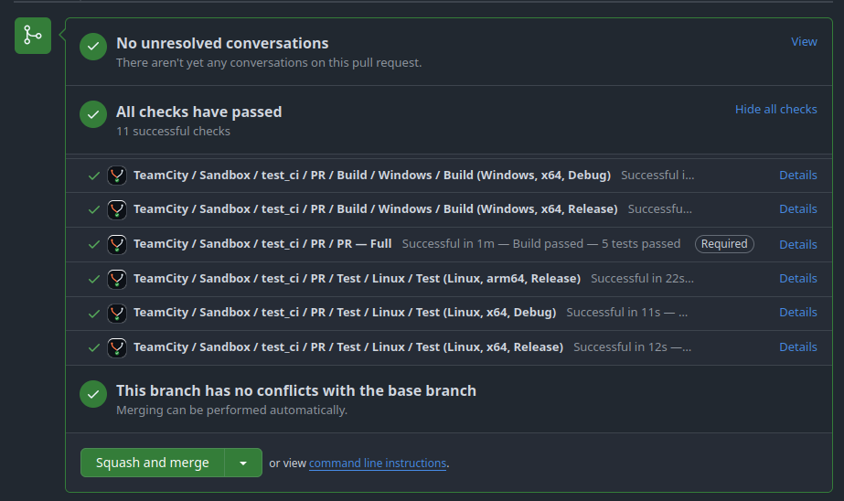

*Eleven configurations, one row each, and every row carries what the build
actually said — "Build passed — 5 tests passed" on the required one. The bundled
publisher would have written "TeamCity build finished" eleven times.*

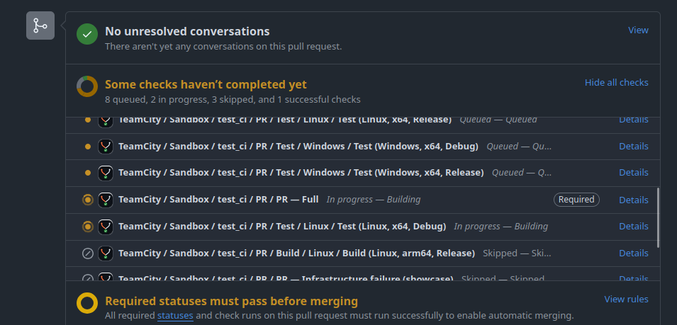

*The same pull request four minutes earlier. Every lifecycle transition is a
Check Run update on the same row: 8 queued, 2 in progress, 3 skipped, 1 green.
A reviewer sees the pipeline advance without opening TeamCity.*

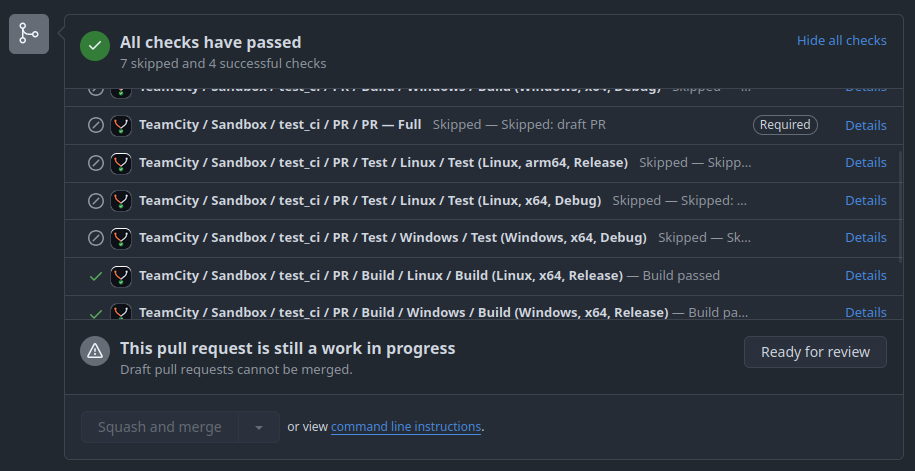

*A draft pull request. Seven configurations were held with the reason on the row
— "Skipped: draft PR" — and four cheap ones still ran, because the opt-in is per
build configuration. No agent was taken for the seven, and nothing has to be
cancelled later.*

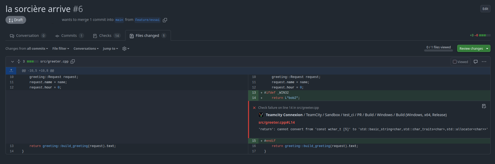

*The claim nothing else on this page can make: the compiler error, on the line
that caused it, in the reviewer's diff. TeamCity's Command Line runner reported
only "exit code 1" — the diagnostic was read from the build log, made
repo-relative against the agent's checkout directory, and posted as a Check Run
annotation.*

### What the panel actually looks like

Everything above lands in one place: the Check Run body, in a fixed order —
**failure cause, tests, artifacts, link to the build**. Three builds, three
views of the same layout.

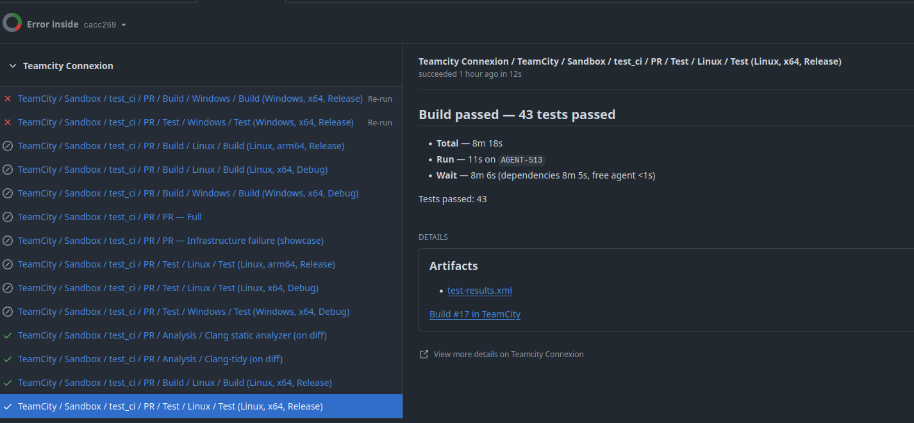

*The happy path. "Build passed — 43 tests passed" in the title GitHub shows in
the merge box; underneath, where the wall-clock went — 8m 18s total for 11s of
work, and the plugin says which: **dependencies 8m 5s**, free agent <1s. Then the
artifact, then the way back to the build. A reviewer never had to open TeamCity,
and an owner reading "8m of dependency wait" knows what to fix.*

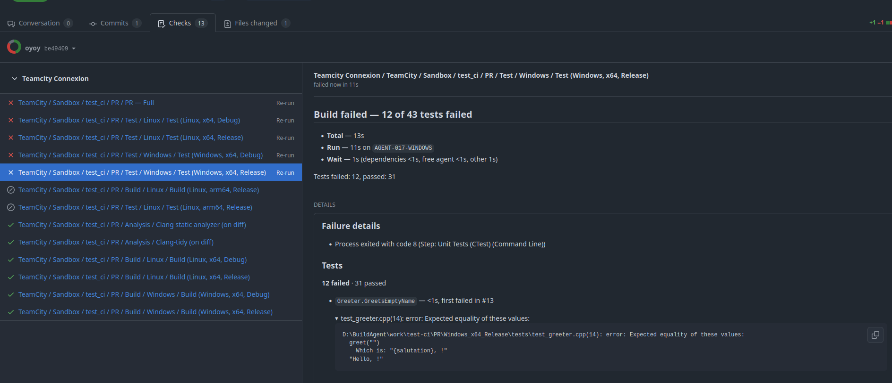

*The same layout, broken. The count is in the title, the failing test names the
build it first broke in (`first failed in #13` — "not you"), and the fold-out is
labelled with **where** it broke rather than with the word "failure", so a
reviewer can tell whether opening it is worth the click. Inside: the
expected-vs-actual, lifted out of the test runner's own boilerplate.*

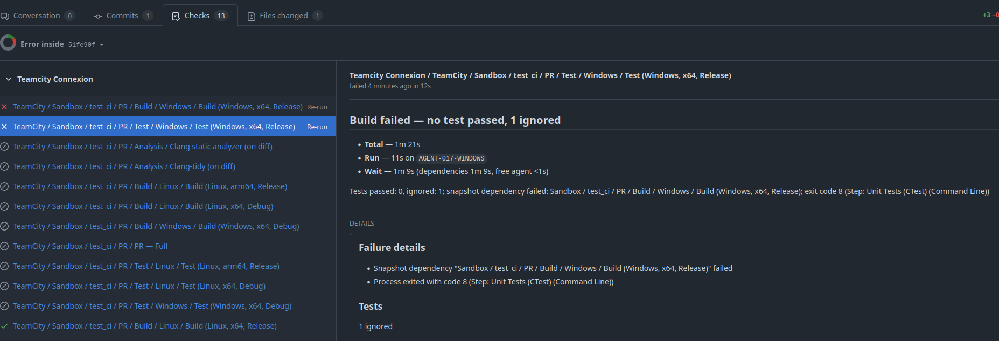

*A build that never got to run its own steps, because something it depends on
failed. The panel **names it** — "Snapshot dependency … failed" — instead of the
bare "Build failed" a reviewer can do nothing with, and the title counts honestly:
"no test passed, 1 ignored".*

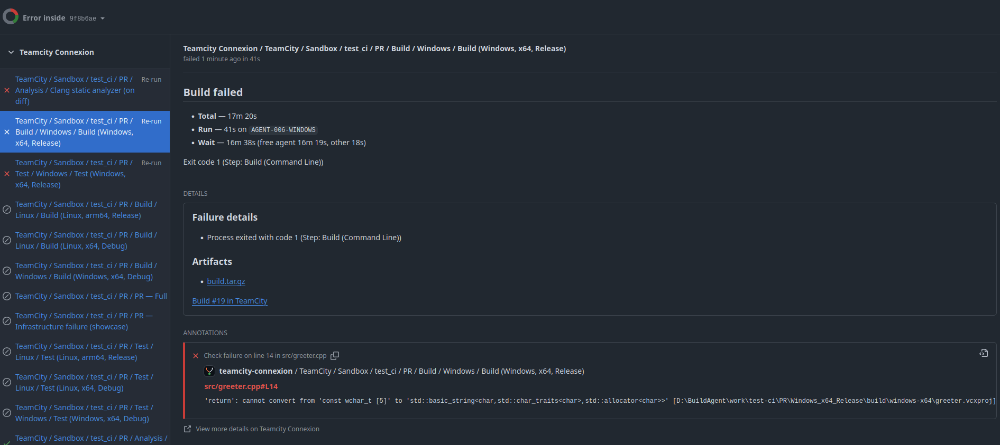

*And the counterpart to the diff shot above: GitHub renders an annotation inside
the diff only when its line is part of the diff. Outside it — a file the pull
request does not touch, a header pulled in by the change — the diagnostic still
arrives, here, in the panel's own **Annotations** block. It does not get lost
because the diff had no room for it.*

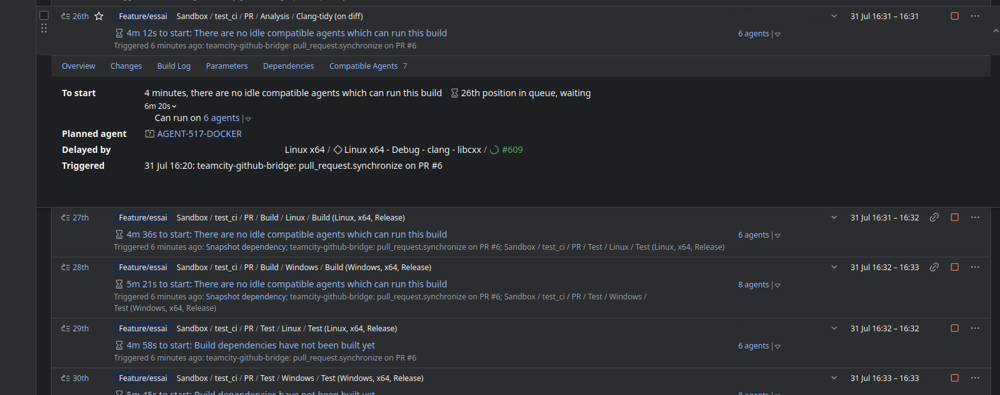

*The audit trail, in TeamCity's own queue: every build says who put it there
and why — "teamcity-github-bridge: `pull_request.synchronize` on PR #6" — next
to TeamCity's own reasons ("Snapshot dependency", "no idle compatible agents").
A relay triggering over REST appears as an anonymous API call.*

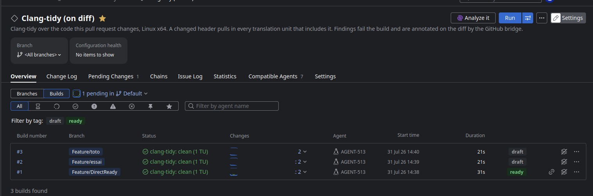

*The other direction, inside TeamCity: the `draft` / `ready` state of the pull
request is a coloured tag on the build — and a filter. An external relay cannot
put anything here.*

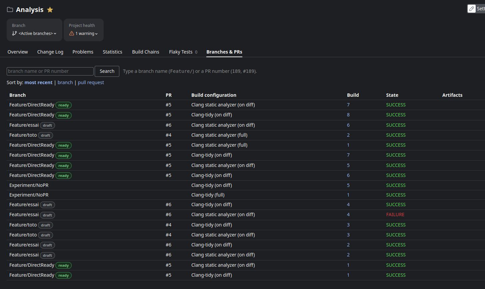

*And a page of the plugin's own: every build listed under **both** keys, the
branch and the pull request, searchable by either. `Experiment/NoPR` has no PR
cell — the column reports what it knows rather than guessing.*

---

## 3. What you stop operating

This is usually the argument that lands with whoever owns the infrastructure.

| Option B keeps alive | With the plugin |
|---|---|
| A service process, on a host, with a runtime, a WSGI server, a reverse proxy, TLS, and a patch cadence. | Nothing. It's a zip in `<TC_DATA_DIR>/plugins/`. It lives and dies with TeamCity. |
| A TeamCity API token stored *outside* TeamCity, with enough rights to trigger and cancel builds. | No TeamCity credential exists. The plugin *is* TeamCity. |
| One webhook per repository to create, rotate and audit. | One webhook for the whole GitHub App. `/info` prints the exact configuration to paste into GitHub. |
| A GitHub App private key (or PAT) on the relay host. | The key stays in the TeamCity connection. The plugin signs a short-lived JWT and mints a 1-hour installation token itself; only the opaque `ghs_*` token goes out. |
| "Service" build configurations that dedupe/cancel/retrigger — occupying agents, cluttering build history, and needing their own maintenance. | None. Those are queue decisions now, not builds. |
| Its own monitoring, or none. | `/health` (JSON probe), `/metrics` (Prometheus: webhooks received/rejected/replayed, check runs posted/failed, builds enqueued/cancelled/stopped), a dedicated log file, and a recent-events list in the admin page. |
| A second place where pipeline behaviour is configured — in a repo nobody on the pipeline team reads. | Behaviour lives on the build configuration (a build feature) and the project (a settings tab), versioned with the pipeline, DSL-able, attachable via a template. |
| A deploy to change a rule. | Settings are edited in-product and applied immediately. No restart. |

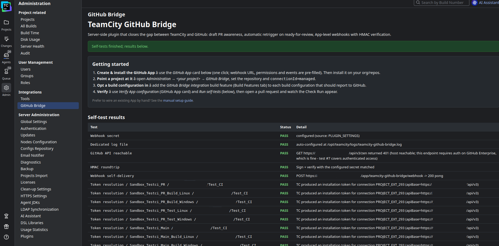

*"Is it configured correctly?" is a button, and the answer is per project: the
secret, the HMAC round-trip, a real signed delivery to its own webhook, GitHub
reachability, token issuance and API auth for each opted-in project. The
equivalent for a relay is a runbook.*

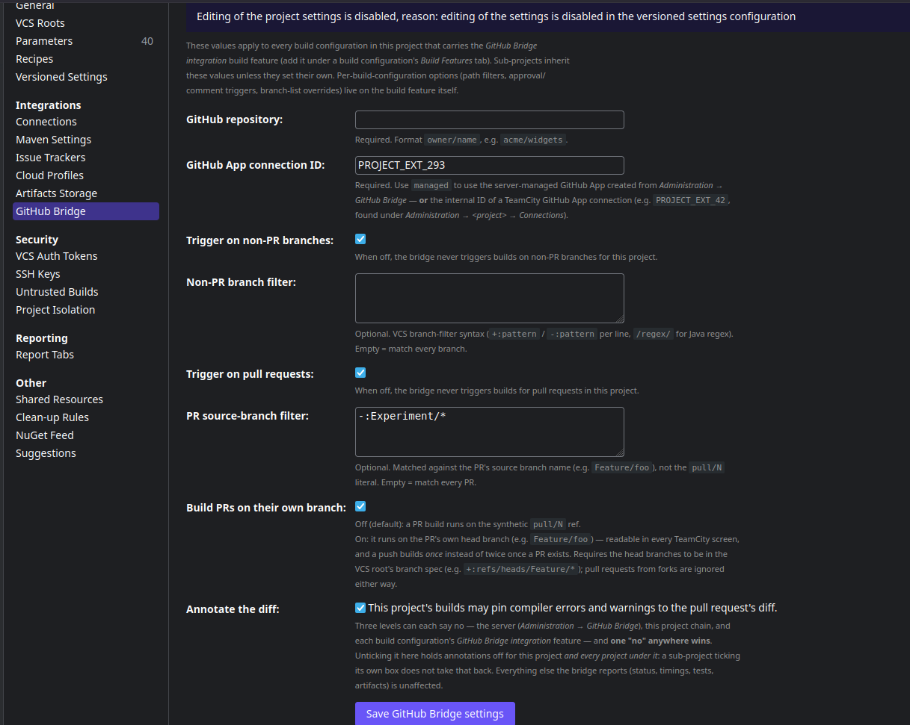

*Where the behaviour lives: on the project, in the product, next to the pipeline
it governs — not in a config file on another host.*

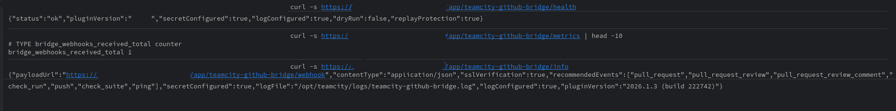

*And for whoever runs it: a JSON liveness probe, Prometheus counters, and an
`/info` that prints the webhook configuration ready to paste into GitHub.*

---

## 4. Security posture, side by side

| | Option B | This plugin |
|---|---|---|
| Internet-exposed surface | TeamCity **plus** the relay. | TeamCity only. |
| Webhook authenticity | Whatever the relay implements. | HMAC-SHA256 over the raw bytes, constant-time compare, **fail-closed**: no secret configured ⇒ every delivery is a 401. |
| Replay / duplicate deliveries | Usually unhandled. | Dropped by `X-GitHub-Delivery` id (`DeliveryReplayGuard`), oversized payloads rejected and counted. |
| Untrusted input | Relay is a new trust boundary holding a TeamCity token. | No new boundary. Fork PRs are ignored by design; comment-triggered builds are restricted to trusted commenters (repo collaborators by default). |
| Secret sprawl | GitHub secret + GitHub App key + TeamCity token, on the relay host. | Secrets stay in TeamCity's config; the admin page only ever shows `secretConfigured: true/false`. |
| Blast radius of a mistake | A relay bug cancels the wrong builds, silently. | A master switch (`queueCleanup.enabled`), per-feature flags, a **dry-run** mode that logs what it *would* do, a repo allowlist — and the invariant that **the bridge never takes away a build it could not have started itself**. |

Full model: [security.md](security.md).

---

## 5. Head-to-head

✅ built in · ⚠️ possible with work · ❌ not really

| | A. Bundled | B. External glue | C. This plugin |
|---|---|---|---|
| Skip builds on draft PRs | ❌ (`ignoreDrafts` is ignored under App auth) | ⚠️ cancel-after-start | ✅ never queued |
| Re-trigger on `ready_for_review` | ❌ | ⚠️ | ✅ |
| `isDraft` exposed to the build | ❌ | ⚠️ triggered builds only | ✅ always |
| Real build status text in GitHub | ❌ hard-coded string | ⚠️ extra REST calls | ✅ |
| Check Run per lifecycle step (queued → in progress → done) | ⚠️ commit statuses | ⚠️ | ✅ + `details_url` to the build |
| Timing breakdown / test summary in the PR | ❌ | ⚠️ | ✅ |
| Diff annotations for compiler errors | ❌ | ❌ | ✅ |
| Reuse an already-green commit | ❌ | ⚠️ racy | ✅ |
| Cancel superseded *running* builds, safely | ❌ | ⚠️ racy | ✅ with guards |
| Cancel queued builds on PR close/merge | ❌ | ⚠️ | ✅ |
| Trigger from PR comment / approval / Re-run button | ❌ | ⚠️ | ✅ per-check **Re-run**, the suite-level *Re-run all* where GitHub offers it, and re-running a **skipped** row |
| Path + label + title/body gating | ⚠️ partial | ⚠️ | ✅ per build configuration |
| One webhook for all repos | ❌ per repo | ✅ | ✅ App-level |
| Configured where the pipeline is | ✅ | ❌ | ✅ |
| TeamCity UI (state pills, PR tab, admin page) | ⚠️ | ❌ | ✅ |
| Health / metrics / self-tests | ❌ | ⚠️ | ✅ |
| Extra host to run and patch | ✅ none | ❌ one | ✅ none |

---

## 6. The honest part

Where option B genuinely wins, and you should say so out loud before someone
else does:

- **Language and iteration speed.** Python beats Kotlin + the TeamCity SDK for
  "change a rule in five minutes", and a relay deploys without touching CI.
- **Survives TeamCity being down.** A relay can queue events while TeamCity
  restarts. The plugin cannot — though a webhook that fails is redelivered by
  GitHub, and a plugin that is down means CI is down anyway.
- **Portable across CI systems.** If Jenkins or GitLab is on the roadmap, relay
  logic partially carries over. Plugin logic does not.
- **No plugin-API risk.** The plugin compiles against a TeamCity SDK that can
  change between majors; that's a real upgrade-time cost. (Mitigation: the
  self-test battery is the first thing you run after an upgrade, and it
  exercises webhook delivery, HMAC, token issuance and a live GitHub round
  trip.)

And where the plugin is deliberately *not* the answer:

- **Forks.** Out of scope, on purpose. A public OSS repo taking PRs from forks
  needs something else.
- **Non-GitHub remotes.** GitHub and GitHub Enterprise only.
- **TeamCity older than 2026.1.** Not supported.
- **Merge queues.** On the roadmap, not shipped.
- **It will not disable the bundled publisher for you.** It warns about the
  double-reporting and leaves the decision to the operator.

---

## 7. Objections, answered

**"A plugin inside the server is riskier than a service outside it."**
The risky operation isn't reading a webhook, it's *taking builds away* — and
that one is riskier from outside, because outside you can only act after the
fact, on stale state. Inside, the same decision is made once, synchronously,
with the queue in hand. And it is bounded: a master switch, per-feature flags, a
dry-run mode, and the invariant that the bridge never removes a build it could
not have started itself.

**"We'd be rewriting something that works."**
You would be *deleting* something that works, and keeping the parts that carry
your policy. The gating rules you already encode (which branches, which paths,
which labels) map onto per-build-configuration fields — see the migration table
below. What disappears is the transport, the token, the host and the service
builds.

**"Bus factor: one Kotlin plugin, one author."**
Apache-2.0, 408 unit tests, ~7 000 lines of documentation across 15 pages, a
`CONTRIBUTING.md` with the build/test/release loop, a Docker-only build (`./dev
package`, nothing installed on the host). The relay has a bus factor too — plus
a host, a deploy pipeline and a token nobody else knows about.

**"Migration is a big bang."**
It isn't, and that's the point of the next section: the two can run side by
side, per build configuration, and the plugin *warns* when both are reporting on
the same build instead of fighting for the row.

**"We'll be stuck when TeamCity ships this natively."**
Then you delete the plugin and keep your configuration — the gating lives on
build configurations and projects, in DSL, not in the plugin. That is strictly
easier than unwinding a relay. And the plugin exists precisely because the
bundled feature has been silently ignoring `ignoreDrafts` under App auth: this
is the place to fix such things outside the JetBrains release cycle.

---

## 8. Migration: incremental and reversible

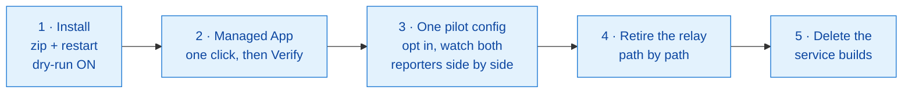

Every step is reversible: remove the build feature and that configuration goes
back to exactly what it did before.

What maps onto what:

| What you have today | What replaces it |
|---|---|
| Flask endpoint receiving GitHub webhooks | `POST /app/teamcity-github-bridge/webhook` (HMAC-verified, replay-guarded) |
| One webhook per repository | One App-level webhook; `/info` prints the paste-ready config |
| Relay code calling TeamCity's REST trigger | `PullRequestEventListener` — in-process enqueue |
| TeamCity API token on the relay host | *(nothing)* |
| "Dedup" service build | Queue dedup + reuse of an already-green commit |
| "Cancel obsolete" service build | `ObsoleteBuildPolicy` — queued *and* running, with guards |
| "Retrigger on ready" cron or handler | `pull_request.ready_for_review` handling |
| Relay posting commit statuses | `BuildStatusCheckRunPublisher` — a Check Run per lifecycle step |
| Relay's branch/path/label rules | Per-build-configuration fields: PR branch filter, `pathFilter`, `labelFilter`, title/body phrases |
| Relay logs on the relay host | `<TC_DATA_DIR>/logs/teamcity-github-bridge.log` + admin page recent events |
| Relay's dashboard, if any | Admin page, **Branches & PRs** tab, `/health`, `/metrics` |

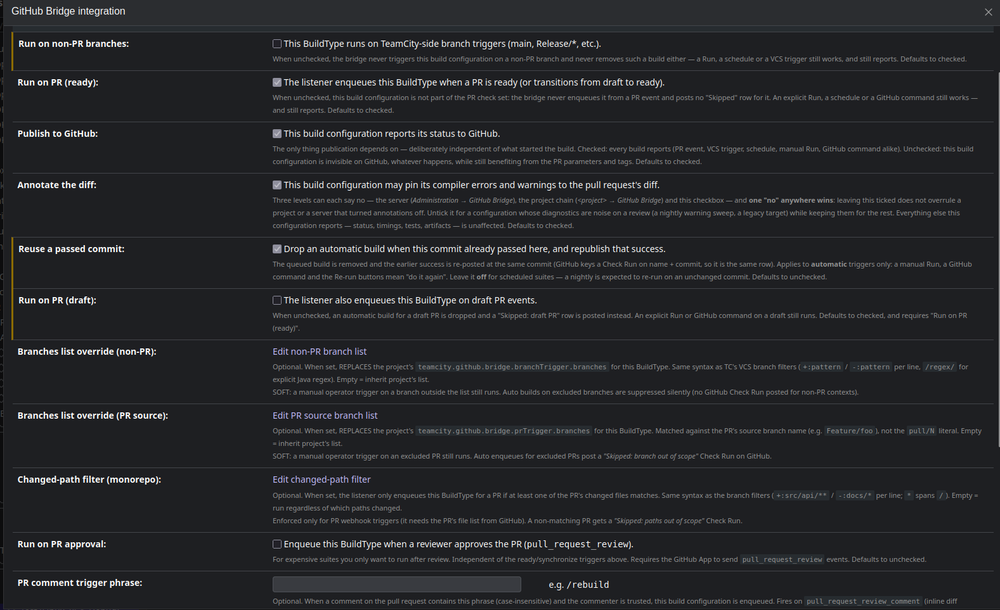

*Where the relay's rules end up: one build feature per configuration, with the
branch, path, label and metadata filters as fields — validated at save time,
attachable through a template, expressible in Kotlin DSL.*

Start with the [5-minute Quickstart](quickstart.md); the pilot-config step is
covered by [configuration.md](configuration.md) and the end-to-end behaviour of
every PR event by [usage-scenarios.md](usage-scenarios.md).

---

## 9. The 10-minute demo

Nothing convinces engineers like watching agent minutes *not* being spent.

1. **Open a draft PR.** GitHub shows `Skipped: draft PR` within seconds. Nothing
   entered the queue; no agent was taken. Show the queue — it's empty.
2. **Click "Ready for review".** Builds appear on their own, tagged `ready`.
3. **Push twice quickly.** The first build is stopped as superseded; the second
   runs. Show that the *last* build in flight is never the one cancelled.
4. **Break the build on purpose** (a compiler error). The Check Run title carries
   the real status text, the body carries the timing split and the failing tests,
   and the error is annotated on the diff line.
5. **Comment the trigger phrase** on a diff line. A build starts, from GitHub.
6. **Click "Re-run"** on the failed check in GitHub. It re-runs, from GitHub.
7. **Open the admin page** and run the self-tests. Green, per project.
8. **Close the PR** with a build still running. It stops.
9. **Count what you deleted**: one host, one token, N webhooks, and the service
   build configurations.

*Steps 1, 4, 7 and 8 are the ones people remember. Step 1 because nothing
happens, which is the whole point.*

---

## 10. Where to go next

- [Quickstart](quickstart.md) — install → App → green Check Run, 5 minutes.
- [usage-scenarios.md](usage-scenarios.md) — 28 walkthroughs, one per PR event.
- [branching-workflows.md](branching-workflows.md) — mapping a default-branch +
  dated-release-branch + cascade-merge model onto pipelines.
- [security.md](security.md) — trust boundaries and fail-closed defaults.
- [architecture.md](architecture.md) — components, sequence diagrams, threading.
- [roadmap.md](roadmap.md) — what is deliberately not done yet.
